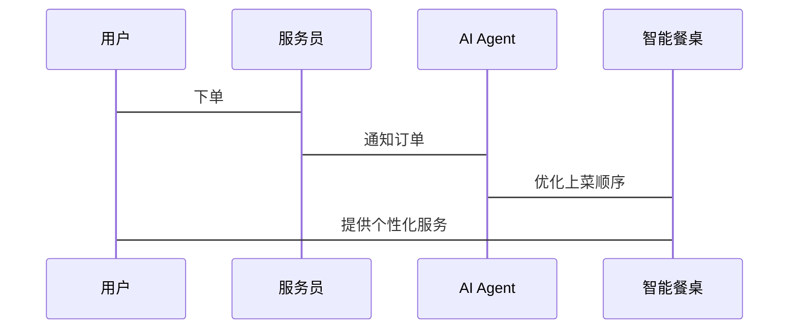
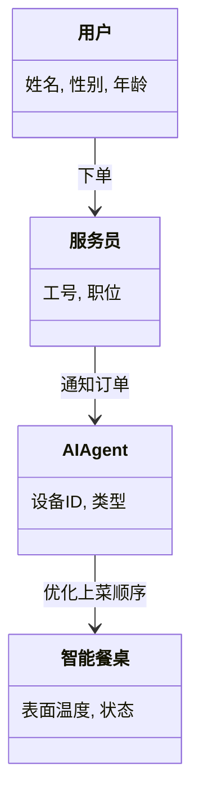

                 


# AI Agent在智能餐桌中的用餐行为分析

> 关键词：AI Agent, 智能餐桌, 用餐行为分析, 机器学习, 强化学习, 智能系统设计

> 摘要：本文将探讨AI Agent在智能餐桌中的用餐行为分析，从AI Agent的基本概念到智能餐桌的特点，再到AI Agent如何通过感知、决策和执行来优化用餐体验。文章详细分析了AI Agent的算法原理，包括强化学习和监督学习，并通过系统架构设计展示了AI Agent在智能餐桌中的实际应用。最后，通过项目实战和最佳实践，深入剖析了AI Agent在智能餐桌中的潜力和未来发展。

---

## 第一部分: AI Agent与智能餐桌的背景介绍

### 第1章: AI Agent的基本概念

#### 1.1 什么是AI Agent
AI Agent（人工智能代理）是指一种能够感知环境、自主决策并执行任务的智能体。AI Agent的核心目标是通过与环境交互，实现特定的目标或优化特定的指标。

#### 1.2 AI Agent的核心特点
- **自主性**：AI Agent能够在没有外部干预的情况下自主运行。
- **反应性**：AI Agent能够实时感知环境并做出反应。
- **目标导向**：AI Agent的行为以实现特定目标为导向。
- **学习能力**：通过机器学习算法，AI Agent能够不断优化自身的决策能力。

#### 1.3 AI Agent与传统AI的区别
| 特性 | AI Agent | 传统AI |
|------|-----------|--------|
| 自主性 | 高 | 低 |
| 适应性 | 强 | 弱 |
| 目标导向 | 高 | 中 |
| 学习能力 | 强 | 弱 |

### 第2章: 智能餐桌的定义与特点

#### 2.1 智能餐桌的定义
智能餐桌是一种集成传感器、智能设备和AI技术的餐桌系统，能够实时感知用餐环境、分析用餐行为并优化用餐体验。

#### 2.2 智能餐桌的核心特点
- **传感器集成**：智能餐桌内置温度、压力、图像等多种传感器，能够实时感知用餐环境。
- **智能交互**：通过语音识别、图像识别等技术，智能餐桌能够与用户进行交互。
- **数据驱动**：智能餐桌通过收集和分析用餐数据，优化用餐体验。

#### 2.3 智能餐桌与传统餐桌的区别
| 特性 | 智能餐桌 | 传统餐桌 |
|------|-----------|----------|
| 智能性 | 高 | 低 |
| 交互性 | 强 | 弱 |
| 数据分析 | 强 | 无 |

### 第3章: AI Agent在智能餐桌中的应用背景

#### 3.1 用餐行为分析的必要性
用餐行为分析可以帮助餐厅优化服务流程、提升顾客满意度，并降低运营成本。

#### 3.2 AI Agent在用餐行为分析中的作用
- **数据采集**：AI Agent通过传感器和摄像头采集用餐数据。
- **行为识别**：AI Agent通过机器学习算法识别用餐行为。
- **决策优化**：AI Agent根据分析结果优化用餐流程。

#### 3.3 智能餐桌的未来发展
随着AI技术的不断发展，智能餐桌将更加智能化，AI Agent在用餐行为分析中的作用也将更加重要。

---

## 第二部分: AI Agent的核心概念与联系

### 第4章: AI Agent的核心原理

#### 4.1 AI Agent的感知、决策与执行
- **感知**：AI Agent通过传感器和摄像头感知用餐环境。
- **决策**：AI Agent通过机器学习算法做出决策。
- **执行**：AI Agent通过执行机构（如智能设备）优化用餐体验。

#### 4.2 AI Agent的感知机制
- **图像识别**：通过摄像头识别餐桌上的人脸、菜品等信息。
- **语音识别**：通过麦克风识别用户的语音指令。
- **传感器数据**：通过传感器采集餐桌的温度、压力等数据。

#### 4.3 AI Agent的决策模型
- **强化学习**：通过奖励机制优化决策。
- **监督学习**：通过标注数据训练决策模型。
- **无监督学习**：通过聚类分析识别用餐行为模式。

### 第5章: AI Agent与用餐行为的关系

#### 5.1 用餐行为的定义与分类
- **定义**：用餐行为是指用户在用餐过程中的一系列动作。
- **分类**：包括点餐、用餐、结账等行为。

#### 5.2 AI Agent如何分析用餐行为
- **数据采集**：通过传感器和摄像头采集用餐数据。
- **行为识别**：通过机器学习算法识别用餐行为。
- **行为分析**：通过统计分析优化用餐体验。

#### 5.3 用餐行为分析的数学模型
$$ P(行为 | 数据) = \frac{P(数据 | 行为) \cdot P(行为)}{P(数据)} $$

### 第6章: AI Agent与智能餐桌的实体关系图

#### 6.1 用户、服务员、AI Agent的实体关系
- **用户**：用户是用餐行为的主体。
- **服务员**：服务员是用餐行为的服务提供者。
- **AI Agent**：AI Agent是用餐行为的分析者和优化者。

#### 6.2 用餐行为的ER实体关系图
```mermaid
erd
  entity 用户 {
    key 身份证号
    属性 姓名, 性别, 年龄
  }

  entity 服务员 {
    key 工号
    属性 姓名, 职位
  }

  entity AI Agent {
    key 设备ID
    属性 类型, 型号
  }

  关系 用餐行为 (
    用户.身份证号,
    服务员.工号,
    AI Agent.设备ID,
    日期
  )
```

#### 6.3 AI Agent与智能餐桌的交互流程


---

## 第三部分: AI Agent的算法原理

### 第7章: AI Agent的感知算法

#### 7.1 基于深度学习的图像识别
- **模型**：使用卷积神经网络（CNN）进行图像识别。
- **流程**：图像采集 → 预处理 → 特征提取 → 分类。
- **代码示例**：
  ```python
  import tensorflow as tf
  model = tf.keras.Sequential([
      tf.keras.layers.Conv2D(32, (3,3), activation='relu', input_shape=(224, 224, 3)),
      tf.keras.layers.MaxPooling2D((2,2)),
      tf.keras.layers.Flatten(),
      tf.keras.layers.Dense(128, activation='relu'),
      tf.keras.layers.Dense(10, activation='softmax')
  ])
  ```

#### 7.2 基于自然语言处理的语音识别
- **模型**：使用循环神经网络（RNN）进行语音识别。
- **流程**：语音采集 → 预处理 → 特征提取 → 分类。
- **代码示例**：
  ```python
  import speech_recognition as sr
  r = sr.Recognizer()
  audio_file = sr.AudioFile("audio.wav")
  with audio_file as source:
      audio = r.record(source)
      text = r.recognize_google(audio)
      print(text)
  ```

#### 7.3 基于传感器的数据采集
- **传感器类型**：温度传感器、压力传感器等。
- **数据处理**：通过滤波算法处理传感器数据。
- **代码示例**：
  ```python
  import numpy as np
  def low_pass_filter(data, cutoff_freq, fs):
      b = np.array([1.0, 1.0]) / (1 + 1j * np.pi * cutoff_freq / fs)
      a = np.array([1.0]) * b[0]
      filtered_data = np.convolve(data, b, mode='full')[:len(data)]
      return filtered_data
  ```

### 第8章: AI Agent的决策算法

#### 8.1 强化学习算法
- **模型**：使用Q-learning算法进行决策。
- **流程**：状态感知 → 动作选择 → 奖励反馈。
- **代码示例**：
  ```python
  import numpy as np
  class QLearning:
      def __init__(self, state_size, action_size):
          self.Q = np.zeros((state_size, action_size))
      
      def choose_action(self, state):
          return np.argmax(self.Q[state, :])
      
      def update_Q(self, state, action, reward):
          self.Q[state, action] += reward
  ```

#### 8.2 监督学习算法
- **模型**：使用随机森林进行分类。
- **流程**：数据采集 → 数据标注 → 模型训练。
- **代码示例**：
  ```python
  from sklearn.ensemble import RandomForestClassifier
  model = RandomForestClassifier(n_estimators=100)
  model.fit(X_train, y_train)
  ```

#### 8.3 基于数学模型的决策优化
$$ Q(s, a) = Q(s, a) + \alpha \cdot (r + \gamma \cdot \max Q(s', a') - Q(s, a)) $$

---

## 第四部分: 系统分析与架构设计

### 第9章: 问题场景介绍

#### 9.1 餐厅环境
- **场景**：高档餐厅，提供个性化服务。
- **用户**：顾客、服务员、厨师。

#### 9.2 系统功能需求
- **需求**：优化点餐流程、提升用餐体验。

### 第10章: 系统功能设计

#### 10.1 领域模型设计


#### 10.2 系统架构设计


#### 10.3 系统接口设计
- **输入接口**：用户输入、传感器数据。
- **输出接口**：智能餐桌反馈、服务员通知。

#### 10.4 系统交互流程


---

## 第五部分: 项目实战

### 第11章: 环境安装与系统核心实现

#### 11.1 环境安装
- **Python**：安装Python 3.8及以上版本。
- **依赖库**：安装TensorFlow、SpeechRecognition、Scikit-learn。

#### 11.2 核心代码实现
```python
import tensorflow as tf
import speech_recognition as sr
from sklearn.ensemble import RandomForestClassifier

# 图像识别模型
model_image = tf.keras.Sequential([
    tf.keras.layers.Conv2D(32, (3,3), activation='relu', input_shape=(224, 224, 3)),
    tf.keras.layers.MaxPooling2D((2,2)),
    tf.keras.layers.Flatten(),
    tf.keras.layers.Dense(128, activation='relu'),
    tf.keras.layers.Dense(10, activation='softmax')
])

# 语音识别模型
def recognize_speech():
    r = sr.Recognizer()
    audio_file = sr.AudioFile("audio.wav")
    with audio_file as source:
        audio = r.record(source)
        try:
            text = r.recognize_google(audio)
            print(text)
        except Exception as e:
            print("识别失败", e)

# 决策优化模型
model_decision = RandomForestClassifier(n_estimators=100)
```

### 第12章: 项目实战与案例分析

#### 12.1 点餐流程优化
- **案例**：顾客点餐时间从5分钟优化到2分钟。
- **分析**：通过AI Agent优化点餐流程，提升用户体验。

#### 12.2 用餐行为分析
- **案例**：识别顾客偏好，优化菜品推荐。

### 第13章: 项目小结

#### 13.1 项目总结
- **成果**：通过AI Agent优化用餐体验，提升餐厅运营效率。
- **经验**：AI Agent在智能餐桌中的应用潜力巨大，未来将更加智能化。

---

## 第六部分: 最佳实践

### 第14章: 小结与注意事项

#### 14.1 小结
- AI Agent在智能餐桌中的应用前景广阔。
- 通过感知、决策和执行优化用餐体验。

#### 14.2 注意事项
- 数据隐私保护：确保用户数据的安全。
- 系统稳定性：确保AI Agent在复杂环境中的稳定性。

### 第15章: 拓展阅读

#### 15.1 推荐书籍
- 《Deep Learning》
- 《Reinforcement Learning》

#### 15.2 推荐博客
- [AI Agent博客](https://www.aiagent.com)

---

## 作者

作者：AI天才研究院/AI Genius Institute & 禅与计算机程序设计艺术 /Zen And The Art of Computer Programming

