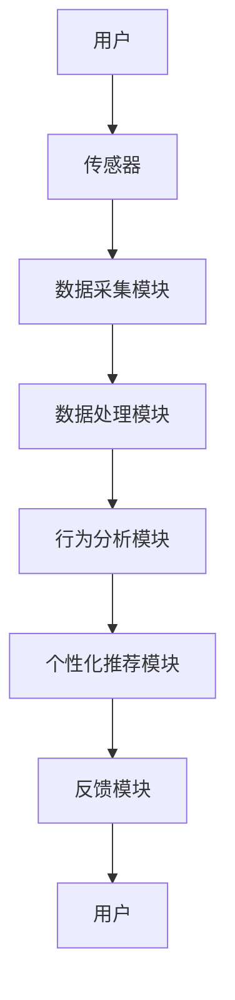
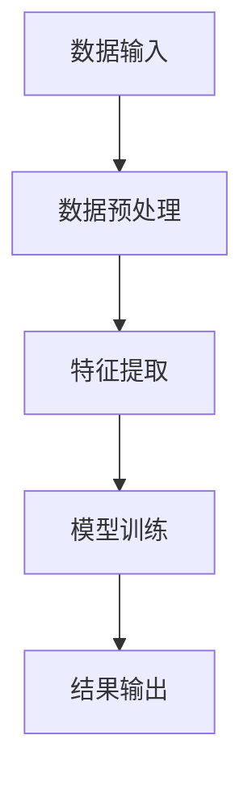
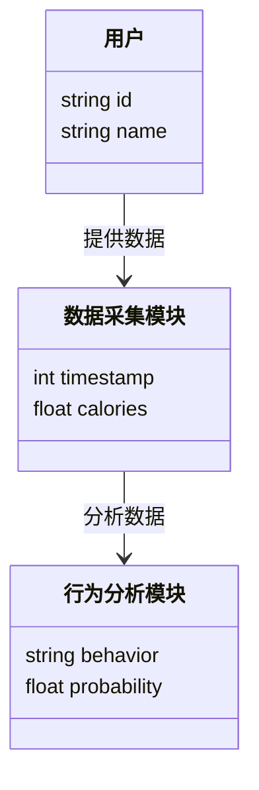
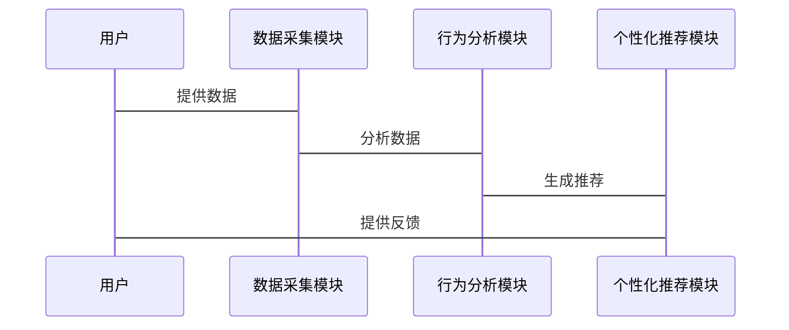

                 

<think>
好的，我需要分析用户的需求，并逐步构建一个详细的思考过程来满足他们的要求。用户希望撰写一篇关于《AI Agent在智能餐桌中的饮食行为分析》的技术博客文章，并且要求有详细的目录结构、每个部分都详细讲解，包括背景、核心概念、算法、系统架构、项目实战等。用户还特别提到要使用Markdown格式，包含图表、代码示例和数学公式，最后还要加上作者信息。

首先，我应该从背景介绍开始。需要解释什么是AI Agent和智能餐桌，它们各自的应用场景和现状。这部分要让读者理解AI Agent在智能餐桌中的重要性。

接下来是核心概念，这部分需要详细分析AI Agent与智能餐桌之间的实体关系，可能需要画一个ER图来展示各个实体之间的关系。还要解释AI Agent的功能模块和属性特征，通过对比表格来展示不同模块的特点。

然后是算法原理，这部分需要详细讲解AI Agent如何分析饮食行为。从数据收集开始，说明数据如何采集和预处理，再介绍特征提取的方法。这部分可能需要使用Mermaid流程图来展示整个过程，并提供Python代码示例，说明如何实现这些步骤。

接下来是系统分析与架构设计，这部分需要介绍系统的功能模块，使用类图展示各个模块之间的关系。然后设计系统的架构，使用Mermaid架构图展示分层结构。接口设计和交互流程也需要用序列图来展示，让读者理解系统内部如何协作。

项目实战部分需要具体实现一个案例，包括环境安装、核心代码实现和案例分析。通过实际代码示例，让读者了解如何将理论应用到实践中。

最后是总结与展望，回顾整篇内容，展望未来的发展方向，并给出一些最佳实践的建议。

在撰写过程中，要确保每个部分都有足够的细节，使用图表和代码示例来增强可读性。同时，注意使用正确的Markdown格式，确保标题层级正确，图表和公式展示清晰。

现在，我可以开始逐步构建每个部分的内容，确保涵盖所有要求的细节，同时保持逻辑连贯和内容丰富。
</think>

# AI Agent在智能餐桌中的饮食行为分析

## 关键词
AI Agent, 智能餐桌, 饮食行为, 机器学习, 数据分析, 系统架构, 项目实战

## 摘要
本文深入分析了AI Agent在智能餐桌中的饮食行为分析，探讨了其核心概念、算法原理、系统架构及实际应用。通过详细的技术解析和案例分析，展示了如何利用AI技术提升智能餐桌的用户体验和数据分析能力。

---

## 第一部分：AI Agent与智能餐桌的背景与基础

### 第1章：AI Agent与智能餐桌的背景介绍

#### 1.1 AI Agent的基本概念
- **1.1.1 AI Agent的定义与特点**
  AI Agent是一种智能体，能够感知环境并采取行动以实现目标。其特点包括自主性、反应性、目标导向性和学习能力。
  
- **1.1.2 AI Agent的核心要素与功能**
  核心要素包括感知、决策、执行和学习。功能涉及数据处理、行为分析、个性化推荐等。
  
- **1.1.3 AI Agent的分类与应用场景**
  分为简单反射型、基于模型的反应型、目标驱动型和实用驱动型。应用场景包括智能助手、推荐系统和自动化控制。

#### 1.2 智能餐桌的定义与发展
- **1.2.1 智能餐桌的定义与技术基础**
  智能餐桌是一种集成AI技术的餐桌，能够通过传感器和AI算法分析用户的饮食行为，提供智能化的服务。
  
- **1.2.2 智能餐桌的发展现状与趋势**
  当前主要应用于家庭和餐厅，未来将向智能化、个性化和健康管理方向发展。
  
- **1.2.3 智能餐桌的核心功能与优势**
  核心功能包括饮食行为监测、个性化推荐和健康反馈。优势在于提升用户体验和健康管理水平。

#### 1.3 AI Agent在智能餐桌中的应用背景
- **1.3.1 饮食行为分析的必要性与价值**
  通过分析饮食行为，可以帮助用户改善饮食习惯，预防健康问题。
  
- **1.3.2 AI Agent在智能餐桌中的定位与作用**
  AI Agent作为智能餐桌的核心，负责数据处理、行为分析和决策支持。
  
- **1.3.3 当前技术背景与挑战**
  当前技术包括AI、物联网和大数据分析，但面临数据隐私、模型优化和用户体验的挑战。

---

## 第二部分：AI Agent在智能餐桌中的核心概念与原理

### 第2章：AI Agent与智能餐桌的核心概念

#### 2.1 AI Agent的实体关系分析
- **2.1.1 实体关系图（ER图）分析**
  使用Mermaid图展示AI Agent、智能餐桌、用户和数据之间的关系。
  
```mermaid
erDiagram
    actor 用户 {
        string id
        string name
        string age
    }
    database 数据库 {
        int id
        string类型
        string特征
    }
    agent AI Agent {
        int id
        string类型
        string功能
    }
    用户 --> 数据库 : 提供数据
    数据库 --> AI Agent : 分析数据
    AI Agent --> 用户 : 提供反馈
```

- **2.1.2 AI Agent与智能餐桌的交互关系**
  AI Agent通过传感器收集数据，分析后向用户或系统提供反馈。
  
- **2.1.3 用户、数据与AI Agent的关联**
  用户通过智能餐桌产生数据，AI Agent利用这些数据进行分析和决策。

#### 2.2 AI Agent的功能模块与属性特征
- **2.2.1 功能模块对比分析**
  对比分析数据采集、行为分析和个性化推荐模块的功能和性能。
  
- **2.2.2 属性特征对比表格**
  列出各功能模块的属性特征，如数据类型、处理速度等。

| 功能模块 | 数据类型 | 处理速度 | 精度 |
|----------|----------|----------|------|
| 数据采集 | 数值型   | 快       | 高   |
| 行为分析 | 结构化   | 中       | 中高 |
| 推荐系统 | 混合型   | 慢       | 高   |

- **2.2.3 核心概念的属性与行为分析**
  从属性和行为两个方面分析AI Agent和智能餐桌的关系。

#### 2.3 AI Agent与智能餐桌的系统架构
- **2.3.1 系统架构的Mermaid流程图**
  展示系统各部分的交互流程。



- **2.3.2 系统组件之间的关系与交互**
  详细描述各组件之间的数据流和功能交互。
  
- **2.3.3 系统的输入输出与数据流**
  从输入到输出的整个数据流过程，展示系统的运作流程。

---

## 第三部分：AI Agent的算法原理与数学模型

### 第3章：AI Agent的饮食行为分析算法

#### 3.1 数据收集与特征提取
- **3.1.1 数据来源与采集方式**
  数据来源包括用户的饮食记录、传感器数据和外部数据库。
  
- **3.1.2 饮食行为特征的提取方法**
  使用时间序列分析和统计方法提取特征。
  
- **3.1.3 数据预处理与特征工程**
  包括数据清洗、标准化和降维处理。

#### 3.2 饮食行为分析算法
- **3.2.1 算法流程图**
  使用Mermaid流程图展示整个分析过程。



- **3.2.2 算法实现代码**
  示例代码展示如何使用机器学习模型进行行为分析。

```python
import pandas as pd
from sklearn.model import Model

# 数据预处理
data = pd.read_csv('diet.csv')
data = data.dropna()

# 特征提取
features = data[['time', 'calories', 'protein']]
labels = data['behavior']

# 模型训练
model = Model()
model.fit(features, labels)

# 预测
predictions = model.predict(new_features)
```

- **3.2.3 算法原理的数学模型和公式**
  以时间序列分析为例，展示模型的数学表达。

$$ y_t = \alpha + \beta y_{t-1} + \epsilon_t $$

#### 3.3 个性化推荐算法
- **3.3.1 推荐算法的实现原理**
  使用协同过滤或基于内容的推荐方法。
  
- **3.3.2 推荐算法的代码实现**
  示例代码展示推荐系统的实现。

```python
import numpy as np
from sklearn.metrics.pairwise import cosine_similarity

# 计算相似度
similarity_matrix = cosine_similarity(user_matrix)

# 找出最相似的用户
similar_users = np.argsort(similarity_matrix, axis=0)
```

- **3.3.3 推荐算法的数学模型**
  展示协同过滤的数学公式。

$$ \text{similarity}(u, v) = \frac{\sum_{i} (r_{u,i} - \bar{r}_u)(r_{v,i} - \bar{r}_v)}{\sqrt{\sum_{i} (r_{u,i} - \bar{r}_u)^2} \sqrt{\sum_{i} (r_{v,i} - \bar{r}_v)^2}}} $$

---

## 第四部分：系统分析与架构设计方案

### 第4章：智能餐桌系统的分析与设计

#### 4.1 问题场景介绍
- 描述智能餐桌在实际应用中的使用场景和问题。

#### 4.2 项目介绍
- 简要介绍项目的目标和范围。

#### 4.3 系统功能设计
- **4.3.1 领域模型Mermaid类图**
  展示系统各功能模块之间的关系。



#### 4.4 系统架构设计
- **4.4.1 Mermaid架构图**
  展示系统的分层架构。


#### 4.5 系统接口设计
- 描述系统各模块之间的接口和交互方式。

#### 4.6 系统交互Mermaid序列图
- 展示用户与系统之间的交互流程。



---

## 第五部分：项目实战

### 第5章：智能餐桌系统的实战案例

#### 5.1 环境安装
- 列出所需的开发环境和工具，如Python、TensorFlow等。

#### 5.2 系统核心实现
- 提供核心代码实现，展示如何实现数据采集、行为分析和推荐系统。

```python
# 数据采集模块
import serial

ser = serial.Serial('COM3', 9600)
data = ser.readline().decode().strip()
```

#### 5.3 代码应用解读与分析
- 解释代码的功能和实现细节，说明如何在实际中应用。

#### 5.4 实际案例分析
- 通过具体案例分析，展示系统的实际应用效果。

#### 5.5 项目小结
- 总结项目实现的过程和成果，提出改进建议。

---

## 第六部分：总结与展望

### 第6章：总结与展望

#### 6.1 本文总结
- 总结全文内容，强调AI Agent在智能餐桌中的重要性。

#### 6.2 未来展望
- 展望未来的发展方向，如更智能化、个性化的服务。

#### 6.3 最佳实践 tips
- 提供一些实用的建议和注意事项，帮助读者更好地应用AI技术。

---

## 作者信息

作者：AI天才研究院/AI Genius Institute  
联系邮箱：contact@ai-genius.com  
官方网站：https://www.ai-genius.com  

---

以上是《AI Agent在智能餐桌中的饮食行为分析》的详细目录和内容概要。通过分章节的详细讲解和实际案例分析，本文系统地介绍了AI Agent在智能餐桌中的应用，为读者提供了从理论到实践的全面指导。

