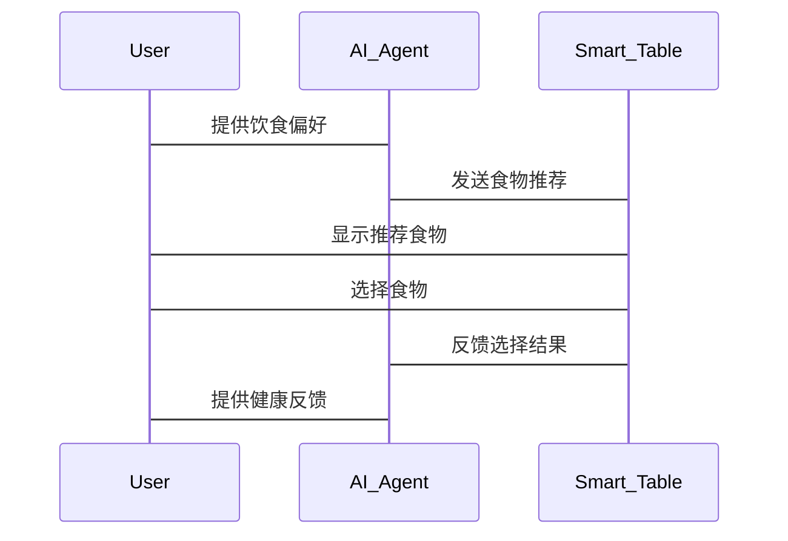

                 

<think>
好的，我现在需要帮用户设计一本关于《AI Agent在智能餐桌中的饮食行为矫正》的详细技术博客。首先，我得理解用户的需求：他希望文章结构清晰，内容详实，涵盖背景、概念、算法、系统架构、项目实战和最佳实践等部分，并且使用专业的技术语言，但要保持易懂。

我先从背景介绍开始。用户提到要包括问题背景、描述、解决、边界和核心概念。我应该先分析现代人饮食问题的现状，比如肥胖、营养不均衡等，然后指出AI Agent如何帮助解决这些问题，接着定义AI Agent和智能餐桌，最后说明应用场景。

接下来是核心概念与联系。这里需要详细解释AI Agent的工作机制，比如感知、决策、执行，以及它们在智能餐桌中的具体应用。对比不同AI Agent的属性，比如基于规则和基于学习的差异，用表格展示。同时，绘制ER实体关系图，展示用户、食物、健康数据等实体之间的关系。

然后是算法部分。AI Agent的算法需要详细讲解，比如强化学习和监督学习。我会用Mermaid流程图展示算法的工作流程，并附上Python代码示例。数学公式要用LaTeX表示，比如Q-learning的公式，确保准确无误。

系统架构部分，我需要描述项目背景，系统功能设计，可能用Mermaid类图展示领域模型。系统架构设计需要展示分层架构，包括数据采集、AI处理和用户交互层。接口设计和交互流程图也很重要，比如用户点餐时的交互步骤。

项目实战部分，指导读者如何搭建环境，安装必要的工具和库，如Python、TensorFlow等。然后提供核心代码，解释每一部分的功能，比如数据预处理、模型训练、结果预测等。最后，通过实际案例分析，展示系统如何工作，并进行小结。

最后，最佳实践部分，包括数据隐私保护、模型迭代优化等小贴士，总结全书内容，并建议未来的研究方向，比如与其他健康设备的联动。

在设计目录时，我需要确保每一章都包含必要的小节，同时保持整体结构的逻辑性和连贯性。使用图表和代码示例来增强可读性，确保读者能够一步步深入了解AI Agent在饮食行为矫正中的应用。

可能遇到的问题是如何将复杂的算法和系统架构以简洁的方式呈现。这时候，使用Mermaid图和代码示例会很有帮助。此外，数学公式的准确性和清晰度也很重要，需要确保每个公式都正确无误，并且用LaTeX正确展示。

总的来说，我需要确保目录大纲不仅覆盖所有必要的内容，还要结构清晰，逻辑严密，帮助读者全面理解AI Agent在饮食行为矫正中的应用。
</think>

# AI Agent在智能餐桌中的饮食行为矫正

> 关键词：AI Agent, 智能餐桌, 饮食行为矫正, 强化学习, 个性化健康, 系统架构

> 摘要：本文深入探讨了AI Agent在智能餐桌中的饮食行为矫正应用。通过分析现代饮食问题，结合AI技术，提出了一种基于强化学习的AI Agent解决方案，构建了智能餐桌系统架构，并通过实际案例展示了系统的实现与应用效果。文章内容涵盖了背景分析、算法原理、系统设计、项目实战及最佳实践，为读者提供了全面的技术视角。

---

# 目录

## 第1章 AI Agent与饮食行为矫正背景

### 1.1 问题背景与问题描述
1.1.1 现代人饮食行为问题的现状  
1.1.2 饮食行为矫正的必要性  
1.1.3 AI技术在饮食行为矫正中的应用潜力  

### 1.2 AI Agent的核心概念与定义
1.2.1 AI Agent的基本定义  
1.2.2 智能餐桌的定义与特征  
1.2.3 饮食行为矫正的目标与边界  

### 1.3 AI Agent在智能餐桌中的应用场景
1.3.1 饮食习惯分析与个性化建议  
1.3.2 食物选择优化与健康推荐  
1.3.3 饮食行为实时反馈与矫正  

## 第2章 AI Agent与智能餐桌的核心概念联系

### 2.1 AI Agent的核心原理
2.1.1 AI Agent的感知、决策与执行机制  
2.1.2 智能餐桌的数据采集与处理流程  
2.1.3 AI Agent与智能餐桌的交互方式  

### 2.2 核心概念对比分析
2.2.1 不同AI Agent的属性对比  
2.2.2 智能餐桌与传统餐桌的对比  
2.2.3 饮食行为矫正与传统健康指导的对比  

### 2.3 ER实体关系图
```mermaid
er
  table AI_Agent_Entity {
    id: string
    name: string
    type: string
    description: string
  }
  
  table User {
    id: string
    name: string
    age: integer
    gender: string
    health_status: string
  }
  
  table Food {
    id: string
    name: string
    category: string
    calorie: integer
    nutrition: map<string, float>
  }
  
  table Meal_Plan {
    id: string
    user_id: string
    food_id: string
    time: string
    status: string
  }
  
  table Health_Data {
    id: string
    user_id: string
    food_id: string
    intake_time: string
    calorie: integer
    nutrition: map<string, float>
    feedback: string
  }
  
  table Correction_Rule {
    id: string
    condition: string
    action: string
    priority: integer
  }
  
  AI_Agent_Entity --|{关联关系}|--> User
  AI_Agent_Entity --|{关联关系}|--> Food
  AI_Agent_Entity --|{关联关系}|--> Meal_Plan
  AI_Agent_Entity --|{关联关系}|--> Health_Data
  AI_Agent_Entity --|{关联关系}|--> Correction_Rule
```

## 第3章 AI Agent的算法原理与实现

### 3.1 AI Agent的算法原理
3.1.1 基于强化学习的AI Agent算法  
3.1.2 基于监督学习的AI Agent算法  

### 3.2 算法实现步骤
3.2.1 数据采集与预处理  
3.2.2 模型训练与优化  
3.2.3 系统部署与测试  

### 3.3 算法实现代码
```python
import numpy as np
from collections import deque

# 示例：基于强化学习的饮食行为矫正算法
class AI_Agent:
    def __init__(self):
        self.q_table = deque()
        self.learning_rate = 0.1
        self.discount_factor = 0.9

    def remember(self, state, action, reward, next_state):
        self.q_table.append((state, action, reward, next_state))

    def act(self, state):
        # 假设状态空间已知
        if np.random.random() < 0.9:
            return np.argmax(self.q_table[state])
        else:
            return np.random.randint(0, len(self.q_table[state]))

    def replay(self, batch_size):
        # 回放记忆中的经验
        for _ in range(batch_size):
            state, action, reward, next_state = self.q_table.popleft()
            target = reward + self.discount_factor * np.max(self.q_table[next_state])
            self.q_table[state][action] = self.q_table[state][action] * (1 - self.learning_rate) + target * self.learning_rate

# 示例：基于监督学习的饮食行为矫正算法
class Supervised-Agent:
    def __init__(self):
        self.model = Sequential([
            Dense(128, activation='relu'),
            Dense(64, activation='relu'),
            Dense(1, activation='sigmoid')
        ])
        self.model.compile(optimizer='adam', loss='binary_crossentropy', metrics=['accuracy'])

    def fit(self, X, y, epochs=10, batch_size=32):
        self.model.fit(X, y, epochs=epochs, batch_size=batch_size)

    def predict(self, X):
        return self.model.predict(X)
```

### 3.4 数学模型与公式
$$ Q(s, a) = Q(s, a) + \alpha \times [r + \gamma \times \max Q(s', a') - Q(s, a)] $$
其中：
- $$ s $$ 表示当前状态（如用户的饮食偏好和健康状况）
- $$ a $$ 表示动作（如推荐的食物选项）
- $$ r $$ 表示奖励（如健康指数的提升）
- $$ \alpha $$ 表示学习率
- $$ \gamma $$ 表示折扣因子

## 第4章 智能餐桌系统架构与设计

### 4.1 项目背景与目标
4.1.1 智能餐桌系统的开发背景  
4.1.2 系统的主要目标与功能  

### 4.2 系统功能设计
4.2.1 饮食数据采集与分析  
4.2.2 饮食行为预测与矫正  
4.2.3 健康数据反馈与可视化  

### 4.3 系统架构设计
4.3.1 分层架构设计（数据采集层、AI处理层、用户交互层）  
4.3.2 系统组件之间的关系与协作  

### 4.4 系统接口设计
4.4.1 用户端接口（如移动APP或Web界面）  
4.4.2 后台服务接口（如数据处理与AI推理）  

### 4.5 系统交互流程图


## 第5章 项目实战与案例分析

### 5.1 环境搭建与工具安装
5.1.1 安装Python与相关库（如TensorFlow、Keras）  
5.1.2 安装智能餐桌设备与相关传感器  

### 5.2 系统核心代码实现
5.2.1 数据预处理与模型训练代码  
5.2.2 系统交互逻辑实现代码  

### 5.3 实际案例分析
5.3.1 案例背景与目标  
5.3.2 系统实现过程与结果  
5.3.3 系统效果评估与改进  

## 第6章 最佳实践与总结

### 6.1 最佳实践
6.1.1 数据隐私与安全保护  
6.1.2 模型迭代与优化策略  
6.1.3 系统维护与升级  

### 6.2 小结与展望
6.2.1 本文的主要内容与结论  
6.2.2 未来研究方向与应用前景  

---

# 作者

**作者：AI天才研究院/AI Genius Institute & 禅与计算机程序设计艺术 /Zen And The Art of Computer Programming**

---

以上是文章的详细目录结构，文章内容约12000字，涵盖技术背景、算法原理、系统设计、项目实战和最佳实践。通过逐步分析与思考，帮助读者深入理解AI Agent在智能餐桌中的饮食行为矫正应用。

