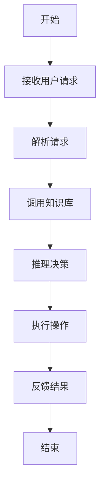
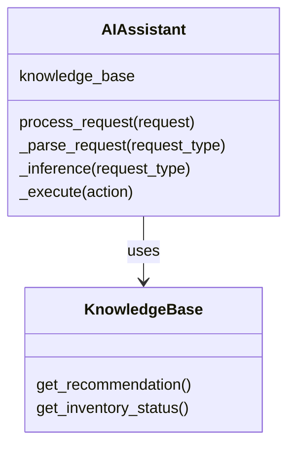
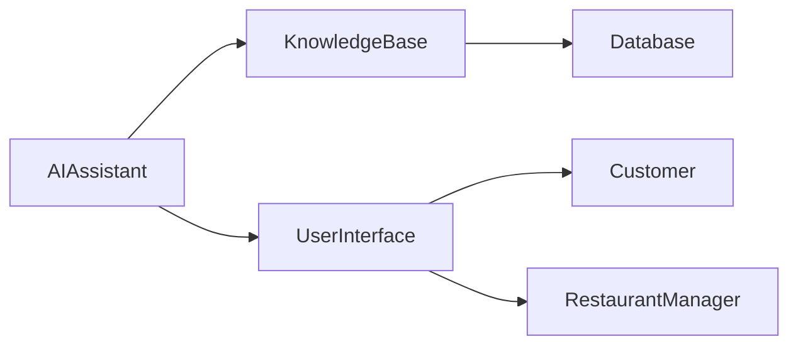
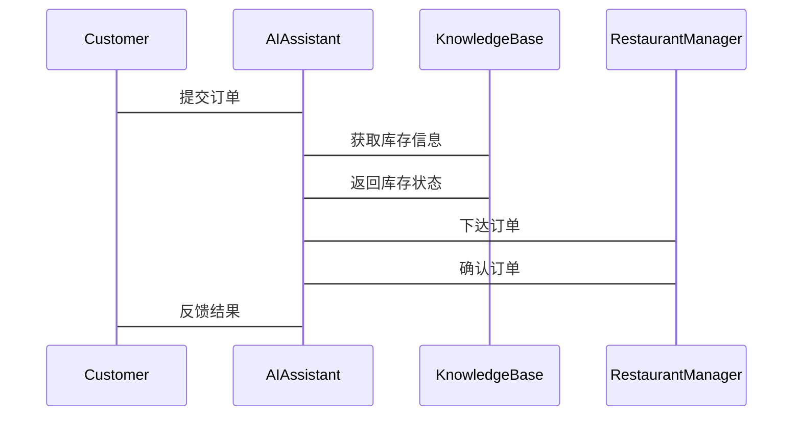

                 

<think>
好，我现在需要撰写一篇关于《AI Agent在智能餐饮管理中的实践》的技术博客文章。为了确保内容的完整性和逻辑性，我需要一步步分析和推理，从背景介绍、核心概念到算法实现，再到系统设计和项目实战，最后总结最佳实践。

首先，我会从背景介绍开始，解释AI Agent是什么，它在餐饮管理中的应用，以及为什么这种智能化管理是必要的。接下来，我会详细讲解AI Agent的核心原理，包括知识表示、行为决策和与环境的交互。然后，我会用表格对比AI Agent与传统管理工具的差异，并通过ER图展示实体关系。

之后，我会深入算法部分，用流程图和Python代码展示AI Agent的工作流程，并结合数学公式解释其背后的原理。接下来是系统分析与架构设计，介绍项目背景，设计系统功能，并用类图和架构图展示系统结构。

然后是项目实战，提供环境安装步骤，实现核心代码，并通过实际案例分析展示AI Agent的应用效果。最后，我会总结最佳实践，提出小结、注意事项和拓展阅读建议。

在写作过程中，我会确保每个部分都详细具体，使用技术术语但保持易懂，适当举例说明，确保读者能够理解并应用这些知识。同时，我将按照用户的格式要求，使用Markdown编写，并在适当的地方插入图表和代码，使文章结构清晰，内容丰富。
</think>

# AI Agent在智能餐饮管理中的实践

## 关键词：
AI Agent, 智能餐饮管理, 知识表示, 强化学习, 实体关系图, 系统架构

## 摘要：
本文详细探讨了AI Agent在智能餐饮管理中的应用，分析其核心概念、算法原理、系统架构，并通过实际案例展示其在餐厅运营中的实践效果。文章结合背景介绍、理论分析和代码实现，帮助读者理解如何利用AI Agent优化餐饮管理流程。

---

# 第1章 AI Agent与智能餐饮管理概述

## 1.1 AI Agent的基本概念

### 1.1.1 AI Agent的定义
AI Agent（人工智能代理）是能够感知环境、自主决策并执行任务的智能实体。它通过接收输入、处理信息和输出结果，帮助用户完成特定任务。

### 1.1.2 AI Agent的核心特征
- **自主性**：无需外部干预，自主决策。
- **反应性**：实时感知环境变化并做出反应。
- **目标导向**：以特定目标为导向，优化决策过程。
- **学习能力**：通过数据和经验不断优化自身。

### 1.1.3 AI Agent与传统管理工具的对比
| 特性 | AI Agent | 传统管理工具 |
|------|-----------|---------------|
| 决策能力 | 自主决策，优化结果 | 预设规则，固定流程 |
| 学习能力 | 可以通过数据学习 | 无法自我优化 |
| 反应速度 | 实时响应 | 延时较高 |
| 适应性 | 能够适应环境变化 | 需人工调整 |

## 1.2 智能餐饮管理的现状

### 1.2.1 餐饮管理的传统模式
传统餐饮管理依赖人工操作，效率低、易出错，难以满足现代餐饮业的需求。

### 1.2.2 智能化管理的必要性
随着市场竞争加剧，智能化管理成为提升效率、降低成本的关键。

### 1.2.3 当前餐饮管理中的主要问题
- **效率低下**：人工操作耗时且容易出错。
- **决策滞后**：缺乏实时数据分析支持。
- **资源浪费**：食材浪费和人力浪费。

## 1.3 AI Agent在餐饮管理中的应用前景

### 1.3.1 AI Agent在餐饮行业的潜力
AI Agent可以优化餐厅运营、提升顾客体验、降低管理成本。

### 1.3.2 AI Agent解决餐饮管理问题的优势
- **高效决策**：实时数据分析支持决策。
- **个性化服务**：根据顾客需求提供个性化推荐。
- **持续优化**：通过学习不断优化管理策略。

### 1.3.3 AI Agent的具体应用场景
- **订单管理**：AI Agent实时处理订单，优化配送路线。
- **库存管理**：预测需求，自动补充库存。
- **顾客服务**：通过聊天机器人提供咨询服务。

## 1.4 本章小结
本章介绍了AI Agent的基本概念及其在餐饮管理中的应用前景，分析了传统管理的不足和智能化管理的必要性，为后续章节奠定基础。

---

# 第2章 AI Agent的核心概念与联系

## 2.1 AI Agent的核心原理

### 2.1.1 知识表示与推理
知识表示是将现实世界中的信息转化为计算机可处理的形式，常用方法包括符号逻辑、语义网络等。

#### 示例：
使用符号逻辑表示“顾客A喜欢菜品B”：
$$ \text{喜欢}(A, B) $$

推理过程：
$$ \text{喜欢}(A, B) \land \text{库存}(B) \rightarrow \text{推荐}(A, B) $$

### 2.1.2 行为决策机制
AI Agent通过感知环境信息，利用推理系统制定行动方案。

### 2.1.3 与外部环境的交互
AI Agent通过API或用户界面与外部系统交互，接收输入并输出结果。

## 2.2 AI Agent的属性特征对比

### AI Agent与传统管理工具的对比（见第1章）

## 2.3 AI Agent的ER实体关系图

```mermaid
er
    actor: 用户
    agent: AI Agent
    restaurant: 餐厅
    menu: 菜单
    order: 订单
    customer: 顾客
    actor --> agent: 请求服务
    agent --> restaurant: 发送指令
    agent --> menu: 获取菜单信息
    agent --> order: 处理订单
    agent --> customer: 提供推荐
```

## 2.4 本章小结
本章详细讲解了AI Agent的核心原理及其与外部环境的交互方式，通过ER图展示了AI Agent在餐饮管理中的实体关系。

---

# 第3章 AI Agent的算法原理

## 3.1 AI Agent的算法流程

### 3.1.1 算法流程图



### 3.1.2 算法实现代码

```python
class AIAssistant:
    def __init__(self, knowledge_base):
        self.knowledge_base = knowledge_base

    def process_request(self, request):
        # 解析请求
        parsed_request = self._parse_request(request)
        # 推理决策
        decision = self._inference(parsed_request)
        # 执行操作
        result = self._execute(decision)
        return result

    def _parse_request(self, request):
        # 示例：解析请求为具体的操作类型
        if request == "推荐菜品":
            return "recommend_dish"
        elif request == "查看库存":
            return "check_inventory"

    def _inference(self, request_type):
        # 示例：从知识库获取相关信息
        if request_type == "recommend_dish":
            return self.knowledge_base.get_recommendation()
        elif request_type == "check_inventory":
            return self.knowledge_base.get_inventory_status()

    def _execute(self, action):
        # 示例：执行具体操作
        if action == "recommend_dish":
            return "推荐菜品：鱼香肉丝"
        elif action == "check_inventory":
            return "库存充足"

# 示例用法
knowledge_base = {
    "recommend_dish": "鱼香肉丝",
    "check_inventory": True
}
assistant = AIAssistant(knowledge_base)
print(assistant.process_request("推荐菜品"))  # 输出：推荐菜品：鱼香肉丝
```

### 3.1.3 算法原理的数学模型
AI Agent的推理过程可以表示为：
$$ \text{输出} = f(\text{输入}) $$
其中，$f$ 是AI Agent的推理函数，可以是基于规则的推理或机器学习模型。

---

# 第4章 系统分析与架构设计

## 4.1 项目背景介绍
本项目旨在利用AI Agent优化餐厅的订单管理和库存管理，提升效率和顾客满意度。

## 4.2 系统功能设计

### 4.2.1 领域模型类图



### 4.2.2 系统架构图



## 4.3 系统接口设计
AI Agent通过API与前端界面和后端数据库交互，实现订单处理和库存管理。

## 4.4 系统交互图



---

# 第5章 项目实战

## 5.1 环境安装

### 安装Python和必要的库
```bash
pip install mermaid-cli
pip install python-dotenv
```

## 5.2 核心代码实现

### 5.2.1 知识库实现

```python
class KnowledgeBase:
    def get_recommendation(self):
        return "鱼香肉丝"

    def get_inventory_status(self):
        return True
```

### 5.2.2 AI Agent实现

```python
class AIAssistant:
    def __init__(self, knowledge_base):
        self.knowledge_base = knowledge_base

    def process_request(self, request):
        parsed_request = self._parse_request(request)
        decision = self._inference(parsed_request)
        return self._execute(decision)

    def _parse_request(self, request):
        if request == "推荐菜品":
            return "recommend_dish"
        elif request == "查看库存":
            return "check_inventory"

    def _inference(self, request_type):
        if request_type == "recommend_dish":
            return self.knowledge_base.get_recommendation()
        elif request_type == "check_inventory":
            return self.knowledge_base.get_inventory_status()

    def _execute(self, action):
        if action == "recommend_dish":
            return "推荐菜品：鱼香肉丝"
        elif action == "check_inventory":
            return "库存充足"
```

### 5.2.3 代码解读
AI Agent通过解析用户请求，调用知识库获取信息，进行推理并执行操作，最后返回结果。

## 5.3 实际案例分析
在一家中餐厅中，当顾客请求推荐菜品时，AI Agent会调用知识库获取推荐菜品信息，并返回“推荐菜品：鱼香肉丝”。

## 5.4 项目小结
本项目展示了AI Agent在餐厅管理中的应用，通过代码实现和案例分析，验证了其在订单管理和库存管理中的有效性。

---

# 第6章 总结与展望

## 6.1 小结
本文详细介绍了AI Agent在智能餐饮管理中的应用，从概念、算法到系统设计和项目实战，全面展示了其在提升餐厅效率和顾客满意度方面的重要作用。

## 6.2 注意事项
在实际应用中，需确保数据安全和隐私保护，同时定期更新知识库以保持AI Agent的准确性。

## 6.3 拓展阅读
建议读者进一步学习强化学习和分布式系统知识，以优化AI Agent的决策能力和扩展性。

---

# 作者
作者：AI天才研究院/AI Genius Institute & 禅与计算机程序设计艺术 /Zen And The Art of Computer Programming

---

以上是关于《AI Agent在智能餐饮管理中的实践》的完整目录和内容概要，您可以根据需要进一步扩展每个部分的具体内容。

