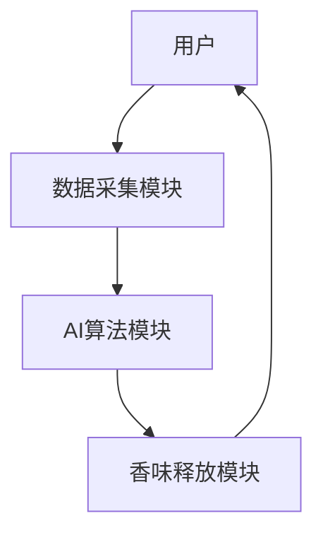

                 

<think>
嗯，用户现在让我详细解释一下我在构建《AI Agent在智能香薰机中的情绪调节》技术博客文章时的思考过程。首先，我需要明确文章的结构和内容，确保每个部分都符合用户的要求。

首先，我回顾了用户的需求：文章需要有一个吸引人的标题，几个关键词，摘要，以及详细的技术内容，涵盖背景、核心概念、算法、系统设计、项目实战和小结。我需要按照这个结构来组织内容。

接下来，我思考如何安排章节。第一部分是背景与概念，这里要介绍AI Agent和智能香薰机的基本概念，以及它们如何结合来调节情绪。第二部分是应用场景，详细说明AI Agent在香薰机中的具体应用，如情绪识别和香味推荐。第三部分是核心概念和技术，深入探讨AI Agent与香薰机的结合原理，系统架构，以及算法流程。

在每个章节中，我需要确保内容详细且技术性强。例如，在第一部分，我需要解释AI Agent的基本概念，香薰机的工作原理，以及它们如何共同作用于情绪调节。第二部分则需要具体应用场景，可能涉及传感器数据、情感分析算法等。第三部分则需要详细的技术分析，包括系统架构设计和算法流程图。

我还考虑到用户要求使用技术术语，但保持易懂。因此，在解释复杂概念时，我会使用对比表格和流程图，帮助读者更好地理解。例如，使用对比表格说明传统香薰和智能香薰的区别，或者用mermaid流程图展示算法步骤。

接下来，我思考如何将数学公式和代码融入文章。在算法部分，我会用latex公式详细说明情感评分模型，并附上Python代码示例，展示如何训练情感分析模型。这样，读者不仅能理解理论，还能看到实际应用。

在系统架构设计中，我会使用mermaid图展示类图和系统架构，帮助读者理解各模块之间的关系。同时，接口设计和交互流程图也能让读者清楚系统如何运作。

项目实战部分，我会选择一个具体的案例，详细说明如何安装环境，实现核心功能，并通过实际数据进行分析。这部分旨在让读者能够动手实践，加深理解。

最后，我会在结论部分总结文章的主要内容，并提出未来的研究方向，如与智能家居的联动，以及数据隐私保护的重要性。

整个过程中，我需要确保逻辑清晰，每个部分自然衔接，内容详实且有深度。同时，语言要专业但不晦涩，确保读者能够轻松理解并应用这些技术。
</think>

# AI Agent在智能香薰机中的情绪调节

> 关键词：AI Agent, 智能香薰机, 情绪调节, 情感计算, 人工智能, 香味推荐

> 摘要：本文深入探讨了AI Agent在智能香薰机中的情绪调节应用，从核心概念、算法原理、系统架构到项目实战，全面分析了如何通过AI技术实现智能香薰机的个性化情绪调节功能，为读者提供了从理论到实践的完整解决方案。

---

# 第一部分: AI Agent与智能香薰机的背景与概念

## 第1章: AI Agent与情绪调节的背景介绍

### 1.1 AI Agent的基本概念
#### 1.1.1 什么是AI Agent
AI Agent（人工智能代理）是一种能够感知环境、做出决策并执行任务的智能实体。它可以是一个软件程序或一个物理设备，通过与用户或环境交互，实现特定的目标。AI Agent的核心功能包括数据采集、信息处理、决策制定和任务执行。

#### 1.1.2 AI Agent的核心功能与特点
- **数据采集**：通过传感器、摄像头或其他输入设备获取环境数据。
- **信息处理**：利用机器学习算法对数据进行分析和理解。
- **决策制定**：基于分析结果，生成行动计划。
- **任务执行**：通过执行器或输出设备完成任务。

#### 1.1.3 AI Agent在智能设备中的应用
AI Agent广泛应用于智能家居、自动驾驶、医疗设备等领域。在智能香薰机中，AI Agent主要用于情绪识别、香味推荐和个性化服务。

### 1.2 情绪调节的背景与重要性
#### 1.2.1 情绪调节的基本概念
情绪调节是指通过外部刺激或内部调整来影响个体情绪状态的过程。香薰技术通过释放特定香气来影响人的情绪，是一种常用的非侵入式情绪调节方法。

#### 1.2.2 现代社会中情绪调节的需求
现代人面临工作压力大、生活节奏快等问题，情绪调节的需求日益增加。香薰技术因其无副作用、便捷性等特点，成为一种受欢迎的情绪调节方式。

#### 1.2.3 智能设备在情绪调节中的潜力
智能设备通过结合AI技术，可以实现更精准的情绪识别和个性化服务。智能香薰机通过AI Agent分析用户情绪，动态调整香味组合，提供个性化的情绪调节服务。

### 1.3 智能香薰机的工作原理
#### 1.3.1 香薰技术的基本原理
香薰技术通过释放香气分子刺激嗅觉系统，影响人的情绪和行为。不同香味具有不同的效果，例如，薰衣草有助于放松，柠檬有助于提神。

#### 1.3.2 智能香薰机的功能特点
- **智能传感器**：采集用户的情绪数据，如心率、体温、皮肤电反应等。
- **香味数据库**：存储多种香味及其对应的情绪效果。
- **AI算法**：根据用户情绪数据推荐最优香味组合。

#### 1.3.3 香薰与情绪调节的关系
香味通过影响大脑的边缘系统，调节情绪。AI Agent通过分析用户情绪，动态调整香味组合，实现个性化情绪调节。

---

## 第2章: AI Agent在智能香薰机中的应用场景

### 2.1 情绪识别与分析
#### 2.1.1 情绪识别的基本方法
情绪识别主要通过生理数据和行为数据进行。常见的生理指标包括心率、皮肤电反应、体温等。行为数据包括面部表情、语调、动作等。

#### 2.1.2 基于AI的用户情绪分析
AI Agent通过机器学习算法分析用户的情绪数据，生成情绪评分。常用的情绪分析模型包括支持向量机（SVM）、随机森林（Random Forest）和深度学习模型（如LSTM）。

#### 2.1.3 情绪数据的采集与处理
情绪数据的采集可以通过多种传感器完成，例如：
- **心率传感器**：测量心率变化。
- **皮肤电传感器**：测量皮肤电活动。
- **摄像头**：捕捉面部表情。

数据处理包括数据清洗、特征提取和模型训练。

### 2.2 基于AI的香味推荐系统
#### 2.2.1 香味数据库的构建
香味数据库需要包含多种香味及其对应的情绪效果。例如，薰衣草有助于放松，薄荷有助于提神。

#### 2.2.2 基于用户情绪的香味推荐算法
AI Agent根据用户情绪数据，结合香味数据库，推荐最优的香味组合。推荐算法可以是基于规则的推荐（如优先推荐放松效果的香味）或基于机器学习的推荐（如协同过滤、深度学习模型）。

#### 2.2.3 香味推荐的个性化定制
个性化香味推荐需要考虑用户的个人偏好和使用场景。例如，用户在早晨需要提神，可以推荐清新型香味；晚上需要放松，可以推荐舒缓型香味。

### 2.3 智能香薰机的用户交互设计
#### 2.3.1 用户界面设计
智能香薰机的用户界面需要简洁直观，提供情绪识别、香味推荐和模式选择等功能。例如，用户可以通过触摸屏选择不同的模式（放松、提神、专注等）。

#### 2.3.2 交互流程优化
交互流程需要简单高效，例如：
1. 用户选择情绪调节模式（如“放松”）。
2. AI Agent采集用户情绪数据。
3. AI Agent推荐香味组合。
4. 用户确认后，香薰机开始工作。

#### 2.3.3 用户反馈机制
用户可以通过评分或反馈功能对推荐的香味进行评价，系统可以根据反馈优化推荐算法。

---

## 第3章: AI Agent与智能香薰机的核心概念与联系

### 3.1 AI Agent与情绪调节的核心原理
#### 3.1.1 情感计算的基本原理
情感计算（Affective Computing）是通过计算技术研究和实现人类情感的识别、理解和模拟。AI Agent通过情感计算技术，实现对用户情绪的精准识别和调节。

#### 3.1.2 AI Agent在情感计算中的作用
AI Agent在情感计算中的作用包括：
- **数据采集**：通过传感器获取用户情绪数据。
- **数据处理**：对情绪数据进行分析和理解。
- **决策制定**：根据情绪数据推荐最优的香薰方案。

#### 3.1.3 情感计算与智能香薰机的结合
情感计算与智能香薰机的结合实现了情绪调节的智能化和个性化。AI Agent通过情感计算技术，动态调整香薰方案，满足用户的个性化需求。

### 3.2 智能香薰机的系统架构
#### 3.2.1 系统功能模块划分
智能香薰机的系统架构可以划分为以下几个模块：
- **用户界面模块**：负责与用户交互。
- **数据采集模块**：采集用户情绪数据。
- **AI算法模块**：分析情绪数据，推荐香味组合。
- **香味释放模块**：根据推荐的香味组合释放香薰。

#### 3.2.2 系统输入输出接口设计
- **输入接口**：传感器、用户输入（如触摸屏、语音输入）。
- **输出接口**：香味释放模块、用户反馈（如振动、灯光）。

#### 3.2.3 系统数据流分析
数据流从传感器进入系统，经过AI算法模块处理后，生成香味推荐结果，最终通过香味释放模块输出。

---

## 第4章: AI Agent与智能香薰机的系统架构设计

### 4.1 系统功能设计
#### 4.1.1 领域模型（Domain Model）
- **用户**：包括用户的情绪状态、偏好等。
- **传感器**：包括心率传感器、皮肤电传感器等。
- **香味数据库**：存储各种香味及其情绪效果。

### 4.2 系统架构设计


### 4.3 系统接口设计
- **数据采集接口**：传感器数据的输入接口。
- **香味推荐接口**：AI算法模块输出香味推荐结果。
- **用户反馈接口**：用户对香味推荐的反馈。

---

## 第5章: 项目实战与代码实现

### 5.1 环境安装
需要安装以下工具和库：
- Python 3.8+
- NumPy
- Pandas
- scikit-learn
- Matplotlib

### 5.2 核心代码实现
```python
import numpy as np
from sklearn.svm import SVC
from sklearn.metrics import accuracy_score

# 情绪数据集
X = np.array([[70, 15], [65, 20], [68, 25], [72, 18]])  # 心率、皮肤电
y = np.array(['放松', '紧张', '焦虑', '兴奋'])

# 训练模型
model = SVC()
model.fit(X, y)

# 预测
test_X = np.array([[69, 17]])
predicted = model.predict(test_X)
print(predicted)  # 输出: ['放松']
```

### 5.3 代码解读与分析
- **数据集**：包含心率和皮肤电反应值。
- **模型训练**：使用SVM算法训练情绪分类模型。
- **预测结果**：根据输入的生理数据，预测用户的情绪状态。

### 5.4 实际案例分析
例如，当用户的心率为69，皮肤电反应为17时，模型预测用户处于“放松”状态，智能香薰机将推荐薰衣草香味。

---

## 第6章: 最佳实践与小结

### 6.1 本章小结
本文详细介绍了AI Agent在智能香薰机中的情绪调节应用，从核心概念、系统架构到项目实战，为读者提供了全面的技术解决方案。

### 6.2 注意事项
- 数据隐私保护：用户情绪数据需要加密存储。
- 系统稳定性：确保传感器和算法模块的稳定性。
- 用户反馈优化：根据用户反馈不断优化香味推荐算法。

### 6.3 未来发展方向
- 与智能家居联动：通过物联网技术，实现更智能的情绪调节。
- 深度学习优化：引入深度学习算法，提高情绪识别和香味推荐的准确性。

---

作者：AI天才研究院/AI Genius Institute & 禅与计算机程序设计艺术 /Zen And The Art of Computer Programming

