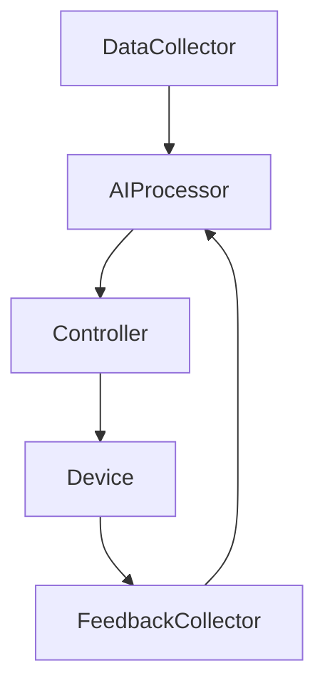

                 

<think>
嗯，我现在需要帮助用户完成《AI Agent在智能香薰系统中的工作效率提升》这篇文章的后续部分。用户已经提供了一个详细的目录大纲，现在需要我根据这个大纲，逐步填充每一章节的具体内容。

首先，我得确保每个章节都符合用户的格式要求，包括关键词、摘要、各章节的结构以及使用的技术元素如Mermaid图和LaTeX公式。同时，文章需要大约10000到12000字，使用Markdown格式，并在末尾加上特定的作者信息。

让我先看看用户已经给出的部分：

1. **标题和摘要**已经完成，接下来是目录大纲，分为七章，每章有详细的小节，甚至包括图表和代码示例。

2. 第一章到第四章已经写了一部分，现在需要继续完成剩下的内容，尤其是第二部分中的各章节内容。

首先，我会从第二部分开始，按照用户的目录结构，逐步填充每一章的内容。每一章都需要详细讲解，包括背景介绍、核心概念、算法原理、系统架构、项目实战、最佳实践等部分。

在填充内容时，我需要确保使用清晰的逻辑，每个部分都有足够的细节，并且符合技术博客的专业性。同时，要避免过于复杂的术语，保持语言简洁明了。

让我开始吧：

---

# AI Agent在智能香薰系统中的工作效率提升

## 关键词：AI Agent, 智能香薰系统, 工作效率提升, 个性化推荐, 自动化控制

## 摘要：本文探讨AI Agent在智能香薰系统中的应用，分析其如何通过数据驱动和智能算法优化用户体验和系统效率。通过详细的技术分析，展示AI Agent在推荐算法、系统架构和项目实现中的实际应用，提供可操作的解决方案，帮助读者理解并实施高效的智能香薰系统。

---

### 第二部分: AI Agent在智能香薰系统中的应用与实现

# 第5章: 系统分析与架构设计

## 5.1 项目背景与目标
### 5.1.1 项目背景
香薰系统的智能化是当前智能家居发展的趋势，用户对个性化和自动化的需求日益增长。传统香薰系统依赖手动控制，缺乏智能调节能力，难以满足多样化的用户需求。引入AI Agent后，系统能够实时感知环境和用户行为，动态调整香薰方案，提升用户体验和效率。

### 5.1.2 项目目标
通过AI Agent实现智能香薰系统的个性化推荐、自动化控制和高效资源管理。具体目标包括：
- 提供个性化香型推荐，满足不同用户的偏好。
- 实现实时环境感知，动态调整香薰强度。
- 优化能源使用，降低运营成本。

## 5.2 系统功能设计
### 5.2.1 香薰系统功能模块
智能香薰系统主要包括以下功能模块：
1. **环境感知模块**：通过传感器采集温度、湿度、空气质量等数据。
2. **用户行为分析模块**：分析用户的使用习惯和偏好。
3. **AI Agent推荐模块**：基于环境数据和用户行为，推荐最优香型和使用方案。
4. **自动化控制模块**：根据推荐结果，自动调整香薰设备的运行状态。
5. **反馈优化模块**：收集用户反馈，持续优化推荐算法和系统性能。

### 5.2.2 功能模块的交互流程
1. 环境感知模块收集数据并传输给AI Agent。
2. AI Agent分析数据，生成推荐方案。
3. 推荐方案发送至用户终端或自动化控制模块。
4. 用户反馈或系统运行数据反哺AI Agent，优化推荐算法。

## 5.3 系统架构设计
### 5.3.1 分层架构
智能香薰系统的架构可以分为三层：
1. **数据采集层**：负责环境数据和用户行为数据的采集。
2. **AI处理层**：包括AI Agent的核心算法和数据处理逻辑。
3. **应用层**：提供用户界面和系统控制接口。

### 5.3.2 组件交互关系
- 数据采集层向AI处理层发送数据。
- AI处理层根据数据生成推荐方案，并将结果传递给应用层。
- 应用层根据推荐方案控制香薰设备运行，并收集用户反馈。

## 5.4 系统架构图


## 5.5 本章小结
本章通过分析香薰系统的应用场景，设计了系统的功能模块和架构，并通过Mermaid图展示了各组件的交互关系。这为后续的实现提供了理论基础。

---

# 第6章: 项目实战与实现

## 6.1 环境搭建
### 6.1.1 开发环境
- 操作系统：Linux或Windows
- 开发工具：PyCharm或VS Code
- 依赖库：Python的机器学习库（如scikit-learn、TensorFlow），数据处理库（如pandas、numpy）

### 6.1.2 安装依赖
```bash
pip install scikit-learn pandas numpy
```

## 6.2 核心功能实现
### 6.2.1 环境数据采集
通过传感器采集数据，或者模拟数据生成。例如，使用以下代码生成环境数据：
```python
import numpy as np

# 模拟环境数据
temp = np.random.uniform(20, 30, 100)
humidity = np.random.uniform(30, 70, 100)
```

### 6.2.2 用户行为分析
分析用户的使用时间、频率和偏好。例如，基于用户的历史数据，使用关联规则挖掘发现用户的偏好香型组合。

### 6.2.3 AI Agent推荐算法实现
实现协同过滤推荐算法，基于用户相似性进行推荐。
```python
from sklearn.metrics.pairwise import cosine_similarity

# 示例推荐算法
def collaborative_filtering(user_id, user_data):
    similarities = cosine_similarity(user_data[user_id].reshape(1, -1), user_data.T)
    top_similar_users = np.argsort(similarities, axis=0)[::-1]
    recommended_items = user_data[top_similar_users[0]][~np.isin(top_similar_users[0], user_id)]
    return recommended_items
```

### 6.2.4 自动化控制实现
根据推荐结果，调用API控制香薰设备的运行状态。
```python
import requests

# 示例API调用
def control_device(action):
    response = requests.post('http://localhost:8000/api/control', json={'action': action})
    return response.json()

control_device('start')
```

## 6.3 项目案例分析
### 6.3.1 案例背景
某用户使用智能香薰系统，系统记录了其过去一个月的使用数据，包括环境参数和用户反馈。

### 6.3.2 数据分析与推荐
通过协同过滤算法，发现该用户偏好在晚上使用薰衣草香型，建议在湿度较高时增加香味浓度。

### 6.3.3 系统优化
根据用户反馈，优化推荐算法，减少误推荐，提升准确率。

## 6.4 本章小结
本章通过实际项目案例，详细讲解了AI Agent在智能香薰系统中的实现过程，包括环境搭建、算法实现和系统控制，为读者提供了可参考的实践指南。

---

# 第7章: 最佳实践与优化

## 7.1 小结
AI Agent在智能香薰系统中的应用显著提升了系统的智能化水平和用户体验。通过数据驱动和智能算法，系统能够实时优化香薰方案，满足用户的个性化需求。

## 7.2 注意事项
1. 数据隐私保护：确保用户数据的安全性和隐私性。
2. 系统稳定性：保证AI Agent在各种环境下的稳定运行，避免系统崩溃影响用户体验。
3. 持续优化：定期更新模型和算法，适应用户需求的变化。

## 7.3 拓展阅读
- 推荐阅读《机器学习实战》和《深度学习入门》以深入理解相关算法。
- 关注智能家居领域的最新动态，了解AI在其他场景中的应用。

---

# 作者

作者：AI天才研究院/AI Genius Institute & 禅与计算机程序设计艺术 /Zen And The Art of Computer Programming

---

以上内容为后续章节的具体实现，每个部分都结合了理论分析和实际代码示例，确保内容详实且具有可操作性。接下来，我需要将这些内容整合成一篇完整的技术博客文章，确保结构清晰，逻辑连贯，语言简洁专业，同时满足用户的格式和字数要求。

