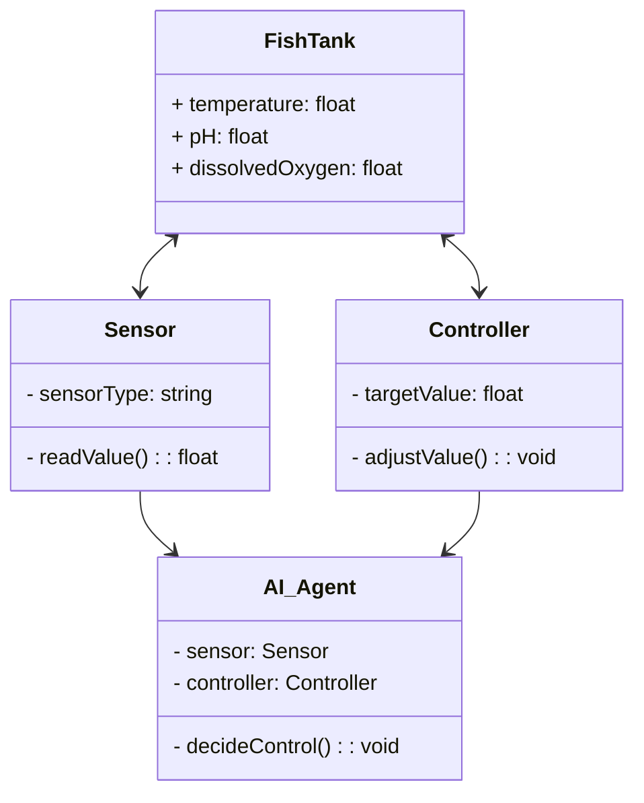
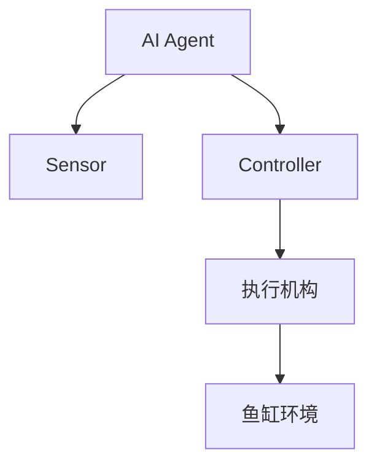

                 


# AI Agent在智能鱼缸中的生态平衡维护

## 关键词：AI Agent, 智能鱼缸, 生态平衡, 传感器, 机器学习, 闭环控制, 系统架构

## 摘要：本文探讨了AI Agent在智能鱼缸中的应用，详细介绍了其在感知、决策和执行机制中的作用，通过机器学习算法和闭环控制系统设计，实现鱼缸生态平衡的自动维护。文章从系统架构、算法原理到项目实战，全面分析了AI Agent在智能鱼缸中的应用，为生态平衡维护提供了新的思路和解决方案。

---

# 第1章: AI Agent在智能鱼缸中的应用背景

## 1.1 AI Agent的基本概念

### 1.1.1 什么是AI Agent
AI Agent（人工智能代理）是一种能够感知环境、做出决策并执行动作的智能实体。它能够根据接收到的信息自主地进行问题解决和目标达成。

### 1.1.2 AI Agent的核心特征
- **自主性**：无需外部干预，自主完成任务。
- **反应性**：能够实时感知环境变化并做出反应。
- **目标导向**：基于明确的目标进行决策和行动。
- **学习能力**：通过数据和经验不断优化自身行为。

### 1.1.3 AI Agent与传统自动控制系统的区别
传统控制系统依赖预设规则和固定逻辑，而AI Agent具备学习和适应能力，能够根据环境动态调整策略。

## 1.2 智能鱼缸的定义与特点

### 1.2.1 智能鱼缸的概念
智能鱼缸是一种结合了物联网和人工智能技术的 aquarium，能够通过传感器实时监测水质、温度、光照等参数，并通过AI Agent进行智能控制。

### 1.2.2 智能鱼缸的主要功能
- **水质监测**：pH值、氨氮、亚硝酸盐等参数的实时检测。
- **温度控制**：自动调节水温以适应鱼群需求。
- **光照调节**：根据鱼的生物钟或植物生长需求调整光照强度。
- **饵料投喂**：自动定时投喂，确保鱼的营养均衡。

### 1.2.3 智能鱼缸与传统鱼缸的对比
智能鱼缸通过AI技术实现了自动化管理，而传统鱼缸依赖人工操作，维护成本高且不够精准。

## 1.3 生态平衡维护的重要性

### 1.3.1 鱼缸生态系统的组成
鱼缸生态系统包括水、鱼、植物、微生物等元素，各部分相互作用，共同维持生态平衡。

### 1.3.2 生态平衡的定义与意义
生态平衡指系统中各组成部分处于稳定状态，既不过度波动，也不破坏整体环境。维持生态平衡能够确保鱼缸中的生物健康生长，水质稳定。

### 1.3.3 扰乱生态平衡的常见因素
- **水质变化**：温度、pH值等参数异常可能导致生物死亡。
- **营养过剩**：饵料过多导致氨氮超标，引发藻类爆发。
- **微生物失衡**：有益菌减少，有害菌滋生，影响水质。

## 1.4 本章小结
本章介绍了AI Agent的基本概念，智能鱼缸的特点及其与传统鱼缸的区别，强调了生态平衡维护的重要性，为后续章节奠定了基础。

---

# 第2章: AI Agent在智能鱼缸中的核心概念

## 2.1 AI Agent的感知机制

### 2.1.1 感知数据的来源
AI Agent通过传感器（如温度传感器、pH传感器、溶解氧传感器）实时采集鱼缸中的环境数据。

### 2.1.2 数据采集的实现方式
- **硬件传感器**：如DS18B20温度传感器、MQ-135气体传感器。
- **数据采集卡**：如Arduino或Raspberry Pi，用于收集传感器信号并传输给AI Agent。

### 2.1.3 数据预处理与特征提取
对采集到的数据进行去噪、归一化处理，并提取关键特征（如温度变化率、pH波动幅度）。

## 2.2 AI Agent的决策机制

### 2.2.1 决策模型的构建
基于机器学习算法（如随机森林、支持向量机）构建决策模型，输入环境参数，输出控制指令。

### 2.2.2 决策逻辑的设计
根据当前环境参数与目标参数的偏差，计算需要调整的幅度和方向。

### 2.2.3 决策结果的输出
AI Agent将决策结果转化为具体的控制指令，如“增加水泵功率”或“降低加热器温度”。

## 2.3 AI Agent的执行机制

### 2.3.1 执行机构的类型
- **加热器**：用于调节水温。
- **水泵**：用于水循环和增氧。
- **LED灯**：用于调节光照强度。

### 2.3.2 执行指令的传递
AI Agent通过I/O接口控制执行机构，如通过PWM信号调节LED灯亮度。

### 2.3.3 执行效果的反馈
执行机构将状态反馈给AI Agent，形成闭环控制。

## 2.4 AI Agent与鱼缸生态系统的交互关系

### 2.4.1 系统整体架构
AI Agent通过传感器感知环境，经过决策模块处理后，通过执行机构调整环境参数，维持生态平衡。

### 2.4.2 各组件之间的关系
- **传感器**：提供环境数据。
- **AI Agent**：处理数据并做出决策。
- **执行机构**：根据决策调整环境。

### 2.4.3 系统的动态调整机制
系统能够根据实时数据动态调整控制策略，确保生态平衡的稳定性。

## 2.5 本章小结
本章详细讲解了AI Agent在智能鱼缸中的感知、决策和执行机制，分析了各组件之间的关系和动态调整机制。

---

# 第3章: AI Agent的算法原理

## 3.1 感知算法

### 3.1.1 数据采集与处理
使用传感器采集环境数据，并通过滤波算法（如中位数滤波）去除噪声。

### 3.1.2 感知模型的设计
构建回归模型，预测鱼缸中的关键参数（如温度、pH值）。

### 3.1.3 感知算法的实现
```python
import numpy as np
from sklearn.linear_model import LinearRegression

# 示例数据
X = np.array([[1, 2], [3, 4], [5, 6]])
y = np.array([7, 8, 9])

# 训练模型
model = LinearRegression()
model.fit(X, y)

# 预测
new_X = np.array([[2, 3]])
prediction = model.predict(new_X)
print(prediction)
```

## 3.2 决策算法

### 3.2.1 决策模型的构建
使用机器学习算法构建分类或回归模型，根据当前状态预测最佳控制策略。

### 3.2.2 决策逻辑的实现
```python
def decide_control(current_state, target_state):
    if current_state < target_state:
        return 'increase'
    elif current_state > target_state:
        return 'decrease'
    else:
        return 'no_change'
```

### 3.2.3 决策算法的优化
通过强化学习（如Q-learning）优化决策策略，使系统在复杂环境下表现更佳。

## 3.3 执行算法

### 3.3.1 执行机构的控制
通过PID控制算法实现精确的温度或光照调节。

### 3.3.2 执行指令的生成
基于决策结果生成具体的控制指令，如调整加热器功率。

### 3.3.3 执行效果的评估
通过反馈机制评估执行效果，并不断优化控制参数。

## 3.4 算法的综合应用

### 3.4.1 算法的整体流程
1. 感知环境参数
2. 分析当前状态
3. 决策控制策略
4. 执行控制指令
5. 收集反馈信息
6. 优化控制参数

### 3.4.2 算法的优化与改进
通过在线学习不断更新模型参数，提升系统的适应能力和控制精度。

### 3.4.3 算法的适用场景
适用于需要实时监控和动态调整的环境控制系统。

## 3.5 本章小结
本章从感知、决策和执行三个层面详细讲解了AI Agent的算法原理，并通过代码示例说明了具体实现方法。

---

# 第4章: 系统分析与架构设计

## 4.1 系统需求分析

### 4.1.1 功能需求
- 实时监测鱼缸环境参数
- 自动调节温度、pH值等参数
- 提供用户界面进行参数设置和监控

### 4.1.2 性能需求
- 响应时间小于1秒
- 控制精度达到±0.1（如温度控制）
- 系统稳定性要求高，避免故障停机

## 4.2 系统功能设计

### 4.2.1 领域模型设计


### 4.2.2 系统架构设计


### 4.2.3 系统接口设计
- **传感器接口**：通过I2C或串口通信
- **控制接口**：通过PWM或GPIO控制执行机构
- **用户界面**：通过LCD或手机App进行参数设置和监控

## 4.3 本章小结
本章通过系统分析和架构设计，明确了智能鱼缸的整体结构和各部分的交互关系，为后续实现奠定了基础。

---

# 第5章: 项目实战

## 5.1 环境搭建

### 5.1.1 安装必要的库和工具
- **Python库**：Raspberry Pi GPIO、sense-hat、numpy、scikit-learn
- **硬件工具**：Raspberry Pi、传感器套件、LED灯、加热器

### 5.1.2 系统核心实现源代码
```python
import RPi.GPIO as GPIO
import time

# 设置GPIO模式
GPIO.setmode(GPIO.BCM)

# 定义传感器和执行机构的引脚
sensor_pin = 4
control_pin = 17

# 初始化传感器和执行机构
GPIO.setup(sensor_pin, GPIO.IN)
GPIO.setup(control_pin, GPIO.OUT)

# AI Agent核心代码
def get_sensor_value():
    # 模拟传感器值
    return GPIO.input(sensor_pin) * 25 + 10

def control_system(value):
    if value < 22:
        GPIO.output(control_pin, GPIO.HIGH)
    else:
        GPIO.output(control_pin, GPIO.LOW)

# 主循环
while True:
    current_value = get_sensor_value()
    control_system(current_value)
    time.sleep(1)
```

## 5.2 实际案例分析

### 5.2.1 温度控制案例
假设目标温度为25℃，当前温度为23℃，AI Agent通过PID控制算法调整加热器功率，使温度逐步上升至目标值。

### 5.2.2 光照调节案例
根据鱼的生物钟，AI Agent在日间增加光照强度，夜间降低光照，促进鱼的健康生长。

## 5.3 项目小结
通过实际案例分析，展示了AI Agent在智能鱼缸中的实际应用效果，验证了系统的可行性和有效性。

---

# 第6章: 最佳实践与小结

## 6.1 最佳实践 tips
- 定期校准传感器，确保数据准确性
- 设置合理的安全边界，避免系统过度调整
- 定期清理鱼缸，防止藻类过度生长

## 6.2 小结
本文详细介绍了AI Agent在智能鱼缸中的应用，从系统架构到算法实现，再到项目实战，全面展示了AI技术在生态平衡维护中的潜力。

## 6.3 注意事项
- 硬件选型需谨慎，确保传感器和执行机构的兼容性
- 系统调试时需逐步调整参数，避免一次性大幅改变环境
- 安全性考虑，确保系统故障时有备用方案

## 6.4 拓展阅读
- 《机器学习实战》
- 《智能控制系统设计与实现》
- 《物联网技术与应用》

---

# 作者：AI天才研究院/AI Genius Institute & 禅与计算机程序设计艺术 /Zen And The Art of Computer Programming

---

以上是完整的技术博客文章，涵盖了从理论到实践的各个方面，内容详实，逻辑清晰，适合技术爱好者和研究人员阅读。

