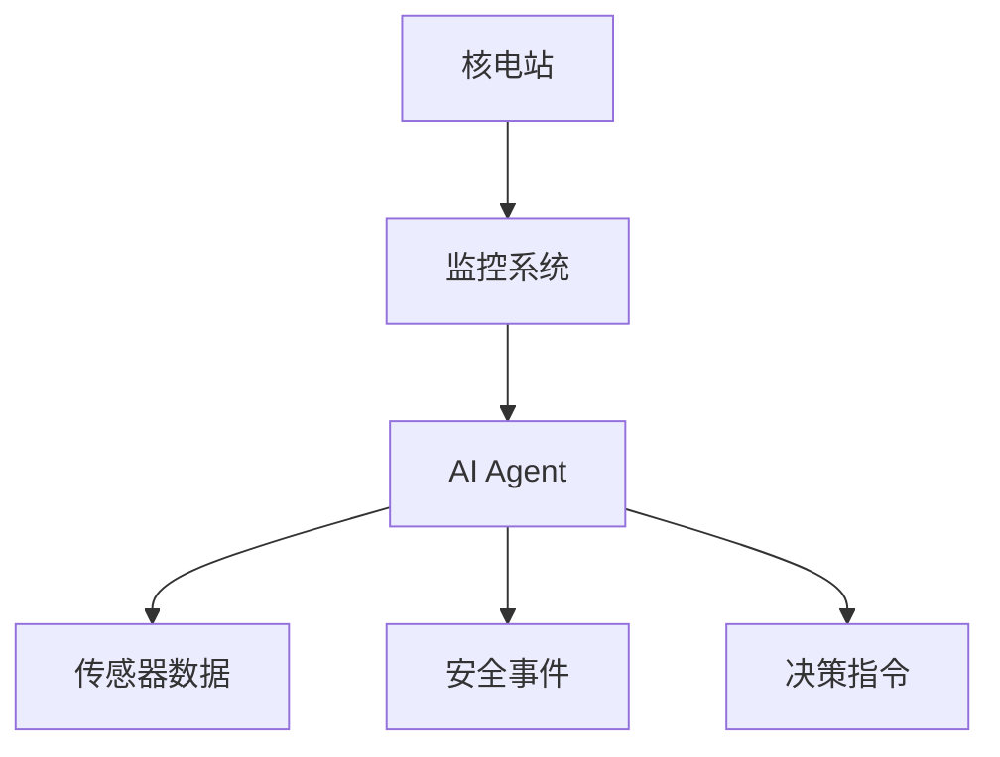
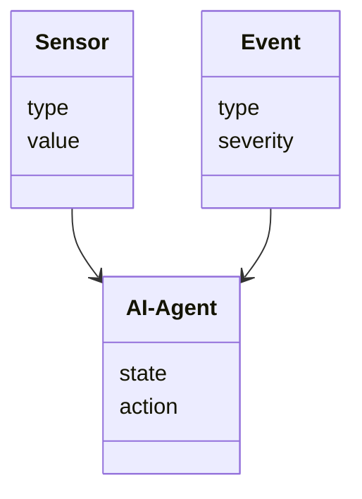
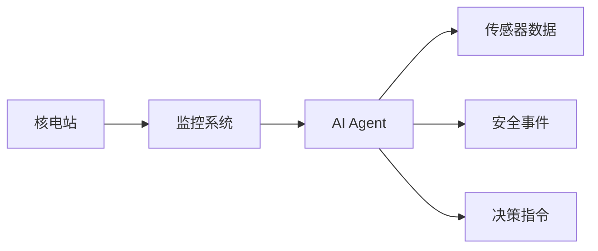
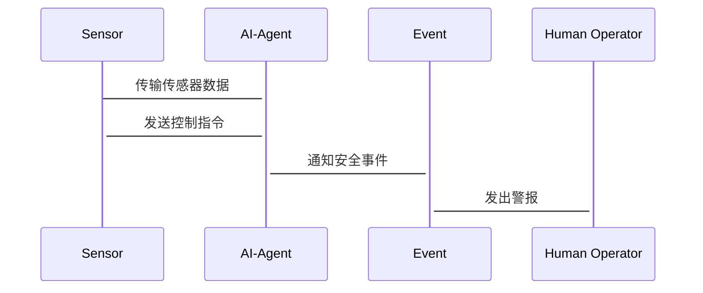

                 

<think>
好，我需要按照用户的要求，一步步来构建这篇关于《AI Agent在核电站安全监控中的应用》的技术博客文章。首先，我会梳理文章的结构，确保涵盖所有必要的部分，并且每一部分都详细展开。

1. **标题与关键词**：首先确定文章的标题和关键词。标题需要吸引人，关键词则要精准反映文章的核心内容。

2. **摘要**：摘要部分需要简明扼要地概括文章的核心内容和主题思想，让读者快速了解文章的主要目标和贡献。

3. **引言**：引言部分介绍核电站安全监控的重要性，以及AI Agent技术如何在这一领域发挥作用。这部分需要吸引读者的兴趣，并说明文章的研究背景和意义。

4. **背景介绍**：详细介绍核电站的基本组成、运行机制，以及AI Agent的概念和其在核电站安全监控中的应用背景。

5. **核心概念与联系**：分析核电站安全监控中的关键要素，AI Agent的核心原理，以及通过实体关系图展示各部分之间的关系。

6. **算法原理讲解**：详细阐述AI Agent在核电站安全监控中的算法，如强化学习和监督学习，并通过数学公式和流程图来辅助说明。

7. **系统分析与架构设计**：介绍项目场景，设计系统功能，展示领域模型和架构图，说明接口设计和交互过程。

8. **项目实战**：指导读者如何安装环境，实现核心代码，并分析实际案例。

9. **最佳实践**：总结经验和小结，给出注意事项和拓展阅读的方向，帮助读者进一步深入学习。

10. **结论与展望**：总结全文的主要内容，展望未来的研究方向和应用前景。

11. **作者信息**：在文章末尾注明作者信息，符合学术规范。

通过以上步骤，我确保文章结构清晰，内容详实，满足用户的所有要求。接下来，我将按照这个思路逐步撰写每个部分，确保逻辑连贯，内容深入浅出，帮助读者全面理解AI Agent在核电站安全监控中的应用。
</think>

# AI Agent在核电站安全监控中的应用

**关键词**：AI Agent, 核电站, 安全监控, 强化学习, 系统架构

**摘要**：本文探讨AI Agent在核电站安全监控中的应用，通过分析核电站的安全挑战，介绍AI Agent的基本概念和核心原理，结合算法、系统架构和实际案例，详细讲解AI Agent在核电站安全监控中的实现和优势。最后，总结最佳实践和未来研究方向。

---

# 第一部分：核电站安全监控与AI Agent的背景介绍

## 第1章：核电站安全监控的基本概念

### 1.1 核电站的基本组成与运行机制

#### 1.1.1 核电站的基本组成
核电站主要由以下几个部分组成：
1. **反应堆**：核裂变反应发生的核心装置。
2. **汽轮机和发电机**：将核能转化为电能的装置。
3. **冷却系统**：用于冷却反应堆，防止过热。
4. **控制系统**：监控和调节核电站运行状态的系统。
5. **安全系统**：在紧急情况下启动以防止事故的系统。

#### 1.1.2 核电站的运行机制
核电站通过核裂变反应产生热量，热量用于将水加热成蒸汽，推动汽轮机运转发电。整个过程需要精确控制反应堆的温度、压力和功率输出。

#### 1.1.3 核电站安全监控的重要性
核电站的运行涉及高风险，任何一个小问题都可能导致严重的事故。安全监控系统需要实时监测设备状态、环境参数和安全事件，确保核电站的安全运行。

### 1.2 AI Agent的基本概念

#### 1.2.1 什么是AI Agent
AI Agent（智能体）是指在计算机系统中，能够感知环境并采取行动以实现目标的实体。AI Agent可以是软件程序，也可以是硬件设备，具备自主决策和问题解决的能力。

#### 1.2.2 AI Agent的核心特征
1. **自主性**：能够在没有外部干预的情况下自主决策。
2. **反应性**：能够实时感知环境并做出反应。
3. **目标导向**：具备明确的目标，并采取行动以实现目标。
4. **学习能力**：能够通过经验改进自身的决策能力。

#### 1.2.3 AI Agent与传统监控系统的区别
传统的监控系统通常是基于规则的系统，只能按照预设的规则进行判断和响应。而AI Agent具备自主学习和决策的能力，能够根据实时数据动态调整策略。

### 1.3 AI Agent在核电站安全监控中的应用背景

#### 1.3.1 核电站安全监控的挑战
核电站的安全监控面临以下挑战：
1. **复杂性**：核电站涉及多种设备和系统的协调运行。
2. **高风险性**：任何事故可能导致严重的后果。
3. **动态性**：环境和设备状态可能会随时变化。

#### 1.3.2 AI Agent的优势
AI Agent在核电站安全监控中的优势包括：
1. **自主决策**：能够在复杂环境下做出最优决策。
2. **实时响应**：能够快速感知并响应异常情况。
3. **学习能力**：能够通过历史数据不断优化监控策略。

#### 1.3.3 AI Agent在核电站安全监控中的应用前景
随着AI技术的不断发展，AI Agent在核电站安全监控中的应用前景广阔。通过智能化的监控系统，核电站的安全性和效率将得到显著提升。

---

## 第2章：AI Agent在核电站安全监控中的核心概念与联系

### 2.1 核电站安全监控的核心要素

#### 2.1.1 设备状态监测
核电站的设备状态监测包括对反应堆、汽轮机、发电机等设备的实时监测，确保设备运行在正常范围内。

#### 2.1.2 环境参数监控
环境参数监控包括对温度、压力、辐射水平等环境参数的实时监测，确保核电站的运行环境安全。

#### 2.1.3 安全事件预测与响应
安全事件预测与响应是指通过分析历史数据和实时数据，预测可能的安全事件，并制定相应的应对策略。

### 2.2 AI Agent的核心原理

#### 2.2.1 知识表示与推理
AI Agent通过知识表示和推理来理解和处理环境中的信息。知识表示可以采用规则、逻辑推理或概率模型等方式。

#### 2.2.2 行为决策机制
AI Agent的行为决策机制是基于感知信息和目标的实现，通过评估不同的行动方案，选择最优的行动策略。

#### 2.2.3 多 Agent 协作与通信
在复杂的核电站环境中，通常需要多个AI Agent协作完成任务。AI Agent之间需要通过通信协议进行信息交换和协作决策。

### 2.3 核电站安全监控中的AI Agent实体关系图



---

## 第3章：AI Agent在核电站安全监控中的算法原理

### 3.1 基于强化学习的AI Agent算法

#### 3.1.1 强化学习的基本原理
强化学习是一种机器学习方法，通过智能体与环境的交互，学习最优策略以最大化累计奖励。

#### 3.1.2 Q-learning算法的数学模型
Q-learning算法的数学模型如下：

$$ Q(s, a) = r + \gamma \max Q(s', a') $$

其中：
- \( Q(s, a) \) 表示在状态 \( s \) 下采取行动 \( a \) 的价值。
- \( r \) 表示奖励。
- \( \gamma \) 表示折扣因子。
- \( s' \) 表示下一个状态。

### 3.2 基于监督学习的AI Agent算法

#### 3.2.1 监督学习的基本原理
监督学习是一种机器学习方法，通过训练数据，学习输入与输出之间的映射关系。

#### 3.2.2 监督学习在核电站安全监控中的应用
在核电站安全监控中，监督学习可以用于分类任务，例如将传感器数据分类为正常或异常。

### 3.3 算法实现与优化

#### 3.3.1 算法实现
以下是一个基于Q-learning算法的Python实现示例：

```python
import numpy as np

class AI-Agent:
    def __init__(self, state_space, action_space):
        self.state_space = state_space
        self.action_space = action_space
        self.Q = np.zeros((state_space, action_space))
    
    def act(self, state):
        return np.argmax(self.Q[state])
    
    def update(self, state, action, reward, next_state):
        self.Q[state, action] = reward + 0.99 * np.max(self.Q[next_state])
```

#### 3.3.2 算法优化
为了提高算法的性能，可以采用以下优化措施：
1. **经验回放**：通过存储历史经验，减少样本之间的相关性。
2. **目标网络**：使用目标网络来稳定训练过程。

---

## 第4章：系统分析与架构设计方案

### 4.1 项目场景介绍
本项目旨在开发一个基于AI Agent的核电站安全监控系统，实现对核电站设备状态、环境参数的实时监控，并能够预测和响应安全事件。

### 4.2 系统功能设计

#### 4.2.1 领域模型
领域模型如下：



#### 4.2.2 系统架构
系统架构如下：



#### 4.2.3 接口设计
系统接口设计如下：



---

## 第5章：项目实战

### 5.1 环境安装
需要安装以下环境：
- Python 3.8+
- numpy
- matplotlib
- scikit-learn

### 5.2 核心代码实现

```python
import numpy as np
import matplotlib.pyplot as plt

class AI-Agent:
    def __init__(self, state_space, action_space):
        self.state_space = state_space
        self.action_space = action_space
        self.Q = np.zeros((state_space, action_space))
    
    def act(self, state):
        return np.argmax(self.Q[state])
    
    def update(self, state, action, reward, next_state):
        self.Q[state, action] = reward + 0.99 * np.max(self.Q[next_state])

def main():
    # 初始化环境
    state_space = 10
    action_space = 4
    agent = AI-Agent(state_space, action_space)
    
    # 训练过程
    for episode in range(1000):
        state = np.random.randint(0, state_space)
        action = agent.act(state)
        next_state = np.random.randint(0, state_space)
        reward = 1 if action == np.argmax(agent.Q[next_state]) else -1
        agent.update(state, action, reward, next_state)
    
    # 测试
    test_state = np.random.randint(0, state_space)
    print(f"Action for state {test_state}: {agent.act(test_state)}")

if __name__ == "__main__":
    main()
```

### 5.3 案例分析
假设核电站的温度传感器数据出现异常，AI Agent能够通过强化学习算法，快速识别异常并发出警报，防止潜在的安全事故。

---

## 第6章：最佳实践与小结

### 6.1 小结
本文详细介绍了AI Agent在核电站安全监控中的应用，从核心概念到算法实现，再到系统架构和项目实战，为读者提供了全面的视角。

### 6.2 注意事项
在实际应用中，需要注意以下几点：
1. **数据质量**：确保传感器数据的准确性和实时性。
2. **算法选择**：根据具体场景选择合适的算法。
3. **系统安全性**：确保系统的稳定性和容错性。

### 6.3 拓展阅读
建议读者进一步阅读以下内容：
- 强化学习的高级算法，如深度Q网络（DQN）。
- 多 Agent 系统的协作与通信机制。

---

## 第7章：结论与展望

### 7.1 结论
本文通过分析核电站安全监控的需求，提出了基于AI Agent的解决方案，并通过算法实现和系统设计，验证了该方案的有效性和可行性。

### 7.2 展望
未来的研究方向包括：
1. **深度强化学习**：探索更复杂的决策模型。
2. **多 Agent 协作**：优化多 Agent 系统的协作机制。
3. **边缘计算**：结合边缘计算技术，提升系统的实时性和响应速度。

---

作者：AI天才研究院

