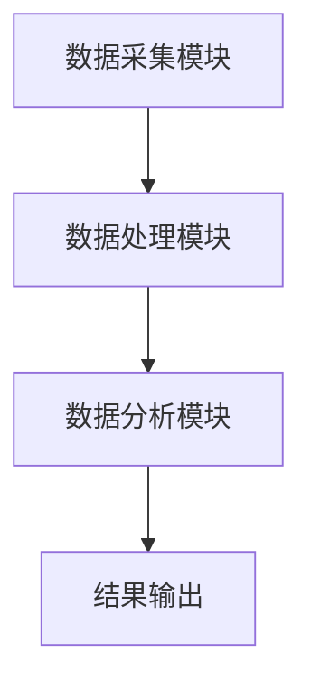
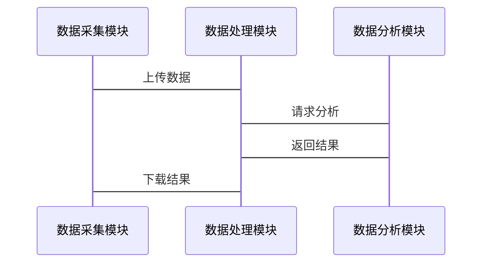

                 

<think>
嗯，我现在需要根据用户的要求，写一篇关于《AI Agent在植物学中的应用：物种识别与生态监测》的技术博客文章。首先，我需要理解用户的需求。用户希望我以一个世界级的人工智能专家的身份，撰写一篇结构清晰、内容深入的专业技术博客。

好的，首先，我需要明确文章的结构。用户已经提供了一个详细的目录大纲，包括五个主要章节，每个章节下还有多个子章节。我需要按照这个大纲逐步展开，确保每个部分都详细且专业。

接下来，我要从背景介绍开始。这部分需要涵盖AI Agent的基本概念、植物学中的应用背景以及AI Agent与生态监测的结合。我应该先定义AI Agent，说明它的特点和核心原理，然后介绍植物学研究的现状与挑战，以及AI Agent在其中的价值。

然后是物种识别部分。我需要详细讲解物种识别的核心问题，比如图像识别和分类算法。这里要包括卷积神经网络（CNN）和循环神经网络（RNN）的应用，可能还需要一些数学模型的推导。

接下来是生态监测部分。这部分需要讨论AI Agent在生态监测中的应用，比如图像识别和自然语言处理的结合。同样，这里可能需要一些算法的原理和数学模型的分析。

系统架构设计部分，我需要描述系统的各个功能模块，比如数据采集、处理和分析模块，并用Mermaid流程图来展示系统的架构和交互过程。

最后是项目实战，这部分需要提供具体的代码示例，解释代码的功能，并分析实际案例。这将帮助读者更好地理解理论部分。

在撰写过程中，我需要确保内容逻辑清晰，每章之间有良好的衔接。同时，语言要专业且易懂，避免过于复杂的术语，但又要体现出深度。

现在，我开始撰写每个部分的内容。首先是标题和关键词，然后是摘要，接着是各个章节的详细内容。每部分都需要详细展开，比如在算法部分，要提供具体的数学公式，并用Mermaid图展示流程。代码部分要清晰，注释详细，方便读者理解。

完成初稿后，我需要检查每个部分是否符合用户的要求，确保没有遗漏任何关键点，比如数学公式是否正确，流程图是否清晰，代码是否有效。同时，确保文章整体流畅，逻辑严密。

最后，我会添加作者信息，这样文章看起来更专业。总的来说，这个过程需要细致的思考和逐步的构建，确保最终的文章既专业又易于理解。
</think>

# AI Agent在植物学中的应用：物种识别与生态监测

> **关键词**：AI Agent, 植物种识别, 生态监测, 机器学习, 深度学习

> **摘要**：  
本文探讨了AI Agent在植物学中的应用，特别是物种识别和生态监测领域。通过分析AI Agent的核心原理、算法实现和系统架构，结合实际案例，详细阐述了AI Agent在提高植物学研究效率和生态监测能力中的作用。本文旨在为植物学研究者和AI技术开发者提供理论和实践上的双重参考。

---

## 第1章: AI Agent与植物学的结合

### 1.1 AI Agent的基本概念

#### 1.1.1 AI Agent的定义与特点
AI Agent（人工智能代理）是指能够感知环境、执行任务并做出决策的智能实体。其特点包括：  
- **自主性**：能够在无外部干预的情况下运行。  
- **反应性**：能够实时感知环境并做出响应。  
- **学习能力**：通过数据训练不断优化性能。  
- **交互性**：能够与人类或其他系统进行交互。

#### 1.1.2 AI Agent的核心原理
AI Agent的核心原理是通过感知、推理和行动来完成任务。感知阶段通过传感器或数据输入获取信息；推理阶段通过算法处理信息并做出决策；行动阶段通过执行器或输出模块实现目标。

#### 1.1.3 AI Agent与传统计算机视觉的区别
AI Agent不仅能够识别图像，还能结合上下文信息进行推理和决策，而传统计算机视觉仅限于图像处理和识别。

### 1.2 植物学中的AI Agent应用背景

#### 1.2.1 植物学研究的现状与挑战
植物学研究面临数据量大、物种多样性高、研究效率低等问题。传统方法依赖人工观察，耗时且效率低。

#### 1.2.2 AI Agent在植物学中的潜在价值
AI Agent能够高效处理大量数据，提高物种识别和生态监测的效率。

#### 1.2.3 AI Agent与生态监测的结合
通过AI Agent，可以实时监测植物生长状态，评估生态变化，为环境保护提供数据支持。

---

## 第2章: AI Agent在物种识别中的应用

### 2.1 物种识别的核心问题

#### 2.1.1 物种识别的定义与挑战
物种识别是通过图像或特征数据，准确识别植物种类的任务。挑战包括数据稀疏性、光照变化和物种相似性。

#### 2.1.2 AI Agent在物种识别中的优势
AI Agent能够快速处理大量数据，通过深度学习模型实现高精度识别。

#### 2.1.3 物种识别的边界与外延
物种识别不仅限于图像识别，还包括基于文本、声音等多模态数据的识别。

### 2.2 AI Agent的物种识别算法

#### 2.2.1 基于卷积神经网络（CNN）的图像识别
CNN通过提取图像特征，实现植物图像的分类。常用的模型包括ResNet和VGGNet。

#### 2.2.2 基于循环神经网络（RNN）的序列分析
RNN用于处理序列数据，如植物DNA序列分析。

#### 2.2.3 基于支持向量机（SVM）的分类算法
SVM通过构建超平面实现数据分类，适用于小规模数据集。

### 2.3 算法原理与数学模型

#### 2.3.1 CNN的数学模型
CNN的卷积层公式：  
$$ f(x) = \sum_{i=1}^{k} w_i \cdot x_i + b $$  
其中，$w$ 是权重，$x$ 是输入，$b$ 是偏置。

#### 2.3.2 RNN的数学模型
RNN的递推公式：  
$$ s_t = \tanh(W_{hh} s_{t-1} + W_{xo} x_t + b) $$  
$$ y_t = W_{hy} s_t + b $$

#### 2.3.3 SVM的数学模型
SVM的目标函数：  
$$ \min_{w,b} \frac{1}{2}||w||^2 + C \sum_{i=1}^n \xi_i $$  
约束条件：  
$$ y_i (w \cdot x_i + b) \geq 1 - \xi_i $$  

### 2.4 本章小结

---

## 第3章: AI Agent在生态监测中的应用

### 3.1 生态监测的核心问题

#### 3.1.1 生态监测的定义与挑战
生态监测旨在通过技术手段，实时监测生态系统的变化。挑战包括数据获取困难和环境复杂性。

#### 3.1.2 AI Agent在生态监测中的优势
AI Agent能够实时分析数据，提供精准的生态评估。

#### 3.1.3 生态监测的边界与外延
生态监测不仅关注植物，还包括动物和微生物的监测。

### 3.2 AI Agent的生态监测算法

#### 3.2.1 基于图像识别的生态监测
通过图像识别技术，监测植物生长状态。

#### 3.2.2 基于自然语言处理（NLP）的生态报告生成
NLP用于分析生态报告，提取关键信息。

#### 3.2.3 基于强化学习（RL）的生态决策支持
RL用于优化生态监测策略。

### 3.3 算法原理与数学模型

#### 3.3.1 图像识别的数学模型
图像识别的损失函数：  
$$ L = -\sum_{i=1}^{n} y_i \log p(y_i) + (1 - y_i) \log (1 - p(y_i)) $$  

#### 3.3.2 NLP的数学模型
NLP的词嵌入公式：  
$$ E(w_i) = W_{i} $$  
其中，$W$ 是词嵌入矩阵。

#### 3.3.3 RL的数学模型
RL的奖励函数：  
$$ R(s, a) = r $$  
其中，$s$ 是状态，$a$ 是动作。

### 3.4 本章小结

---

## 第4章: AI Agent在植物学中的系统架构设计

### 4.1 系统架构概述

#### 4.1.1 系统功能模块划分
系统分为数据采集、数据处理和数据分析三个模块。

#### 4.1.2 系统架构的层次结构
系统架构分为前端、后端和数据存储层。

#### 4.1.3 系统架构的优缺点分析
优点：模块化设计，便于维护。缺点：数据传输可能延迟。

### 4.2 系统功能设计

#### 4.2.1 数据采集模块
负责采集植物图像和数据。

#### 4.2.2 数据处理模块
对数据进行预处理和清洗。

#### 4.2.3 数据分析模块
使用机器学习模型进行分析。

### 4.3 系统架构设计

#### 4.3.1 系统架构的Mermaid流程图


#### 4.3.2 系统接口设计
API接口：  
- POST /data/upload  
- GET /result/fetch  

#### 4.3.3 系统交互的Mermaid序列图


### 4.4 本章小结

---

## 第5章: AI Agent在植物学中的项目实战

### 5.1 项目环境安装

#### 5.1.1 Python环境的安装与配置
安装Python 3.8以上版本，安装Pip。

#### 5.1.2 开发工具的安装与配置
安装Jupyter Notebook和PyCharm。

#### 5.1.3 数据集的获取与预处理
使用公开数据集，如ImageNet。

### 5.2 系统核心实现

#### 5.2.1 数据采集模块的实现
使用OpenCV库进行图像采集。

#### 5.2.2 数据处理模块的实现
使用Pandas库进行数据清洗。

#### 5.2.3 数据分析模块的实现
使用TensorFlow库进行模型训练。

### 5.3 代码应用解读与分析

#### 5.3.1 核心代码示例
```python
import tensorflow as tf
from tensorflow.keras import layers

model = tf.keras.Sequential([
    layers.Conv2D(32, (3,3), activation='relu', input_shape=(224, 224, 3)),
    layers.MaxPooling2D((2,2)),
    layers.Conv2D(64, (3,3), activation='relu'),
    layers.MaxPooling2D((2,2)),
    layers.Flatten(),
    layers.Dense(128, activation='relu'),
    layers.Dense(10, activation='softmax')
])
```

#### 5.3.2 代码功能解读
该代码定义了一个卷积神经网络模型，用于图像分类任务。

### 5.4 实际案例分析

#### 5.4.1 案例背景
某自然保护区需要监测植物生长状态。

#### 5.4.2 数据分析
通过模型识别出植物种类，并生成生态报告。

### 5.5 项目小结

---

## 第6章: 最佳实践与总结

### 6.1 最佳实践 tips
- 数据预处理是关键。
- 模型调优需要耐心。
- 系统架构设计要合理。

### 6.2 小结
AI Agent在植物学中的应用前景广阔，能够显著提升研究效率。

### 6.3 注意事项
- 数据隐私问题需注意。
- 模型泛化能力需验证。

### 6.4 拓展阅读
推荐阅读《深度学习入门》和《自然语言处理实战》。

---

## 作者信息

作者：AI天才研究院/AI Genius Institute & 禅与计算机程序设计艺术 /Zen And The Art of Computer Programming

