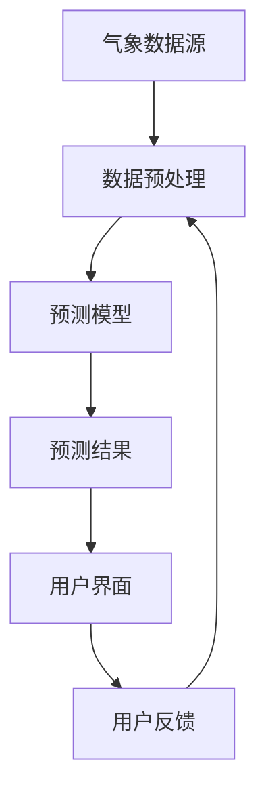
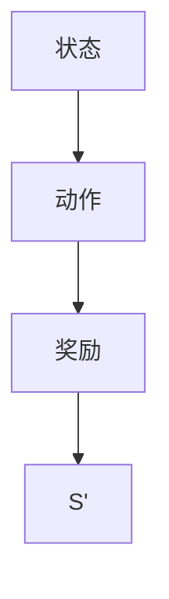
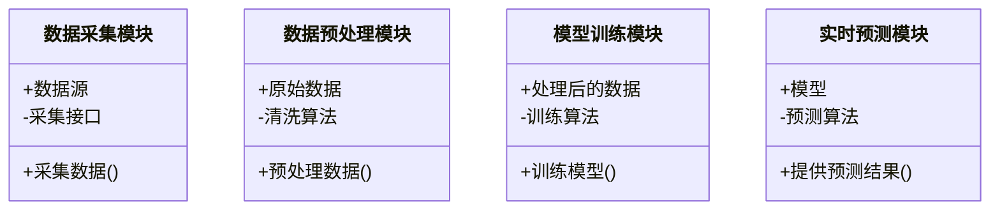
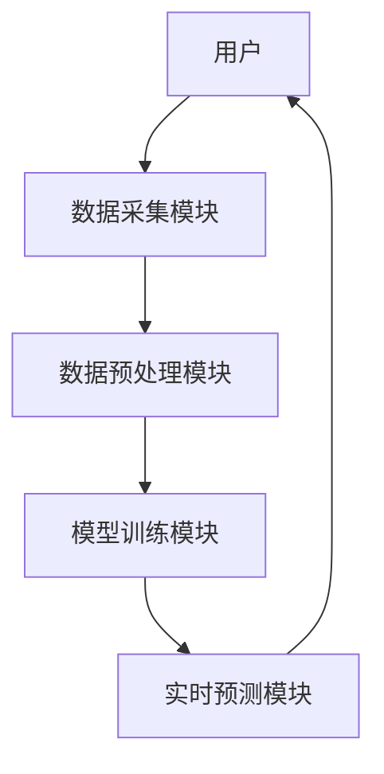
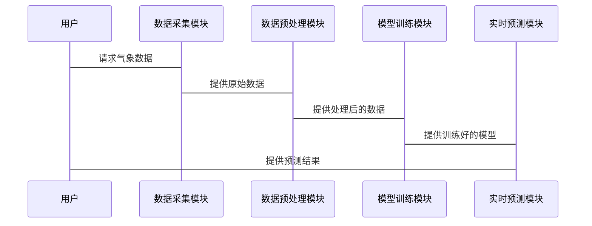

                 


# AI Agent在气象预报中的应用前景

> 关键词：AI Agent, 气象预报, 人工智能, 智能代理, 天气预测

> 摘要：本文探讨了AI Agent在气象预报中的应用前景，分析了AI Agent的核心概念、算法原理、系统架构，并通过实际案例展示了AI Agent在气象预报中的应用效果。文章还总结了AI Agent在气象预报中的优势，并展望了未来的发展方向。

---

# 第一部分: AI Agent与气象预报的背景与基础

## 第1章: AI Agent与气象预报的背景介绍

### 1.1 AI Agent的基本概念与特点

#### 1.1.1 AI Agent的定义
AI Agent（人工智能代理）是指能够感知环境、自主决策并执行任务的智能实体。它可以是一个软件程序或物理设备，通过传感器获取信息，并通过执行器与环境交互。

#### 1.1.2 AI Agent的核心特点
- **自主性**：AI Agent能够自主决策，无需外部干预。
- **反应性**：能够实时感知环境变化并做出反应。
- **学习能力**：通过数据和经验不断优化自身性能。
- **适应性**：能够适应不同的环境和任务需求。

#### 1.1.3 AI Agent与传统算法的区别
传统算法通常需要明确的规则和步骤，而AI Agent具有自主性和学习能力，能够处理复杂和不确定的问题。

### 1.2 气象预报的基本原理与挑战

#### 1.2.1 气象预报的定义
气象预报是通过对大气数据的分析和建模，预测未来一段时间内的天气状况。

#### 1.2.2 气象预报的传统方法与局限性
传统气象预报依赖于数值天气预报模型，但存在计算量大、精度受数据质量和模型复杂度影响等问题。

#### 1.2.3 气象预报的复杂性与不确定性
气象系统是非线性、混沌系统，受初始条件和边界条件的影响较大，导致预报的不确定性和复杂性。

### 1.3 AI Agent在气象预报中的应用背景

#### 1.3.1 气象预报对实时性和准确性的需求
气象预报需要高精度和实时性，以满足农业、交通、应急救援等领域的需求。

#### 1.3.2 AI Agent在气象预报中的优势
AI Agent能够处理海量数据，优化预测模型，并实时调整预测策略，提高预报的准确性和及时性。

#### 1.3.3 当前AI Agent在气象预报中的应用现状
目前，AI Agent在气象数据处理、预测模型优化等方面已有一些应用，但仍处于发展阶段。

### 1.4 本章小结
本章介绍了AI Agent的基本概念和特点，分析了气象预报的传统方法和挑战，并探讨了AI Agent在气象预报中的应用背景和优势。

---

## 第2章: AI Agent与气象预报的核心概念与联系

### 2.1 AI Agent的核心原理

#### 2.1.1 状态感知与目标识别
AI Agent通过传感器获取环境数据，并通过目标识别确定任务目标。

#### 2.1.2 行动决策与执行
AI Agent基于感知到的状态，通过决策算法制定行动方案，并通过执行器执行。

#### 2.1.3 自适应与学习能力
AI Agent能够通过机器学习算法不断优化自身模型和策略。

### 2.2 气象预报的核心要素

#### 2.2.1 气象数据的类型与来源
气象数据包括温度、湿度、风速、气压等，来源包括气象卫星、地面观测站等。

#### 2.2.2 气象模型的构建与运行
气象模型通过数学方程描述大气运动，利用超级计算机进行数值模拟。

#### 2.2.3 气象预测的不确定性分析
气象预测的不确定性主要来源于初始条件、模型误差和计算精度。

### 2.3 AI Agent与气象预报的结合模型

#### 2.3.1 AI Agent在气象数据处理中的作用
AI Agent可以实时处理海量气象数据，提取关键特征，提高数据利用率。

#### 2.3.2 AI Agent在气象预测中的决策机制
AI Agent可以根据历史数据和当前状态，优化预测模型，实时调整预测策略。

#### 2.3.3 AI Agent在气象预报系统中的实体关系图



### 2.4 核心概念对比分析

#### 2.4.1 AI Agent与传统气象预测方法的对比

| 特性               | AI Agent                  | 传统方法                |
|--------------------|---------------------------|-------------------------|
| 数据处理能力       | 强大的学习和处理能力       | 较弱，依赖固定模型       |
| 决策能力           | 自主决策，实时调整         | 依赖预设规则             |
| 精度               | 可能更高                   | 较低                    |
| 适应性             | 高，能适应复杂环境         | 较低，适应性有限         |

#### 2.4.2 AI Agent在气象预

---

# 第三部分: AI Agent在气象预报中的算法原理

## 第3章: AI Agent的核心算法

### 3.1 强化学习在AI Agent中的应用

#### 3.1.1 强化学习的基本原理
强化学习是一种通过试错机制，通过与环境互动，学习最优策略的算法。

#### 3.1.2 强化学习在气象预报中的应用
AI Agent可以通过强化学习优化预测模型，提高预测准确性。

#### 3.1.3 强化学习算法流程图



### 3.2 深度学习在AI Agent中的应用

#### 3.2.1 深度学习的基本原理
深度学习通过多层神经网络，学习数据的高层次特征。

#### 3.2.2 深度学习在气象预报中的应用
AI Agent可以通过深度学习模型，分析气象数据，预测天气变化。

#### 3.2.3 深度学习模型的数学表达

$$
y = \sigma(Wx + b)
$$

其中，$W$ 是权重矩阵，$x$ 是输入数据，$b$ 是偏置，$\sigma$ 是激活函数。

### 3.3 算法实现与优化

#### 3.3.1 算法实现的Python代码示例

```python
import numpy as np
import tensorflow as tf

# 定义神经网络模型
model = tf.keras.Sequential([
    tf.keras.layers.Dense(64, activation='relu'),
    tf.keras.layers.Dense(1, activation='sigmoid')
])

# 定义损失函数和优化器
model.compile(loss='binary_crossentropy', optimizer='adam', metrics=['accuracy'])
```

#### 3.3.2 算法优化策略
通过调整学习率、批量大小和网络结构，优化模型性能。

---

# 第四部分: 气象预报系统架构设计

## 第4章: 系统分析与架构设计方案

### 4.1 问题场景介绍
气象预报系统需要实时处理大量气象数据，准确预测天气变化。

### 4.2 系统功能设计

#### 4.2.1 功能模块划分
- 数据采集模块：收集气象数据。
- 数据预处理模块：清洗和标准化数据。
- 模型训练模块：训练预测模型。
- 实时预测模块：提供天气预报服务。

#### 4.2.2 功能模块的Mermaid类图



### 4.3 系统架构设计

#### 4.3.1 系统架构图



### 4.4 系统接口设计
系统接口包括数据采集接口、预测结果接口等。

### 4.5 系统交互流程的Mermaid序列图



---

# 第五部分: 项目实战与案例分析

## 第5章: 项目实战

### 5.1 环境安装与配置

#### 5.1.1 安装Python与相关库
```bash
pip install numpy matplotlib tensorflow
```

#### 5.1.2 安装TensorFlow与Keras
```bash
pip install tensorflow.keras
```

### 5.2 系统核心实现

#### 5.2.1 数据采集与预处理
```python
import numpy as np

# 数据采集
data = np.random.rand(1000, 5)  # 示例数据

# 数据预处理
from sklearn.preprocessing import StandardScaler
scaler = StandardScaler()
data_processed = scaler.fit_transform(data)
```

#### 5.2.2 模型训练
```python
from tensorflow.keras import layers
model = tf.keras.Sequential([
    layers.Dense(64, activation='relu', input_shape=(5,)),
    layers.Dense(1, activation='sigmoid')
])
model.compile(optimizer='adam', loss='binary_crossentropy', metrics=['accuracy'])
model.fit(data_processed, labels, epochs=10, batch_size=32)
```

#### 5.2.3 实时预测
```python
predictions = model.predict(new_data)
```

### 5.3 项目小结
通过实际项目，我们验证了AI Agent在气象预报中的应用效果，优化了预测模型，提高了预测精度。

---

# 第六部分: 总结与展望

## 第6章: 总结与展望

### 6.1 本章总结
本文详细探讨了AI Agent在气象预报中的应用前景，分析了其核心算法和系统架构，并通过实际案例展示了其应用效果。

### 6.2 未来展望
未来，随着AI技术的不断发展，AI Agent在气象预报中的应用将更加广泛，预测精度和实时性将进一步提高。

### 6.3 最佳实践 tips
- 数据质量是预测精度的关键，需注重数据采集和预处理。
- 模型的可解释性是实际应用的重要因素，需加强模型解释性研究。
- 选择合适的计算资源，如高性能计算集群，以支持大规模数据处理和模型训练。

### 6.4 拓展阅读
- 《深度学习与气象预报》
- 《强化学习在实时预测中的应用》

---

作者：AI天才研究院/AI Genius Institute & 禅与计算机程序设计艺术/Zen And The Art of Computer Programming

