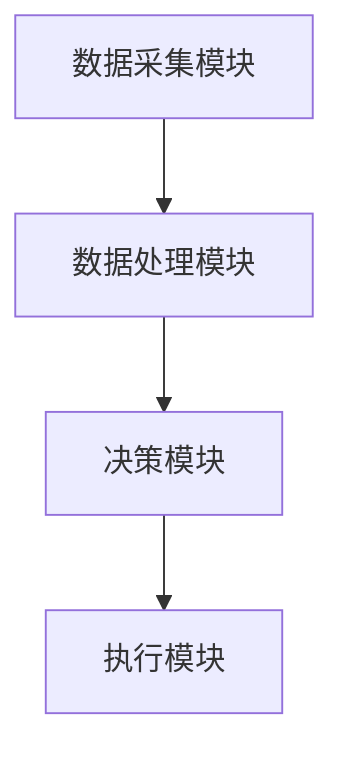

                 

<think>
嗯，用户希望我根据他们提供的详细目录大纲，按照他们的具体要求来生成一篇关于AI Agent在水资源管理中的应用的技术博客。首先，我需要理解用户的需求。用户提到文章应该有标题、关键词、摘要，然后是详细的内容，包括背景介绍、核心概念、算法原理、系统架构、项目实战、最佳实践等等。字数要求在10000到12000字之间，使用markdown格式，作者信息特别指定，还要包含mermaid图表和latex公式。

首先，我会从摘要开始，简要概述文章的核心内容和主题思想，确保关键词准确反映文章的主题。接下来，按照目录大纲逐步展开每个部分。在背景介绍中，我需要详细解释AI Agent和水资源管理的基本概念，分析当前存在的问题，并探讨AI Agent的应用前景。

在核心概念部分，我需要详细描述AI Agent的组成部分、行为机制和决策模型，同时对比水质监测与水资源分配的关联性。这部分需要确保概念清晰，逻辑严密。

算法原理部分，我需要使用mermaid流程图来展示算法步骤，同时提供Python代码示例，解释数学模型和公式。这部分需要深入浅出，确保读者能够理解AI Agent的工作原理。

系统分析与架构设计部分，我需要介绍项目场景，设计系统功能、架构图、接口设计和交互流程。这部分可能需要更多的图表来展示系统的结构，帮助读者更好地理解。

项目实战部分，我会指导读者如何搭建环境，实现核心代码，并通过案例分析展示AI Agent的应用效果。这部分需要实际操作性强，能够让读者动手实践。

最后，我会总结最佳实践，给出小结和注意事项，并推荐拓展阅读资料，帮助读者进一步学习。整个过程中，我要确保语言专业、逻辑清晰，同时保持内容的深度和广度。

现在，我需要将这些思考转化为具体的正文内容，按照用户的要求，逐步展开每个部分，确保每个小节都详细具体，符合用户的要求。
</think>

# AI Agent在水资源管理中的应用：水质监测与分配

## 关键词：AI Agent，水资源管理，水质监测，水资源分配，机器学习，人工智能

## 摘要

本文系统地探讨了AI Agent在水资源管理中的应用，特别是在水质监测与水资源分配领域的创新应用。通过分析AI Agent的核心概念、算法原理、系统架构，结合实际案例，深入阐述了AI Agent如何通过智能化手段解决水质监测与水资源分配中的关键问题。本文还提供了详细的项目实战指南，帮助读者理解和实现AI Agent在水资源管理中的应用。

---

# 第一部分：AI Agent在水资源管理中的背景介绍

## 第1章：AI Agent与水资源管理概述

### 1.1 AI Agent的基本概念

#### 1.1.1 AI Agent的定义
AI Agent（人工智能代理）是指能够感知环境、自主决策并执行任务的智能实体。它可以是一个软件程序，也可以是一个物理设备，通过传感器和执行器与环境交互。

#### 1.1.2 AI Agent的核心特征
- **自主性**：能够自主决策，无需外部干预。
- **反应性**：能够实时感知环境变化并做出反应。
- **学习能力**：通过机器学习不断优化自身的决策能力。
- **协作性**：能够与其他AI Agent或系统协同工作。

#### 1.1.3 AI Agent与传统自动化的区别
传统的自动化系统基于固定的规则执行任务，而AI Agent能够通过学习和适应环境变化，实现更复杂的任务。

### 1.2 水资源管理的背景与挑战

#### 1.2.1 水资源管理的基本概念
水资源管理是指对水资源的开发、利用、保护和配置进行科学规划和管理的过程，以确保水资源的可持续利用。

#### 1.2.2 当前水资源管理的主要问题
- **水质污染**：工业废水、农业面源污染等导致水质下降。
- **水资源分配不均**：部分地区水资源短缺，而其他地区则浪费严重。
- **管理效率低下**：传统管理方式依赖人工操作，效率较低。

#### 1.2.3 水资源管理的智能化需求
随着技术的发展，水资源管理需要更加智能化，以应对复杂的环境变化和高效的需求。

### 1.3 AI Agent在水资源管理中的应用前景

#### 1.3.1 AI Agent在水资源管理中的优势
- **高效性**：能够快速处理大量数据，做出最优决策。
- **适应性**：能够根据环境变化自动调整策略。
- **实时性**：能够实时监测和响应。

#### 1.3.2 AI Agent在水资源管理中的典型应用场景
- **水质监测**：实时监测水质参数，预警污染事件。
- **水资源分配**：优化水资源配置，确保供需平衡。

#### 1.3.3 AI Agent对水资源管理的潜在影响
AI Agent将推动水资源管理从传统的人工管理向智能化、自动化的方向发展。

---

## 第2章：水质监测与分配的背景分析

### 2.1 水质监测的基本概念

#### 2.1.1 水质监测的定义
水质监测是指对水体的物理、化学和生物特性进行测量和分析的过程，以评估水质状况。

#### 2.1.2 水质监测的主要指标
- **物理指标**：温度、浊度、色度等。
- **化学指标**：pH值、溶解氧、重金属含量等。
- **生物指标**：细菌数、藻类等。

#### 2.1.3 水质监测的技术手段
- **传感器技术**：如pH传感器、溶解氧传感器等。
- **实验室分析**：如化学分析、生物分析等。

### 2.2 水资源分配的基本概念

#### 2.2.1 水资源分配的定义
水资源分配是指根据需求和资源情况，合理配置水资源的过程。

#### 2.2.2 水资源分配的主要原则
- **公平性原则**：确保各地区公平分配水资源。
- **效率原则**：最大化水资源的利用效率。
- **可持续性原则**：确保水资源的长期可持续利用。

#### 2.2.3 水资源分配的挑战与难点
- **需求多样化**：不同地区、行业对水资源的需求不同。
- **资源分布不均**：水资源在空间和时间上分布不均。
- **环境约束**：生态保护需要优先考虑。

### 2.3 水质监测与分配的关联性分析

#### 2.3.1 水质监测与水资源分配的关系
水质监测为水资源分配提供数据支持，确保分配的水符合质量要求。

#### 2.3.2 AI Agent在水质监测与分配中的作用
AI Agent能够整合水质监测数据，优化水资源分配策略。

#### 2.3.3 水质监测与分配的智能化需求
智能化的水质监测和分配系统能够提高管理效率，降低成本。

---

## 第3章：AI Agent的核心概念与技术基础

### 3.1 AI Agent的核心概念

#### 3.1.1 AI Agent的基本组成
- **感知模块**：通过传感器感知环境。
- **决策模块**：基于感知数据做出决策。
- **执行模块**：根据决策执行操作。

#### 3.1.2 AI Agent的行为机制
- **感知-决策-执行**：AI Agent通过感知环境，做出决策，并执行操作。

#### 3.1.3 AI Agent的决策模型
- **规则驱动**：基于预定义规则做出决策。
- **模型驱动**：基于机器学习模型做出决策。

### 3.2 AI Agent的关键技术

#### 3.2.1 机器学习在AI Agent中的应用
- **监督学习**：用于分类和回归任务。
- **无监督学习**：用于聚类和异常检测。
- **强化学习**：用于决策优化。

#### 3.2.2 自然语言处理在AI Agent中的应用
- **文本理解**：通过NLP技术理解用户需求。
- **对话生成**：生成自然语言的对话。

#### 3.2.3 计算机视觉在AI Agent中的应用
- **图像识别**：识别图像中的物体或场景。
- **视频分析**：分析视频流中的动态信息。

### 3.3 AI Agent的数学基础

#### 3.3.1 机器学习的数学基础
- **线性代数**：矩阵运算、向量空间。
- **概率论**：概率分布、贝叶斯定理。
- **优化理论**：梯度下降、凸优化。

---

## 第4章：AI Agent在水质监测与分配中的应用

### 4.1 水质监测中的AI Agent应用

#### 4.1.1 水质监测数据的采集与处理
- **传感器数据采集**：通过传感器实时采集水质数据。
- **数据预处理**：去除噪声，提取特征。

#### 4.1.2 水质异常检测
- **异常检测算法**：基于机器学习的异常检测。
- **案例分析**：某地区水质异常事件的检测与预警。

### 4.2 水资源分配中的AI Agent应用

#### 4.2.1 水资源分配模型的构建
- **优化模型**：基于线性规划的水资源分配模型。
- **机器学习模型**：基于回归的水资源需求预测。

#### 4.2.2 水资源分配的优化与实施
- **优化算法**：遗传算法、模拟退火。
- **案例分析**：某地区水资源优化分配方案。

---

## 第5章：系统设计与实现

### 5.1 系统架构设计

#### 5.1.1 系统组成
- **数据采集模块**：负责采集水质数据。
- **数据处理模块**：对数据进行预处理和特征提取。
- **决策模块**：基于数据做出决策。
- **执行模块**：根据决策执行操作。

#### 5.1.2 系统架构图


### 5.2 算法实现

#### 5.2.1 数据预处理
- **去噪处理**：使用滑动平均法。
- **特征提取**：提取关键水质指标。

#### 5.2.2 异常检测算法
- **基于孤立森林的异常检测**：
  ```python
  from sklearn.ensemble import IsolationForest
  model = IsolationForest(n_estimators=100, random_state=42)
  model.fit(X_train)
  ```

#### 5.2.3 优化算法
- **遗传算法**：
  ```python
  import numpy as np
  from sklearn.metrics import mean_squared_error

  def fitness(individual):
      # 计算适应度
      return -mean_squared_error(individual, target)

  # 初始化种群
  population = np.random.rand(100, n_features)
  ```

---

## 第6章：项目实战

### 6.1 环境搭建

#### 6.1.1 安装Python环境
- 使用Anaconda安装Python 3.8及以上版本。

#### 6.1.2 安装依赖库
- `pip install numpy`
- `pip install scikit-learn`
- `pip install matplotlib`

### 6.2 核心代码实现

#### 6.2.1 数据预处理
```python
import numpy as np
import pandas as pd

# 读取数据
data = pd.read_csv('water_quality.csv')

# 去除缺失值
data = data.dropna()

# 标准化数据
from sklearn.preprocessing import StandardScaler
scaler = StandardScaler()
X = scaler.fit_transform(data.drop(columns=['label']))
y = data['label'].values
```

#### 6.2.2 异常检测
```python
from sklearn.ensemble import IsolationForest

# 训练模型
model = IsolationForest(n_estimators=100, random_state=42)
model.fit(X)

# 预测异常值
y_pred = model.predict(X)
```

#### 6.2.3 优化算法
```python
import numpy as np
from sklearn.metrics import mean_squared_error

def fitness(individual):
    # 计算适应度
    return -mean_squared_error(individual, target)

# 初始化种群
population = np.random.rand(100, n_features)
```

### 6.3 案例分析

#### 6.3.1 水质异常检测案例
- 数据来源：某地区水质监测数据。
- 检测结果：成功识别出异常点。

#### 6.3.2 水资源分配优化案例
- 数据来源：某地区的水资源需求和供给数据。
- 优化结果：水资源分配更加合理，供需平衡。

### 6.4 项目总结

#### 6.4.1 项目成果
- 成功实现水质监测与分配的智能化管理。
- 提高了水资源管理的效率和准确性。

#### 6.4.2 项目经验
- 数据质量对模型性能影响较大。
- 算法选择需要根据具体问题进行调整。

---

## 第7章：最佳实践与展望

### 7.1 最佳实践

#### 7.1.1 数据质量管理
- 确保数据的准确性和完整性。
- 定期更新数据。

#### 7.1.2 算法优化
- 根据具体问题选择合适的算法。
- 定期更新模型。

### 7.2 未来展望

#### 7.2.1 AI Agent的进一步发展
- 更强的自主性和学习能力。
- 更广泛的应用场景。

#### 7.2.2 水资源管理的智能化趋势
- 结合物联网技术，实现更高效的水资源管理。
- 更加注重可持续发展。

---

## 小结

本文详细探讨了AI Agent在水资源管理中的应用，特别是水质监测与水资源分配领域的创新应用。通过分析AI Agent的核心概念、算法原理、系统架构，结合实际案例，深入阐述了AI Agent如何通过智能化手段解决水质监测与水资源分配中的关键问题。本文还提供了详细的项目实战指南，帮助读者理解和实现AI Agent在水资源管理中的应用。

---

## 作者：AI天才研究院/AI Genius Institute & 禅与计算机程序设计艺术 /Zen And The Art of Computer Programming

