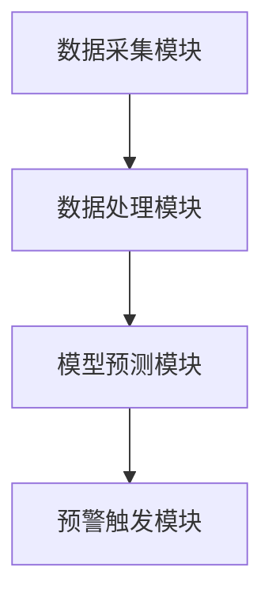

                 


# AI Agent在海啸预警中的数据处理

> 关键词：AI Agent, 海啸预警, 数据处理, 时间序列分析, 机器学习, 深度学习, 系统架构设计

> 摘要：  
本文深入探讨了AI Agent在海啸预警中的数据处理应用。通过分析海啸预警的背景与挑战，结合AI Agent的核心原理，详细阐述了数据采集、预处理、融合、建模与预测的全过程。文章还介绍了系统的架构设计、接口设计和交互流程，并通过一个完整的项目案例展示了AI Agent在实际应用中的实现。最后，总结了AI Agent在海啸预警中的优势与未来发展方向。

---

## 第1章: 海啸预警与AI Agent概述

### 1.1 海啸预警的重要性

#### 1.1.1 海啸的基本概念
海啸是一种由海底地震、火山爆发或海底滑坡引起的巨大海洋波浪。海啸的发生往往具有突发性和破坏性，对沿海地区的人类生命和财产安全构成严重威胁。

#### 1.1.2 海啸预警的必要性
海啸预警系统能够通过监测海洋环境数据（如水位变化、地震活动等）预测海啸的发生，从而为沿海居民争取宝贵的逃生时间。高效的海啸预警系统可以显著降低海啸带来的损失。

#### 1.1.3 海啸预警系统的现状
目前，海啸预警系统主要依赖传统的地震监测和水位监测技术。然而，这些方法在数据处理能力、预测精度和实时性方面存在一定的局限性。

### 1.2 AI Agent的基本概念

#### 1.2.1 什么是AI Agent
AI Agent（人工智能代理）是一种能够感知环境、自主决策并执行任务的智能实体。它能够通过传感器获取信息，利用算法进行分析和推理，并根据结果采取行动。

#### 1.2.2 AI Agent的核心特征
- **自主性**：AI Agent能够自主决策和行动，无需人工干预。
- **反应性**：能够实时感知环境变化并做出响应。
- **学习能力**：通过数据和经验不断优化自身的算法和模型。

#### 1.2.3 AI Agent与传统算法的区别
AI Agent不仅是一个算法，更是一个能够与环境交互的智能系统。它能够根据实时数据动态调整行为，而传统算法通常是在静态数据集上进行处理。

### 1.3 AI Agent在海啸预警中的应用前景

#### 1.3.1 海啸预警中的数据处理挑战
海啸预警涉及多源异构数据（如地震数据、水位数据、气象数据等），数据量大、类型多样，且对实时性要求高。

#### 1.3.2 AI Agent在海啸预警中的优势
AI Agent能够实时处理多源数据，快速识别潜在风险，并自主触发预警机制。此外，AI Agent可以通过学习不断优化预测模型，提高预警的准确性。

#### 1.3.3 未来发展趋势
随着人工智能技术的不断发展，AI Agent在海啸预警中的应用将更加广泛。未来的海啸预警系统可能会集成更多的传感器数据，采用更复杂的算法模型，并实现更高效的实时处理能力。

---

## 第2章: AI Agent的核心原理与数据处理流程

### 2.1 AI Agent的核心原理

#### 2.1.1 AI Agent的感知机制
AI Agent通过多种传感器（如地震仪、水位计、气象站等）获取环境数据。感知机制负责将这些数据转化为可处理的信息。

#### 2.1.2 AI Agent的决策机制
基于感知到的数据，AI Agent利用机器学习模型（如时间序列分析、深度学习等）进行风险评估和预测，生成预警信号。

#### 2.1.3 AI Agent的执行机制
AI Agent根据决策结果触发预警机制（如发送警报信息、启动应急措施等）。

### 2.2 数据处理流程

#### 2.2.1 数据采集与预处理
数据采集包括从多种传感器获取原始数据；数据预处理包括数据清洗、标准化和增强。

#### 2.2.2 数据融合与特征提取
通过多种数据融合方法（如加权平均、投票法等）提取有用的特征，为后续的建模与预测提供高质量的数据。

#### 2.2.3 数据建模与预测
利用机器学习和深度学习模型对数据进行建模和预测，生成风险评估结果。

---

## 第3章: 海啸预警中的数据采集与预处理

### 3.1 数据采集

#### 3.1.1 海啸预警数据的来源
- **地震数据**：通过地震仪监测地震活动。
- **水位数据**：通过潮汐监测站测量水位变化。
- **气象数据**：通过气象卫星和气象站获取气象信息。

#### 3.1.2 数据采集的挑战
- 数据异构性：不同传感器的数据格式和单位可能不同。
- 数据质量：传感器可能出现噪声或故障，影响数据准确性。

#### 3.1.3 数据采集的解决方案
- 使用统一的数据接口标准。
- 建立数据清洗和校准机制。

### 3.2 数据预处理

#### 3.2.1 数据清洗
- 去除噪声数据。
- 处理缺失值。

#### 3.2.2 数据标准化
- 将不同传感器的数据标准化到统一的量纲。

#### 3.2.3 数据增强
- 对数据进行平滑处理，减少噪声影响。

---

## 第4章: 数据融合与特征提取

### 4.1 数据融合方法

#### 4.1.1 基于规则的融合方法
- 根据预设的规则对多源数据进行融合。

#### 4.1.2 基于统计的融合方法
- 使用统计方法（如加权平均、投票法）对数据进行融合。

#### 4.1.3 基于机器学习的融合方法
- 使用集成学习算法对多源数据进行融合。

### 4.2 特征提取技术

#### 4.2.1 基于时间序列的特征提取
- 提取时间序列的周期性、趋势性等特征。

#### 4.2.2 基于空间数据的特征提取
- 提取空间分布特征，如波浪传播方向、速度等。

#### 4.2.3 基于物理模型的特征提取
- 结合物理模型（如波传播模型）提取特征。

---

## 第5章: 数据建模与预测

### 5.1 数据建模方法

#### 5.1.1 时间序列模型
- **ARIMA模型**：自回归积分滑动平均模型。
- **LSTM模型**：长短期记忆网络。

#### 5.1.2 空间模型
- **卷积神经网络（CNN）**：用于处理空间数据。

#### 5.1.3 综合模型
- 将时间序列和空间模型结合，提高预测精度。

### 5.2 预测算法实现

#### 5.2.1 基于机器学习的预测算法
- 使用随机森林、支持向量机（SVM）等算法进行预测。

#### 5.2.2 基于深度学习的预测算法
- 使用LSTM、Transformer等模型进行预测。

#### 5.2.3 混合模型的预测算法
- 将机器学习和深度学习模型结合，提高预测精度。

---

## 第6章: 系统架构与接口设计

### 6.1 系统架构设计

#### 6.1.1 系统模块划分
- **数据采集模块**：负责采集多源数据。
- **数据处理模块**：负责数据预处理、融合和特征提取。
- **模型预测模块**：负责构建和训练预测模型。
- **预警触发模块**：根据预测结果触发预警。

#### 6.1.2 系统功能流程
1. 数据采集模块获取多源数据。
2. 数据处理模块对数据进行预处理和融合。
3. 模型预测模块利用融合后的数据进行预测。
4. 预警触发模块根据预测结果发送警报。

#### 6.1.3 系统架构图


### 6.2 系统接口设计

#### 6.2.1 数据接口设计
- 数据接口采用RESTful API，支持JSON格式的数据传输。

#### 6.2.2 用户接口设计
- 提供图形化界面，方便用户查看预警信息和系统状态。

#### 6.2.3 系统交互流程
1. 用户通过图形化界面提交查询请求。
2. 系统接收请求并调用数据采集模块获取数据。
3. 数据处理模块对数据进行处理并返回结果。
4. 模型预测模块根据处理后的数据进行预测并触发预警。
5. 预警信息通过图形化界面反馈给用户。

---

## 第7章: 项目实战

### 7.1 环境配置

#### 7.1.1 安装Python环境
- 使用Anaconda安装Python 3.8及以上版本。

#### 7.1.2 安装依赖库
```bash
pip install numpy pandas scikit-learn tensorflow
```

### 7.2 系统核心实现源代码

#### 7.2.1 数据采集模块
```python
import numpy as np

def collect_data(sensors):
    data = []
    for sensor in sensors:
        data.append(sensor.get_data())
    return data
```

#### 7.2.2 数据预处理模块
```python
def preprocess(data):
    # 删除缺失值
    data = data.dropna()
    # 标准化数据
    from sklearn.preprocessing import StandardScaler
    scaler = StandardScaler()
    data_scaled = scaler.fit_transform(data)
    return data_scaled
```

#### 7.2.3 模型预测模块
```python
from tensorflow.keras.models import Sequential
from tensorflow.keras.layers import LSTM, Dense

def build_model(input_shape):
    model = Sequential()
    model.add(LSTM(64, input_shape=input_shape))
    model.add(Dense(1))
    model.compile(loss='mean_squared_error', optimizer='adam')
    return model
```

#### 7.2.4 预警触发模块
```python
def trigger_alarm(probability):
    if probability > 0.9:
        print("海啸预警！请立即采取应急措施。")
```

### 7.3 代码应用解读与分析

#### 7.3.1 数据采集模块
该模块通过调用不同传感器的API获取数据，并将数据返回给主程序。

#### 7.3.2 数据预处理模块
数据预处理模块对采集到的数据进行清洗和标准化处理，确保数据的质量和一致性。

#### 7.3.3 模型预测模块
模型预测模块利用LSTM网络对预处理后的数据进行建模和预测，生成风险评估结果。

#### 7.3.4 预警触发模块
根据模型预测结果，当预测概率超过阈值时，触发预警机制。

### 7.4 实际案例分析

#### 7.4.1 数据来源
假设我们从地震仪、水位计和气象站获取数据。

#### 7.4.2 数据处理
对数据进行清洗、标准化和特征提取，构建一个完整的数据集。

#### 7.4.3 模型训练
使用LSTM网络对数据进行训练，优化模型参数，提高预测精度。

#### 7.4.4 预警触发
当模型预测海啸发生的概率超过0.9时，触发预警机制。

---

## 第8章: 总结与展望

### 8.1 本章小结
本文详细探讨了AI Agent在海啸预警中的数据处理应用。通过分析海啸预警的背景与挑战，结合AI Agent的核心原理，详细阐述了数据采集、预处理、融合、建模与预测的全过程。

### 8.2 未来展望
随着人工智能技术的不断发展，AI Agent在海啸预警中的应用将更加广泛。未来的海啸预警系统可能会集成更多的传感器数据，采用更复杂的算法模型，并实现更高效的实时处理能力。

---

## 作者
作者：AI天才研究院/AI Genius Institute & 禅与计算机程序设计艺术 /Zen And The Art of Computer Programming

