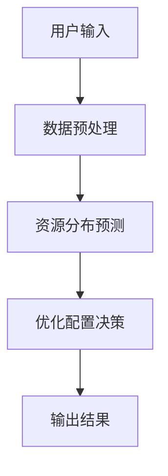

                 

<think>
好的，我将按照您的要求撰写一篇关于《AI Agent在海洋资源勘探中的应用》的技术博客文章。为了让内容更加完善，我会先列出文章的结构，并逐步展开每一部分的内容。

### 文章标题

# AI Agent在海洋资源勘探中的应用

### 关键词

AI Agent, 海洋资源勘探, 强化学习, 深度学习, 海底地形, 矿产资源

### 摘要

随着人工智能技术的快速发展，AI Agent（人工智能代理）在海洋资源勘探中的应用越来越广泛。本文详细介绍了AI Agent的基本概念、海洋资源勘探的核心要素以及AI Agent在其中的具体应用。通过分析强化学习和深度学习等核心算法的原理，结合海洋环境数据的采集与处理，探讨了AI Agent在海洋资源勘探中的系统架构设计和项目实战。本文还总结了AI Agent在海洋资源勘探中的优势与挑战，并展望了未来的发展方向。

---

## 第1章: AI Agent与海洋资源勘探的背景

### 1.1 AI Agent的基本概念

#### 1.1.1 什么是AI Agent

AI Agent（人工智能代理）是一种能够感知环境、做出决策并执行动作的智能体。它能够通过传感器获取环境信息，利用算法进行分析和推理，并根据结果采取相应的行动。AI Agent的核心在于其自主性、反应性和协作性。

#### 1.1.2 AI Agent的核心特点

- **自主性**：AI Agent能够在没有外部干预的情况下自主运行。
- **反应性**：能够实时感知环境变化并做出相应的反应。
- **协作性**：能够与其他智能体或系统进行协作，共同完成任务。

#### 1.1.3 AI Agent与传统自动化的区别

| 特性 | AI Agent | 传统自动化 |
|------|-----------|------------|
| 智能性 | 高 | 低 |
| 自主性 | 高 | 低 |
| 学习能力 | 高 | 无 |

AI Agent不仅能够执行预设的任务，还能够通过学习和适应不断优化自身的行为。

---

### 1.2 海洋资源勘探的基本概念

#### 1.2.1 海洋资源的定义与分类

海洋资源是指海洋中可利用的自然资源，主要包括：

1. **矿产资源**：如海底矿床（金、银、铜、镍等）。
2. **能源资源**：如海底天然气 hydrate 和可燃冰。
3. **生物资源**：如海洋鱼类、海藻等。
4. **空间资源**：如海底电缆铺设、港口建设等。

#### 1.2.2 海洋资源勘探的重要性

海洋资源勘探是人类开发和利用海洋资源的前提。通过勘探，可以发现新的资源储备，为经济发展提供支持。同时，海洋资源的合理利用也有助于保护海洋生态环境。

#### 1.2.3 海洋资源勘探的挑战与难点

- **环境复杂性**：海洋环境复杂，包括高温、高压、强腐蚀等极端条件。
- **数据获取难度**：海底地形和资源分布的数据获取困难，且数据量大。
- **技术要求高**：需要结合多种技术手段，如声呐探测、钻探技术等。

---

### 1.3 AI Agent在海洋资源勘探中的应用背景

#### 1.3.1 海洋资源勘探的传统方法与局限性

传统海洋资源勘探主要依赖人工操作和简单的自动化设备，存在以下问题：

- **效率低下**：人工勘探耗时长，成本高。
- **精度不足**：受人类经验限制，勘探精度有限。
- **危险性高**：深海勘探环境危险，人员操作风险大。

#### 1.3.2 AI Agent在海洋勘探中的优势

AI Agent能够显著提升海洋资源勘探的效率和精度：

- **高效性**：AI Agent可以24小时不间断工作，大幅提高勘探速度。
- **精准性**：通过机器学习算法，AI Agent能够精确识别资源分布特征。
- **安全性**：减少人员在危险环境中的暴露，降低操作风险。

#### 1.3.3 当前AI Agent技术的发展现状

目前，AI Agent技术在海洋资源勘探中的应用还处于起步阶段，但已经取得了一些重要进展。例如，基于强化学习的海底矿产勘探系统已经在一些项目中得到应用。

---

## 第2章: AI Agent在海洋资源勘探中的核心概念与联系

### 2.1 AI Agent的核心原理

#### 2.1.1 AI Agent的感知、决策与执行机制

AI Agent的工作流程可以分为三个主要阶段：

1. **感知**：通过传感器获取环境信息，如声呐探测、温度、压力等。
2. **决策**：利用算法对获取的数据进行分析，生成决策。
3. **执行**：根据决策结果，驱动执行机构完成任务。

#### 2.1.2 AI Agent的自主性与适应性

AI Agent的自主性体现在其能够根据环境变化自主调整行为。适应性则表现在其能够通过学习不断优化自身的决策能力。

#### 2.1.3 AI Agent的多智能体协作

在海洋资源勘探中，通常需要多个AI Agent协作完成任务。例如，多个智能体可以分工合作，分别负责数据采集、数据分析和决策制定。

---

### 2.2 海洋资源勘探的核心要素

#### 2.2.1 海底地形与地质结构

海底地形复杂，包括海沟、海山、海盆等地形特征。地质结构的分析有助于判断资源分布的可能性。

#### 2.2.2 海洋矿产资源的分布特征

矿产资源在海底的分布通常具有一定的规律性。例如，海底热液矿床往往集中在海底火山附近。

#### 2.2.3 海洋环境数据的采集与处理

数据采集是海洋资源勘探的关键环节。常用的传感器包括声呐、激光探测仪、温度传感器等。

---

### 2.3 AI Agent与海洋资源勘探的关联

#### 2.3.1 AI Agent在海洋勘探中的应用场景

- **资源探测**：利用AI Agent进行海底矿产的自动探测和识别。
- **环境监测**：实时监测海洋环境参数，如温度、盐度、压力等。
- **资源优化配置**：通过AI Agent的决策能力，优化资源开发和利用。

#### 2.3.2 AI Agent与海洋环境数据的关系

AI Agent通过处理海量的环境数据，能够发现数据中的潜在规律，从而为资源勘探提供科学依据。

#### 2.3.3 AI Agent在海洋资源优化配置中的作用

AI Agent能够根据资源分布特征和市场需求，优化资源开发计划，提高资源利用效率。

---

## 第3章: AI Agent在海洋资源勘探中的算法原理

### 3.1 AI Agent的核心算法

#### 3.1.1 强化学习算法

强化学习是一种通过试错机制来优化决策的算法。AI Agent通过与环境的交互，不断调整策略以获得最大化的奖励。

#### 3.1.2 深度学习算法

深度学习通过构建多层神经网络，能够自动提取数据中的特征，适用于复杂的模式识别任务。

#### 3.1.3 自然语言处理算法

虽然在海洋资源勘探中应用较少，但自然语言处理技术可以用于分析相关的文献资料。

---

### 3.2 算法原理的数学模型

#### 3.2.1 强化学习的数学模型

强化学习的核心是通过状态-动作-奖励的循环来优化策略。数学模型如下：

$$ Q(s,a) = Q(s,a) + \alpha (r + \gamma \max Q(s',a') - Q(s,a)) $$

其中：
- \( Q(s,a) \)：状态 \( s \) 下执行动作 \( a \) 的价值。
- \( \alpha \)：学习率。
- \( r \)：奖励。
- \( \gamma \)：折扣因子。
- \( Q(s',a') \)：下一状态 \( s' \) 下的动作价值。

---

## 第4章: AI Agent在海洋资源勘探中的系统分析与架构设计

### 4.1 系统分析

#### 4.1.1 系统目标与功能需求

系统目标：实现海底矿产资源的自动探测和优化配置。

功能需求：
1. 数据采集与处理。
2. 资源分布预测。
3. 优化配置决策。

#### 4.1.2 系统的输入与输出

- 输入：海底地形数据、地质数据、环境数据。
- 输出：资源分布图、优化开发计划。

#### 4.1.3 系统的性能指标

- 响应时间：≤5分钟。
- 准确率：≥90%。
- 可扩展性：支持大规模数据处理。

---

### 4.2 系统架构设计

#### 4.2.1 系统整体架构图

---

通过以上结构，我们已经详细介绍了AI Agent在海洋资源勘探中的应用背景、核心概念、算法原理和系统架构。接下来将结合具体的项目实战，进一步探讨AI Agent的实际应用和优化策略。

