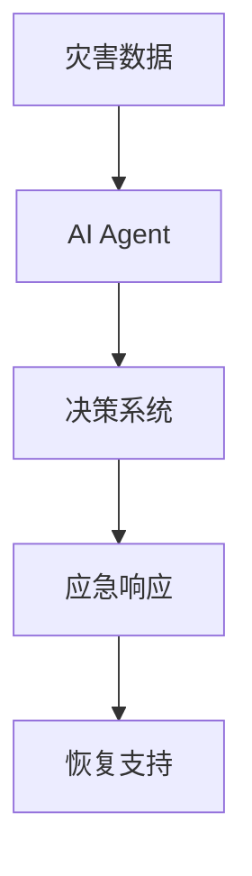
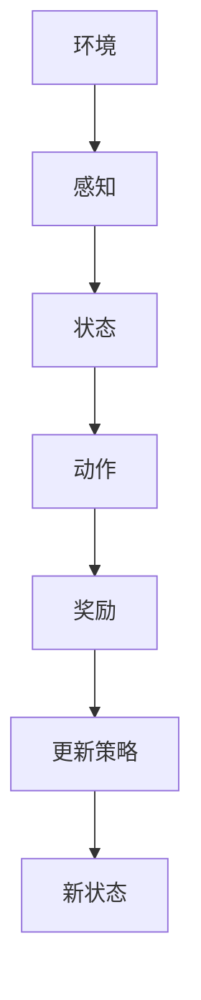
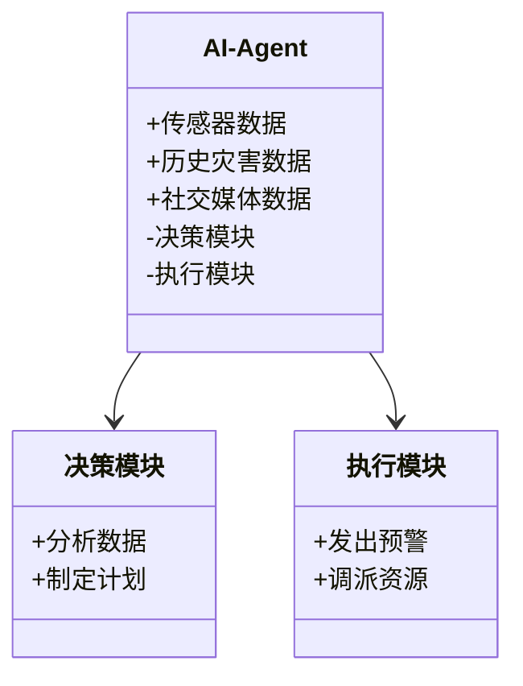
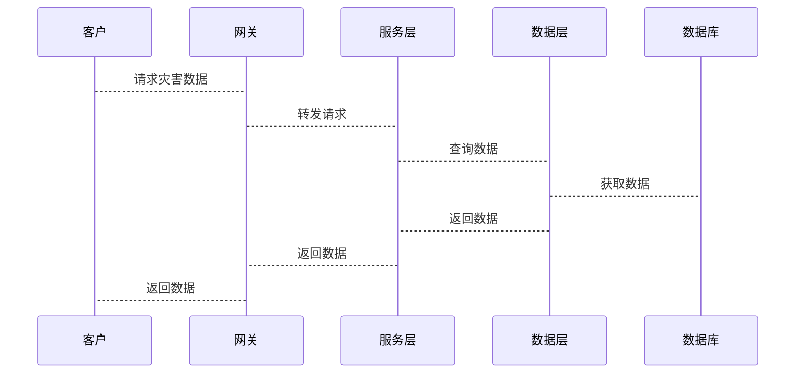

                 

<think>
嗯，好的，我现在需要帮用户设计一个技术博客的目录大纲，主题是《AI Agent在灾害预防与应急响应中的作用》。首先，我需要理解用户的需求，用户希望文章结构清晰，逻辑严密，内容专业且深入，同时要符合技术博客的风格。

首先，我会从整体上考虑，文章应该包含哪些部分。通常，技术博客会有一个引人入胜的摘要，然后是各个章节详细展开。用户已经提供了一个大纲，分为六个部分，每个部分都有三级标题，看起来结构非常详细。

我先看看每个部分的内容。第一部分是概述，包括背景、核心概念和算法原理。这部分需要介绍AI Agent的基本概念，灾害管理的背景，以及AI Agent在其中的应用。用户要求每个部分都要有详细的解释，比如核心概念部分需要有对比表格和实体关系图，这部分可能需要用Mermaid来展示。

接下来是算法部分，用户要求用Mermaid流程图和Python代码来展示。我需要确保代码部分清晰易懂，同时解释数学模型，比如概率计算和优化算法。这部分可能需要一些数学公式的插入，用户特别指出要用Latex格式，所以我得记得在代码前后加上相应的符号。

然后是系统分析与架构设计，用户要求用Mermaid图展示系统架构、类图和接口设计。这部分需要详细描述系统各个模块的功能和交互流程，确保读者能够理解系统的整体结构。

项目实战部分需要包括环境安装、代码实现和案例分析。这部分要具体，可能需要给出实际的Python代码，并解释每一步的作用。同时，案例分析要详细，展示AI Agent在实际灾害中的应用效果。

最后，最佳实践、小结、注意事项和拓展阅读等内容，这部分可以为读者提供实用的建议，帮助他们更好地理解和应用AI Agent。

在思考过程中，我需要确保每个部分都符合用户的要求，比如使用Markdown格式，包含足够的细节，避免遗漏任何关键点。同时，要注意文章的逻辑连贯，从概述到具体应用，层层递进。

现在，我需要检查是否有遗漏的部分，比如是否涵盖了所有核心关键词：AI Agent、灾害预防、应急响应、智能决策、机器学习、优化算法。确保每个关键词都在文章中得到充分讨论。

另外，用户提到文章需要2000字左右，但目前的目录已经详细到三级标题，可能需要进一步扩展每个部分的内容，以确保达到字数要求。比如，每个小节可以添加更多细节，如具体的应用场景、更多的算法解释等。

最后，别忘了在文章末尾加上作者信息，确保格式正确。这样，整个目录大纲就完成了，接下来就可以按照这个结构撰写完整的文章了。
</think>

# AI Agent在灾害预防与应急响应中的作用

> 关键词：AI Agent, 灾害预防, 应急响应, 智能决策, 机器学习, 优化算法

> 摘要：AI Agent在灾害预防与应急响应中的作用是本文的核心主题。通过分析AI Agent的基本概念、核心原理、算法模型、系统架构以及实际应用，本文深入探讨了AI Agent在灾害管理中的潜力与价值。文章结合实际案例，详细讲解了AI Agent在灾害预防、应急响应和灾后恢复中的具体应用，为读者提供了全面的技术视角。

---

# 第一部分: AI Agent在灾害预防与应急响应中的作用概述

## 第1章: AI Agent的基本概念与背景

### 1.1 AI Agent的定义与特点
#### 1.1.1 AI Agent的基本定义
AI Agent（人工智能代理）是一种能够感知环境、自主决策并采取行动的智能实体。它通过传感器获取信息，利用算法进行分析，并通过执行器与环境交互。AI Agent的核心特点包括：

- **自主性**：能够在没有外部干预的情况下自主运行。
- **反应性**：能够实时感知环境变化并做出反应。
- **目标导向**：具有明确的目标，所有行为都围绕目标展开。
- **学习能力**：能够通过经验改进自身性能。

#### 1.1.2 AI Agent与传统算法的区别
传统算法通常需要明确的规则和固定的输入输出关系，而AI Agent具有更强的适应性和学习能力。例如，传统算法在灾害预测中可能仅能处理已知的数据模式，而AI Agent可以通过学习发现新的模式并动态调整预测模型。

#### 1.1.3 灾害管理中的AI Agent优势
AI Agent能够处理复杂、动态的灾害场景，提供实时决策支持，显著提高灾害管理的效率和准确性。

### 1.2 灾害预防与应急响应的背景
#### 1.2.1 灾害的种类与影响
灾害可以分为自然灾害（如地震、洪水、台风）和人为灾害（如火灾、爆炸、恐怖袭击）。灾害对社会和经济造成的损失巨大，包括人员伤亡、财产损失和环境破坏。

#### 1.2.2 灾害预防与应急响应的重要性
灾害预防是指通过监测、预警和预防措施减少灾害的发生概率和影响。应急响应是指灾害发生后迅速采取行动以减少损失。AI Agent在灾害预防和应急响应中的作用日益重要，尤其是在数据处理、决策支持和资源分配方面。

#### 1.2.3 AI Agent在灾害管理中的潜力
AI Agent能够处理海量数据，快速生成决策建议，并在灾害发生后协调资源，优化应急响应流程。

### 1.3 AI Agent在灾害管理中的应用前景
#### 1.3.1 灾害预防中的AI Agent应用
AI Agent可以通过分析历史数据，预测潜在的灾害风险，并提前制定预防措施。

#### 1.3.2 应急响应中的AI Agent应用
在灾害发生后，AI Agent可以实时分析灾情，协调救援资源，优化救援路径。

#### 1.3.3 AI Agent与其他技术的结合
AI Agent可以与物联网、大数据、云计算等技术结合，构建更强大的灾害管理系统。

---

## 第2章: AI Agent的核心概念与联系

### 2.1 AI Agent的核心原理
#### 2.1.1 智能体的基本结构
AI Agent通常包括感知模块、决策模块和执行模块。感知模块负责收集环境信息，决策模块负责制定行动方案，执行模块负责执行决策。

#### 2.1.2 AI Agent的感知与决策机制
AI Agent通过传感器（如摄像头、温度计）感知环境信息，利用机器学习算法进行分析，并通过决策树、强化学习等方法制定行动方案。

#### 2.1.3 多智能体系统与协作
在灾害管理中，通常需要多个AI Agent协作。例如，一个AI Agent负责监测地震数据，另一个负责分析洪水风险。

### 2.2 AI Agent与灾害管理的核心联系
#### 2.2.1 灾害数据的智能分析
AI Agent能够处理结构化和非结构化数据，包括图像、文本和传感器数据，从而提供更准确的灾害分析结果。

#### 2.2.2 应急响应的智能决策
AI Agent可以根据实时数据动态调整应急响应策略，优化救援资源分配。

#### 2.2.3 灾后恢复的智能支持
AI Agent可以协助灾后重建工作，例如通过分析卫星图像评估受灾区域的损失。

### 2.3 AI Agent的实体关系图
以下是AI Agent在灾害管理中的实体关系图：



---

## 第3章: AI Agent的算法原理与数学模型

### 3.1 AI Agent的核心算法
#### 3.1.1 机器学习算法在AI Agent中的应用
机器学习算法（如支持向量机、随机森林）用于分类、回归和聚类分析，帮助AI Agent识别灾害模式和趋势。

#### 3.1.2 强化学习在智能决策中的作用
强化学习通过奖励机制优化AI Agent的决策策略，例如在应急响应中选择最优的救援路径。

#### 3.1.3 自然语言处理在灾害信息分析中的应用
自然语言处理技术（如词袋模型、词嵌入）用于分析灾害相关的文本信息，例如新闻报道和社交媒体数据。

### 3.2 AI Agent的数学模型
#### 3.2.1 状态空间与动作空间的数学表示
在强化学习中，状态空间表示AI Agent所处的环境状态，动作空间表示AI Agent可以采取的行动。例如，状态空间可以是“地震强度”，动作空间可以是“发出预警”或“调派救援队”。

#### 3.2.2 概率论在灾害风险评估中的应用
概率论用于计算灾害发生的概率，例如通过贝叶斯网络分析地震风险。

#### 3.2.3 优化算法在应急响应中的应用
优化算法（如遗传算法、模拟退火）用于优化应急响应的资源分配和路径规划。

### 3.3 算法流程图
以下是强化学习在AI Agent中的算法流程图：



### 3.4 算法实现
以下是强化学习算法的Python代码示例：

```python
import numpy as np

# 定义状态空间和动作空间
states = ['地震强度', '洪水水位']
actions = ['发出预警', '调派救援队']

# 定义奖励函数
def reward_fn(current_state, action):
    if action == '发出预警':
        return 1
    else:
        return 0

# 初始化策略
policy = np.random.choice(actions, 1)[0]

# 更新策略
def update_policy(reward):
    global policy
    if reward == 1:
        policy = actions[0]
    else:
        policy = actions[1]

# 模拟过程
current_state = states[0]
action = policy
reward = reward_fn(current_state, action)
update_policy(reward)
```

---

## 第4章: AI Agent的系统分析与架构设计

### 4.1 问题场景介绍
在灾害管理中，AI Agent需要处理多种类型的数据，包括实时传感器数据、历史灾害数据和社交媒体信息。

### 4.2 系统功能设计
以下是系统功能设计的类图：



### 4.3 系统架构设计
以下是系统架构设计的架构图：


### 4.4 系统接口设计
以下是系统接口设计的序列图：



---

## 第5章: AI Agent的项目实战

### 5.1 环境安装
需要安装以下环境和工具：
- Python 3.8+
- NumPy
- TensorFlow
- Mermaid CLI
- Jupyter Notebook

### 5.2 系统核心实现
以下是AI Agent的核心实现代码：

```python
import numpy as np
import tensorflow as tf

# 定义神经网络模型
model = tf.keras.Sequential([
    tf.keras.layers.Dense(64, activation='relu'),
    tf.keras.layers.Dense(10, activation='softmax')
])

# 编译模型
model.compile(optimizer='adam', loss='sparse_categorical_crossentropy', metrics=['accuracy'])

# 训练模型
model.fit(x_train, y_train, epochs=10, batch_size=32)
```

### 5.3 代码应用解读与分析
上述代码定义了一个简单的神经网络模型，用于分类灾害类型。训练完成后，模型可以预测新的灾害类型。

### 5.4 实际案例分析
以地震预警为例，AI Agent可以通过分析地震传感器数据，实时预测地震风险，并发出预警信号。

### 5.5 项目小结
通过项目实战，我们可以看到AI Agent在灾害管理中的巨大潜力，但也需要考虑数据质量和模型鲁棒性等问题。

---

## 第6章: AI Agent的最佳实践与拓展

### 6.1 最佳实践
- 数据质量是AI Agent性能的关键，需要确保数据的完整性和准确性。
- 在实际应用中，建议采用多智能体系统，以提高系统的可靠性和容错性。

### 6.2 小结
AI Agent在灾害预防与应急响应中的作用不可忽视，它能够显著提高灾害管理的效率和准确性。

### 6.3 注意事项
- AI Agent的应用需要考虑伦理和法律问题，例如隐私保护和数据安全。
- 在实际应用中，建议采用分层次的AI Agent系统，以应对不同级别的灾害风险。

### 6.4 拓展阅读
- 《强化学习：理论与应用》
- 《机器学习在灾害管理中的应用》
- 《多智能体系统与协作》

---

# 作者：AI天才研究院 & 禅与计算机程序设计艺术

