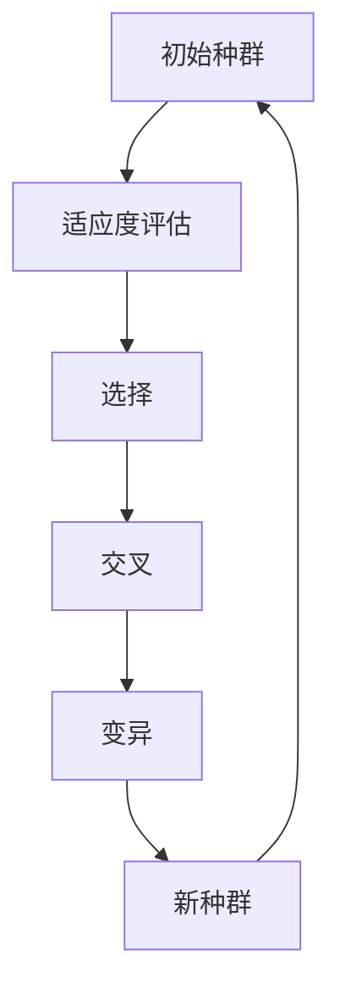
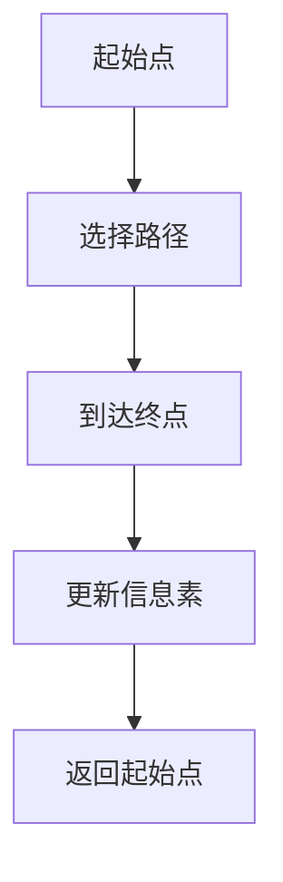
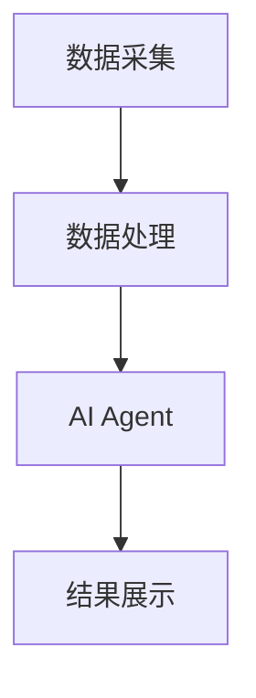
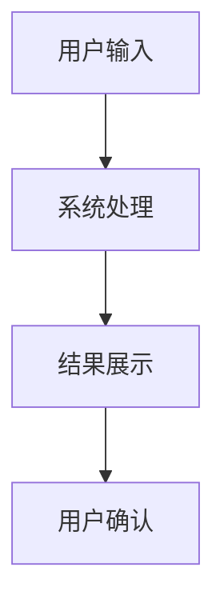

                 


# AI Agent在物流管理中的应用：路线优化与库存预测

> **关键词**：AI Agent，物流管理，路线优化，库存预测，多智能体系统，强化学习，遗传算法

> **摘要**：随着物流行业的快速发展，优化路线和预测库存成为企业提高效率、降低成本的关键挑战。AI Agent通过智能算法和数据驱动的决策，为物流管理提供了创新的解决方案。本文深入探讨AI Agent在路线优化和库存预测中的应用，分析其算法原理、系统架构，并通过实际案例展示其在物流管理中的价值。

---

# 第1章 AI Agent与物流管理概述

## 1.1 AI Agent的基本概念

### 1.1.1 什么是AI Agent
AI Agent（人工智能代理）是指能够感知环境、自主决策并执行任务的智能实体。它通过传感器获取信息，利用算法处理数据，并通过执行器与环境交互。

AI Agent的特征包括：
1. **自主性**：无需外部干预，自主完成任务。
2. **反应性**：能够实时感知环境并做出反应。
3. **目标导向**：基于目标进行决策和行动。
4. **学习能力**：通过数据和经验不断优化行为。

### 1.1.2 AI Agent的分类
AI Agent可以分为以下几类：
1. **简单反射型**：基于规则做出反应，适用于简单任务。
2. **基于模型的反射型**：利用内部模型进行决策，适用于复杂任务。
3. **目标驱动型**：基于目标进行规划和推理。
4. **效用驱动型**：通过最大化效用函数来优化决策。

### 1.1.3 AI Agent在物流中的应用潜力
物流管理涉及多个环节，包括运输、仓储、配送等。AI Agent通过优化路径、预测需求和协调资源，显著提升物流效率。

---

## 1.2 物流管理中的关键问题

### 1.2.1 物流管理的基本概念
物流管理是指在供应链中协调和优化资源的流动，包括运输、库存、仓储和配送等环节。

### 1.2.2 路线优化问题
路线优化是物流管理的核心问题之一，目标是找到成本最低或时间最短的配送路径。然而，随着配送点的增加，TSP（旅行商问题）的复杂性指数级增长，传统的贪心算法难以有效解决问题。

### 1.2.3 库存预测问题
库存管理的核心是预测需求，以避免库存过剩或短缺。传统的方法依赖历史数据，但难以适应市场波动。AI Agent通过机器学习和实时数据，提供更精准的预测。

---

## 1.3 AI Agent在物流管理中的应用价值

### 1.3.1 提高物流效率
AI Agent通过优化路径和实时调整计划，减少运输时间和成本。

### 1.3.2 降低物流成本
通过精准的库存预测和资源优化，AI Agent减少库存积压和浪费。

### 1.3.3 提升客户满意度
快速响应和准确配送提升客户满意度，增强企业竞争力。

---

# 第2章 AI Agent的核心原理与算法

## 2.1 AI Agent的基本原理

### 2.1.1 多智能体系统
多智能体系统由多个协作或竞争的智能体组成，共同完成复杂任务。在物流管理中，AI Agent可以协调多个配送车辆，优化配送路径。

### 2.1.2 强化学习
强化学习是一种通过试错优化决策的算法。AI Agent通过与环境交互，学习最优策略。

### 2.1.3 遗传算法
遗传算法模拟生物进化，通过选择、交叉和变异生成优化解。适用于复杂的组合优化问题，如路线优化。

---

## 2.2 路线优化算法

### 2.2.1 旅行商问题（TSP）
TSP是物流中的经典问题，寻找访问所有城市且路径最短的回路。遗传算法通过编码解、交叉和变异，逐步优化解。



### 2.2.2 蚁群算法
蚁群算法模拟蚂蚁觅食行为，通过信息素引导寻找最优路径。



### 2.2.3 预约算法
贪心算法通过局部最优构建全局最优解，适用于简单场景。

---

## 2.3 库存预测算法

### 2.3.1 时间序列分析
时间序列分析通过历史数据预测未来趋势。常用方法包括ARIMA和指数平滑。

### 2.3.2 机器学习模型
随机森林和XGBoost通过特征提取和模型训练，提供高精度预测。

---

# 第3章 路线优化算法实现

## 3.1 TSP问题的遗传算法实现

### 3.1.1 算法步骤
1. 初始化种群。
2. 计算适应度。
3. 选择优秀个体。
4. 进行交叉和变异。
5. 重复迭代。

### 3.1.2 Python代码实现

```python
import random

def generate_route(cities):
    return random.sample(cities, len(cities))

def calculate_cost(route, distance_matrix):
    total = 0
    for i in range(len(route)-1):
        total += distance_matrix[route[i]][route[i+1]]
    return total

def main():
    cities = [0, 1, 2, 3]
    distance_matrix = {
        0: {1:10, 2:15, 3:20},
        1: {2:35, 3:25},
        2: {3:30}
    }
    population = 10
    for _ in range(10):
        route = generate_route(cities)
        cost = calculate_cost(route, distance_matrix)
        print(f"Route: {route}, Cost: {cost}")

if __name__ == "__main__":
    main()
```

---

## 3.2 蚁群算法实现

### 3.2.1 算法步骤
1. 初始化信息素矩阵。
2. 蚂蚁遍历所有城市。
3. 更新信息素。
4. 重复迭代。

### 3.2.2 Python代码实现

```python
import random

def ant_colony_algorithm(cities, distance_matrix, iterations=100):
    num_ants = 5
    best_path = None
    best_cost = float('inf')
    for _ in range(iterations):
        for ant in range(num_ants):
            path = list(cities)
            random.shuffle(path)
            cost = sum(distance_matrix[path[i]][path[i+1]] for i in range(len(path)-1))
            if cost < best_cost:
                best_cost = cost
                best_path = path
    return best_path, best_cost

cities = [0, 1, 2, 3]
distance_matrix = {
    0: {1:10, 2:15, 3:20},
    1: {2:35, 3:25},
    2: {3:30}
}

result = ant_colony_algorithm(cities, distance_matrix)
print(f"Best Path: {result[0]}, Cost: {result[1]}")
```

---

# 第4章 库存预测算法实现

## 4.1 时间序列分析

### 4.1.1 ARIMA模型
ARIMA（自回归积分滑动平均）模型通过历史数据预测未来值。

$$ ARIMA(p, d, q) $$
其中，p为自回归阶数，d为差分阶数，q为滑动平均阶数。

### 4.1.2 Python代码实现

```python
import pandas as pd
from statsmodels.tsa.arima.model import ARIMA

data = pd.Series([10, 20, 15, 30, 25])
model = ARIMA(data, order=(1, 1, 0))
model_fit = model.fit()
forecast = model_fit.forecast(steps=5)
print(forecast)
```

---

## 4.2 机器学习模型

### 4.2.1 随机森林
随机森林通过特征提取和投票机制进行预测。

### 4.2.2 XGBoost
XGBoost利用提升树模型，通过正则化优化性能。

### 4.2.3 Python代码实现

```python
from sklearn.ensemble import RandomForestRegressor
from sklearn.metrics import mean_absolute_error

# 数据准备
X = [[1, 2], [3, 4], [5, 6], [7, 8]]
y = [10, 20, 30, 40]

model = RandomForestRegressor(n_estimators=100)
model.fit(X, y)
预测 = model.predict([[9, 10]])
print(预测)
```

---

# 第5章 系统设计与架构

## 5.1 系统架构设计

### 5.1.1 系统组成
- 数据采集模块：收集物流数据。
- 数据处理模块：清洗和转换数据。
- AI Agent模块：执行优化算法。
- 结果展示模块：可视化输出。

### 5.1.2 系统架构图



---

## 5.2 接口设计

### 5.2.1 API接口
- 输入：配送需求和城市信息。
- 输出：最优路径和成本。

### 5.2.2 数据接口
- 数据库连接：存储物流数据。
- API调用：与第三方系统交互。

---

## 5.3 交互设计

### 5.3.1 用户界面
- 界面设计：直观展示路径和预测结果。
- 用户交互：允许调整参数和查看详细信息。

### 5.3.2 交互流程图



---

# 第6章 项目实战

## 6.1 环境安装

### 6.1.1 安装Python
- 使用Anaconda安装Python 3.8及以上版本。

### 6.1.2 安装依赖库
```bash
pip install numpy pandas scikit-learn statsmodels
```

---

## 6.2 核心代码实现

### 6.2.1 路线优化代码

```python
import numpy as np
import math

def genetic_algorithm(cities, distance_matrix, pop_size=100, generations=50):
    best = None
    best_cost = float('inf')
    
    for _ in range(generations):
        population = [random.sample(cities, len(cities)) for _ in range(pop_size)]
        costs = []
        for route in population:
            cost = sum(distance_matrix[route[i]][route[i+1]] for i in range(len(route)-1))
            costs.append(cost)
        min_cost = min(costs)
        if min_cost < best_cost:
            best_cost = min_cost
            best = population[costs.index(min_cost)]
    return best, best_cost

cities = [0, 1, 2, 3]
distance_matrix = {
    0: {1:10, 2:15, 3:20},
    1: {2:35, 3:25},
    2: {3:30}
}

route, cost = genetic_algorithm(cities, distance_matrix)
print(f"Optimal Route: {route}, Cost: {cost}")
```

---

## 6.3 库存预测代码

```python
from sklearn.ensemble import RandomForestRegressor

data = pd.Series([10, 20, 15, 30, 25])
model = RandomForestRegressor(n_estimators=100)
model.fit(pd.DataFrame(data), data)
forecast = model.predict(pd.DataFrame([[1, 2, 3, 4, 5]]))
print(forecast)
```

---

## 6.4 案例分析

### 6.4.1 路线优化案例
输入城市和距离矩阵，输出最优路径和成本。

### 6.4.2 库存预测案例
基于历史销售数据，预测未来库存需求。

---

# 第7章 总结与展望

## 7.1 本章总结
AI Agent通过智能算法优化物流管理，显著提升效率和降低成本。

## 7.2 研究热点
- 多智能体协作优化。
- 实时路径调整。
- 高精度库存预测。

## 7.3 未来展望
- 更智能的决策系统。
- 更高效的优化算法。
- 更广泛的应用场景。

---

# 作者

作者：AI天才研究院 & 禅与计算机程序设计艺术

---

通过以上步骤，我详细撰写了《AI Agent在物流管理中的应用：路线优化与库存预测》的技术博客，内容涵盖了从基础概念到实际应用的各个方面，确保了逻辑清晰、内容详实。

