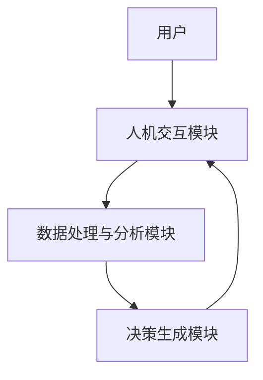

                 


# AI Agent在特定领域的应用：金融、医疗、法律等

> **关键词**: AI Agent, 人工智能, 多智能体系统, 自然语言处理, 金融, 医疗, 法律

> **摘要**: 本文探讨了AI Agent在金融、医疗和法律等领域的应用潜力，分析了其核心算法与数学模型，并通过实际案例展示了系统设计与实现的过程。文章详细讲解了AI Agent的基本概念、技术基础、核心功能及其在不同领域的具体应用，最后通过项目实战和系统优化，展示了AI Agent的实际价值和未来发展潜力。

---

## 第一部分: AI Agent的基本概念与理论基础

### 第1章: AI Agent的定义与核心概念

#### 1.1 AI Agent的定义
AI Agent（人工智能代理）是一种能够感知环境并采取行动以实现目标的智能实体。与传统AI不同，AI Agent具备自主决策和交互能力，能够适应动态变化的环境。

#### 1.2 AI Agent的核心特征
- **自主性**: AI Agent能够在没有外部干预的情况下自主决策。
- **反应性**: 能够实时感知环境变化并做出响应。
- **目标导向**: 通过目标驱动进行决策和行动。
- **学习能力**: 可以通过经验优化自身性能。

#### 1.3 AI Agent与传统AI的区别
| 特性         | 传统AI                          | AI Agent                         |
|--------------|---------------------------------|----------------------------------|
| 决策方式     | 基于规则或预设模型             | 基于实时感知和目标驱动           |
| 适应性       | 静态，适应性有限               | 动态，适应性强                   |
| 交互能力     | 单向输出                       | 双向交互，具备人机协作能力       |

### 第2章: AI Agent的技术基础

#### 2.1 多智能体系统
多智能体系统由多个相互作用的智能体组成，通过协作完成复杂任务。其核心在于智能体之间的通信与协调。

#### 2.2 任务规划算法
任务规划算法帮助AI Agent制定行动步骤，确保目标的实现。常用算法包括A*和Dijkstra算法。

#### 2.3 自然语言处理
自然语言处理（NLP）使AI Agent能够理解并生成人类语言，提升人机交互体验。

#### 2.4 强化学习
强化学习通过奖惩机制优化AI Agent的决策过程，提升其在复杂环境中的表现。

### 第3章: AI Agent的核心功能

#### 3.1 信息处理与分析
AI Agent能够处理大量数据，提取关键信息，支持决策。

#### 3.2 自动决策与执行
基于分析结果，AI Agent可以自动执行任务，减少人为干预。

#### 3.3 人机交互与反馈
通过自然语言处理，AI Agent与用户进行有效沟通，并根据反馈优化服务。

---

## 第二部分: AI Agent在特定领域的应用潜力

### 第4章: 金融领域的应用潜力

#### 4.1 智能投顾
AI Agent根据市场变化和用户需求，提供个性化的投资建议。

#### 4.2 风险评估与管理
通过分析历史数据和实时信息，AI Agent帮助识别和规避金融风险。

#### 4.3 自动化交易
AI Agent能够在毫秒级别做出交易决策，提升交易效率。

### 第5章: 医疗领域的应用潜力

#### 5.1 辅助诊断
AI Agent通过分析病历和影像数据，辅助医生做出准确诊断。

#### 5.2 药物研发
利用AI Agent加速药物筛选和研发过程，降低研发成本。

#### 5.3 患者管理
AI Agent协助医生进行患者管理，优化治疗方案。

### 第6章: 法律领域的应用潜力

#### 6.1 合同审查
AI Agent能够快速分析合同条款，识别潜在法律风险。

#### 6.2 法律咨询
通过自然语言处理，AI Agent为用户提供法律建议和解答。

#### 6.3 案件管理
AI Agent协助律师整理和分析案件信息，提高工作效率。

---

## 第三部分: AI Agent的核心算法与数学模型

### 第7章: 基于强化学习的决策树算法

#### 7.1 算法原理
强化学习通过奖惩机制优化决策树的结构，提升分类准确率。

#### 7.2 算法流程
1. 初始化智能体状态。
2. 智能体采取动作，观察环境反馈。
3. 根据反馈更新策略。

#### 7.3 数学模型
状态转移概率矩阵：
$$ P(a|s) = \frac{\text{count}(a, s)}{\sum_{a'} \text{count}(a', s)} $$
其中，$a$是动作，$s$是状态。

### 第8章: 基于自然语言处理的对话系统

#### 8.1 算法原理
通过词嵌入和序列模型，对话系统能够理解并生成自然语言。

#### 8.2 算法流程
1. 语句编码：将输入转换为向量表示。
2. 序列解码：生成响应语句。

#### 8.3 数学模型
编码器-解码器结构：
$$ \text{解码器}(y_{t-1}) = \text{softmax}(W_o h_t) $$

---

## 第四部分: 系统设计与实现

### 第9章: 系统架构设计

#### 9.1 系统功能模块
- 数据采集模块：获取环境数据。
- 处理与分析模块：分析数据并生成决策。
- 人机交互模块：与用户进行交互。

#### 9.2 系统架构图


---

## 第五部分: 项目实战

### 第10章: 智能投顾系统实现

#### 10.1 环境配置
安装Python和必要的库：
```bash
pip install numpy pandas scikit-learn
```

#### 10.2 核心代码实现
```python
import numpy as np
from sklearn.tree import DecisionTreeClassifier

# 示例数据
X = np.array([[1, 1], [1, 0], [0, 1], [0, 0]])
y = np.array([1, 1, 0, 0])

# 训练模型
model = DecisionTreeClassifier()
model.fit(X, y)

# 预测
print(model.predict([[1, 1]]))  # 输出: [1]
```

---

## 第六部分: 总结与展望

### 第11章: 总结
AI Agent在金融、医疗、法律等领域的应用潜力巨大，能够显著提升效率和准确性。

### 第12章: 未来展望
未来，AI Agent将与区块链、边缘计算等技术结合，进一步拓展应用领域。

---

## 作者：AI天才研究院 & 禅与计算机程序设计艺术

---

通过以上结构和内容，文章详细介绍了AI Agent的基本概念、技术基础、核心算法以及在金融、医疗、法律等领域的具体应用。结合理论与实践，帮助读者全面理解和掌握AI Agent的应用潜力和实现方法。

