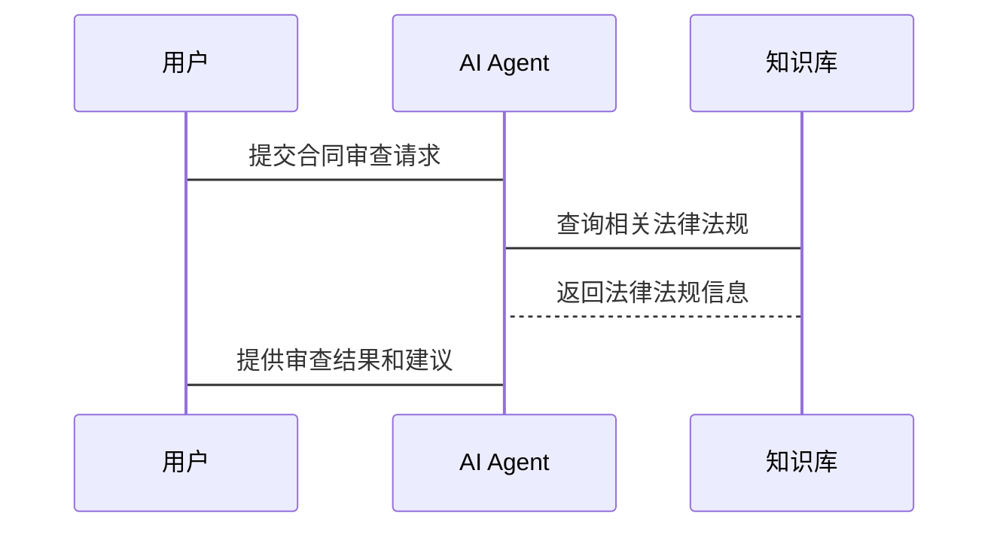
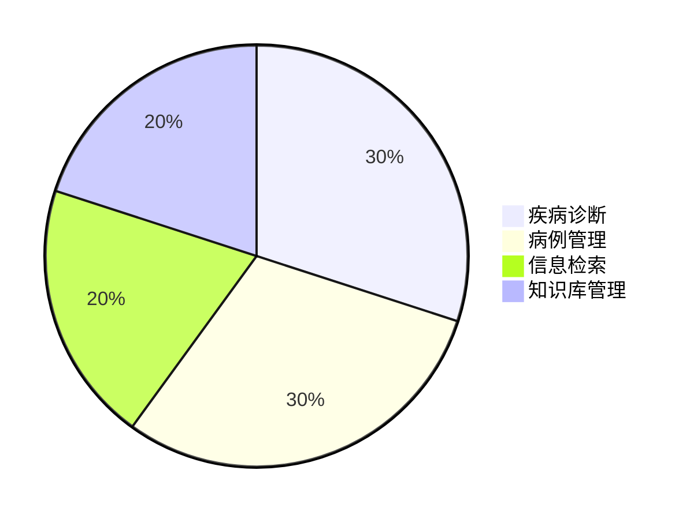
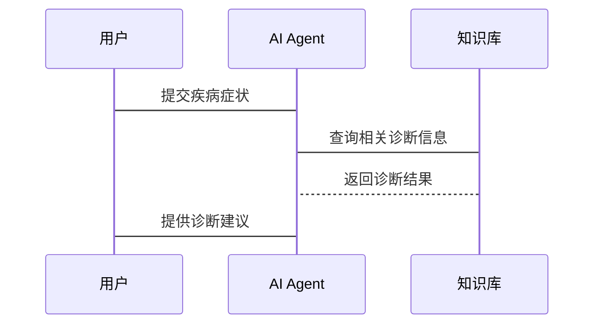
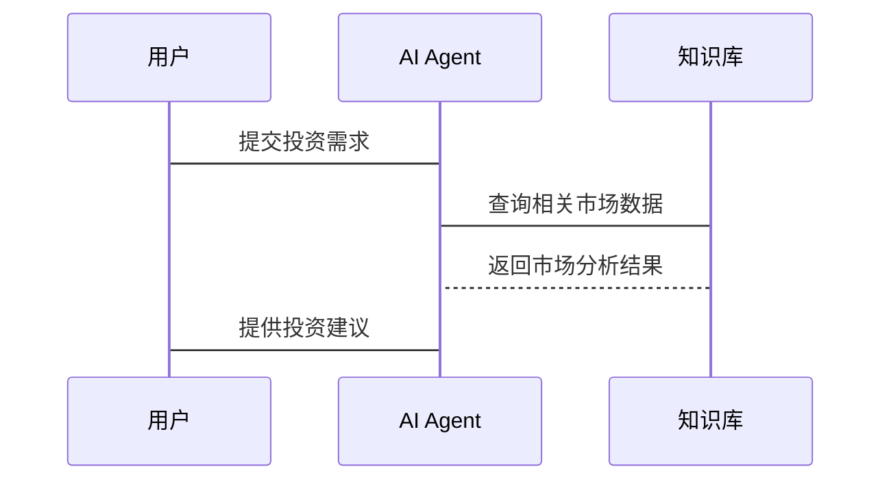

                 


# AI Agent在特定领域的深度应用：法律、医疗、金融

## 关键词：AI Agent, 法律, 医疗, 金融, 多智能体系统, 强化学习, 自然语言处理

## 摘要：本文详细探讨了AI Agent在法律、医疗和金融三个领域的深度应用，分析了其技术基础、系统架构、算法原理及实际案例。通过法律领域的合同审查、医疗领域的诊断辅助和金融领域的风险管理等案例，展示了AI Agent在这些领域的独特价值和应用潜力。文章还总结了实施AI Agent的最佳实践和未来发展趋势。

---

## 第一部分: AI Agent 的背景与技术基础

### 第1章: AI Agent 概念与技术基础

#### 1.1 AI Agent 的定义与核心概念

**1.1.1 AI Agent 的定义**

AI Agent（人工智能代理）是指能够感知环境、自主决策并执行任务的智能实体。它可以是一个软件程序、机器人或其他智能系统，通过与用户或环境交互，完成特定目标。AI Agent的核心在于其自主性和智能性，能够根据输入的信息做出决策并采取行动。

**1.1.2 AI Agent 的核心要素与属性**

AI Agent的核心要素包括：

1. **感知能力**：通过传感器或数据输入感知环境。
2. **推理能力**：基于感知信息进行逻辑推理和知识表示。
3. **决策能力**：根据推理结果做出最优决策。
4. **执行能力**：通过执行机构或输出模块采取行动。
5. **学习能力**：通过机器学习算法不断优化自身性能。

AI Agent的属性包括自主性、反应性、目标导向性和社交能力。

**1.1.3 AI Agent 的分类与应用场景**

AI Agent可以根据功能、智能水平和环境类型进行分类：

1. **按功能分类**：
   - **工具型AI Agent**：用于完成特定任务，如计算器。
   - **社交型AI Agent**：用于与人类或其他智能体交互，如虚拟助手。
   - **决策型AI Agent**：用于复杂决策场景，如自动驾驶。

2. **按智能水平分类**：
   - **反应式AI Agent**：基于当前感知做出反应，不依赖历史信息。
   - **认知式AI Agent**：具备高级推理和规划能力，能够处理复杂任务。

3. **按环境类型分类**：
   - **静态环境**：环境在决策过程中不变。
   - **动态环境**：环境在决策过程中可能发生变化。
   - **部分可观测环境**：智能体无法完全感知环境状态。

AI Agent的应用场景包括智能助手、自动驾驶、智能客服、机器人手术助手等。

#### 1.2 多智能体系统与协作

**1.2.1 多智能体系统的基本概念**

多智能体系统（Multi-Agent System, MAS）是由多个相互作用的智能体组成的系统，这些智能体通过协作完成单个智能体无法完成的任务。多智能体系统的优势在于能够处理复杂任务，通过分工合作提高效率。

**1.2.2 多智能体协作的机制与挑战**

多智能体协作的机制包括：

1. **通信机制**：智能体之间通过消息传递进行通信。
2. **协调机制**：通过协商或协议分配任务。
3. **合作机制**：通过分工合作完成共同目标。
4. **冲突解决机制**：处理协作中的冲突和矛盾。

多智能体系统的主要挑战包括通信开销、同步问题、安全性和隐私保护。

**1.2.3 实体关系图（ER图）展示多智能体协作关系**

使用Mermaid图展示多智能体协作关系：

```mermaid
erDiagram
    user} +-----{agent
    agent} +-----{task
    agent} +-----{environment
```

#### 1.3 AI Agent 的技术基础

**1.3.1 人工智能与机器学习基础**

人工智能（AI）和机器学习（ML）是AI Agent的核心技术。机器学习算法（如深度学习、强化学习）用于训练AI Agent，使其能够从数据中学习和改进。

**1.3.2 知识表示与推理**

知识表示是将知识以计算机可理解的形式表示，常用的知识表示方法包括语义网络、规则表示和知识图谱。推理是基于知识表示进行逻辑推理，如布尔逻辑推理、概率推理和类比推理。

**1.3.3 自然语言处理（NLP）与对话系统**

自然语言处理（NLP）用于使AI Agent能够理解和生成人类语言。对话系统基于NLP技术，通过上下文理解用户需求并生成自然语言回复。

#### 1.4 AI Agent 的算法原理

**1.4.1 基于强化学习的AI Agent 算法**

强化学习是一种通过试错机制训练AI Agent的方法。AI Agent在环境中通过执行动作获得奖励或惩罚，逐步优化策略以最大化累计奖励。

**1.4.2 基于监督学习的AI Agent 算法**

监督学习是一种通过标注数据训练AI Agent的方法。AI Agent通过输入输出的对应关系进行学习，适用于分类和回归任务。

**1.4.3 基于知识图谱的推理算法**

知识图谱是一种结构化的知识表示形式。基于知识图谱的推理算法通过查询和推理知识图谱中的信息，生成新的知识或回答问题。

---

## 第二部分: AI Agent 在法律领域的深度应用

### 第2章: AI Agent 在法律领域的深度应用

#### 2.1 法律领域的 AI Agent 应用场景

**2.1.1 合同审查与分析**

AI Agent可以自动分析合同文本，识别关键条款和潜在风险，帮助律师快速完成合同审查。

**2.1.2 法律咨询与建议**

AI Agent可以根据用户提供的法律问题，结合法律法规和案例，提供法律建议和解决方案。

**2.1.3 法律合规监控**

AI Agent可以实时监控企业经营行为，识别合规风险，确保企业行为符合相关法律法规。

#### 2.2 法律 AI Agent 的系统架构

**2.2.1 系统功能设计**

系统功能包括合同审查、法律咨询、合规监控和知识库管理。

**2.2.2 系统架构设计**

使用Mermaid图展示系统架构：


**2.2.3 系统接口与交互设计**

使用Mermaid图展示系统交互流程：



#### 2.3 法律 AI Agent 的实现与案例

**2.3.1 环境安装与配置**

安装Python、TensorFlow、Keras和自然语言处理库（如spaCy）。

**2.3.2 核心代码实现**

以下是一个法律合同审查AI Agent的Python代码示例：

```python
import tensorflow as tf
import numpy as np
from tensorflow.keras import layers

# 定义模型
model = tf.keras.Sequential([
    layers.Dense(128, activation='relu', input_shape=(num_features,)),
    layers.Dense(64, activation='relu'),
    layers.Dense(1, activation='sigmoid')
])

# 编译模型
model.compile(optimizer='adam', loss='binary_crossentropy', metrics=['accuracy'])

# 训练模型
model.fit(X_train, y_train, epochs=10, batch_size=32)
```

**2.3.3 案例分析与详细解读**

案例：某公司合同审查AI Agent，用于识别合同中的风险条款。AI Agent通过分析合同文本，标记出潜在风险，并提供修改建议。

---

## 第三部分: AI Agent 在医疗领域的深度应用

### 第3章: AI Agent 在医疗领域的深度应用

#### 3.1 医疗领域的 AI Agent 应用场景

**3.1.1 疾病诊断与辅助决策**

AI Agent可以分析患者的症状和病史，辅助医生进行疾病诊断和治疗方案选择。

**3.1.2 医疗病例管理与分析**

AI Agent可以帮助医生管理患者病例，分析病历数据，识别潜在风险。

**3.1.3 医疗信息检索与患者咨询**

AI Agent可以为患者提供医疗信息检索和咨询服务，帮助患者了解疾病和治疗方法。

#### 3.2 医疗 AI Agent 的系统架构

**3.2.1 系统功能设计**

系统功能包括疾病诊断、病例管理和信息检索。

**3.2.2 系统架构设计**

使用Mermaid图展示系统架构：



**3.2.3 系统接口与交互设计**

使用Mermaid图展示系统交互流程：



#### 3.3 医疗 AI Agent 的实现与案例

**3.3.1 环境安装与配置**

安装Python、TensorFlow、Keras和自然语言处理库（如spaCy）。

**3.3.2 核心代码实现**

以下是一个医疗诊断AI Agent的Python代码示例：

```python
import tensorflow as tf
import numpy as np
from tensorflow.keras import layers

# 定义模型
model = tf.keras.Sequential([
    layers.Dense(128, activation='relu', input_shape=(num_features,)),
    layers.Dense(64, activation='relu'),
    layers.Dense(1, activation='sigmoid')
])

# 编译模型
model.compile(optimizer='adam', loss='binary_crossentropy', metrics=['accuracy'])

# 训练模型
model.fit(X_train, y_train, epochs=10, batch_size=32)
```

**3.3.3 案例分析与详细解读**

案例：某医院疾病诊断AI Agent，用于辅助医生诊断疾病。AI Agent通过分析患者的症状和病史，提供诊断建议和治疗方案。

---

## 第四部分: AI Agent 在金融领域的深度应用

### 第4章: AI Agent 在金融领域的深度应用

#### 4.1 金融领域的 AI Agent 应用场景

**4.1.1 风险管理**

AI Agent可以实时监控市场动态，识别潜在风险，帮助金融机构进行风险管理。

**4.1.2 投资决策**

AI Agent可以通过分析市场数据和历史趋势，为投资者提供投资建议和优化投资组合。

**4.1.3 客户服务**

AI Agent可以为客户提供实时的金融信息服务，解答客户疑问，提供个性化金融建议。

#### 4.2 金融 AI Agent 的系统架构

**4.2.1 系统功能设计**

系统功能包括风险管理、投资决策和客户服务。

**4.2.2 系统架构设计**

使用Mermaid图展示系统架构：


**4.2.3 系统接口与交互设计**

使用Mermaid图展示系统交互流程：



#### 4.3 金融 AI Agent 的实现与案例

**4.3.1 环境安装与配置**

安装Python、TensorFlow、Keras和自然语言处理库（如spaCy）。

**4.3.2 核心代码实现**

以下是一个金融风险管理AI Agent的Python代码示例：

```python
import tensorflow as tf
import numpy as np
from tensorflow.keras import layers

# 定义模型
model = tf.keras.Sequential([
    layers.Dense(128, activation='relu', input_shape=(num_features,)),
    layers.Dense(64, activation='relu'),
    layers.Dense(1, activation='sigmoid')
])

# 编译模型
model.compile(optimizer='adam', loss='binary_crossentropy', metrics=['accuracy'])

# 训练模型
model.fit(X_train, y_train, epochs=10, batch_size=32)
```

**4.3.3 案例分析与详细解读**

案例：某金融机构风险管理AI Agent，用于实时监控市场动态，识别潜在风险。AI Agent通过分析市场数据和历史趋势，提供风险管理建议。

---

## 第五部分: 项目实战与未来发展

### 第5章: 项目实战

#### 5.1 法律合同审查AI Agent 实战

**5.1.1 环境安装与配置**

安装Python、TensorFlow、Keras和自然语言处理库（如spaCy）。

**5.1.2 核心代码实现**

以下是一个法律合同审查AI Agent的Python代码示例：

```python
import tensorflow as tf
import numpy as np
from tensorflow.keras import layers

# 定义模型
model = tf.keras.Sequential([
    layers.Dense(128, activation='relu', input_shape=(num_features,)),
    layers.Dense(64, activation='relu'),
    layers.Dense(1, activation='sigmoid')
])

# 编译模型
model.compile(optimizer='adam', loss='binary_crossentropy', metrics=['accuracy'])

# 训练模型
model.fit(X_train, y_train, epochs=10, batch_size=32)
```

**5.1.3 案例分析与详细解读**

案例：某公司合同审查AI Agent，用于识别合同中的风险条款。AI Agent通过分析合同文本，标记出潜在风险，并提供修改建议。

#### 5.2 医疗诊断AI Agent 实战

**5.2.1 环境安装与配置**

安装Python、TensorFlow、Keras和自然语言处理库（如spaCy）。

**5.2.2 核心代码实现**

以下是一个医疗诊断AI Agent的Python代码示例：

```python
import tensorflow as tf
import numpy as np
from tensorflow.keras import layers

# 定义模型
model = tf.keras.Sequential([
    layers.Dense(128, activation='relu', input_shape=(num_features,)),
    layers.Dense(64, activation='relu'),
    layers.Dense(1, activation='sigmoid')
])

# 编译模型
model.compile(optimizer='adam', loss='binary_crossentropy', metrics=['accuracy'])

# 训练模型
model.fit(X_train, y_train, epochs=10, batch_size=32)
```

**5.2.3 案例分析与详细解读**

案例：某医院疾病诊断AI Agent，用于辅助医生诊断疾病。AI Agent通过分析患者的症状和病史，提供诊断建议和治疗方案。

#### 5.3 金融风险管理AI Agent 实战

**5.3.1 环境安装与配置**

安装Python、TensorFlow、Keras和自然语言处理库（如spaCy）。

**5.3.2 核心代码实现**

以下是一个金融风险管理AI Agent的Python代码示例：

```python
import tensorflow as tf
import numpy as np
from tensorflow.keras import layers

# 定义模型
model = tf.keras.Sequential([
    layers.Dense(128, activation='relu', input_shape=(num_features,)),
    layers.Dense(64, activation='relu'),
    layers.Dense(1, activation='sigmoid')
])

# 编译模型
model.compile(optimizer='adam', loss='binary_crossentropy', metrics=['accuracy'])

# 训练模型
model.fit(X_train, y_train, epochs=10, batch_size=32)
```

**5.3.3 案例分析与详细解读**

案例：某金融机构风险管理AI Agent，用于实时监控市场动态，识别潜在风险。AI Agent通过分析市场数据和历史趋势，提供风险管理建议。

### 第6章: 未来发展与最佳实践

#### 6.1 未来发展趋势

AI Agent在法律、医疗和金融领域的应用将更加深入，随着技术的进步，AI Agent将具备更高的智能性和自主性。未来的发展方向包括：

1. **多模态AI Agent**：结合视觉、听觉等多种感知方式，提供更丰富的交互体验。
2. **人机协作**：AI Agent与人类专家协同工作，提高决策的准确性和效率。
3. **边缘计算**：AI Agent在边缘设备上运行，实现低延迟和高实时性。

#### 6.2 实施AI Agent的最佳实践

1. **明确需求**：在实施AI Agent之前，明确业务需求和应用场景。
2. **数据准备**：确保数据的高质量和完整性，为AI Agent提供充足的学习材料。
3. **模型选择**：根据具体任务选择合适的算法和模型，确保模型的性能和可解释性。
4. **系统集成**：将AI Agent与其他系统和工具集成，确保系统的兼容性和可扩展性。
5. **持续优化**：通过实时反馈和数据更新，不断优化AI Agent的性能和表现。

#### 6.3 注意事项与挑战

1. **数据隐私**：在处理敏感数据时，需要遵守相关法律法规，保护数据隐私。
2. **模型解释性**：AI Agent的决策过程需要具备可解释性，以便用户理解和信任。
3. **技术瓶颈**：当前技术仍存在局限性，如处理复杂任务时的效率和准确性问题。

---

## 小结

本文详细探讨了AI Agent在法律、医疗和金融三个领域的深度应用，分析了其技术基础、系统架构、算法原理及实际案例。通过法律合同审查、医疗诊断辅助和金融风险管理等案例，展示了AI Agent在这些领域的独特价值和应用潜力。文章还总结了实施AI Agent的最佳实践和未来发展趋势，为读者提供了有价值的参考。

---

## 作者：AI天才研究院/AI Genius Institute & 禅与计算机程序设计艺术/Zen And The Art of Computer Programming

