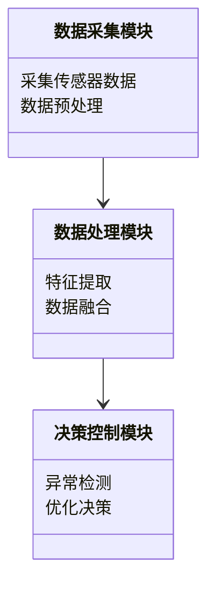
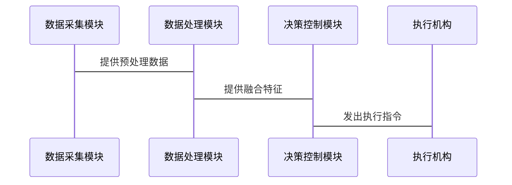

                 


# AI Agent在环境监测与保护中的角色

## 关键词：AI Agent, 环境监测, 环境保护, 强化学习, 传感器网络, 多模态数据融合

## 摘要：本文探讨了AI Agent在环境监测与保护中的应用，从概念、算法、系统架构到实际项目，全面分析了AI Agent如何提升环境监测的效率和准确性。通过具体案例和最佳实践，展示了AI技术在环境保护中的潜力和价值。

---

## 第一部分: AI Agent在环境监测与保护中的角色概述

## 第1章: AI Agent的基本概念与背景

### 1.1 AI Agent的定义与特点

#### 1.1.1 AI Agent的定义
AI Agent（人工智能代理）是指在计算机系统中，能够感知环境、自主决策并执行任务的智能实体。它具备目标导向性、自主性、反应性和社交性等核心特点。

#### 1.1.2 AI Agent的核心特点
- **目标导向性**：AI Agent的行为以实现特定目标为导向。
- **自主性**：能够独立感知环境并自主决策。
- **反应性**：能够实时响应环境变化。
- **社交性**：能够与其他系统或人类进行交互。

#### 1.1.3 AI Agent与传统自动化系统的区别
| 特性          | AI Agent                | 传统自动化系统          |
|---------------|-------------------------|-------------------------|
| 决策能力      | 具备自主决策能力        | 依赖预设规则            |
| 学习能力      | 可通过数据学习优化      | 无法优化，仅按规则执行  |
| 环境适应性    | 能够适应动态环境变化     | 适应性较差，需人工调整  |

### 1.2 环境监测与保护的背景

#### 1.2.1 环境监测的重要性
环境监测是保护生态系统、预防污染扩散的重要手段。通过实时监测环境数据，可以及时发现并应对潜在的环境问题。

#### 1.2.2 环境保护的挑战与机遇
- **挑战**：环境问题日益复杂，数据量大且多样化，传统方法难以应对。
- **机遇**：AI技术的快速发展为环境监测提供了新的解决方案。

#### 1.2.3 AI Agent在环境监测中的应用前景
AI Agent可以通过实时数据分析、异常检测和自主决策，显著提高环境监测的效率和准确性。

### 1.3 AI Agent在环境监测与保护中的作用

#### 1.3.1 AI Agent在环境数据采集中的应用
AI Agent能够协调多种传感器，实现多模态数据的采集与融合，提高数据的准确性和完整性。

#### 1.3.2 AI Agent在环境异常检测中的作用
通过学习正常环境数据的模式，AI Agent能够快速识别异常情况，如污染物超标或设备故障。

#### 1.3.3 AI Agent在环境优化与保护中的价值
AI Agent可以通过优化决策模型，制定最优的环境保护策略，减少资源浪费和环境污染。

---

## 第2章: AI Agent的核心概念与原理

### 2.1 AI Agent的感知机制

#### 2.1.1 数据采集与传感器技术
AI Agent通过多种传感器（如温度、湿度、气体传感器）采集环境数据，并进行预处理和特征提取。

#### 2.1.2 数据预处理与特征提取
- **数据预处理**：去除噪声、归一化等处理，确保数据质量。
- **特征提取**：通过主成分分析（PCA）等方法提取关键特征。

#### 2.1.3 环境数据的多模态融合
将来自不同传感器的数据进行融合，提高数据的丰富性和准确性。

### 2.2 AI Agent的决策机制

#### 2.2.1 基于规则的决策系统
通过预设规则进行简单决策，适用于规则明确的场景。

#### 2.2.2 基于机器学习的决策模型
利用训练数据构建分类器或回归模型，实现复杂场景的决策。

#### 2.2.3 基于强化学习的决策优化
通过奖励机制优化决策策略，适用于动态环境中的决策问题。

### 2.3 AI Agent的执行机制

#### 2.3.1 执行动作的规划与调度
AI Agent根据决策结果生成执行计划，并协调资源进行调度。

#### 2.3.2 动作执行的实时性与可靠性
确保执行动作的实时性和可靠性，减少延迟和错误。

#### 2.3.3 执行结果的反馈与优化
通过反馈机制不断优化执行策略，提高整体效率。

### 2.4 AI Agent的环境适应性

#### 2.4.1 环境动态变化的应对策略
通过动态调整模型参数和策略，适应环境变化。

#### 2.4.2 不确定性环境下的鲁棒性设计
设计鲁棒算法，确保在不确定环境中的稳定运行。

#### 2.4.3 多目标优化的平衡与协调
在多个目标之间找到平衡点，优化整体性能。

---

## 第3章: AI Agent在环境监测中的算法原理

### 3.1 环境数据采集与处理

#### 3.1.1 数据采集的传感器网络设计
设计多传感器网络，确保数据的全面性和准确性。

#### 3.1.2 数据预处理与特征提取方法
使用PCA等方法提取关键特征，减少数据维度。

#### 3.1.3 数据融合技术与实现
通过加权融合等方法，整合多源数据，提高数据质量。

### 3.2 环境异常检测算法

#### 3.2.1 基于监督学习的异常检测
使用支持向量机（SVM）等监督学习算法进行异常检测。

#### 3.2.2 基于无监督学习的异常检测
利用聚类算法（如K-means）识别异常数据。

#### 3.2.3 基于强化学习的异常检测优化
通过强化学习优化异常检测模型，提高检测准确率。

### 3.3 环境优化与保护算法

#### 3.3.1 基于强化学习的环境优化策略
使用Q-learning算法优化资源分配，减少环境负担。

#### 3.3.2 基于机器学习的环境预测模型
构建回归模型预测环境变化趋势，提前制定应对措施。

#### 3.3.3 基于多目标优化的环境保护方案
通过遗传算法等方法，在多个目标之间找到最优平衡。

---

## 第4章: AI Agent在环境监测中的系统架构

### 4.1 系统功能设计

#### 4.1.1 数据采集模块
负责环境数据的采集与预处理。

#### 4.1.2 数据处理模块
进行数据融合与特征提取。

#### 4.1.3 决策控制模块
基于算法模型进行决策并执行动作。

### 4.2 系统架构设计

#### 4.2.1 领域模型设计
使用Mermaid类图展示系统各模块之间的关系。



#### 4.2.2 系统架构图
使用Mermaid架构图展示系统的整体架构。


### 4.3 系统接口设计

#### 4.3.1 接口描述
- 数据采集模块与数据处理模块之间的接口。
- 数据处理模块与决策控制模块之间的接口。

#### 4.3.2 交互序列图
展示系统各模块之间的交互流程。



---

## 第5章: AI Agent在环境监测中的项目实战

### 5.1 环境安装与配置

#### 5.1.1 安装Python环境
使用Anaconda安装Python 3.8及以上版本。

#### 5.1.2 安装依赖库
安装numpy、pandas、scikit-learn等库。

### 5.2 系统核心实现

#### 5.2.1 数据采集模块实现
编写代码采集传感器数据。

```python
import numpy as np

def collect_data(sensor_ids):
    data = {}
    for id in sensor_ids:
        # 模拟传感器数据采集
        data[id] = np.random.normal(loc=id, scale=0.1, size=100)
    return data

sensor_ids = [1, 2, 3]
data = collect_data(sensor_ids)
print(data)
```

#### 5.2.2 数据处理模块实现
实现数据预处理和特征提取。

```python
from sklearn.decomposition import PCA

def preprocess_data(data):
    # 数据标准化
    data_scaled = (data - data.mean()) / data.std()
    # PCA降维
    pca = PCA(n_components=2)
    features = pca.fit_transform(data_scaled)
    return features

features = preprocess_data(data)
print(features)
```

#### 5.2.3 决策控制模块实现
实现异常检测和优化决策。

```python
from sklearn.svm import OneClassSVC

def detect_anomaly(features):
    model = OneClassSVC()
    model.fit(features)
    return model.predict(features)

anomaly_predictions = detect_anomaly(features)
print(anomaly_predictions)
```

### 5.3 实际案例分析

#### 5.3.1 案例背景
假设某工业园区需要实时监测空气质量数据。

#### 5.3.2 数据分析与处理
展示如何通过AI Agent实现数据采集、处理和异常检测。

#### 5.3.3 系统优化与总结
总结系统实现的效果和优化方向。

---

## 第6章: 最佳实践与小结

### 6.1 最佳实践

#### 6.1.1 小结
AI Agent在环境监测中的应用显著提高了效率和准确性。

#### 6.1.2 注意事项
- 确保数据质量和传感器的可靠性。
- 定期更新模型以适应环境变化。
- 处理好隐私和数据安全问题。

#### 6.1.3 拓展阅读
推荐相关书籍和论文，供读者深入学习。

---

## 作者：AI天才研究院 & 禅与计算机程序设计艺术

---

以上是完整的文章大纲和内容，涵盖了从概念到实践的各个方面，确保读者能够全面理解AI Agent在环境监测与保护中的角色和应用。

