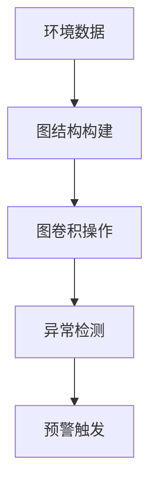
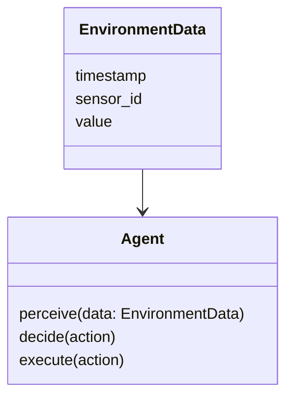
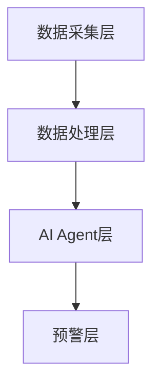
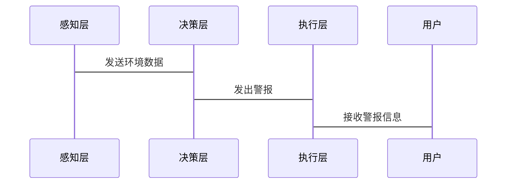

                 


# AI Agent在环境监测与预警中的实践

> 关键词：AI Agent, 环境监测, 异常检测, 预警系统, 加强学习, 图神经网络

> 摘要：本文系统地探讨了AI Agent在环境监测与预警中的应用，从背景介绍、核心概念、算法原理到系统架构和项目实战，全面分析了AI Agent在环境监测中的作用和实现方法。通过具体案例和代码实现，展示了如何利用AI Agent提升环境监测的效率和准确性。

---

# 第一部分：AI Agent在环境监测与预警中的背景与概念

## 第1章：AI Agent与环境监测概述

### 1.1 AI Agent的基本概念

#### 1.1.1 AI Agent的定义
AI Agent（人工智能代理）是指能够感知环境、做出决策并执行操作的智能实体。它能够根据环境信息自主行动，以实现特定目标。

#### 1.1.2 AI Agent的核心特征
- **自主性**：能够自主决策和行动，无需外部干预。
- **反应性**：能够实时感知环境变化并做出响应。
- **目标导向性**：所有行为都以实现特定目标为导向。
- **学习能力**：能够通过经验改进自身的性能。

#### 1.1.3 AI Agent与传统自动化的区别
| 特性       | 传统自动化           | AI Agent                |
|------------|----------------------|--------------------------|
| 决策方式   | 预设规则             | 自主学习与决策           |
| 环境适应性 | 固定场景             | 多场景适应               |
| 复杂性     | 简单固定             | 复杂多样                 |

### 1.2 环境监测与预警的背景

#### 1.2.1 环境监测的定义与重要性
环境监测是指通过技术手段对环境要素（如空气、水、土壤）进行实时或定期的观测和分析。其重要性在于及时发现环境问题，为环境保护和治理提供数据支持。

#### 1.2.2 环境监测的主要技术手段
- **传感器技术**：用于采集环境数据（如温度、湿度、污染物浓度）。
- **数据分析技术**：对传感器数据进行处理、分析和可视化。
- **通信技术**：实现数据的实时传输和共享。

#### 1.2.3 环境预警的必要性与挑战
环境预警是指在环境问题发生前发出警报，以减少潜在危害。其必要性在于预防环境灾难，保护人民生命财产安全。然而，环境预警面临数据复杂性高、事件不确定性大等挑战。

### 1.3 AI Agent在环境监测中的应用背景

#### 1.3.1 环境监测中的数据处理需求
环境监测数据具有多样性、实时性和动态性特点，需要高效的数据处理能力。

#### 1.3.2 AI Agent在环境监测中的优势
- **智能化**：能够自动识别异常，提高监测效率。
- **实时性**：能够快速响应环境变化。
- **自适应性**：能够根据环境变化调整监测策略。

#### 1.3.3 当前环境监测技术的局限性
- **人工干预过多**：传统监测系统依赖人工分析，效率低。
- **数据处理能力有限**：难以处理海量、复杂的数据。
- **预警精度不足**：传统预警系统误报率和漏报率较高。

### 1.4 本章小结
本章介绍了AI Agent的基本概念、环境监测的背景及其重要性，以及AI Agent在环境监测中的应用优势和当前技术的局限性。这些内容为后续章节奠定了基础。

---

## 第2章：环境监测与预警的核心问题

### 2.1 环境数据的采集与处理

#### 2.1.1 环境数据的多样性
环境监测数据包括空气质量、水质、噪声等多种类型，数据来源多样化。

#### 2.1.2 数据采集的挑战
- **数据量大**：需要处理海量数据。
- **数据异质性**：不同类型数据难以统一处理。
- **数据实时性**：需要实时采集和分析。

#### 2.1.3 数据预处理的关键步骤
- **数据清洗**：去除噪声和异常值。
- **数据转换**：将数据转换为适合分析的形式。
- **数据集成**：整合多源数据。

### 2.2 环境监测中的异常检测

#### 2.2.1 异常检测的定义
异常检测是指识别数据中与正常模式不符的异常值或模式。

#### 2.2.2 异常检测的分类
- **基于统计的方法**：如Z-score、箱线图法。
- **基于机器学习的方法**：如聚类、分类、深度学习。
- **基于时间序列的方法**：如ARIMA、LSTM。

#### 2.2.3 环境异常检测的典型场景
- **空气质量突变**：如PM2.5浓度突然升高。
- **水质突变**：如COD（化学需氧量）突然下降。
- **噪声突变**：如工业噪声突然增大。

### 2.3 环境预警的决策机制

#### 2.3.1 预警级别划分
通常分为多个级别，如轻微、一般、严重、紧急。

#### 2.3.2 预警触发条件
根据环境数据是否超过预设阈值或其他条件触发预警。

#### 2.3.3 预警信息的传播与响应
- **传播方式**：通过短信、邮件、APP推送等方式通知相关人员。
- **响应措施**：根据预警级别采取相应的应急措施。

### 2.4 本章小结
本章分析了环境监测中的数据采集与处理、异常检测以及预警决策机制，为后续章节的AI Agent应用提供了问题背景。

---

## 第3章：AI Agent的核心概念与原理

### 3.1 AI Agent的构成要素

#### 3.1.1 感知层
负责感知环境信息，如传感器数据、用户输入等。

#### 3.1.2 决策层
基于感知到的信息，通过算法进行决策，确定下一步行动。

#### 3.1.3 执行层
根据决策层的指令，执行具体操作，如发出警报、调整设备参数等。

### 3.2 AI Agent的行为模型

#### 3.2.1 监督学习模型
通过大量标注数据训练模型，使其能够预测目标结果。

#### 3.2.2 强化学习模型
通过与环境交互，学习策略以最大化累积奖励。

#### 3.2.3 混合学习模型
结合监督学习和强化学习，综合利用两种学习方式的优势。

### 3.3 AI Agent与环境监测的结合

#### 3.3.1 数据驱动的AI Agent
基于大量环境数据，通过机器学习算法进行建模和预测。

#### 3.3.2 知识驱动的AI Agent
利用领域知识（如环境科学知识）进行推理和决策。

#### 3.3.3 人机协作的AI Agent
结合人类专家的知识和AI Agent的数据处理能力，实现人机协作。

### 3.4 本章小结
本章详细介绍了AI Agent的核心概念与行为模型，并分析了其在环境监测中的应用方式。

---

## 第4章：AI Agent在环境监测中的算法原理

### 4.1 基于强化学习的异常检测

#### 4.1.1 强化学习的基本原理
- **状态空间**：环境的状态，如空气质量指数。
- **动作空间**：AI Agent可以执行的动作，如发出警报。
- **奖励函数**：根据动作的效果给予奖励或惩罚。

#### 4.1.2 异常检测的强化学习模型
- **输入**：环境数据流。
- **输出**：异常标志（0或1）。

#### 4.1.3 算法实现步骤
1. 初始化模型参数。
2. 通过环境数据与模型交互，获取奖励。
3. 更新模型参数以最大化累积奖励。

#### 4.1.4 Python代码实现
```python
import numpy as np
import gym

class Environment(gym.Env):
    def __init__(self):
        # 定义状态空间和动作空间
        self.observation_space = gym.spaces.Box(low=0, high=1, shape=(1,))
        self.action_space = gym.spaces.Discrete(2)

    def step(self, action):
        # 简单示例：随机生成奖励
        reward = np.random.randn() if action == 1 else -np.random.randn()
        return self.observation_space.sample(), reward, False, {}

    def reset(self):
        return self.observation_space.sample()
```

#### 4.1.5 数学模型与公式
强化学习的目标是最大化累积奖励，数学模型如下：
$$ R = \sum_{t=1}^{T} r_t $$
其中，\( r_t \) 是第 \( t \) 步的即时奖励，\( T \) 是终止时间。

### 4.2 基于图神经网络的环境监测

#### 4.2.1 图神经网络的基本原理
- **图结构**：环境数据可以表示为图结构，节点代表监测点，边代表关联性。
- **图卷积**：通过卷积操作捕捉节点之间的关系。

#### 4.2.2 图神经网络在环境监测中的应用
- **异常检测**：通过图结构发现异常监测点。
- **预测建模**：预测未来环境状况。

#### 4.2.3 Python代码实现
```python
import tensorflow as tf
from tensorflow.keras.layers import Input, Dense, Dropout, Layer

class GraphConvolution(Layer):
    def __init__(self, output_dim, **kwargs):
        super(GraphConvolution, self).__init__(**kwargs)
        self.output_dim = output_dim

    def call(self, inputs, adjacency_matrix, mask=None):
        x = inputs
        support = tf.matmul(adjacency_matrix, x)
        output = tf.keras.layers.Dense(self.output_dim)(support)
        return output

# 输入定义
input_node = Input(shape=(1,))  # 输入节点特征
input_adj = Input(shape=(n_nodes, n_nodes))  # 输入邻接矩阵

# 图卷积层
gc = GraphConvolution(16)(input_node, input_adj)
gc_dropout = Dropout(0.5)(gc)
dense = Dense(1)(gc_dropout)

# 定义模型
model = Model(inputs=[input_node, input_adj], outputs=dense)
model.compile(optimizer='adam', loss='binary_crossentropy')
```

#### 4.2.4 算法流程图


### 4.3 本章小结
本章详细讲解了基于强化学习和图神经网络的算法原理，并通过代码实现和流程图展示了AI Agent在环境监测中的应用。

---

## 第5章：系统分析与架构设计

### 5.1 问题场景介绍
本章以空气质量监测为例，设计一个基于AI Agent的环境监测系统。

### 5.2 系统功能设计

#### 5.2.1 领域模型


### 5.3 系统架构设计

#### 5.3.1 系统架构图


#### 5.3.2 接口设计
- **数据采集接口**：接收传感器数据。
- **预警触发接口**：发送预警信息。

#### 5.3.3 交互流程图


### 5.4 本章小结
本章通过系统架构设计，展示了AI Agent在环境监测中的整体框架和各模块之间的交互关系。

---

## 第6章：项目实战

### 6.1 环境安装

#### 6.1.1 安装依赖
```bash
pip install numpy tensorflow gym matplotlib
```

### 6.2 核心代码实现

#### 6.2.1 加强学习异常检测
```python
import gym
from gym import spaces
import numpy as np

class AirQualityEnv(gym.Env):
    def __init__(self):
        self.observation_space = spaces.Box(low=0, high=np.inf, shape=(1,))
        self.action_space = spaces.Discrete(2)
        self.current_state = np.array([0.0])

    def step(self, action):
        # 简单示例：假设状态变化
        if action == 1:
            self.current_state += np.random.normal(0.5, 0.1)
        else:
            self.current_state -= np.random.normal(0.2, 0.05)
        reward = -abs(self.current_state - 0.5)  # 假设目标状态为0.5
        done = self.current_state > 1.0 or self.current_state < 0.1
        return self.current_state, reward, done, {}

    def reset(self):
        self.current_state = np.array([0.5])
        return self.current_state
```

#### 6.2.2 图神经网络实现
```python
import tensorflow as tf
from tensorflow.keras.layers import Input, Dense, Dropout, Layer

class GraphConvolution(Layer):
    def __init__(self, output_dim, **kwargs):
        super(GraphConvolution, self).__init__(**kwargs)
        self.output_dim = output_dim

    def call(self, inputs, adjacency_matrix):
        x = tf.matmul(adjacency_matrix, inputs)
        x = tf.keras.layers.Dense(self.output_dim, activation='relu')(x)
        return x

# 定义模型
input_node = Input(shape=(1,))
input_adj = Input(shape=(n_nodes, n_nodes))
gc = GraphConvolution(16)(input_node, input_adj)
gc_dropout = Dropout(0.5)(gc)
output = Dense(1, activation='sigmoid')(gc_dropout)
model = Model(inputs=[input_node, input_adj], outputs=output)
model.compile(optimizer='adam', loss='binary_crossentropy')
```

### 6.3 案例分析

#### 6.3.1 加强学习异常检测案例
训练AI Agent在空气质量数据中识别异常值。

#### 6.3.2 图神经网络案例
使用图神经网络预测空气质量指数，识别异常监测点。

### 6.4 项目小结
本章通过具体项目实战，展示了AI Agent在环境监测中的实际应用，验证了算法的有效性。

---

## 第7章：总结与展望

### 7.1 总结
本文详细探讨了AI Agent在环境监测与预警中的应用，从背景介绍、核心概念、算法原理到系统架构和项目实战，全面分析了AI Agent在环境监测中的作用和实现方法。

### 7.2 最佳实践 Tips
- **数据质量**：确保环境数据的准确性和完整性。
- **模型选择**：根据具体场景选择合适的AI算法。
- **系统维护**：定期更新模型和优化系统性能。

### 7.3 未来展望
随着AI技术的不断发展，AI Agent在环境监测中的应用将更加广泛和深入。未来的研究方向包括更高效的算法、更智能的决策机制以及更强大的系统架构。

---

## 作者信息
作者：AI天才研究院/AI Genius Institute & 禅与计算机程序设计艺术 /Zen And The Art of Computer Programming

---

通过本文的系统阐述，读者可以全面了解AI Agent在环境监测与预警中的实践应用，掌握相关的技术原理和实现方法。

