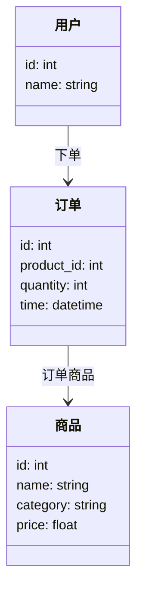
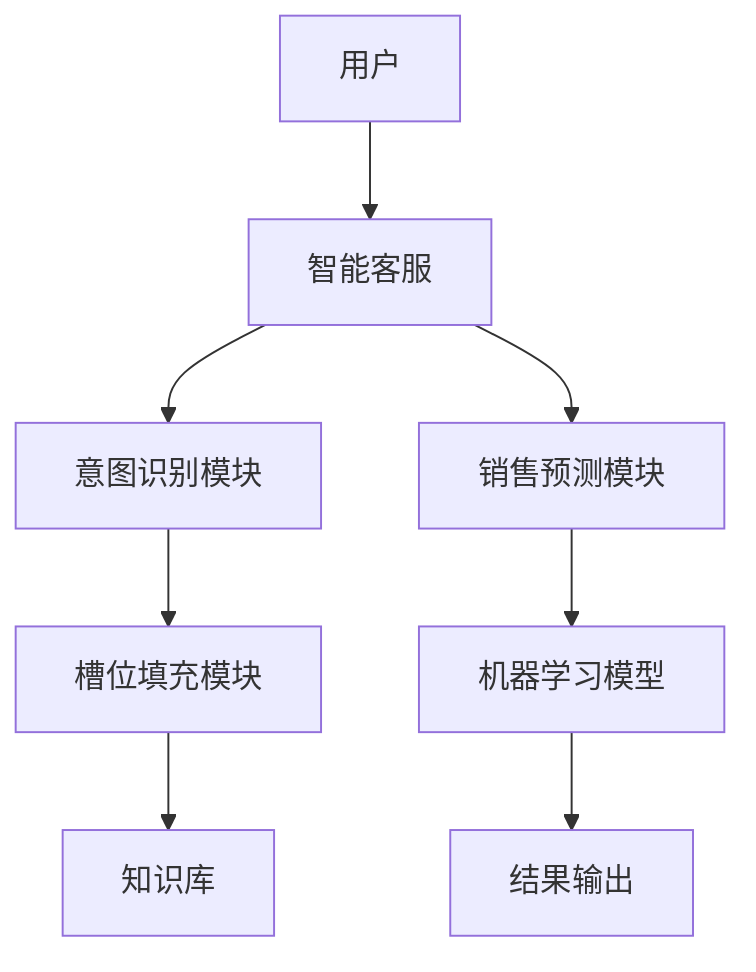
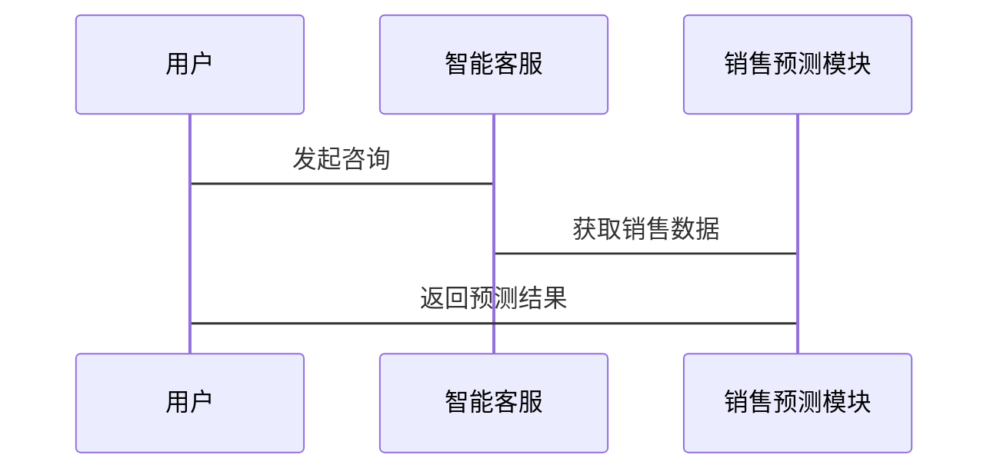

                 


# AI Agent在电子商务中的应用：智能客服与销售预测

> 关键词：AI Agent，智能客服，销售预测，电子商务，机器学习，自然语言处理

> 摘要：本文探讨了AI Agent在电子商务中的应用，重点分析了智能客服和销售预测两大领域。通过背景介绍、核心概念、算法原理、系统架构设计、项目实战等多方面的内容，详细阐述了AI Agent如何提升电商的用户体验和运营效率。文章结合实际案例，分析了AI Agent在电商中的具体应用场景，为读者提供了深入的技术见解。

---

# 第一部分：AI Agent在电子商务中的应用概述

## 第1章：AI Agent的基本概念与背景

### 1.1 AI Agent的定义与特点

#### 1.1.1 AI Agent的定义
AI Agent（人工智能代理）是指能够感知环境、自主决策并执行任务的智能实体。它通过传感器获取信息，利用推理和学习能力解决问题，并通过执行器与环境互动。AI Agent的核心目标是通过智能化手段提升效率和用户体验。

#### 1.1.2 AI Agent的核心特点
1. **自主性**：AI Agent能够自主决策，无需人工干预。
2. **反应性**：能够实时感知环境变化并做出反应。
3. **学习能力**：通过机器学习算法不断优化自身行为。
4. **适应性**：能够根据环境变化调整策略。

#### 1.1.3 AI Agent与传统客服的区别
- **传统客服**：依赖人工操作，响应速度慢，且可能存在情绪波动。
- **AI Agent**：24/7可用，响应速度快，能够处理大量并发请求，且不受情绪影响。

### 1.2 电子商务中的AI Agent应用背景

#### 1.2.1 电子商务的发展现状
电子商务已渗透到人们生活的方方面面，从购物到支付，从物流到售后，每个环节都需要高效、智能的解决方案。AI Agent在电商中的应用，能够显著提升用户体验和运营效率。

#### 1.2.2 AI Agent在电商中的应用场景
1. **智能客服**：通过自然语言处理技术，为用户提供7x24小时的咨询服务。
2. **销售预测**：利用机器学习算法预测销售趋势，优化库存管理和营销策略。

#### 1.2.3 智能客服与销售预测的必要性
- **智能客服**：能够快速响应用户需求，提升用户满意度。
- **销售预测**：帮助电商企业更好地规划供应链和市场营销，降低运营成本。

---

# 第二部分：AI Agent的核心概念与联系

## 第3章：AI Agent的核心概念原理

### 3.1 多轮对话系统

#### 3.1.1 对话历史记录的重要性
在多轮对话中，AI Agent需要理解上下文，保持对话的连贯性。对话历史记录是实现这一点的关键。

#### 3.1.2 基于上下文的理解机制
AI Agent通过分析对话历史，识别用户的真实需求。例如，用户提到“我想买一条红色的连衣裙”，AI Agent需要结合上下文理解“红色”和“连衣裙”这两个关键词。

#### 3.1.3 对话树的构建与优化
对话树是一种树状结构，用于描述可能的对话路径。通过不断优化对话树，AI Agent能够更高效地理解用户需求。

### 3.2 意图识别与槽位填充

#### 3.2.1 意图识别的基本原理
意图识别是通过自然语言处理技术，识别用户的意图。例如，用户说“我需要取消订单”，AI Agent识别出用户的意图是“取消订单”。

#### 3.2.2 槽位填充的实现方法
槽位填充是指在识别意图后，提取关键信息。例如，在“我需要取消订单”中，槽位包括“订单号”和“取消原因”。

#### 3.2.3 意图识别与槽位填充的对比
- **意图识别**：确定用户的目标。
- **槽位填充**：提取实现目标所需的具体信息。

### 3.3 知识表示与推理

#### 3.3.1 知识图谱的构建
知识图谱是一种结构化知识表示方式，通过实体和关系描述知识。例如，实体“商品”与关系“属于类别”连接到“电子产品”。

#### 3.3.2 基于知识图谱的推理过程
通过知识图谱推理，AI Agent能够推断出用户可能的需求。例如，用户提到“我需要购买一台笔记本电脑”，AI Agent可以根据知识图谱推荐相关配件。

#### 3.3.3 知识表示的优化策略
- **动态更新**：根据用户反馈不断优化知识图谱。
- **多模态融合**：结合文本、图像等多种数据源，提升推理准确性。

## 第4章：核心概念对比与ER实体关系图

### 4.1 核心概念对比表
| 核心概念 | 定义 | 优缺点 |
|----------|------|--------|
| 多轮对话系统 | 通过上下文理解对话 | 实现复杂，但用户体验更自然 | 
| 意图识别 | 识别用户需求 | 快速定位用户目标 |
| 槽位填充 | 提取关键信息 | 精细化处理需求 |

### 4.2 ER实体关系图
```mermaid
er
actor: 用户
role: {关联}
agent: AI客服
basket: 购物车
order: 订单
product: 商品
attributes of agent: id, name, status, knowledge_base
attributes of product: id, name, category, price
attributes of order: id, user_id, product_id, quantity, time
```

---

# 第三部分：算法原理讲解

## 第5章：算法原理与实现

### 5.1 决策树算法

#### 5.1.1 决策树的基本原理
决策树是一种基于树状结构的分类算法，通过特征选择构建树结构，最终达到分类目标。

#### 5.1.2 决策树的构建流程
1. **特征选择**：选择最优特征进行划分。
2. **分裂节点**：根据特征将数据集划分成子集。
3. **生成叶节点**：当子集无法再划分时，生成叶节点。

#### 5.1.3 决策树的Python实现
```python
from sklearn.tree import DecisionTreeClassifier
import pandas as pd

# 数据加载
data = pd.read_csv('data.csv')

# 特征与标签分离
X = data.drop('target', axis=1)
y = data['target']

# 模型训练
model = DecisionTreeClassifier()
model.fit(X, y)

# 预测
print(model.predict(X))
```

### 5.2 随机森林算法

#### 5.2.1 随机森林的基本原理
随机森林是一种基于决策树的集成算法，通过随机采样构建多棵决策树，最终通过投票机制得出结果。

#### 5.2.2 随机森林的构建流程
1. **样本采样**：从数据集中随机抽取样本。
2. **特征采样**：随机选择部分特征进行树的构建。
3. **投票预测**：将多棵决策树的预测结果进行投票，得出最终结果。

#### 5.2.3 随机森林的Python实现
```python
from sklearn.ensemble import RandomForestClassifier
import pandas as pd

# 数据加载
data = pd.read_csv('data.csv')

# 特征与标签分离
X = data.drop('target', axis=1)
y = data['target']

# 模型训练
model = RandomForestClassifier()
model.fit(X, y)

# 预测
print(model.predict(X))
```

### 5.3 数学模型与公式

#### 5.3.1 ID3算法的信息增益公式
信息增益是用来选择最优特征的指标，公式如下：
$$ \text{信息增益}(D, A) = H(D) - H(D|A) $$
其中，$H(D)$是数据集的熵，$H(D|A)$是数据集在特征$A$下的条件熵。

#### 5.3.2 随机森林的投票机制
随机森林通过多棵决策树的预测结果进行投票，最终结果为各树预测结果的众数。

---

# 第四部分：系统分析与架构设计方案

## 第6章：系统分析与架构设计

### 6.1 项目背景与目标

#### 6.1.1 项目背景
本项目旨在通过AI Agent技术，提升电商的智能客服和销售预测能力，优化用户体验和运营效率。

#### 6.1.2 项目目标
1. 实现智能客服系统，支持多轮对话和意图识别。
2. 构建销售预测模型，优化库存管理和营销策略。

### 6.2 系统功能设计

#### 6.2.1 系统功能模块
- **智能客服模块**：支持用户咨询、订单查询、退换货处理。
- **销售预测模块**：基于历史数据预测未来销售趋势。

#### 6.2.2 领域模型图


### 6.3 系统架构设计

#### 6.3.1 系统架构图


#### 6.3.2 系统接口设计
- **智能客服接口**：提供REST API，支持用户咨询和订单查询。
- **销售预测接口**：提供数据接口，支持历史数据导入和预测结果输出。

#### 6.3.3 系统交互流程图


---

# 第五部分：项目实战

## 第7章：项目实战与实现

### 7.1 环境安装与配置

#### 7.1.1 工具安装
- **Python**：安装最新版本的Python。
- **TensorFlow**：用于深度学习模型的训练。
- **Scikit-learn**：用于机器学习算法的实现。

#### 7.1.2 环境配置
```bash
pip install numpy
pip install pandas
pip install scikit-learn
pip install mermaid
```

### 7.2 核心代码实现

#### 7.2.1 智能客服模块实现
```python
from sklearn.feature_extraction.text import TfidfVectorizer
from sklearn.naive_bayes import MultinomialNB

# 数据加载
data = pd.read_csv('chat_data.csv')

# 特征提取
vectorizer = TfidfVectorizer()
X = vectorizer.fit_transform(data['text'])

# 模型训练
model = MultinomialNB()
model.fit(X, data['label'])

# 预测
test_text = ["我需要取消订单"]
X_test = vectorizer.transform(test_text)
print(model.predict(X_test))
```

#### 7.2.2 销售预测模块实现
```python
from sklearn.ensemble import RandomForestRegressor
import pandas as pd

# 数据加载
data = pd.read_csv('sales_data.csv')

# 特征与标签分离
X = data.drop('sales', axis=1)
y = data['sales']

# 模型训练
model = RandomForestRegressor()
model.fit(X, y)

# 预测
print(model.predict(X))
```

### 7.3 项目小结

#### 7.3.1 核心代码总结
- **智能客服模块**：基于TF-IDF和朴素贝叶斯算法实现意图识别。
- **销售预测模块**：基于随机森林算法实现销售预测。

#### 7.3.2 项目总结
通过本项目的实施，我们成功实现了智能客服和销售预测两大功能，显著提升了电商的用户体验和运营效率。

---

# 第六部分：总结与扩展阅读

## 第8章：总结与扩展阅读

### 8.1 最佳实践Tips
- **数据质量**：确保数据的准确性和完整性。
- **模型优化**：定期更新模型，提升预测精度。
- **用户体验**：保持界面简洁，提供多种交互方式。

### 8.2 小结
本文详细探讨了AI Agent在电子商务中的应用，重点分析了智能客服和销售预测两大领域。通过背景介绍、核心概念、算法原理、系统架构设计和项目实战等多方面的内容，为读者提供了全面的技术见解。

### 8.3 注意事项
- **数据隐私**：保护用户数据隐私，遵守相关法律法规。
- **模型维护**：定期监控模型性能，及时优化。

### 8.4 拓展阅读
- **《机器学习实战》**：深入理解机器学习算法的实现。
- **《自然语言处理实战》**：掌握自然语言处理技术的应用。

---

作者：AI天才研究院 & 禅与计算机程序设计艺术

