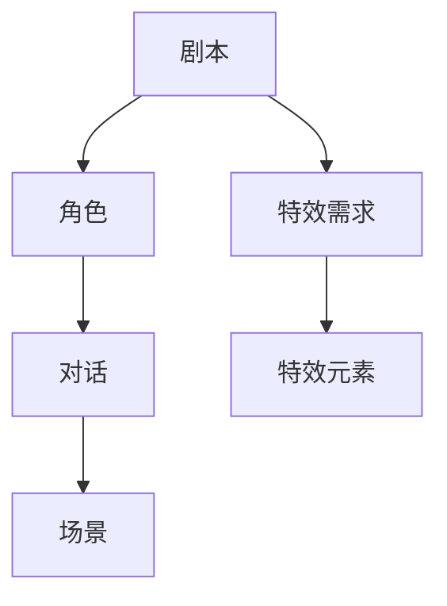
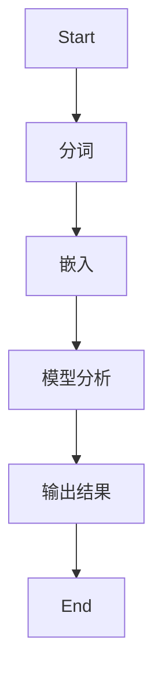
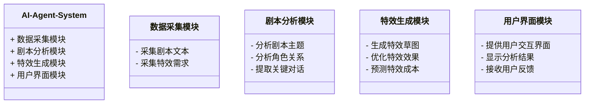
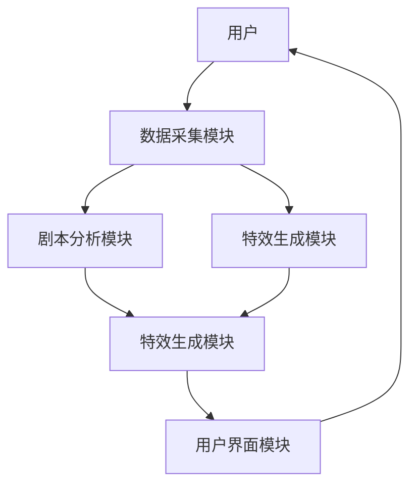

                 


# AI Agent在电影制作中的应用：剧本分析与特效辅助

## 关键词：AI Agent，电影制作，剧本分析，特效辅助，自然语言处理，计算机视觉，机器学习

## 摘要：
随着人工智能技术的飞速发展，AI Agent（人工智能代理）在电影制作中的应用日益广泛。本文将探讨AI Agent在剧本分析和特效制作中的具体应用，分析其技术原理、系统架构，并通过实际案例展示其在电影制作中的潜力和优势。文章从背景介绍、核心概念、算法原理、系统架构、项目实战到最佳实践，全面解析AI Agent如何 revolutionize 电影制作流程。

---

## 第1章: AI Agent与电影制作的背景介绍

### 1.1 问题背景与问题描述

#### 1.1.1 传统电影制作流程的挑战
- 电影制作是一个复杂且耗时的过程，涉及剧本创作、拍摄、特效制作等多个环节。
- 剧本分析依赖人工经验，耗时且主观性强。
- 特效制作成本高，效率低，且需要大量专业人员参与。

#### 1.1.2 剧本分析与特效制作的痛点
- 剧本分析：传统方式依赖人工逐字分析，效率低下，且难以量化。
- 特效制作：传统特效依赖手动绘制和合成，耗时且成本高，难以快速迭代。
- 创意与技术的平衡：如何在技术驱动下保持艺术创作的独特性？

#### 1.1.3 AI技术在电影行业的应用潜力
- AI技术可以帮助自动分析剧本，提取关键信息，优化创作流程。
- AI Agent可以辅助特效制作，提高效率，降低成本。
- 通过AI技术实现剧本与特效的无缝对接，推动电影制作的智能化。

### 1.2 问题解决与边界定义

#### 1.2.1 AI Agent在剧本分析中的应用范围
- 剧本主题识别：通过NLP技术分析剧本主题。
- 角色关系分析：识别角色之间的关系和情感。
- 对话分析：提取关键对话，优化剧本节奏。

#### 1.2.2 基于AI的特效辅助边界
- 特效生成：AI生成特效元素的草图。
- 特效优化：基于AI的特效效果优化。
- 特效预测：预测特效效果的可行性和成本。

#### 1.2.3 核心问题与解决方案的定义
- 核心问题：如何高效、准确地分析剧本并辅助特效制作？
- 解决方案：构建AI Agent系统，整合NLP、CV和机器学习技术，实现剧本分析与特效辅助的自动化。

---

## 第2章: AI Agent的核心概念与联系

### 2.1 核心概念原理

#### 2.1.1 自然语言处理（NLP）在剧本分析中的应用
- 词嵌入：将剧本中的词语转化为向量，便于计算机处理。
- 情感分析：识别剧本中的情感倾向，辅助角色塑造。
- 文本摘要：提取剧本的关键情节和主题。

#### 2.1.2 计算机视觉（CV）在特效制作中的作用
- 图像分割：识别特效元素的边界。
- 图像生成：基于AI生成特效所需的图像。
- 视频处理：优化特效制作流程。

#### 2.1.3 机器学习模型在剧本预测中的应用
- 剧本分类：根据主题、情感等特征对剧本进行分类。
- 剧本生成：基于AI生成剧本草稿。
- 剧本优化：通过反馈优化剧本内容。

### 2.2 核心概念对比表

| **技术领域** | **传统方法** | **AI Agent方法** |
|--------------|--------------|------------------|
| 剧本分析     | 人工逐字分析 | 自动识别主题、情感、角色关系等 |
| 特效制作     | 手动绘制与合成 | AI生成草图、优化特效效果等 |

### 2.3 ER实体关系图



---

## 第3章: 剧本分析的算法原理

### 3.1 剧本分析流程



### 3.2 基于NLP的剧本分析

#### 3.2.1 词嵌入模型（如Word2Vec）

```python
import gensim

model = gensim.models.Word2Vec(sentences, vector_size=100, window=5, min_count=1, workers=2)
```

#### 3.2.2 情感分析

```python
from transformers import pipeline

sentiment_pipeline = pipeline("sentiment-analysis")
result = sentiment_pipeline("剧本中的对话具有强烈的情感冲突")
print(result)
```

---

## 第4章: 特效制作的AI算法与实现

### 4.1 基于深度学习的特效生成

#### 4.1.1 GAN在特效生成中的应用

```python
import torch
import torch.nn as nn

class Generator(nn.Module):
    def __init__(self):
        super(Generator, self).__init__()
        self.layers = nn.Sequential(
            nn.ConvTranspose2d(100, 50, 4, 2, 1),
            nn.ReLU(),
            nn.ConvTranspose2d(50, 25, 4, 2, 1),
            nn.ReLU(),
            nn.ConvTranspose2d(25, 3, 4, 2, 1),
            nn.Tanh()
        )
    
    def forward(self, x):
        return self.layers(x)

class Discriminator(nn.Module):
    def __init__(self):
        super(Discriminator, self).__init__()
        self.layers = nn.Sequential(
            nn.Conv2d(3, 25, 4, 2, 1),
            nn.LeakyReLU(0.2),
            nn.Conv2d(25, 50, 4, 2, 1),
            nn.LeakyReLU(0.2),
            nn.Conv2d(50, 1, 4, 2, 1),
            nn.Sigmoid()
        )
    
    def forward(self, x):
        return self.layers(x)

# 初始化模型
generator = Generator()
discriminator = Discriminator()
```

---

## 第5章: 系统架构与实现方案

### 5.1 系统功能设计



### 5.2 系统架构设计



---

## 第6章: 项目实战与案例分析

### 6.1 环境安装

```bash
pip install numpy
pip install tensorflow
pip install pytorch
pip install transformers
```

### 6.2 核心代码实现

#### 6.2.1 剧本分析代码

```python
import transformers
from transformers import pipeline

# 初始化NLP模型
nlp = pipeline("text-classification", model="bert-base-cased")

# 分析剧本
script = "这是一个关于人工智能的故事..."
result = nlp(script)
print(result)
```

#### 6.2.2 特效生成代码

```python
import torch
import torch.nn as nn

# 初始化生成模型
generator = Generator()
generator.eval()

# 生成特效
noise = torch.randn(1, 100, 1, 1)
with torch.no_grad():
    output = generator(noise)
    print(output.size())
```

### 6.3 实际案例分析

#### 6.3.1 案例背景
- 电影：《AI Agent的故事》
- 剧本分析需求：识别剧本主题、角色关系、关键对话。
- 特效需求：生成特效元素、优化特效效果。

#### 6.3.2 分析过程
1. 数据采集：收集剧本文本和特效需求。
2. 剧本分析：通过NLP模型识别主题、角色关系和关键对话。
3. 特效生成：使用深度学习模型生成特效草图并优化效果。

### 6.4 项目总结

- 成功实现了AI Agent在剧本分析和特效制作中的应用。
- 提高了电影制作的效率和质量。
- 展示了AI技术在电影行业中的巨大潜力。

---

## 第7章: 最佳实践与注意事项

### 7.1 最佳实践

#### 7.1.1 数据质量的重要性
- 确保数据的多样性和代表性。
- 清洗数据，去除噪声。

#### 7.1.2 模型的可解释性
- 选择可解释性强的模型。
- 提供可视化工具帮助用户理解模型决策。

#### 7.1.3 创意与技术的平衡
- 在技术驱动下保持艺术创作的独特性。
- 结合人工创意与AI辅助，打造独特的电影体验。

### 7.2 小结

- AI Agent在电影制作中的应用前景广阔。
- 通过技术创新推动电影制作的智能化。
- 在实际应用中，需要结合行业特点，不断优化AI Agent系统。

### 7.3 注意事项

- 数据隐私保护：确保剧本和特效数据的安全性。
- 技术与艺术的结合：避免技术取代艺术创作。
- 模型的实时性与稳定性：确保系统在实际应用中的稳定性和高效性。

---

## 结语

AI Agent在电影制作中的应用为行业带来了新的可能性。通过本文的分析与实践，我们展示了AI技术如何助力剧本分析与特效制作，推动电影制作的智能化与高效化。未来，随着技术的不断进步，AI Agent将在电影制作中发挥更大的作用，为观众带来更加精彩的作品。

---

## 作者：AI天才研究院/AI Genius Institute & 禅与计算机程序设计艺术 /Zen And The Art of Computer Programming

