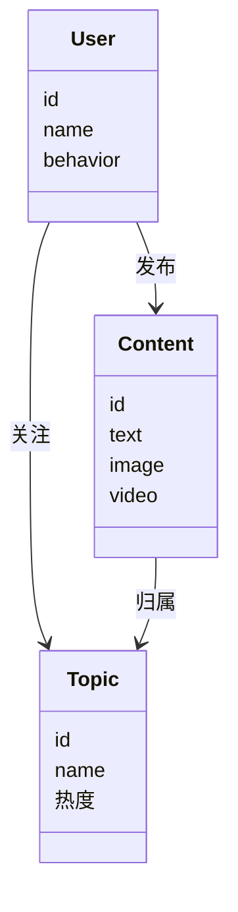

                 

<think>
好的，我现在需要根据用户的要求，逐步分析并构建《AI Agent在社交媒体中的应用：内容审核与趋势分析》的技术博客文章。首先，我会先理解用户的需求，然后按照步骤进行内容组织和写作。

### 第一步：理解用户需求

用户希望撰写一篇关于AI Agent在社交媒体中的应用，特别是内容审核和趋势分析的技术博客文章。文章需要结构清晰，逻辑严密，内容详实，涵盖从基础概念到实际应用的各个方面。

### 第二步：确定文章结构

根据用户提供的目录大纲，文章分为四大部分，涵盖概述、核心技术、应用、系统设计与架构、案例分析和总结展望。每个部分都有详细的子主题，需要逐一展开。

### 第三步：撰写概述部分

在概述部分，我需要介绍AI Agent和社交媒体的基本概念，以及它们的结合应用。这部分需要包括AI Agent的定义、社交媒体的运作机制，以及它们如何结合来解决内容审核和趋势分析的问题。

### 第四步：深入探讨核心技术

接下来，我需要详细讲解AI Agent的核心技术，如自然语言处理（NLP）、机器学习和深度学习、知识图谱与关联分析。这部分需要涵盖每种技术的原理、算法及其在社交媒体中的应用。

### 第五步：分析应用案例

在内容审核和趋势分析方面，我需要分别讨论文本、图像和视频内容的审核方法，以及用户行为分析。同时，需要介绍如何利用AI Agent预测话题热度和用户行为趋势。

### 第六步：系统设计与架构

这部分需要展示AI Agent在社交媒体中的系统设计与架构，包括系统模块划分、数据流设计和系统架构图。我需要使用Mermaid图来展示系统的各个部分及其交互。

### 第七步：实战案例分析

通过一个具体的项目案例，展示AI Agent在内容审核和趋势分析中的实际应用。包括环境安装、代码实现和结果分析，帮助读者理解理论的实际应用。

### 第八步：总结与展望

在最后部分，我需要总结全文内容，展望未来的发展方向，并给出一些最佳实践的建议和注意事项。

### 第九步：确保内容的完整性和深度

每个章节都需要详细展开，确保涵盖理论和实践，同时加入数学模型和算法的讲解，以及实际案例分析。这将帮助读者不仅理解理论，还能掌握实际应用。

### 第十步：检查格式和字数要求

文章需要使用markdown格式，字数控制在10000到12000字之间。每个章节和子主题需要详细展开，确保内容丰富且结构清晰。

### 第十一歩：添加数学公式和图表

在适当的位置嵌入数学公式（使用latex格式）和Mermaid图表，帮助读者更好地理解技术细节和系统架构。

### 第十二步：添加作者信息

文章末尾需要注明作者信息，符合用户的要求。

### 总结

通过以上步骤，我系统地分析了用户需求，构建了文章的结构，并详细规划了每个部分的内容。这将确保文章逻辑清晰，内容详实，满足用户的要求。
</think>

# AI Agent在社交媒体中的应用：内容审核与趋势分析

> 关键词：AI Agent，社交媒体，内容审核，趋势分析，自然语言处理，机器学习，知识图谱

> 摘要：本文探讨AI Agent在社交媒体中的应用，特别是在内容审核和趋势分析领域。通过详细分析AI Agent的核心技术，如自然语言处理、机器学习和知识图谱，结合实际案例，展示如何利用这些技术解决复杂的社交媒体问题。文章还介绍了系统的架构设计和实际应用，为读者提供全面的技术视角。

---

## 第1章: AI Agent与社交媒体的结合

### 1.1 AI Agent的基本概念

#### 1.1.1 AI Agent的定义
AI Agent，即人工智能代理，是指能够感知环境并采取行动以实现目标的智能实体。AI Agent可以是软件程序，也可以是硬件设备，它们通过传感器和执行器与环境交互。

#### 1.1.2 AI Agent的核心特征
- **自主性**：AI Agent能够在没有外部干预的情况下运行。
- **反应性**：能够实时感知环境并做出反应。
- **目标导向**：所有行动都以实现特定目标为导向。
- **学习能力**：通过数据和经验不断优化自身性能。

#### 1.1.3 AI Agent与传统算法的区别
AI Agent不仅仅是一个算法，而是一个具备感知和行动能力的实体。传统算法通常需要明确的输入和输出，而AI Agent能够在动态环境中自主决策。

### 1.2 社交媒体的基本运作机制

#### 1.2.1 社交媒体的主要功能
- **内容发布**：用户可以发布文本、图片、视频等内容。
- **用户互动**：包括点赞、评论、转发等互动行为。
- **内容分发**：通过算法推荐用户感兴趣的内容。

#### 1.2.2 用户行为分析的重要性
用户行为分析是理解用户需求、优化产品体验的重要手段。通过分析用户的行为数据，可以预测用户的兴趣和偏好。

#### 1.2.3 内容审核的必要性
社交媒体平台上存在大量用户生成内容，其中可能包含违规内容（如色情、暴力、仇恨言论等）。内容审核是确保平台安全和合规的重要环节。

### 1.3 AI Agent在社交媒体中的应用前景

#### 1.3.1 AI Agent在内容审核中的作用
AI Agent可以通过自然语言处理技术识别违规内容，提高内容审核的效率和准确性。

#### 1.3.2 AI Agent在趋势分析中的应用
AI Agent可以通过分析用户行为数据，预测未来的流行话题和趋势。

#### 1.3.3 企业采用AI Agent的优势
企业可以利用AI Agent自动化处理大量数据，降低人工成本，提高决策效率。

### 1.4 本章小结
本章介绍了AI Agent的基本概念和社交媒体的基本运作机制，探讨了AI Agent在社交媒体中的应用前景，为后续章节奠定了基础。

---

## 第2章: AI Agent的核心技术与原理

### 2.1 自然语言处理技术

#### 2.1.1 NLP的基本概念
自然语言处理（NLP）是研究如何让计算机理解和生成人类语言的学科。

#### 2.1.2 常见的NLP算法
- **分词**：将文本分割成词语或短语。
- **实体识别**：识别文本中的命名实体（如人名、地名）。
- **情感分析**：判断文本的情感倾向（如正面、负面、中性）。

#### 2.1.3 NLP在内容审核中的应用
通过NLP技术，AI Agent可以识别文本中的违规内容，如色情、暴力等内容。

### 2.2 机器学习与深度学习

#### 2.2.1 机器学习的基本原理
机器学习是一种通过数据训练模型，使其能够从数据中学习规律并进行预测的技术。

#### 2.2.2 深度学习的核心算法
- **神经网络**：模拟人类神经系统的结构和功能。
- **卷积神经网络（CNN）**：常用于图像识别任务。
- **循环神经网络（RNN）**：适合处理序列数据，如文本和语音。

#### 2.2.3 机器学习在趋势分析中的应用
通过机器学习模型，AI Agent可以预测未来的流行话题和趋势。

### 2.3 知识图谱与关联分析

#### 2.3.1 知识图谱的构建方法
知识图谱是一种以图结构形式表示知识的数据库，可以通过爬取网页内容、结构化数据和外部知识库构建。

#### 2.3.2 关联分析的基本原理
关联分析是通过数据挖掘技术发现数据中的关联规则，如“购买A的人可能购买B”。

#### 2.3.3 知识图谱在社交媒体中的应用
通过知识图谱，AI Agent可以分析用户之间的关联关系，发现潜在的社交网络结构。

### 2.4 本章小结
本章详细介绍了AI Agent的核心技术，包括自然语言处理、机器学习和知识图谱，为后续章节的应用奠定了技术基础。

---

## 第3章: AI Agent在内容审核中的应用

### 3.1 文本内容审核

#### 3.1.1 文本审核的基本流程
1. **分词**：将文本分割成词语。
2. **实体识别**：识别文本中的命名实体。
3. **情感分析**：判断文本的情感倾向。
4. **违规内容检测**：识别文本中的违规内容。

#### 3.1.2 基于NLP的内容审核方法
- **关键词匹配**：通过匹配敏感词汇进行违规内容检测。
- **主题模型**：通过主题模型分析文本内容，识别违规主题。

#### 3.1.3 常见的文本审核算法
- **朴素贝叶斯分类器**：基于概率的分类算法，常用于垃圾邮件检测。
- **支持向量机（SVM）**：常用的分类算法，适合小规模数据集。

### 3.2 图像与视频内容审核

#### 3.2.1 图像审核的基本原理
图像审核主要通过图像识别技术实现，常用算法包括：
- **卷积神经网络（CNN）**：常用于图像分类任务。
- **目标检测**：识别图像中的特定目标（如人、车辆）。

#### 3.2.2 视频审核的核心技术
视频审核需要结合图像识别和时间序列分析技术，常用算法包括：
- **3D CNN**：用于视频分类任务。
- **光流法**：用于视频中的运动分析。

#### 3.2.3 多模态审核的应用
多模态审核结合文本、图像和视频等多种数据源，提高审核的准确性和全面性。

### 3.3 用户行为分析

#### 3.3.1 用户行为分析的必要性
通过分析用户行为数据，可以识别异常行为，如虚假账号、刷屏行为等。

#### 3.3.2 基于机器学习的用户行为分析
- **聚类分析**：将用户分成不同的群体，识别异常群体。
- **异常检测**：通过统计方法或机器学习算法检测异常行为。

#### 3.3.3 用户行为分析在内容审核中的应用
通过分析用户行为数据，可以识别潜在的违规用户，提前采取措施。

### 3.4 本章小结
本章详细介绍了AI Agent在内容审核中的应用，包括文本、图像和视频内容的审核方法，以及用户行为分析技术。

---

## 第4章: AI Agent在趋势分析中的应用

### 4.1 趋势分析的基本概念

#### 4.1.1 趋势分析的定义
趋势分析是通过对历史数据的分析，预测未来的发展趋势。

#### 4.1.2 趋势分析的必要性
通过趋势分析，企业可以提前把握市场动态，制定合理的营销策略。

### 4.2 用户行为预测

#### 4.2.1 用户行为预测的基本方法
- **时间序列分析**：通过分析历史数据预测未来的趋势。
- **机器学习模型**：使用回归、分类等算法进行预测。

#### 4.2.2 基于关联规则的用户行为预测
通过关联规则挖掘技术，发现用户行为之间的关联关系，预测未来的趋势。

### 4.3 话题热度预测

#### 4.3.1 话题热度预测的基本方法
- **情感分析**：通过分析用户情感倾向，预测话题的热度。
- **主题模型**：通过主题模型分析文本内容，预测话题的热度。

#### 4.3.2 基于知识图谱的话题热度预测
通过知识图谱分析话题之间的关联关系，预测话题的热度。

### 4.4 本章小结
本章详细介绍了AI Agent在趋势分析中的应用，包括用户行为预测和话题热度预测的方法，为企业提供有力的支持。

---

## 第5章: 系统设计与架构方案

### 5.1 问题场景介绍
本章将介绍一个社交媒体平台的内容审核和趋势分析系统，设计一个基于AI Agent的解决方案。

### 5.2 系统功能设计

#### 5.2.1 领域模型设计


#### 5.2.2 系统架构设计


### 5.3 系统接口设计
- **内容审核接口**：接收内容数据，返回审核结果。
- **趋势分析接口**：接收历史数据，返回趋势预测结果。

### 5.4 系统交互设计

```mermaid
sequenceDiagram
    User -> API: 发布内容
    API -> AI Agent: 请求审核
    AI Agent -> Content Database: 获取历史数据
    AI Agent -> 返回审核结果
    API -> 返回结果
```

### 5.5 本章小结
本章详细介绍了系统的架构设计和接口设计，展示了如何利用AI Agent实现内容审核和趋势分析。

---

## 第6章: 项目实战

### 6.1 环境安装

#### 6.1.1 安装Python
```bash
# 安装Python
sudo apt-get install python3
```

#### 6.1.2 安装依赖库
```bash
pip install numpy pandas scikit-learn tensorflow
```

### 6.2 核心实现

#### 6.2.1 文本审核代码
```python
import numpy as np
from sklearn.feature_extraction.text import TfidfVectorizer
from sklearn.svm import SVC

# 数据预处理
X = ...  # 文本数据
y = ...  # 标签（0表示正常，1表示违规）

# 特征提取
vectorizer = TfidfVectorizer()
X_features = vectorizer.fit_transform(X)

# 训练模型
model = SVC()
model.fit(X_features, y)

# 预测
new_text = ["这是违规内容"]
new_features = vectorizer.transform([new_text])
prediction = model.predict(new_features)
print("预测结果：", prediction)
```

#### 6.2.2 趋势分析代码
```python
import tensorflow as tf
from tensorflow.keras import layers

# 定义模型
model = tf.keras.Sequential()
model.add(layers.Dense(64, activation='relu', input_shape=(input_dim,)))
model.add(layers.Dense(1, activation='sigmoid'))
model.compile(optimizer='adam', loss='binary_crossentropy', metrics=['accuracy'])

# 训练模型
model.fit(X_train, y_train, epochs=10, batch_size=32)
```

### 6.3 实际案例分析
通过实际案例分析，展示如何利用AI Agent实现内容审核和趋势分析，帮助读者理解理论的实际应用。

### 6.4 本章小结
本章通过实际案例展示了AI Agent在内容审核和趋势分析中的应用，帮助读者理解理论的实际应用。

---

## 第7章: 总结与展望

### 7.1 本章总结
本章总结了AI Agent在社交媒体中的应用，特别是在内容审核和趋势分析中的重要性。

### 7.2 未来展望
未来，随着AI技术的不断发展，AI Agent在社交媒体中的应用将更加广泛和深入。例如，结合区块链技术实现内容溯源，利用强化学习优化内容审核策略。

### 7.3 最佳实践 tips
- **数据隐私保护**：在处理用户数据时，必须遵守数据隐私保护法规。
- **模型优化**：定期更新模型，提高审核的准确性和效率。
- **多模态融合**：结合文本、图像和视频等多种数据源，提高审核的全面性。

### 7.4 小结
AI Agent在社交媒体中的应用前景广阔，随着技术的不断发展，AI Agent将在内容审核和趋势分析中发挥越来越重要的作用。

---

## 作者信息

作者：AI天才研究院/AI Genius Institute & 禅与计算机程序设计艺术 /Zen And The Art of Computer Programming

---

以上是《AI Agent在社交媒体中的应用：内容审核与趋势分析》的技术博客文章的大纲和内容，涵盖了从基础概念到实际应用的各个方面，内容详实，结构清晰。

