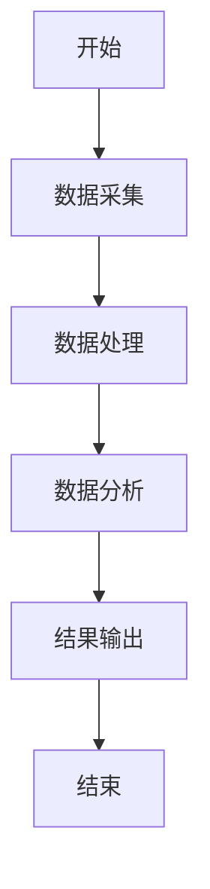
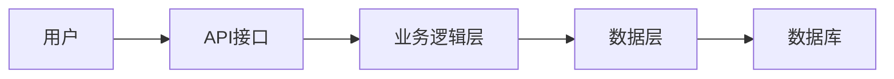

                 


# AI Agent在社交网络分析中的应用：舆情监测与影响力评估

## 关键词：AI Agent、社交网络分析、舆情监测、影响力评估、自然语言处理、图计算、深度学习

## 摘要：  
本文深入探讨了AI Agent在社交网络分析中的应用，重点介绍了舆情监测与影响力评估的核心技术与实现方法。文章从AI Agent的基本概念出发，结合自然语言处理与图计算等技术，详细分析了舆情监测与影响力评估的算法原理、系统架构及项目实战。通过实际案例分析，展示了AI Agent在社交网络分析中的强大能力与广泛的应用前景。

---

## 第1章: AI Agent与社交网络分析概述

### 1.1 AI Agent的基本概念

#### 1.1.1 AI Agent的定义与特点  
AI Agent（人工智能代理）是指能够感知环境、自主决策并执行任务的智能体。其特点包括：  
1. **自主性**：无需外部干预，能够独立完成任务。  
2. **反应性**：能够实时感知环境变化并做出响应。  
3. **学习能力**：通过数据训练不断优化自身性能。  
4. **协作性**：能够与其他Agent或系统协同工作。  

#### 1.1.2 AI Agent的核心功能与应用场景  
AI Agent的核心功能包括：  
- 数据采集与处理：从社交网络中获取文本、图片、视频等数据。  
- 数据分析与理解：通过NLP技术对文本进行情感分析、实体识别等处理。  
- 决策与行动：基于分析结果生成舆情报告或采取相应行动（如发布内容）。  

应用场景包括：社交媒体监控、品牌声誉管理、舆情预警、用户影响力评估等。  

#### 1.1.3 社交网络分析的基本概念与方法  
社交网络分析是指对社交网络中个体或组织之间的关系进行建模、分析和挖掘的过程。常用方法包括：  
1. **社会网络分析（SNA）**：通过图论方法分析网络结构。  
2. **文本挖掘**：从文本数据中提取有用信息。  
3. **情感分析**：识别文本中的情感倾向。  

---

### 1.2 舆情监测与影响力评估的背景与意义

#### 1.2.1 舆情监测的定义与作用  
舆情监测是指通过收集、分析和评估公众对某一事件或品牌的态度和情感的过程。其作用包括：  
1. **实时预警**：快速发现负面舆情并采取应对措施。  
2. **品牌管理**：帮助企业维护品牌形象和声誉。  
3. **决策支持**：为营销策略提供数据支持。  

#### 1.2.2 影响力评估的核心目标与价值  
影响力评估是指对社交网络中用户或品牌的影响力进行量化的过程。其核心目标包括：  
1. **识别关键意见领袖（KOL）**：找到最具影响力的意见领袖。  
2. **评估传播效果**：衡量内容的传播范围和影响力。  
3. **优化传播策略**：基于评估结果优化内容发布策略。  

#### 1.2.3 AI Agent在舆情监测与影响力评估中的优势  
AI Agent的优势体现在以下几点：  
1. **高效性**：能够快速处理海量数据并生成实时报告。  
2. **准确性**：通过深度学习模型提高分析结果的准确性。  
3. **自主性**：能够在无人干预的情况下持续运行并适应环境变化。  

---

### 1.3 本书的核心内容与结构

#### 1.3.1 本书的研究框架  
本书将从AI Agent的基本概念出发，结合自然语言处理和图计算技术，详细讲解舆情监测与影响力评估的实现方法。  

#### 1.3.2 各章节内容概览  
- **第2章**：介绍自然语言处理与文本挖掘技术。  
- **第3章**：讲解图计算与社交网络分析的核心算法。  
- **第4章**：详细分析AI Agent的构建与训练方法。  
- **第5章**：探讨系统架构设计与实现。  
- **第6章**：通过实战案例展示AI Agent的应用。  

#### 1.3.3 学习本书的必要性与方法  
学习本书可以帮助读者掌握AI Agent在社交网络分析中的核心技术，并将其应用于实际场景中。建议读者结合理论知识与实践案例，逐步掌握相关技术。

---

## 第2章: 自然语言处理与文本挖掘技术

### 2.1 自然语言处理（NLP）基础

#### 2.1.1 NLP的核心任务与技术  
NLP的核心任务包括：  
1. **文本分割**：将文本分割为单词或句子。  
2. **词干提取**：去除单词的派生形式，保留词干。  
3. **实体识别**：识别文本中的实体（如人名、地名等）。  

常用技术包括：  
- 词袋模型（Bag-of-Words，BoW）  
- 词嵌入（Word Embedding，如Word2Vec、GloVe）  
- 情感分析（Sentiment Analysis）  

#### 2.1.2 常见的NLP模型与工具  
- **传统模型**：BoW、TF-IDF等。  
- **深度学习模型**：RNN、LSTM、Transformer（如BERT、GPT）。  
- **工具**：NLTK、spaCy、HanLP等。  

#### 2.1.3 NLP在舆情监测中的应用  
通过NLP技术，可以实现以下功能：  
1. **情感分析**：判断文本的情感倾向（正面、负面、中性）。  
2. **主题提取**：提取文本中的主要主题。  
3. **关键词提取**：识别文本中的关键词。  

---

### 2.2 文本挖掘与情感分析

#### 2.2.1 文本挖掘的基本方法  
文本挖掘的基本方法包括：  
1. **分词**：将文本分割为词语或短语。  
2. **去停用词**：去除常见词汇（如“的”、“了”等）。  
3. **特征提取**：提取文本的特征向量。  

#### 2.2.2 情感分析的算法与实现  
常用情感分析算法包括：  
- **基于规则的方法**：通过预设规则判断情感倾向。  
- **基于机器学习的方法**：使用SVM、随机森林等模型进行分类。  
- **基于深度学习的方法**：使用LSTM、Transformer等模型进行情感分类。  

#### 2.2.3 基于深度学习的情感分析模型  
以BERT模型为例，其情感分析流程如下：  
1. **输入文本**：将文本输入BERT模型。  
2. **模型处理**：模型对文本进行编码，生成词向量。  
3. **分类预测**：基于词向量，预测文本的情感倾向。  

数学公式：  
$$ P(y=positive|x) = \text{BERT}(x) $$  

---

## 第3章: 图计算与社交网络分析

### 3.1 图计算的基本概念与技术

#### 3.1.1 图的表示与存储  
图的表示方式包括：  
- **邻接矩阵**：适用于小规模图。  
- **邻接表**：适用于大规模图。  

#### 3.1.2 图的遍历算法  
常用图遍历算法包括：  
- **深度优先搜索（DFS）**：沿着一条路径尽可能深入。  
- **广度优先搜索（BFS）**：逐层扩展节点。  

#### 3.1.3 社交网络的特征提取  
社交网络的特征包括：  
- **度数**：节点的连接数。  
- **介数中心性**：节点在图中作为桥梁的重要性。  
- **接近中心性**：节点到其他节点的平均距离。  

---

### 3.2 社交网络分析的核心算法

#### 3.2.1 社会网络分析（SNA）的指标与方法  
SNA的指标包括：  
1. **密度**：网络中边的密集程度。  
2. **聚类系数**：网络中三角形的密度。  

#### 3.2.2 基于图的社区发现算法  
常用社区发现算法包括：  
- **Louvain算法**：基于模块度优化的社区发现。  
- **Girvan-Newman算法**：基于介数中心性的社区发现。  

#### 3.2.3 基于图的影响力评估方法  
影响力评估的方法包括：  
1. **PageRank算法**：用于评估节点的重要性。  
2. **HITS算法**：用于评估节点的权威性和Hub性。  

---

## 第4章: AI Agent的构建与训练

### 4.1 AI Agent的核心组件与架构

#### 4.1.1 感知模块（文本理解）  
感知模块负责对社交网络中的文本进行理解和分析，包括：  
- **分词**：将文本分割为词语。  
- **情感分析**：判断文本的情感倾向。  

#### 4.1.2 决策模块（情感分析与影响力评估）  
决策模块基于感知模块的分析结果，生成舆情报告或采取相应行动。  

#### 4.1.3 行动模块（数据输出与反馈）  
行动模块负责将分析结果输出或反馈到社交网络中。  

---

### 4.2 基于深度学习的AI Agent训练

#### 4.2.1 神经网络模型的选择与优化  
常用深度学习模型包括：  
- **卷积神经网络（CNN）**：适用于文本分类任务。  
- **循环神经网络（RNN）**：适用于序列数据处理任务。  
- **Transformer模型**：适用于长文本处理任务。  

#### 4.2.2 基于Transformer的文本处理模型  
以BERT模型为例，其训练流程如下：  
1. **预训练**：在大规模数据上进行无监督预训练。  
2. **微调**：在特定任务上进行有监督微调。  

数学公式：  
$$ \text{BERT}(x) = \text{Transformer}(\text{Input}(x)) $$  

---

## 第5章: 系统架构与项目实战

### 5.1 系统功能设计

#### 5.1.1 系统模块划分  
系统模块包括：  
1. **数据采集模块**：从社交网络中采集数据。  
2. **数据处理模块**：对数据进行清洗和预处理。  
3. **数据分析模块**：对数据进行分析和挖掘。  
4. **结果输出模块**：生成舆情报告或采取相应行动。  

#### 5.1.2 系统功能流程图  


---

### 5.2 系统架构设计

#### 5.2.1 系统架构设计  
系统架构采用分层设计：  
- **数据层**：存储原始数据和处理后的数据。  
- **业务逻辑层**：实现数据采集、处理和分析功能。  
- **用户接口层**：提供用户交互界面。  

#### 5.2.2 系统架构图  


---

### 5.3 项目实战

#### 5.3.1 环境安装  
- **Python 3.8+**  
- **TensorFlow/PyTorch**  
- **NLTK/spaCy**  

#### 5.3.2 核心实现代码  
```python
import tensorflow as tf
from tensorflow.keras import layers

# 定义模型
model = tf.keras.Sequential([
    layers.Embedding(input_dim=10000, output_dim=16),
    layers.LSTM(64),
    layers.Dense(2, activation='sigmoid')
])

# 编译模型
model.compile(optimizer='adam', loss='binary_crossentropy', metrics=['accuracy'])
```

---

### 5.4 实际案例分析

#### 5.4.1 案例背景  
假设我们希望分析某品牌在社交媒体上的舆情。  

#### 5.4.2 数据处理与分析  
1. **数据采集**：从Twitter、微博等平台采集相关文本数据。  
2. **数据清洗**：去除无关信息和噪声数据。  
3. **情感分析**：对文本进行情感分类（正面、负面、中性）。  
4. **影响力评估**：识别关键意见领袖并评估其影响力。  

---

## 第6章: 总结与展望

### 6.1 本章总结  
本文详细介绍了AI Agent在社交网络分析中的应用，重点讲解了舆情监测与影响力评估的核心技术与实现方法。通过实际案例分析，展示了AI Agent在社交网络分析中的强大能力与广泛的应用前景。

### 6.2 未来展望  
未来，随着AI技术的不断发展，AI Agent在社交网络分析中的应用将更加广泛和深入。研究方向包括：  
1. **多模态数据处理**：结合文本、图像、视频等多种数据源进行分析。  
2. **实时性优化**：提升AI Agent的实时响应能力。  
3. **个性化推荐**：基于用户行为和偏好提供个性化的内容推荐。  

---

## 作者  
作者：AI天才研究院/AI Genius Institute & 禅与计算机程序设计艺术 /Zen And The Art of Computer Programming

