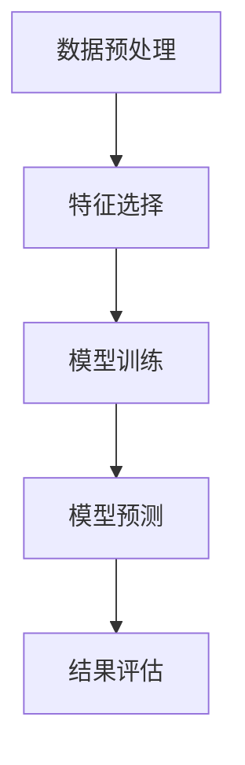
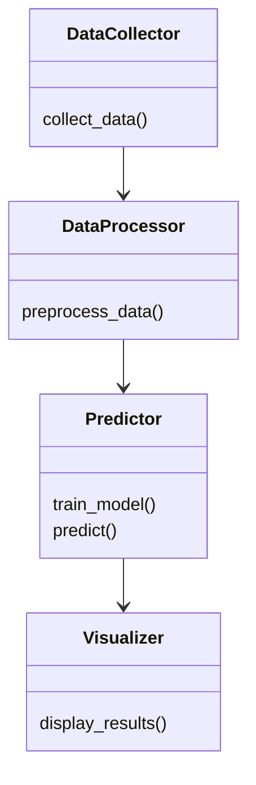
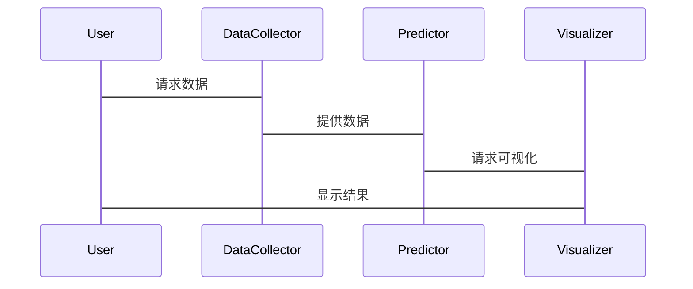

                 


# AI Agent在空气质量预测中的应用

## 关键词：空气质量预测、AI Agent、机器学习、环境监测、数据科学、污染控制

## 摘要：  
本文探讨了AI Agent在空气质量预测中的应用，从背景、概念、算法到系统设计和项目实战，全面分析了空气质量预测的挑战和解决方案。通过详细讲解AI Agent的行为机制、算法实现和系统架构，展示了如何利用AI技术提升空气质量预测的准确性和实时性。本文适合数据科学家、环境研究人员和AI技术爱好者阅读。

---

## 第一部分：空气质量预测的背景与挑战

### 第1章：空气质量预测的背景与问题描述

#### 1.1 空气质量预测的重要性  
空气质量直接影响人类健康和环境生态。通过预测空气质量，可以提前采取措施减少污染源排放，降低健康风险，优化城市规划。  

#### 1.2 空气质量预测的核心问题  
- **污染物来源**：工业排放、交通尾气、自然因素（如沙尘暴）等。  
- **扩散模型**：空气质量受气象条件（风速、温度、湿度）和地理因素影响。  
- **数据多样性**：空气质量数据来自传感器、气象站、卫星等多种来源。  

#### 1.3 空气质量预测的现有方法  
- **基于统计的方法**：如时间序列分析（ARIMA），适用于简单预测但缺乏物理意义。  
- **基于物理模型的方法**：如数值模拟模型（如CAMx），计算复杂但精度高。  
- **基于机器学习的方法**：如随机森林、神经网络，适合处理非线性关系和大数据。  

---

## 第二部分：AI Agent的基本概念与核心原理

### 第2章：AI Agent的基本概念与核心原理

#### 2.1 AI Agent的定义与分类  
AI Agent是一种智能体，能够感知环境、自主决策并执行任务。常见分类包括：  
- **简单反射型Agent**：基于规则直接响应输入。  
- **基于模型的反射型Agent**：维护环境模型，根据模型推理决策。  
- **目标驱动型Agent**：根据目标选择最优动作。  

#### 2.2 AI Agent的行为机制  
- **感知环境**：通过传感器或数据源获取输入。  
- **制定决策**：基于感知信息进行推理和判断。  
- **执行动作**：输出决策结果并执行任务。  

#### 2.3 AI Agent与传统算法的区别  
| 属性       | 传统算法                   | AI Agent                   |  
|------------|----------------------------|-----------------------------|  
| 决策方式   | 固定规则                   | 自主推理和学习             |  
| 环境适应   | 静态                       | 动态                        |  
| 应用场景   | 简单问题                   | 复杂动态问题               |  

---

## 第三部分：空气质量预测中的AI Agent应用框架

### 第3章：空气质量预测中的AI Agent应用框架

#### 3.1 空气质量预测的核心要素  
- **污染物浓度**：PM2.5、PM10、SO2等。  
- **污染源分布**：工业、交通、居民活动等。  
- **天气条件**：温度、湿度、风速、风向。  

#### 3.2 AI Agent在空气质量预测中的角色  
- **数据收集与处理**：整合传感器数据和气象数据。  
- **模型训练与预测**：基于历史数据训练模型，预测未来空气质量。  
- **结果优化与反馈**：根据预测结果优化模型，并向用户反馈。  

#### 3.3 空气质量预测的AI Agent框架设计  
- **数据流分析**：从数据采集到预测输出的全流程。  
- **模型选择与优化**：选择适合的算法并进行调参。  
- **结果输出与可视化**：将预测结果以图表形式展示。  

---

## 第四部分：空气质量预测的AI Agent算法实现

### 第4章：空气质量预测的AI Agent算法实现

#### 4.1 数据预处理与特征选择  
- 数据清洗：处理缺失值和异常值。  
- 特征选择：提取关键特征，如污染物浓度、气象条件等。  

#### 4.2 基于机器学习的空气质量预测模型  
- **算法选择**：使用LSTM或随机森林进行时间序列预测。  
- **模型训练**：训练模型并评估性能。  

#### 4.3 算法流程图  


#### 4.4 核心代码示例  
```python
import pandas as pd
from sklearn.ensemble import RandomForestRegressor
from sklearn.metrics import mean_squared_error

# 数据加载
data = pd.read_csv('air_quality.csv')

# 特征选择
features = ['PM2.5', 'PM10', 'SO2', 'NO2', 'O3', 'CO']
target = 'AQI'

# 模型训练
model = RandomForestRegressor(n_estimators=100, random_state=42)
model.fit(data[features], data[target])

# 模型预测
predictions = model.predict(data[features])
print(f'均方误差：{mean_squared_error(data[target], predictions)}')
```

---

## 第五部分：空气质量预测系统的系统分析与架构设计

### 第5章：空气质量预测系统的系统分析与架构设计

#### 5.1 问题场景介绍  
空气质量监测系统需要实时采集和处理数据，预测未来空气质量，并向用户反馈结果。  

#### 5.2 系统功能设计  
- **数据采集模块**：从传感器和气象站获取数据。  
- **数据处理模块**：清洗和特征提取。  
- **模型预测模块**：基于机器学习模型进行预测。  
- **结果可视化模块**：以图表形式展示预测结果。  

#### 5.3 系统架构设计  


#### 5.4 系统交互设计  


---

## 第六部分：空气质量预测的项目实战

### 第6章：空气质量预测的项目实战

#### 6.1 环境安装  
安装Python、TensorFlow、Keras、Scikit-learn等工具。  

#### 6.2 系统核心实现源代码  
```python
import numpy as np
import pandas as pd
from sklearn.ensemble import RandomForestRegressor
from sklearn.model_selection import train_test_split
from sklearn.metrics import accuracy_score

# 数据加载
data = pd.read_csv('air_quality.csv')

# 数据预处理
data.dropna(inplace=True)

# 特征选择
X = data[['PM2.5', 'PM10', 'SO2', 'NO2', 'O3', 'CO']]
y = data['AQI']

# 数据分割
X_train, X_test, y_train, y_test = train_test_split(X, y, test_size=0.2, random_state=42)

# 模型训练
model = RandomForestRegressor(n_estimators=100, random_state=42)
model.fit(X_train, y_train)

# 模型预测
y_pred = model.predict(X_test)

# 模型评估
print(f'准确率：{accuracy_score(y_test, y_pred)}')
```

#### 6.3 案例分析与优化  
以北京市某区域为例，分析模型预测结果，并优化模型参数以提高准确率。  

#### 6.4 项目小结  
总结项目经验，讨论模型的优缺点，提出改进建议。

---

## 第七部分：总结与展望

### 第7章：总结与展望

#### 7.1 项目总结  
本文通过AI Agent实现了空气质量预测系统，验证了AI技术在环境监测中的应用潜力。  

#### 7.2 未来展望  
未来，可以进一步研究多源数据融合、实时预测和智能决策优化，提升空气质量预测的精度和实用性。  

---

## 作者：AI天才研究院/AI Genius Institute & 禅与计算机程序设计艺术 /Zen And The Art of Computer Programming

