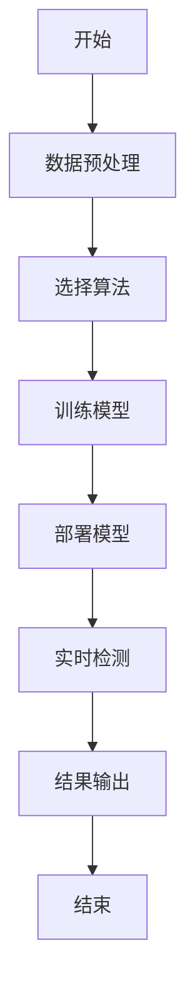
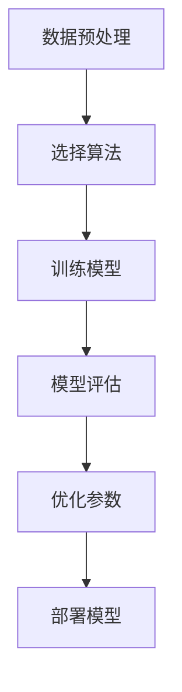
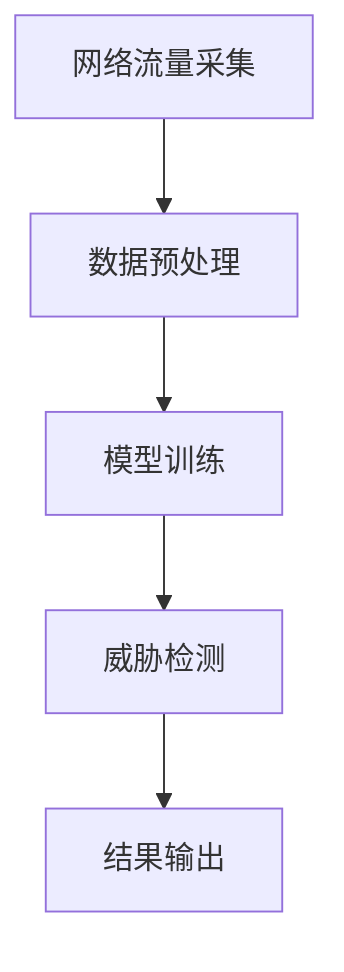
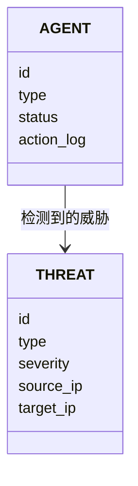
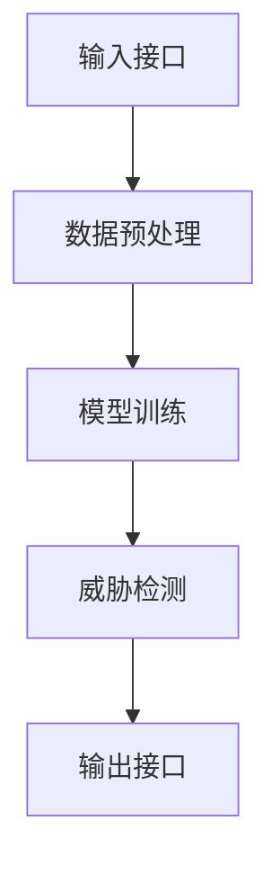

                 


# AI Agent在网络安全中的威胁检测

> 关键词：AI Agent, 网络安全, 威胁检测, 机器学习, 深度学习, 系统架构, 项目实战

> 摘要：随着网络安全威胁的日益复杂化和智能化，传统的基于规则的安全检测方法已难以应对新型威胁。AI Agent作为一种智能体，能够通过自我学习和适应，实时分析网络流量和行为模式，发现潜在的安全威胁。本文详细探讨了AI Agent在网络安全威胁检测中的核心概念、算法原理、系统架构设计以及实际项目实现，旨在为网络安全从业者提供理论与实践相结合的深度解析。

---

# 第一部分: AI Agent在网络安全中的威胁检测概述

## 第1章: AI Agent与网络安全概述

### 1.1 AI Agent的基本概念

#### 1.1.1 什么是AI Agent
AI Agent（人工智能代理）是一种能够感知环境、执行任务并采取行动的智能实体。在网络安全领域，AI Agent通常被设计为能够实时监控网络流量、分析日志数据，并根据异常行为触发警报或采取防御措施。

**AI Agent的核心特点：**
1. **自主性**：能够独立决策和行动。
2. **反应性**：能够实时响应环境变化。
3. **学习能力**：能够通过数据和经验不断优化自身的检测能力。
4. **可扩展性**：能够适应不同规模和复杂度的网络安全场景。

**AI Agent与传统安全工具的对比表：**

| 特性               | AI Agent                     | 传统安全工具                 |
|--------------------|----------------------------|-----------------------------|
| 数据处理能力       | 强大的模式识别和异常检测能力 | 基于规则的匹配能力           |
| 学习能力           | 能够通过机器学习不断优化     | 需要人工维护规则库           |
| 响应速度           | 实时响应                   | 可能存在延迟或误报           |
| 灵活性             | 能够适应新型威胁           | 需要定期更新规则库           |

---

### 1.2 网络安全威胁的现状

#### 1.2.1 当前网络安全的主要威胁
- 网络攻击日益复杂化，攻击者利用零日漏洞、钓鱼攻击等手段进行隐蔽攻击。
- 像Apt（高级持续性威胁）攻击具有长期潜伏性和高度针对性。
- IoT设备的普及带来了更多的潜在攻击面。

#### 1.2.2 威胁检测的挑战与难点
- 数据量大：网络流量日志海量，传统规则匹配效率低下。
- 假阳性高：基于规则的检测方法容易产生大量误报。
- 难以应对未知威胁：新型攻击手法往往难以被预先定义的规则覆盖。

#### 1.2.3 威胁检测的边界与外延
- **边界**：仅关注网络层和应用层的异常行为检测。
- **外延**：扩展到用户行为分析（UBA）、威胁情报整合等领域。

---

### 1.3 AI Agent在威胁检测中的应用价值

#### 1.3.1 提高威胁检测的效率
AI Agent能够实时分析网络流量，快速识别潜在威胁，减少人工干预。

#### 1.3.2 增强威胁检测的准确性
通过机器学习算法，AI Agent能够发现复杂的攻击模式，降低误报率和漏报率。

#### 1.3.3 降低安全运营的成本
AI Agent能够自动化处理大量数据，减少人工审查的工作量，降低运营成本。

---

### 1.4 本章小结
本章介绍了AI Agent的基本概念及其在网络安全中的应用价值，强调了AI Agent在应对复杂威胁方面的优势。通过对比传统安全工具，突出了AI Agent的自主性、学习能力和实时性等核心特点。

---

# 第二部分: AI Agent的核心概念与原理

## 第2章: AI Agent的核心概念与原理

### 2.1 AI Agent的定义与属性

#### 2.1.1 AI Agent的定义
AI Agent在网络安全中的定义是一个能够感知网络环境、分析数据并采取行动的智能实体。

#### 2.1.2 AI Agent的核心属性对比表
| 属性             | 描述                                   |
|------------------|--------------------------------------|
| 感知能力         | 能够采集和分析网络流量、日志数据       |
| 决策能力         | 基于历史数据和当前数据做出判断       |
| 行动能力         | 根据决策结果采取防御措施或触发警报     |
| 学习能力         | 能够通过机器学习优化自身的检测能力     |

#### 2.1.3 AI Agent的实体关系图（ER图）
```mermaid
erDiagram
    AGENT {
        id
        type
        status
        action_log
    }
    THREAT {
        id
        type
        severity
        source_ip
        target_ip
    }
    AGENT --|{-> THREAT : 检测到的威胁
```

---

### 2.2 AI Agent的算法原理

#### 2.2.1 常见的AI算法及其特点
- **监督学习**：适用于已知威胁的分类任务，如垃圾邮件检测。
- **无监督学习**：适用于未知威胁的发现，如异常流量检测。
- **强化学习**：适用于动态环境下的策略优化，如实时防御决策。

#### 2.2.2 AI Agent的算法选择与优化
- 根据具体任务选择合适的算法：异常检测选择无监督学习，分类任务选择监督学习。
- 优化算法性能：通过特征选择、模型调参等方式提高检测精度。

#### 2.2.3 AI Agent的算法流程图（Mermaid）


---

### 2.3 AI Agent的数学模型与公式

#### 2.3.1 基本数学模型
- **监督学习模型**：如逻辑回归、支持向量机（SVM）。
  $$ P(y|x) = \frac{e^{w \cdot x + b}}{1 + e^{w \cdot x + b}} $$
- **无监督学习模型**：如聚类算法（K-means）。
  $$ \text{目标函数} = \sum_{i=1}^{n} \sum_{j=1}^{k} w_{ij}^2 $$

#### 2.3.2 机器学习模型的数学公式
- **线性回归**：用于预测威胁严重性。
  $$ y = \beta_0 + \beta_1x_1 + \beta_2x_2 + \dots + \beta_nx_n $$
- **决策树**：用于分类任务。
  $$ \text{决策树模型} = \text{ID3/C4.5/C5.0算法构建} $$

#### 2.3.3 深度学习模型的数学公式
- **神经网络**：用于复杂模式识别。
  $$ a^{(l)} = \sigma(w^{(l)} a^{(l-1)} + b^{(l)}) $$
  其中，$\sigma$为激活函数，如ReLU或Sigmoid。

---

### 2.4 本章小结
本章详细讲解了AI Agent的核心概念和算法原理，通过对比不同算法的特点，明确了在实际应用中如何选择和优化算法。同时，通过数学公式和流程图的方式，帮助读者理解AI Agent的实现过程。

---

# 第三部分: AI Agent的算法原理与实现

## 第3章: AI Agent的算法原理与实现

### 3.1 常见的威胁检测算法

#### 3.1.1 监督学习算法
- **逻辑回归**：适用于二分类问题，如正常流量与异常流量的分类。
  ```python
  from sklearn.linear_model import LogisticRegression
  model = LogisticRegression()
  model.fit(X_train, y_train)
  ```

#### 3.1.2 无监督学习算法
- **Isolation Forest**：适用于异常检测，能够有效识别异常流量。
  ```python
  from sklearn.ensemble import IsolationForest
  model = IsolationForest(random_state=42)
  model.fit(X_train)
  ```

#### 3.1.3 强化学习算法
- **Q-Learning**：适用于动态环境下的决策优化。
  ```python
  class QLearning:
      def __init__(self, state_space, action_space):
          self.Q = defaultdict(lambda: defaultdict(lambda: 0))
  ```

### 3.2 算法实现的流程图（Mermaid）


### 3.3 算法实现的Python代码示例

#### 3.3.1 监督学习算法代码
```python
from sklearn.datasets import make_classification
from sklearn.linear_model import LogisticRegression
from sklearn.metrics import accuracy_score

# 生成数据
X, y = make_classification(n_samples=1000, n_features=20, n_classes=2)

# 训练模型
model = LogisticRegression()
model.fit(X, y)

# 预测与评估
y_pred = model.predict(X)
print("Accuracy:", accuracy_score(y, y_pred))
```

#### 3.3.2 无监督学习算法代码
```python
from sklearn.ensemble import IsolationForest
from sklearn.metrics import confusion_matrix

# 生成数据
X, y = make_classification(n_samples=1000, n_features=20, n_classes=2)

# 训练模型
model = IsolationForest(random_state=42)
model.fit(X)

# 预测与评估
y_pred = model.predict(X)
print("Confusion Matrix:\n", confusion_matrix(y, y_pred))
```

#### 3.3.3 强化学习算法代码
```python
from collections import defaultdict

class QLearning:
    def __init__(self, state_space, action_space):
        self.Q = defaultdict(lambda: defaultdict(lambda: 0))
        self.state_space = state_space
        self.action_space = action_space

    def choose_action(self, state):
        return max(self.Q[state].items(), key=lambda x: x[1])[0]

    def update_Q(self, state, action, reward, next_state):
        self.Q[state][action] += 0.1 * (reward + max(self.Q[next_state].values()) - self.Q[state][action])

# 示例使用
ql = QLearning(state_space=4, action_space=3)
action = ql.choose_action(0)
ql.update_Q(0, action, reward=1, next_state=1)
```

---

### 3.4 本章小结
本章通过具体的代码示例，详细讲解了AI Agent在威胁检测中的算法实现。通过对比不同算法的特点和应用场景，帮助读者理解如何在实际项目中选择和优化算法。

---

# 第四部分: AI Agent的系统架构与设计

## 第4章: AI Agent的系统架构与设计

### 4.1 系统架构设计

#### 4.1.1 系统架构图（Mermaid）


#### 4.1.2 系统模块划分
- **数据采集模块**：负责收集网络流量和日志数据。
- **数据预处理模块**：清洗数据，提取特征。
- **模型训练模块**：训练机器学习模型，优化算法参数。
- **威胁检测模块**：实时分析数据，识别威胁。
- **结果输出模块**：生成警报或报告。

#### 4.1.3 系统功能设计（领域模型Mermaid）


---

### 4.2 系统接口设计

#### 4.2.1 系统接口定义
- **输入接口**：接收网络流量数据和日志。
- **输出接口**：输出检测结果、警报信息和统计报告。

#### 4.2.2 接口交互流程图（Mermaid）


---

### 4.3 本章小结
本章详细讲解了AI Agent系统的架构设计和接口设计，通过Mermaid图展示了系统的模块划分和交互流程。这为后续的项目实现提供了理论基础。

---

# 第五部分: AI Agent的项目实战

## 第5章: AI Agent的项目实战

### 5.1 项目背景与目标

#### 5.1.1 项目背景
本项目旨在开发一个基于AI Agent的网络威胁检测系统，用于实时监控企业内部网络的流量，发现潜在的安全威胁。

#### 5.1.2 项目目标
- 实现实时网络流量监控。
- 检测异常流量和潜在攻击。
- 提供实时警报和统计报告。

---

### 5.2 系统实现

#### 5.2.1 环境搭建
- 操作系统：Linux
- 工具：Python 3.8+, scikit-learn, pandas, matplotlib

#### 5.2.2 核心实现代码
```python
import pandas as pd
from sklearn.ensemble import IsolationForest
from sklearn.metrics import classification_report

# 数据加载
data = pd.read_csv('network_traffic.csv')

# 数据预处理
X = data.drop('label', axis=1)
y = data['label']

# 训练模型
model = IsolationForest(random_state=42)
model.fit(X)

# 预测与评估
y_pred = model.predict(X)
print(classification_report(y, y_pred))
```

#### 5.2.3 系统功能实现
- 数据采集：使用SNMP协议采集网络设备数据。
- 数据预处理：清洗数据，提取关键特征。
- 模型训练：训练Isolation Forest模型。
- 威胁检测：实时分析流量，识别异常行为。
- 结果输出：生成警报和统计报告。

---

### 5.3 案例分析与详细解读

#### 5.3.1 案例场景
假设某企业内部网络遭受DDoS攻击，攻击者通过大量的异常流量尝试破坏网络服务。

#### 5.3.2 案例实现
```python
import pandas as pd
from sklearn.ensemble import IsolationForest

# 数据加载
data = pd.read_csv('network_traffic.csv')

# 训练模型
model = IsolationForest(random_state=42)
model.fit(data.drop('label', axis=1))

# 实时检测
new_traffic = pd.read_csv('live_traffic.csv')
y_pred = model.predict(new_traffic.drop('label', axis=1))

# 输出结果
print("Anomaly scores:", y_pred)
```

---

### 5.4 本章小结
本章通过一个实际的项目案例，详细讲解了AI Agent在网络安全威胁检测中的实现过程。从环境搭建到代码实现，再到案例分析，帮助读者掌握AI Agent的实际应用。

---

# 第六部分: 总结与展望

## 第6章: 总结与展望

### 6.1 本项目总结
- **核心成果**：开发了一个基于AI Agent的网络威胁检测系统。
- **主要挑战**：算法优化、数据隐私保护、系统稳定性等。
- **实践经验**：数据预处理、模型调优、实时性保障是关键。

### 6.2 未来展望
- **算法优化**：探索更高效的无监督学习算法，如图神经网络。
- **扩展应用**：将AI Agent应用于更复杂的场景，如APT检测、IoT安全等。
- **数据隐私保护**：研究数据加密和隐私保护技术，确保数据安全。

---

## 附录: 更多资源与学习资料

### 附录A: 推荐书籍
1. 《机器学习实战》
2. 《网络安全技术及应用》
3. 《深入理解深度学习》

### 附录B: 开源工具推荐
1. scikit-learn：机器学习库。
2. TensorFlow：深度学习框架。
3. Nmap：网络扫描工具。

---

## 作者：AI天才研究院 & 禅与计算机程序设计艺术

---

以上就是完整的《AI Agent在网络安全中的威胁检测》的技术博客文章结构与内容。希望这篇文章能够为网络安全从业者和AI技术爱好者提供有价值的参考与启发。

