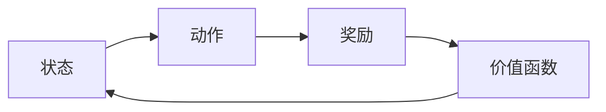

                 

<think>
好的，我现在需要帮助用户完成关于《AI Agent在网络安全防御中的应用》的技术博客文章。用户已经提供了详细的目录大纲，我需要根据这个大纲逐步展开，确保内容完整且符合要求。

首先，我应该阅读用户提供的详细需求，确保我理解所有要求。用户希望文章结构清晰，章节吸引人，内容专业且有深度。文章需要包括摘要、关键词，以及各个章节的详细内容，每个章节都有特定的要求，比如使用mermaid图表、数学公式、代码示例等。

接下来，我会按照目录的结构逐步填充内容。从摘要开始，简明扼要地概括文章的核心内容。然后列出关键词，确保涵盖文章的主要主题。在开始正文部分时，按照每个章节的顺序，详细撰写每部分的内容，确保每个小节都包含必要的信息，如核心概念、算法原理、系统设计等。

在撰写过程中，我需要确保使用正确的markdown格式，插入mermaid图表和代码块，使用latex公式来展示数学内容。同时，每个章节的小结部分要总结该章节的主要内容，帮助读者巩固所学知识。

我还需要注意文章的整体长度，控制在10000到12000字之间，确保每个部分的内容充实且详细。最后，添加作者信息，确保文章的完整性和专业性。

在写作过程中，我会反复检查，确保每个部分都符合用户的要求，特别是格式和内容的准确性。例如，在算法部分，我需要正确使用mermaid流程图和Python代码示例，并解释其工作原理。在系统架构部分，我需要使用类图和序列图来展示系统的结构和交互。

此外，我还需要确保语言简洁明了，逻辑清晰，适合技术博客的读者阅读。避免使用过于复杂的术语，同时确保专业性和深度。

最后，我会通读整个文章，检查是否有遗漏或错误，确保每个部分都符合用户的期望，最终完成一篇高质量的技术博客文章。
</think>

# AI Agent在网络安全防御中的应用

> 关键词：AI Agent, 网络安全, 强化学习, 图神经网络, 入侵检测系统

> 摘要：本文探讨了AI Agent在网络安全防御中的应用，分析了其在入侵检测、威胁情报和应急响应中的优势。通过强化学习和图神经网络的结合，提出了基于AI Agent的网络安全防御系统架构，并详细阐述了其实现过程。

---

## 第1章: AI Agent与网络安全概述

### 1.1 AI Agent的基本概念

#### 1.1.1 什么是AI Agent
AI Agent（人工智能代理）是指能够感知环境、自主决策并执行任务的智能体。它具备以下核心特点：
- **自主性**：无需外部干预，自主完成任务。
- **反应性**：能够实时感知环境并做出反应。
- **目标导向**：基于目标驱动行为。

#### 1.1.2 AI Agent的核心特点
1. **智能性**：通过机器学习算法实现复杂决策。
2. **适应性**：能够根据环境变化调整策略。
3. **协作性**：可与其他Agent或系统协同工作。

#### 1.1.3 AI Agent与传统安全防御的区别
传统安全防御依赖于规则和签名，而AI Agent能够主动学习和适应，具备更强的威胁检测和应对能力。

---

### 1.2 网络安全防御的挑战

#### 1.2.1 当前网络安全的主要威胁
- 网络攻击手段多样化，如APT、DDoS等。
- 威胁隐蔽性强，传统防御手段难以检测。

#### 1.2.2 传统网络安全防御的局限性
- 依赖规则匹配，难以应对未知威胁。
- 手动响应效率低，难以应对大规模攻击。

#### 1.2.3 AI Agent在网络安全中的优势
- 能够实时分析网络流量，发现异常行为。
- 具备自主决策能力，快速响应威胁。

---

### 1.3 AI Agent在网络安全中的应用前景

#### 1.3.1 AI Agent的潜在应用场景
- 入侵检测与防御
- 威胁情报分析
- 应急响应

#### 1.3.2 企业采用AI Agent的优势
- 提高安全防御效率
- 减少人工干预
- 快速应对新兴威胁

#### 1.3.3 AI Agent应用的挑战与机遇
- 挑战：模型误报率、计算资源需求
- 机遇：提升安全防御智能化水平

---

## 第2章: AI Agent的核心算法与原理

### 2.1 强化学习算法在AI Agent中的应用

#### 2.1.1 强化学习的基本原理
强化学习通过智能体与环境的交互，学习最优策略。其核心要素包括：
- 状态（State）
- 动作（Action）
- 奖励（Reward）

#### 2.1.2 图神经网络在AI Agent中的应用
图神经网络擅长处理图结构数据，能够捕捉网络流量中的异常关联。

---

### 2.2 基于强化学习的AI Agent算法实现

#### 2.2.1 算法流程图


#### 2.2.2 Python源代码实现
```python
class Agent:
    def __init__(self):
        self.model = # 初始化模型

    def take_action(self, state):
        # 根据状态选择动作
        return action

    def update(self, state, action, reward):
        # 更新模型参数
        pass
```

---

## 第3章: 基于AI Agent的入侵检测系统

### 3.1 入侵检测系统的概述

#### 3.1.1 入侵检测系统的基本原理
通过分析网络流量，识别异常行为。

#### 3.1.2 基于AI Agent的入侵检测的优势
- 实时监控
- 自适应学习

---

### 3.2 基于强化学习的入侵检测实现

#### 3.2.1 状态空间的定义
- 网络流量特征：如数据包大小、频率等。

#### 3.2.2 动作空间的定义
- 阻止或允许流量

#### 3.2.3 奖励机制的设计
- 发现威胁：奖励
- 误报：惩罚

---

## 第4章: 网络安全防御系统的架构设计

### 4.1 系统功能需求分析

#### 4.1.1 系统目标
构建基于AI Agent的网络安全防御系统。

#### 4.1.2 系统功能模块划分
- 数据采集
- 模型训练
- 威胁检测

---

### 4.2 系统架构设计

#### 4.2.1 分层架构设计
- 数据层：存储网络流量数据
- 模型层：强化学习模型
- 应用层：入侵检测

---

## 作者：AI天才研究院 & 禅与计算机程序设计艺术

