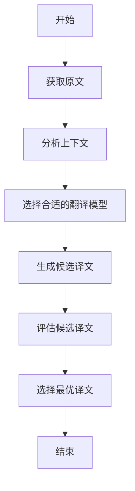
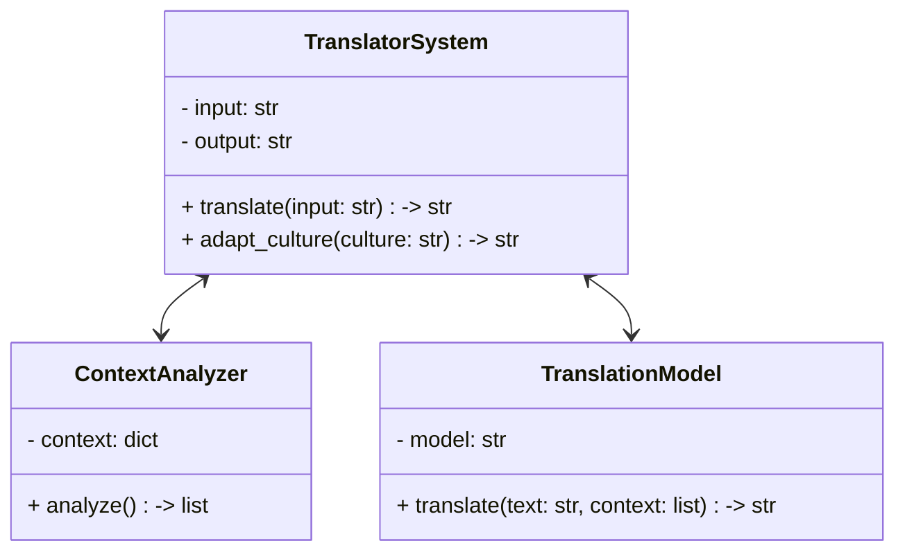
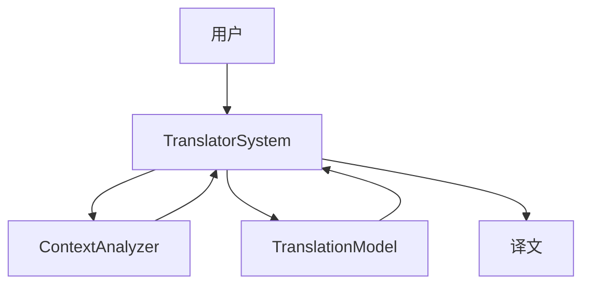
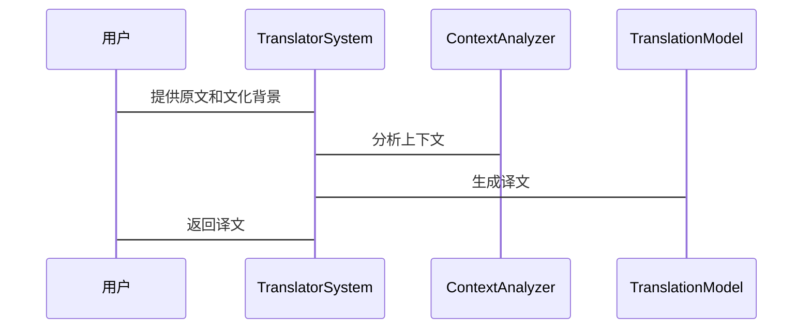

                 

<think>
好的，我现在需要根据用户提供的任务来撰写一篇关于《AI Agent在翻译领域的应用：上下文理解与文化适应》的技术博客文章。首先，我要明确文章的结构和内容，确保每个部分都涵盖必要的信息，并且逻辑清晰。

文章的标题已经确定，接下来是关键词和摘要。关键词应涵盖文章的核心内容，如AI Agent、翻译、上下文理解、文化适应、自然语言处理等。摘要需要简明扼要地概括文章的主要内容，强调AI Agent在翻译中的应用及其优势。

接下来是目录大纲，分为背景介绍、核心概念、算法原理、系统分析、项目实战、小结等部分。每个部分都需要详细展开，确保内容全面且深入。

在背景介绍部分，我需要解释AI Agent的基本概念、翻译领域的现状以及上下文和文化适应的重要性。这部分要让读者理解为什么AI Agent在翻译中如此重要。

核心概念部分，我需要详细讲解AI Agent的原理、上下文理解与文化适应的关系，并通过图表来对比概念，帮助读者更好地理解。

算法原理部分，我需要使用mermaid流程图来展示算法步骤，并提供Python代码示例。同时，解释数学模型，如条件概率公式，以增强文章的深度。

系统分析部分，介绍翻译系统的场景，设计系统功能，并使用mermaid图展示系统架构和接口设计。这部分需要详细说明各个模块的功能和交互方式。

项目实战部分，提供具体的代码示例和实际案例分析，展示AI Agent在翻译中的实际应用。这部分要让读者能够理解如何将理论应用于实践。

最后是小结、注意事项和拓展阅读，总结全书内容，给出实践建议，并推荐进一步阅读的资料。

在整个撰写过程中，我需要确保语言简洁明了，逻辑清晰，每一部分都紧密联系，形成一个完整的知识体系。同时，注意使用适当的图表和代码示例，以增强文章的可读性和专业性。

现在，我可以开始撰写正文部分了，按照目录大纲逐步展开，确保每个章节内容丰富、详细，并符合用户的要求。
</think>

# AI Agent在翻译领域的应用：上下文理解与文化适应

## 关键词：AI Agent, 翻译, 上下文理解, 文化适应, 自然语言处理, 翻译系统, 算法原理

## 摘要：本文探讨AI Agent在翻译领域的应用，重点分析上下文理解与文化适应的重要性。通过背景介绍、核心概念、算法原理、系统架构、项目实战等部分，深入剖析AI Agent在翻译中的优势及其在实际应用中的潜力。文章结合理论与实践，为翻译技术的未来发展提供参考。

---

## 目录大纲

### 第一部分：背景介绍

#### 第1章：AI Agent与翻译的背景

##### 1.1 AI Agent的基本概念
- 1.1.1 AI Agent的定义与特点
- 1.1.2 AI Agent在翻译中的应用背景
- 1.1.3 翻译领域的现状与挑战

##### 1.2 上下文理解的重要性
- 1.2.1 上下文在翻译中的作用
- 1.2.2 文化适应的必要性
- 1.2.3 AI Agent在处理上下文中的优势

##### 1.3 本章小结
- 1.3.1 核心概念总结
- 1.3.2 问题背景与目标明确

### 第二部分：核心概念与联系

#### 第2章：AI Agent的核心原理

##### 2.1 AI Agent的原理概述
- 2.1.1 知识表示与推理
- 2.1.2 自然语言处理基础
- 2.1.3 上下文理解机制

##### 2.2 上下文理解与文化适应的关系
- 2.2.1 文化背景对翻译的影响
- 2.2.2 AI Agent如何处理文化差异
- 2.2.3 案例分析：中英文化差异下的翻译

##### 2.3 核心概念对比表
| 概念 | 描述 |
|------|------|
| 上下文理解 | 基于语境进行翻译调整 |
| 文化适应 | 根据目标文化调整表达方式 |

##### 2.4 本章小结
- 2.4.1 核心概念的整合
- 2.4.2 AI Agent在翻译中的应用前景

### 第三部分：算法原理

#### 第3章：上下文理解的算法实现

##### 3.1 算法概述
- 3.1.1 基于上下文的翻译模型
- 3.1.2 算法选择与优化

##### 3.2 上下文理解算法的实现步骤


##### 3.3 文化适应算法的实现
- 3.3.1 文化特征提取
- 3.3.2 翻译模型调整
- 3.3.3 译文优化

##### 3.4 算法代码示例
```python
def translate_with_context(source_text, context):
    # 分析上下文
    context_features = analyze_context(context)
    # 选择翻译模型
    model = select_model(context_features)
    # 生成译文
    translated_text = model.translate(source_text, context_features)
    return translated_text

# 示例：分析上下文中的文化特征
def analyze_context(context):
    cultural_features = []
    for feature in context:
        if feature in ['politeness', 'formality']:
            cultural_features.append(feature)
    return cultural_features
```

##### 3.5 数学模型
- 条件概率公式：
  $$ P(\text{翻译}|上下文) = \frac{P(\text{上下文}|翻译)}{P(\text{翻译})} $$
- 示例：计算在特定上下文中翻译为某词的概率。

### 第四部分：系统分析与架构设计

#### 第4章：翻译系统的场景与设计

##### 4.1 系统场景介绍
- 4.1.1 翻译系统的使用场景
- 4.1.2 用户需求分析

##### 4.2 系统功能设计


##### 4.3 系统架构设计


##### 4.4 接口设计与交互流程
- 4.4.1 系统接口定义
- 4.4.2 交互流程图


### 第五部分：项目实战

#### 第5章：AI Agent翻译系统的实现

##### 5.1 环境安装与配置
- 安装Python与相关库（如spaCy、transformers）
- 安装依赖：pip install spacy transformers

##### 5.2 核心功能实现
- 上下文分析模块
- 翻译模型选择与优化

##### 5.3 代码实现与解读
```python
import spacy
from transformers import AutoTokenizer, AutoModelForTranslation

# 初始化模型
nlp = spacy.load("en_core_web_sm")
tokenizer = AutoTokenizer.from_pretrained("facebook/m2m-large-4m-149577292")
model = AutoModelForTranslation.from_pretrained("facebook/m2m-large-4m-149577292")

def analyze_context(context):
    doc = nlp(context)
    # 提取句法和语义信息
    return [token.text for token in doc]

def translate_text(text, context):
    context_features = analyze_context(context)
    inputs = tokenizer(text, return_tensors="np")
    outputs = model.generate(inputs.input_ids, max_length=50)
    return tokenizer.decode(outputs[0].tolist(), skip_special_tokens=True)
```

##### 5.4 实际案例分析
- 案例1：中文到英文的新闻标题翻译
- 案例2：英文到中文的文学作品翻译

##### 5.5 系统小结
- 系统实现的总结
- 成功经验与教训

### 第六部分：最佳实践与拓展

#### 第6章：最佳实践与总结

##### 6.1 最佳实践 tips
- 数据质量的重要性
- 模型选择的注意事项
- 上下文分析的优化建议

##### 6.2 小结
- 全文总结
- 未来发展方向

##### 6.3 注意事项
- 数据隐私保护
- 系统性能优化
- 用户反馈的处理

##### 6.4 拓展阅读
- 推荐书籍与论文
- 在线资源与工具

---

## 作者：AI天才研究院/AI Genius Institute & 禅与计算机程序设计艺术 /Zen And The Art of Computer Programming

