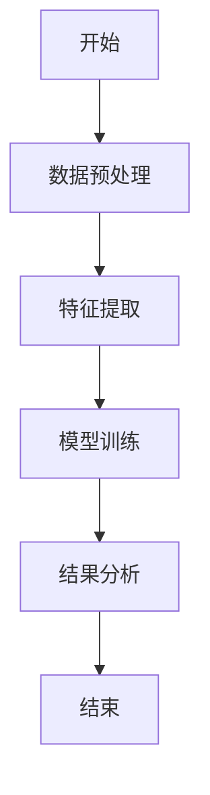
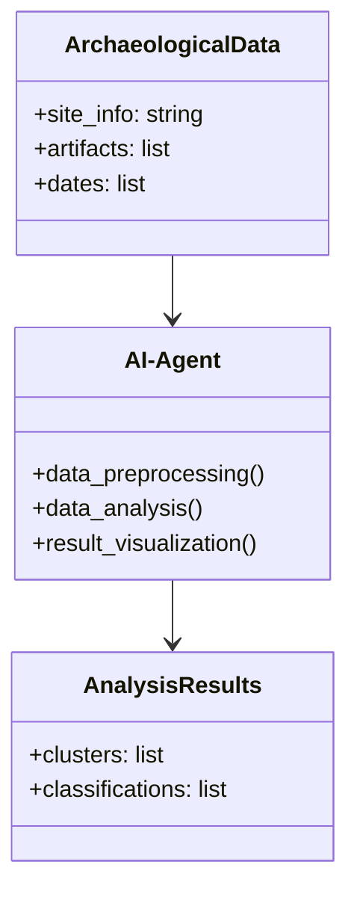
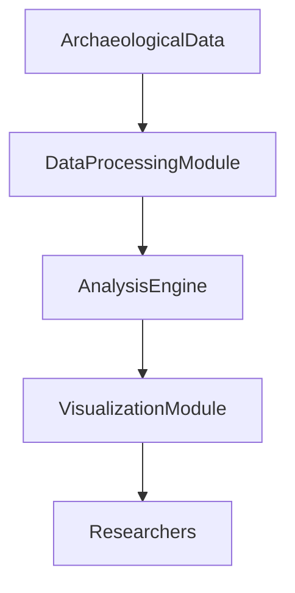
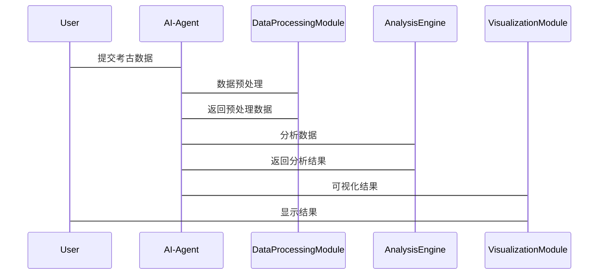

                 


# AI Agent在考古发掘中的数据分析

> 关键词：AI Agent, 考古数据分析, 数据挖掘, 人工智能, 考古学, 数据分析算法

> 摘要：本文探讨了AI Agent在考古发掘中的数据分析应用，涵盖背景、核心概念、算法原理、系统架构、项目实战及总结。通过详细分析，展示了AI Agent如何提升考古数据处理的效率和准确性，为考古学研究提供新思路。

---

## 第1章 背景介绍

### 1.1 问题背景

#### 1.1.1 考古发掘中的数据分析需求
考古学依赖于对大量数据的分析，包括遗址布局、文物年代、材料分析等。传统方法耗时且效率低下，AI Agent的引入为数据处理提供了新途径。

#### 1.1.2 传统考古数据分析的局限性
传统方法依赖人工分析，存在主观性强、效率低、难以处理复杂数据等问题。AI Agent能够自动化处理，提高分析效率和准确性。

#### 1.1.3 AI Agent在考古数据分析中的优势
AI Agent具备自动化、高效性和精准性，能够在复杂数据中发现隐藏模式，帮助考古学家快速得出结论。

### 1.2 问题描述

#### 1.2.1 考古数据的多样性与复杂性
考古数据包括文本、图像、三维模型等多种类型，复杂性高，难以用传统方法处理。

#### 1.2.2 数据分析的挑战
数据量大、类型多样、关联性复杂，传统分析方法难以应对。

#### 1.2.3 AI Agent在数据处理中的角色
AI Agent作为智能工具，能够处理复杂数据，发现隐藏规律，辅助考古学家进行研究。

### 1.3 问题解决

#### 1.3.1 AI Agent在考古数据分析中的应用场景
应用于遗址重建、文物分类、年代测定等领域，帮助考古学家快速分析数据。

#### 1.3.2 数据处理流程的优化
通过AI Agent实现数据预处理、特征提取、模式识别等步骤，优化分析流程。

#### 1.3.3 提高数据分析效率的方法
利用机器学习算法，快速处理和分析数据，减少人工干预。

### 1.4 边界与外延

#### 1.4.1 AI Agent在考古数据分析中的应用边界
专注于数据处理，不直接参与现场发掘，但可辅助分析和模拟。

#### 1.4.2 数据分析的外延领域
涵盖文物保护、遗址复原、文化传承等多个方面。

#### 1.4.3 与其他技术的结合
与计算机视觉、自然语言处理等技术结合，提升数据分析能力。

### 1.5 概念结构与核心要素组成

#### 1.5.1 AI Agent的核心概念
AI Agent具备感知、决策和执行能力，能够独立处理数据。

#### 1.5.2 数据分析的关键要素
包括数据预处理、特征提取、模型选择和结果解释等。

#### 1.5.3 考古学与AI Agent的结合点
通过数据驱动的方式，AI Agent辅助考古学家进行研究。

### 1.6 本章小结
本章介绍了AI Agent在考古数据分析中的背景、问题及解决方案，为后续章节奠定了基础。

---

## 第2章 核心概念与联系

### 2.1 AI Agent与数据分析的核心概念

#### 2.1.1 AI Agent的定义与特点
AI Agent是一种智能体，能够感知环境、处理数据并做出决策。

#### 2.1.2 AI Agent与传统数据处理工具的区别
AI Agent具备自主性和智能性，能够主动优化分析过程。

#### 2.1.3 AI Agent与数据分析的关系
AI Agent通过数据驱动决策，提升分析效率和准确性。

---

## 第3章 算法原理讲解

### 3.1 数据预处理算法

#### 3.1.1 数据清洗的流程
包括去噪、填补缺失值、标准化等步骤，确保数据质量。

#### 3.1.2 数据归一化的方法
通过标准化或归一化处理，消除数据量纲差异。

#### 3.1.3 数据特征提取的技巧
利用主成分分析（PCA）提取关键特征，降低维度。

### 3.2 数据分析算法

#### 3.2.1 聚类分析的原理
通过K-means算法将相似文物分组，便于分类研究。

#### 3.2.2 分类算法的应用
利用随机森林或支持向量机（SVM）对文物进行分类。

#### 3.2.3 回归分析的实现
用于预测文物年代或其他连续变量。

### 3.3 AI Agent的算法实现

#### 3.3.1 算法选择的依据
根据数据类型和分析目标选择合适的算法。

#### 3.3.2 算法优化的方法
通过超参数调优和模型集成提升性能。

#### 3.3.3 算法实现的步骤
包括数据预处理、模型训练、结果解释等。

### 3.4 算法流程图


---

## 第4章 系统分析与架构设计方案

### 4.1 问题场景介绍
AI Agent应用于考古数据分析，帮助处理遗址数据，重建历史场景。

### 4.2 项目介绍
设计一个AI Agent系统，集成数据处理、分析和可视化功能。

### 4.3 系统功能设计

#### 4.3.1 领域模型（Mermaid类图）


### 4.4 系统架构设计

#### 4.4.1 系统架构图


### 4.5 系统接口设计
设计RESTful API接口，供研究人员调用AI Agent进行数据分析。

### 4.6 系统交互序列图


---

## 第5章 项目实战

### 5.1 环境安装
安装Python、TensorFlow、Pandas等工具，配置开发环境。

### 5.2 核心代码实现

#### 5.2.1 数据预处理代码
```python
import pandas as pd

def preprocess_data(data):
    # 去除缺失值
    data = data.dropna()
    # 标准化处理
    from sklearn.preprocessing import StandardScaler
    scaler = StandardScaler()
    data_scaled = scaler.fit_transform(data)
    return data_scaled
```

#### 5.2.2 聚类分析代码
```python
from sklearn.cluster import KMeans

def perform_clustering(data, n_clusters):
    kmeans = KMeans(n_clusters=n_clusters, random_state=0)
    labels = kmeans.fit_predict(data)
    return labels, kmeans.cluster_centers_
```

### 5.3 实际案例分析
以某遗址的数据为例，展示如何利用AI Agent进行数据分析和可视化。

---

## 第6章 总结与最佳实践

### 6.1 本章小结
总结AI Agent在考古数据分析中的应用价值和优势。

### 6.2 最佳实践

#### 6.2.1 使用AI Agent的优势
提高效率、准确性，降低成本。

#### 6.2.2 数据分析的注意事项
确保数据质量，选择合适的算法，及时验证结果。

### 6.3 小结
AI Agent为考古学研究提供了新的工具和方法，未来将发挥更大作用。

---

## 作者：AI天才研究院/AI Genius Institute & 禅与计算机程序设计艺术 /Zen And The Art of Computer Programming

