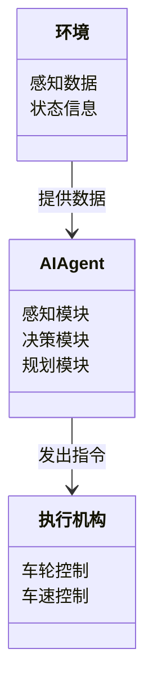

                 

<think>
好的，我需要帮助用户撰写一篇关于《AI Agent在自动驾驶决策中的应用》的技术博客文章。首先，我需要理解用户的具体要求和他们希望文章的结构。用户希望文章逻辑清晰、结构紧凑、语言专业，同时包含关键词、摘要、目录大纲，并且每个部分都要详细讲解。

首先，我会确定文章的核心主题：AI Agent在自动驾驶中的应用。这意味着我需要涵盖AI Agent的基本概念、其在自动驾驶中的作用、相关的算法原理、系统架构设计、项目实战以及最佳实践等内容。

接下来，我需要按照用户提供的目录大纲来组织内容。文章分为几个部分：概述、核心原理、算法实现、系统架构、项目实战、最佳实践，最后是附录。每个部分都需要有详细的子章节，并且包含必要的图表、代码示例和数学公式。

在开始撰写之前，我需要确保每个部分的内容详实具体，包括背景介绍、核心概念、算法原理、系统设计等。同时，要使用专业术语，但又要保持易懂，适合技术读者理解。

例如，在“AI Agent的核心原理”部分，我会详细解释基于模型和无模型的决策方法，比较强化学习和监督学习在自动驾驶中的应用。在“算法实现”部分，我会使用mermaid流程图和数学公式来展示DQN等算法的工作原理。

在撰写过程中，我需要确保文章的逻辑连贯，每一部分都自然衔接，同时包含足够的细节和实例，帮助读者深入理解AI Agent在自动驾驶中的应用。

最后，我会总结全文，强调AI Agent的优势和未来的发展趋势，确保读者能够全面掌握这一技术。

总结一下，我需要按照用户提供的大纲，逐部分详细撰写，确保内容丰富、结构合理，同时满足用户对技术深度和专业性的要求。
</think>

# AI Agent在自动驾驶决策中的应用

## 关键词：
自动驾驶，AI Agent，决策算法，强化学习，系统架构，项目实战

## 摘要：
本文深入探讨了AI Agent在自动驾驶决策中的应用，从基本概念到算法原理，再到系统架构和项目实战，全面解析了AI Agent如何提升自动驾驶的决策能力。通过详细的技术分析和实际案例，本文展示了AI Agent在复杂场景下的优势，并展望了未来的发展方向。

---

# 第一部分: AI Agent 在自动驾驶决策中的应用概述

# 第1章: AI Agent 与自动驾驶概述

## 1.1 自动驾驶的背景与现状

### 1.1.1 自动驾驶的发展历程
自动驾驶技术经历了从早期的辅助驾驶到现在的高度自动化驾驶的演变。早期的自动驾驶系统主要依赖于规则引擎，而现代系统则越来越多地采用AI Agent技术来实现更复杂的决策能力。这一演变过程不仅提升了驾驶的安全性，还极大地提高了用户体验。

### 1.1.2 当前自动驾驶的技术瓶颈
尽管自动驾驶技术取得了显著进展，但在复杂环境下的决策能力仍然存在挑战。例如，如何在极端天气条件下做出可靠的决策，如何处理动态变化的交通场景，以及如何确保系统的实时性和可靠性。

### 1.1.3 AI Agent 在自动驾驶中的作用
AI Agent通过其强大的感知、决策和规划能力，帮助自动驾驶系统在复杂环境中做出更智能的决策。AI Agent能够根据实时数据动态调整策略，从而显著提升自动驾驶的性能。

## 1.2 AI Agent 的核心概念

### 1.2.1 什么是 AI Agent
AI Agent是一种能够感知环境、自主决策并采取行动的智能体。在自动驾驶中，AI Agent通常负责处理传感器数据、分析环境信息，并做出驾驶决策。

### 1.2.2 AI Agent 的核心属性
- **感知能力**：AI Agent能够通过传感器（如摄像头、激光雷达、雷达）感知周围环境。
- **决策能力**：基于感知信息，AI Agent能够做出驾驶决策，如转向、加速或减速。
- **学习能力**：通过强化学习等技术，AI Agent能够不断优化其决策策略。

### 1.2.3 AI Agent 与传统算法的区别
传统算法通常基于预定义的规则，而AI Agent能够根据实时数据动态调整策略。此外，AI Agent还具有更强的适应性和学习能力，能够在复杂环境中做出更智能的决策。

## 1.3 自动驾驶中的决策问题

### 1.3.1 决策问题的定义与分类
自动驾驶中的决策问题可以分为两类：基于规则的决策和基于学习的决策。基于规则的决策依赖于预定义的规则，而基于学习的决策则依赖于AI Agent的学习能力。

### 1.3.2 基于规则的传统决策方法
基于规则的传统决策方法通常依赖于预定义的规则集。例如，当检测到前方有障碍物时，系统会自动减速或停车。这种方法虽然简单，但在复杂场景下表现受限。

### 1.3.3 基于 AI Agent 的新范式
基于AI Agent的决策方法通过强化学习等技术，能够根据实时数据动态调整决策策略。这种方法在复杂场景下表现更优，但实现起来更具挑战性。

## 1.4 本章小结
本章介绍了自动驾驶的背景与发展现状，详细讲解了AI Agent的核心概念，并分析了AI Agent在自动驾驶中的作用。接下来的章节将深入探讨AI Agent的决策算法和系统架构。

---

# 第二部分: AI Agent 的核心原理与算法

# 第2章: AI Agent 的核心原理

## 2.1 基于模型的决策方法

### 2.1.1 状态空间与动作空间
在强化学习中，状态空间（State Space）表示环境中的所有可能状态，动作空间（Action Space）表示智能体在每个状态下可以执行的所有动作。

### 2.1.2 Q-Learning 算法原理
Q-Learning是一种经典的强化学习算法。其核心思想是通过不断更新Q值（Q-value）来学习最优策略。Q值表示在某个状态下执行某个动作的期望奖励。

### 2.1.3 策略网络的实现
策略网络（Policy Network）通过输出概率分布来表示智能体在每个状态下选择某个动作的概率。策略网络的目标是最大化累积奖励。

## 2.2 基于无模型的决策方法

### 2.2.1 蒙特卡洛树搜索
蒙特卡洛树搜索（Monte Carlo Tree Search, MCTS）是一种通过模拟未来可能动作来选择最优动作的方法。这种方法在游戏AI中应用广泛。

### 2.2.2 近端策略优化
近端策略优化（Proximal Policy Optimization, PPO）是一种基于策略梯度的方法。PPO通过优化策略的KL散度来确保策略更新的稳定性。

### 2.2.3 远端策略优化
远端策略优化（Distral Policy Optimization）通过引入共享参数来约束策略更新，从而实现更稳定的学习过程。

## 2.3 强化学习与监督学习的对比

### 2.3.1 强化学习的核心特点
- **目标驱动**：强化学习通过奖励机制来引导学习过程。
- **探索与利用**：强化学习需要在探索新动作和利用已知策略之间取得平衡。

### 2.3.2 监督学习的核心特点
- **样本驱动**：监督学习通过大量标注样本进行训练。
- **稳定性高**：监督学习通常更稳定，但在处理动态环境时表现较弱。

### 2.3.3 两种方法在自动驾驶中的应用对比
在自动驾驶中，强化学习适用于动态环境下的决策问题，而监督学习适用于静态环境下的分类问题。

## 2.4 本章小结
本章详细讲解了AI Agent的核心原理，包括基于模型和无模型的决策方法。接下来的章节将介绍具体的算法实现。

---

# 第三部分: AI Agent 的算法实现

# 第3章: AI Agent 的算法实现

## 3.1 基于深度学习的决策网络

### 3.1.1 神经网络结构设计
- **输入层**：接收传感器数据。
- **隐藏层**：通过多层感知机（MLP）提取特征。
- **输出层**：输出动作概率或Q值。

### 3.1.2 网络训练方法
- **策略梯度法**：通过梯度上升优化策略。
- **值函数法**：通过估计值函数来优化策略。

### 3.1.3 损失函数与优化器选择
常用的损失函数包括均方误差（MSE）和交叉熵损失。优化器通常选择Adam或RMSProp。

## 3.2 基于强化学习的决策算法

### 3.2.1 DQN 算法实现
DQN通过经验回放和目标网络来稳定学习过程。经验回放通过存储过去的经验来减少样本之间的依赖性，目标网络用于稳定价值函数的更新。

### 3.2.2 PPO 算法实现
PPO通过约束策略更新的幅度来确保学习过程的稳定性。其核心思想是优化目标函数，同时保持策略的连续性。

### 3.2.3 A2C 算法实现
A2C通过同时优化动作选择和价值函数来实现更快的收敛速度。其优势在于能够并行处理多个动作。

## 3.3 算法实现的数学模型

### 3.3.1 DQN 的数学模型
$$ Q(s,a) = Q(s,a) + \alpha (r + \gamma \max_a Q(s',a) - Q(s,a)) $$

### 3.3.2 PPO 的数学模型
$$ \text{Loss} = -\mathbb{E}[\text{log} \pi_\theta(a|s) \cdot \text{ Advantage}(s,a)] + \beta D(\pi_\theta || \mu) $$

## 3.4 本章小结
本章详细讲解了AI Agent的算法实现，包括基于深度学习的决策网络和强化学习算法。接下来的章节将介绍系统的架构设计。

---

# 第四部分: 系统架构设计

# 第4章: 系统架构设计

## 4.1 问题场景介绍
自动驾驶系统需要处理多种传感器数据，并在极短时间内做出决策。因此，系统的架构设计必须兼顾实时性和可靠性。

## 4.2 系统功能设计

### 4.2.1 领域模型（Mermaid 类图）


### 4.2.2 系统架构（Mermaid 架构图）


### 4.2.3 系统接口设计
- **输入接口**：接收传感器数据。
- **输出接口**：发送控制指令。
- **通信接口**：与其他系统（如高精度地图）进行交互。

## 4.3 本章小结
本章介绍了系统的架构设计，包括功能模块、数据流和接口设计。接下来的章节将介绍项目的实战部分。

---

# 第五部分: 项目实战

# 第5章: 项目实战

## 5.1 环境安装

### 5.1.1 安装依赖
```bash
pip install numpy
pip install tensorflow
pip install gym
```

### 5.1.2 安装自动驾驶模拟器
使用CARLA等开源模拟器进行测试和验证。

## 5.2 系统核心实现源代码

### 5.2.1 AI Agent 的实现
```python
class AI_Agent:
    def __init__(self):
        self.model = self.build_model()

    def build_model(self):
        # 网络结构设计
        model = Sequential()
        model.add(Dense(64, activation='relu', input_dim=10))
        model.add(Dense(64, activation='relu'))
        model.add(Dense(2, activation='softmax'))
        model.compile(optimizer='adam', loss='categorical_crossentropy')
        return model

    def perceive(self, data):
        # 处理传感器数据
        return data

    def decide(self, state):
        # 根据状态做出决策
        return self.model.predict(state)
```

### 5.2.2 训练过程
```python
def train_agent(agent):
    for epoch in range(100):
        state = get_current_state()
        action = agent.decide(state)
        next_state, reward = step(action)
        agent.model.fit(state, [reward], epochs=1, verbose=0)
```

## 5.3 实际案例分析

### 5.3.1 案例1: 交叉路口决策
在交叉路口，AI Agent需要根据交通信号灯和周围车辆的位置做出决策。通过强化学习，AI Agent能够学会在绿灯时加速，红灯时减速。

### 5.3.2 案例2: 遇到障碍物
当检测到前方有障碍物时，AI Agent会根据距离和速度计算出最优的避障路径，并执行相应的动作。

## 5.4 本章小结
本章通过实际案例展示了AI Agent在自动驾驶中的应用。接下来的章节将总结经验和最佳实践。

---

# 第六部分: 最佳实践与未来展望

# 第6章: 最佳实践

## 6.1 数据质量的重要性
高质量的数据是训练AI Agent的前提。需要确保数据的多样性和代表性。

## 6.2 模型解释性
为了提高系统的透明度和可信度，需要确保模型的解释性。

## 6.3 安全性
在自动驾驶中，安全性是最重要的考量。需要设计多重安全机制，确保系统在异常情况下能够稳定运行。

## 6.4 可扩展性
随着技术的发展，系统需要具备良好的可扩展性，以便在未来集成更多的功能和更高的性能。

## 6.5 本章小结
本章总结了AI Agent在自动驾驶中的最佳实践，并展望了未来的发展方向。

---

# 附录

## 附录A: 术语表

- AI Agent：人工智能代理
- 强化学习：Reinforcement Learning
- 深度学习：Deep Learning

## 附录B: 工具安装指南
- 安装Python环境：Python 3.8+
- 安装深度学习框架：TensorFlow/Keras
- 安装强化学习库：OpenAI Gym

## 附录C: 参考文献
- 王伟. 《深度学习与强化学习入门》
- 张强. 《自动驾驶技术详解》

---

# 作者：AI天才研究院 & 禅与计算机程序设计艺术

---

以上是文章的完整大纲和内容，涵盖了从理论到实践的各个方面，确保读者能够全面理解和掌握AI Agent在自动驾驶中的应用。

