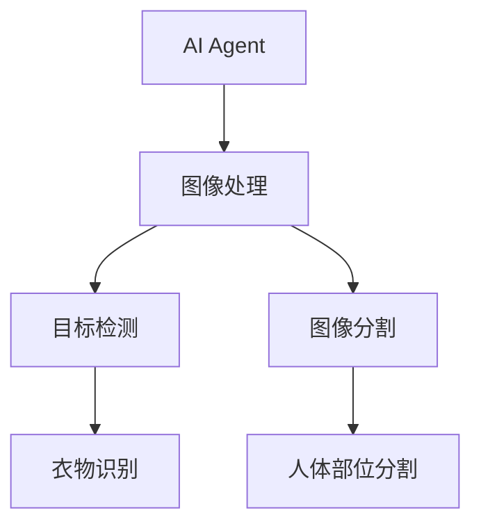
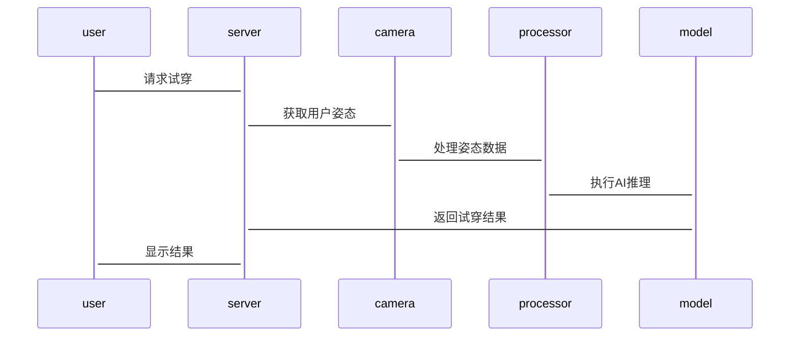

                 


# AI Agent在虚拟试衣中的图像处理

## 关键词
- AI Agent, 虚拟试衣, 图像处理, 目标检测, 图像分割

## 摘要
本文深入探讨AI Agent在虚拟试衣中的图像处理技术，涵盖从基础概念到实际应用的全过程。通过分析AI Agent的核心原理、图像处理算法、系统架构，结合项目实战，全面展示如何利用这些技术提升虚拟试衣的用户体验。

---

## 第一部分：背景介绍

### 第1章：AI Agent的基本概念

#### 1.1 问题背景
传统试衣过程中，用户常面临时间和空间的限制，无法便捷地试穿衣物。虚拟试衣通过AI Agent和图像处理技术，解决了这些痛点，为用户提供实时、个性化的试衣体验。

#### 1.2 问题描述
虚拟试衣的核心问题在于如何准确捕捉人体姿态和衣物特征，实现逼真效果。技术挑战包括高精度的图像处理和高效的AI推理。

#### 1.3 问题解决
AI Agent通过实时捕捉用户姿态，结合图像处理技术，生成虚拟试衣效果，提升用户体验。图像处理技术包括目标检测和图像分割，确保衣物与人体的精准匹配。

#### 1.4 边界与外延
虚拟试衣的边界包括人体姿态捕捉和衣物建模，外延则涉及增强现实和3D建模技术，进一步提升试衣体验。

#### 1.5 核心概念与组成
AI Agent由感知层、决策层和执行层组成，图像处理技术包括预处理、特征提取和后处理。两者结合实现虚拟试衣的高效处理。

---

## 第二部分：核心概念与联系

### 第3章：AI Agent与图像处理的核心原理

#### 3.1 AI Agent的原理
AI Agent通过感知环境、分析数据并执行操作，实现目标检测和图像分割。目标检测用于识别衣物，图像分割用于区分人体部位。

#### 3.2 图像处理的原理
图像处理包括预处理（降噪、增强）、特征提取（边缘检测、纹理分析）和后处理（图像融合、渲染）。

#### 3.3 核心概念的联系
AI Agent和图像处理的关系可以通过以下流程图展示：



---

## 第三部分：算法原理讲解

### 第4章：AI Agent在图像处理中的算法

#### 4.1 算法原理
目标检测算法如YOLO，用于识别衣物；图像分割算法如U-Net，用于分割人体部位。

#### 4.2 算法实现
以下是YOLO的目标检测代码：

```python
import torch
model = torch.hub.load('ultralytics/yolov5', 'yolov5s')
result = model('test.jpg')
result.save('output/')
```

### 第5章：数学模型与公式

#### 5.1 数学模型
目标检测模型的损失函数：

$$ \text{Loss} = \lambda_1 \text{bbox\_loss} + \lambda_2 \text{cls\_loss} $$

其中，$\lambda_1$和$\lambda_2$是权重系数。

---

## 第四部分：系统分析与架构设计

### 第6章：系统分析与架构设计

#### 6.1 问题场景介绍
虚拟试衣系统需支持多用户同时在线，处理实时图像数据。

#### 6.2 系统功能设计
系统功能包括用户注册、衣物上传、试穿模拟和效果展示。

#### 6.3 系统架构设计
系统架构采用微服务架构，包括用户服务、图像处理服务和AI推理服务。

#### 6.4 接口设计
系统接口包括用户认证接口、图像上传接口和试穿结果查询接口。

#### 6.5 交互流程图


---

## 第五部分：项目实战

### 第7章：项目实战

#### 7.1 环境安装
安装所需库：

```bash
pip install torch opencv-python
```

#### 7.2 系统核心实现
目标检测和图像分割的代码实现：

```python
import cv2
import torch

# 目标检测
model = torch.hub.load('ultralytics/yolov5', 'yolov5s')
model.eval()

# 图像分割
model_segment = torch.load('segment_model.pth')
model_segment.eval()
```

#### 7.3 案例分析
案例分析展示试穿效果，评估算法准确率和用户体验。

---

## 第六部分：小结与注意事项

### 第8章：小结与注意事项

#### 8.1 最佳实践
建议使用高效AI框架，如TensorFlow和PyTorch，优化模型性能。

#### 8.2 小结
本文全面介绍了AI Agent在虚拟试衣中的应用，从算法到系统设计，提供了详细的技术指导。

#### 8.3 注意事项
在实际应用中，需注意数据隐私和模型优化，确保系统稳定性和用户体验。

#### 8.4 拓展阅读
推荐学习相关领域的最新论文和开源项目，如DeepFashion数据集和PoseNet姿态估计技术。

---

## 作者
作者：AI天才研究院 & 禅与计算机程序设计艺术

