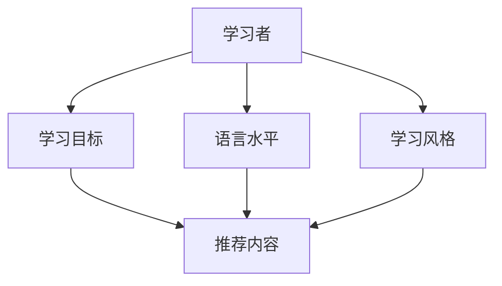
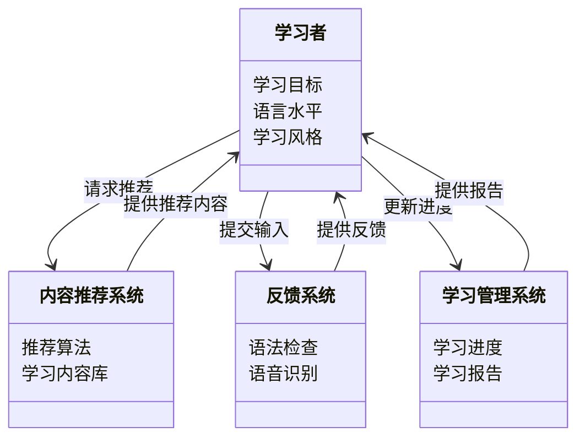

                 


# AI Agent在语言学习中的个性化教学

> 关键词：AI Agent，个性化教学，语言学习，自然语言处理，机器学习，实时反馈

> 摘要：本文探讨了AI Agent在语言学习中的个性化教学应用，分析了其核心概念、算法原理、系统架构，并通过实际案例展示了其在语言学习中的具体应用。文章内容涵盖了AI Agent的基本概念、个性化教学的特点、AI Agent在语言学习中的应用场景，详细分析了AI Agent的核心原理与关键技术，包括自然语言处理、机器学习算法的应用，以及实时反馈机制的实现。通过系统分析与架构设计，展示了AI Agent在语言学习中的系统结构和接口设计。最后，通过项目实战和最佳实践，总结了AI Agent在语言学习中的应用经验和未来发展方向。

---

# 第一部分: AI Agent与个性化教学的背景介绍

## 第1章: AI Agent的基本概念与应用背景

### 1.1 什么是AI Agent
#### 1.1.1 AI Agent的定义
AI Agent（人工智能代理）是一种能够感知环境并采取行动以实现目标的智能体。在语言学习中，AI Agent可以作为辅助工具，根据学习者的需求提供个性化的教学服务。

#### 1.1.2 AI Agent的核心特征
- **自主性**：能够在没有外部干预的情况下独立运行。
- **反应性**：能够根据环境反馈实时调整行为。
- **学习能力**：能够通过数据和反馈不断优化自身的算法。

#### 1.1.3 AI Agent与传统教学工具的区别
- **智能化**：AI Agent能够理解和生成自然语言，而传统工具通常只是静态的内容提供。
- **个性化**：AI Agent能够根据学习者的特点动态调整教学内容，而传统工具通常是固定的。
- **实时反馈**：AI Agent能够实时分析学习者的输入并提供反馈，而传统工具通常是滞后反馈。

### 1.2 个性化教学的定义与特点
#### 1.2.1 个性化教学的内涵
个性化教学是指根据每个学习者的特点和需求，提供定制化的教学内容和方法。

#### 1.2.2 个性化教学的目标
- **提高学习效果**：通过针对性的教学内容和方法，帮助学习者更快地掌握知识。
- **增强学习体验**：让学习者在学习过程中感到被关注和理解，从而提高学习的积极性。
- **优化学习路径**：根据学习者的学习进度和能力，动态调整学习计划。

#### 1.2.3 个性化教学与传统教学的对比
- **传统教学**：通常是统一的教学内容和进度，适用于大多数学生，但难以满足个体差异。
- **个性化教学**：根据每个学生的具体情况调整教学内容和进度，能够更好地满足个体需求。

### 1.3 AI Agent在语言学习中的应用背景
#### 1.3.1 当前语言学习的痛点
- **学习者多样性**：不同的学习者有不同的学习风格、语言能力和学习目标。
- **教学资源有限**：传统教学通常依赖于教师的资源和时间，难以满足大规模个性化需求。
- **反馈滞后**：学习者在学习过程中通常得不到及时的反馈，影响学习效果。

#### 1.3.2 AI Agent如何解决语言学习中的问题
- **个性化内容推荐**：AI Agent能够根据学习者的特点推荐适合的学习材料和练习。
- **实时反馈与纠错**：AI Agent能够在学习者输入后立即提供反馈和纠正错误。
- **学习进度跟踪与分析**：AI Agent能够跟踪学习者的学习进度，并分析学习效果，提出改进建议。

#### 1.3.3 个性化教学在语言学习中的重要性
个性化教学能够提高学习者的积极性和学习效果，帮助他们在有限的时间内更高效地掌握语言技能。

---

## 第2章: AI Agent在语言学习中的问题背景

### 2.1 语言学习中的个性化需求
#### 2.1.1 学生的学习风格差异
- **视觉型学习者**：偏好通过视觉信息（如图像、视频）学习。
- **听觉型学习者**：偏好通过听觉信息（如音频、语音）学习。
- **动觉型学习者**：偏好通过实践和动手操作学习。

#### 2.1.2 学习目标的多样性
- **考试准备**：为了通过语言考试（如雅思、托福）而学习。
- **职业发展**：为了在工作中使用语言而学习。
- **兴趣爱好**：出于对语言文化的兴趣而学习。

#### 2.1.3 学习进度的个性化管理
- **学习者的起点不同**：有些学习者可能已经具备一定的语言基础，有些则完全是零基础。
- **学习速度差异**：不同的学习者掌握知识的速度不同，需要灵活调整学习计划。

### 2.2 AI Agent在语言学习中的应用场景
#### 2.2.1 个性化内容推荐
- **根据学习者的水平推荐难度适中的学习材料**。
- **根据学习者的学习风格推荐适合的资源形式（如视频、音频、文本）**。
- **根据学习目标推荐相关的话题和内容**。

#### 2.2.2 实时反馈与纠错
- **即时检查语法错误**：AI Agent可以在学习者输入句子后立即检查语法错误，并提供改进建议。
- **语音识别与反馈**：AI Agent可以通过语音识别技术评估学习者的发音，并提供反馈。
- **写作反馈**：AI Agent可以分析学习者的作文，并提供结构、语法和表达方面的反馈。

#### 2.2.3 学习进度跟踪与分析
- **记录学习者的学习轨迹**：AI Agent可以跟踪学习者每天的学习时间、学习内容和学习效果。
- **生成学习报告**：根据学习数据生成报告，分析学习者的强项和弱项，提出改进建议。
- **调整学习计划**：根据学习者的学习进度和效果动态调整学习计划。

### 2.3 问题解决与边界分析
#### 2.3.1 AI Agent在语言学习中的问题解决流程
1. **收集学习者信息**：包括学习目标、学习风格、语言水平等。
2. **分析学习者需求**：根据收集的信息确定适合的学习内容和方法。
3. **提供个性化服务**：根据分析结果推荐学习材料、提供反馈和调整学习计划。
4. **持续优化**：根据学习者的学习反馈不断优化AI Agent的服务。

#### 2.3.2 AI Agent的边界与外延
- **边界**：AI Agent主要专注于语言学习的个性化教学，不涉及其他领域。
- **外延**：AI Agent可以通过与其他系统的集成，扩展其功能，例如与语音识别系统、自然语言处理系统等集成。

#### 2.3.3 核心要素与组成结构
- **学习者模型**：包括学习者的学习目标、风格、水平等信息。
- **推荐系统**：根据学习者模型推荐适合的学习内容。
- **反馈系统**：提供实时的反馈和改进建议。
- **学习管理系统**：跟踪学习者的学习进度并优化学习计划。

---

## 第3章: AI Agent的核心原理与关键技术

### 3.1 AI Agent的工作原理
#### 3.1.1 数据采集与分析
- **数据来源**：包括学习者的行为数据（如点击、输入）、学习效果数据（如测试成绩）。
- **数据分析**：通过机器学习算法分析数据，提取学习者的特征和模式。

#### 3.1.2 自然语言处理技术
- **文本分析**：使用自然语言处理技术分析学习者输入的文本，理解其语义和语法结构。
- **语音识别**：通过语音识别技术分析学习者的发音和语调。

#### 3.1.3 机器学习算法的应用
- **监督学习**：通过标记数据训练模型，预测学习者的语言水平或学习风格。
- **无监督学习**：通过聚类分析发现学习者的潜在需求或模式。
- **强化学习**：通过奖励机制优化AI Agent的决策过程。

### 3.2 AI Agent与个性化教学的结合
#### 3.2.1 用户画像的构建
- **画像维度**：包括学习目标、语言水平、学习风格、学习时间等。
- **画像更新**：根据学习者的行为和反馈不断更新用户画像。

#### 3.2.2 内容推荐算法
- **基于协同过滤的推荐算法**：根据学习者的相似性推荐学习内容。
- **基于内容的推荐算法**：根据学习内容的特征推荐相关的内容。

#### 3.2.3 实时反馈机制
- **语法纠错**：使用自然语言处理技术检查学习者的语法错误，并提供修改建议。
- **语音反馈**：通过语音识别技术分析学习者的发音，并提供反馈和改进建议。

### 3.3 核心概念对比表
#### 3.3.1 用户画像与传统教学评估的对比
| 特性               | 用户画像                     | 传统教学评估         |
|--------------------|------------------------------|----------------------|
| 数据来源           | 学习者的行为和输入数据       | 学生的考试成绩       |
| 更新频率           | 实时更新                    | 定期评估             |
| 应用场景           | 个性化内容推荐和反馈         | 统一的教学计划和评估   |

#### 3.3.2 内容推荐算法与随机推荐的对比
| 特性               | 基于算法的推荐             | 随机推荐             |
|--------------------|---------------------------|----------------------|
| 精准度             | 高                        | 低                   |
| 个性化             | 高                        | 低                   |
| 数据依赖           | 高                        | 低                   |

#### 3.3.3 实时反馈与滞后反馈的对比
| 特性               | 实时反馈                 | 滞后反馈             |
|--------------------|--------------------------|----------------------|
| 反馈时间           | 立即                     | 延后                 |
| 反馈内容           | 详细且具体               | 概括性               |
| 反馈效果           | 更高的学习效果           | 较低的学习效果       |

---

## 第4章: AI Agent的核心概念与联系

### 4.1 核心概念原理
#### 4.1.1 用户画像的构建过程
1. **数据收集**：通过学习者的行为数据和输入数据收集信息。
2. **特征提取**：从数据中提取学习者的特征，如语言水平、学习风格等。
3. **画像更新**：根据新的数据不断更新用户画像。

#### 4.1.2 内容推荐算法的实现
1. **数据预处理**：清洗和标准化数据。
2. **模型训练**：使用机器学习算法训练推荐模型。
3. **推荐生成**：根据模型预测结果生成推荐内容。

#### 4.1.3 实时反馈机制的原理
1. **输入接收**：接收学习者的输入（如文本或语音）。
2. **处理分析**：使用自然语言处理技术分析输入内容。
3. **反馈生成**：根据分析结果生成反馈并返回给学习者。

### 4.2 实体关系图（ER图）



---

## 第5章: 算法原理讲解

### 5.1 推荐算法的实现

#### 5.1.1 基于协同过滤的推荐算法
1. **数据预处理**：将学习者的行为数据进行处理，构建用户-物品矩阵。
2. **相似度计算**：计算用户之间的相似度，找出与当前用户相似的学习者。
3. **推荐生成**：基于相似用户的偏好推荐内容。

#### 5.1.2 基于内容的推荐算法
1. **特征提取**：从学习内容中提取特征（如主题、关键词）。
2. **相似度计算**：计算当前学习者感兴趣的内容与其他内容的相似度。
3. **推荐生成**：推荐与当前学习者需求最匹配的内容。

### 5.2 推荐算法的数学模型

#### 5.2.1 基于协同过滤的矩阵分解
$$
X = W \times H
$$
其中，$X$ 是用户-物品矩阵，$W$ 是用户-隐因子矩阵，$H$ 是物品-隐因子矩阵。

#### 5.2.2 基于内容的相似度计算
$$
sim(i, j) = \frac{\sum_{k} w_{i,k} w_{j,k}}{\sqrt{\sum_{k} w_{i,k}^2} \times \sqrt{\sum_{k} w_{j,k}^2}}
$$
其中，$sim(i, j)$ 是用户$i$和用户$j$的相似度，$w_{i,k}$和$w_{j,k}$是用户$i$和$j$在特征$k$上的权重。

### 5.3 Python实现示例

```python
# 基于协同过滤的推荐算法实现
def collaborative_filtering_recommendation(users_data, user_id):
    # 计算用户相似度
    similarity_matrix = compute_similarity(users_data)
    # 找出最相似的用户
    similar_users = find_top_similar_users(similarity_matrix, user_id)
    # 推荐内容
    recommended_items = get_recommendations(users_data, similar_users)
    return recommended_items
```

---

## 第6章: 系统分析与架构设计方案

### 6.1 问题场景介绍
语言学习AI Agent系统需要解决个性化教学中的内容推荐、实时反馈和学习进度跟踪问题。

### 6.2 项目介绍
本项目旨在开发一个基于AI Agent的语言学习个性化教学系统，提供智能化的学习支持。

### 6.3 系统功能设计
#### 6.3.1 领域模型


#### 6.3.2 系统架构设计


---

## 第7章: 项目实战

### 7.1 环境安装
- **Python**：安装Python 3.8或更高版本。
- **库的安装**：使用pip安装必要的库，如`numpy`, `scikit-learn`, `transformers`。

### 7.2 核心代码实现
```python
# 用户画像构建
def build_user_profile(user_data):
    profile = {}
    for feature in user_data:
        profile[feature] = user_data[feature]
    return profile

# 内容推荐算法
def content_based_recommendation(corpus, user_profile):
    # 提取内容特征
    features = extract_features(corpus)
    # 计算相似度
    similarity_scores = compute_similarity(features, user_profile)
    # 生成推荐
    recommendations = get_top_matches(similarity_scores)
    return recommendations
```

### 7.3 案例分析与应用解读
通过实际案例分析，展示AI Agent在语言学习中的具体应用和效果。

### 7.4 项目总结
总结项目实现的关键点和经验教训，展望未来的发展方向。

---

## 第8章: 最佳实践与小结

### 8.1 最佳实践
- **数据质量**：确保数据的准确性和完整性。
- **模型优化**：根据实际效果不断优化推荐算法和反馈机制。
- **用户体验**：注重用户界面的友好性和反馈的及时性。

### 8.2 小结
AI Agent在语言学习中的个性化教学应用具有广阔的发展前景，能够有效提升学习效果和学习体验。

### 8.3 注意事项
- **隐私保护**：在处理学习者数据时，需要注意隐私保护。
- **算法选择**：根据具体需求选择合适的算法，避免过度复杂化。
- **性能优化**：确保系统在大规模数据下的性能。

### 8.4 拓展阅读
推荐相关的书籍和论文，供读者深入学习。

---

作者：AI天才研究院/AI Genius Institute & 禅与计算机程序设计艺术 /Zen And The Art of Computer Programming

