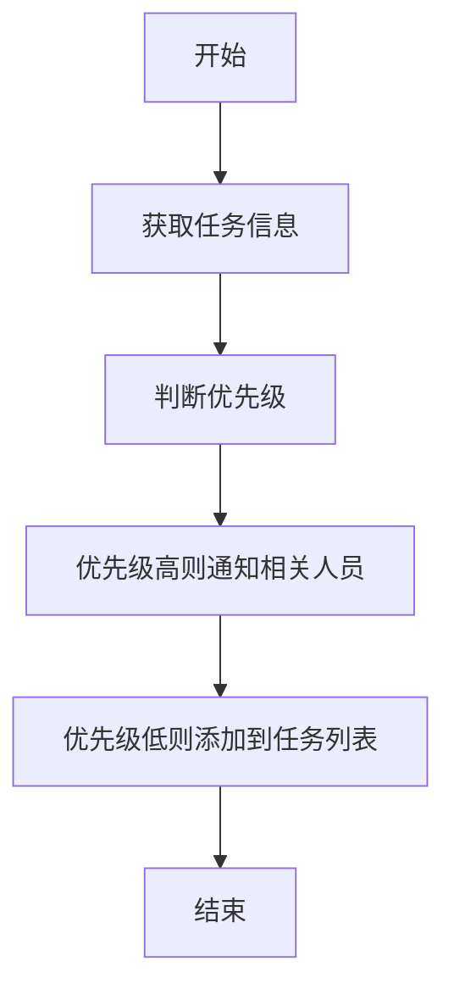
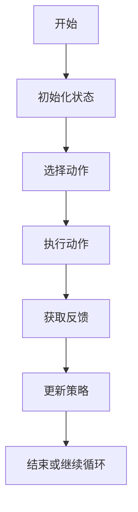
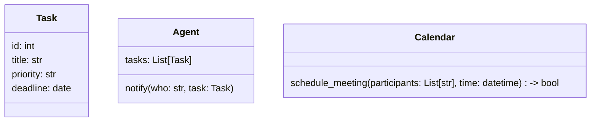
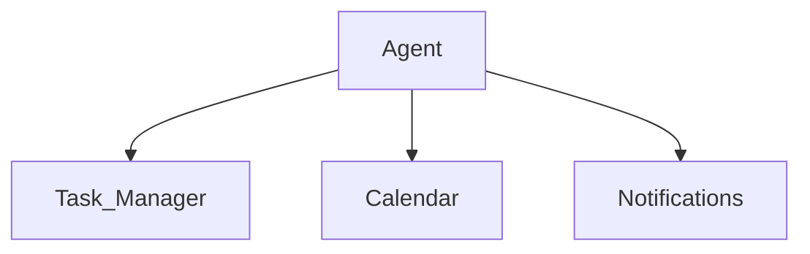
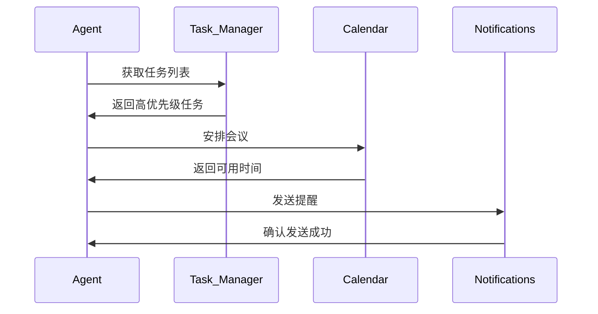

                 

<think>
嗯，我现在需要帮用户撰写一篇关于《AI Agent在远程办公支持中的应用与最佳实践》的技术博客文章。用户已经给出了一个详细的目录结构，我需要按照这个结构一步步填充内容，确保每个部分都详尽且符合要求。

首先，文章的标题和关键词已经明确，接下来是摘要部分。摘要需要简明扼要地概括文章的核心内容，包括背景、技术要点、解决方案和结论。我需要确保摘要涵盖这些方面，让读者一目了然。

接下来是第1章，背景介绍。我需要详细解释AI Agent的基本概念，包括定义、核心特征和与传统办公工具的区别。这部分需要让读者理解AI Agent是什么以及它在远程办公中的重要性。然后，我需要讨论远程办公的现状和挑战，分析AI Agent如何解决这些问题，并展望其应用前景。

第2章是核心概念与原理。我需要解释AI Agent的工作原理，包括感知、决策和执行，用表格对比不同AI Agent的特征，并绘制实体关系图。这部分需要清晰展示AI Agent的内部机制和各实体之间的关系。

算法原理部分需要详细讲解AI Agent使用的算法，比如基于规则的推理和强化学习。我需要用Mermaid绘制算法流程图，提供Python代码实现，并解释数学模型，特别是Q-learning的公式。代码示例需要具体且有注释，帮助读者理解。

系统分析与架构设计章节需要介绍问题场景，设计系统功能，用Mermaid类图展示领域模型，然后绘制系统架构图，描述各模块的交互。这部分需要展示系统的整体结构和各部分的功能。

项目实战部分需要通过一个具体案例，比如智能会议管理系统，展示如何开发AI Agent。我需要详细说明开发环境的安装步骤，提供核心代码，并分析实际案例中的挑战和解决方案，最后总结项目经验。

最佳实践部分需要给出在远程办公中应用AI Agent的注意事项，包括技术选型、数据隐私、用户体验等方面，并推荐一些拓展阅读材料。这部分需要帮助读者在实际应用中避免常见错误，并进一步深入学习。

最后，文章结尾需要加上作者信息，满足用户的格式要求。

现在，我需要确保每个章节都按照用户的要求，详细展开内容，使用正确的格式，包括Mermaid图表和数学公式。同时，字数控制在10000到12000字之间，内容要专业且易于理解。

在撰写过程中，我可能会遇到一些问题，比如如何深入解释复杂的算法或系统架构。这时，我需要查阅相关资料，确保解释准确，并用通俗易懂的语言表达出来。此外，代码部分需要正确无误，避免语法错误，并加上详细注释，方便读者理解和应用。

总的来说，我需要一步步按照目录结构填充内容，确保每个部分都符合用户的要求，同时保持逻辑清晰，结构紧凑。这样才能写出一篇高质量的技术博客文章，帮助读者深入了解AI Agent在远程办公中的应用与最佳实践。
</think>

# AI Agent在远程办公支持中的应用与最佳实践

## 关键词：AI Agent, 远程办公, 人工智能, 系统架构, 最佳实践

## 摘要：随着远程办公的普及，AI Agent（人工智能代理）在提升办公效率和解决远程协作问题中发挥着越来越重要的作用。本文系统地探讨了AI Agent在远程办公中的应用背景、核心概念、算法原理、系统架构，并通过实际案例展示了如何开发和实施AI Agent支持的远程办公系统。同时，本文还总结了最佳实践和注意事项，为读者提供全面的指导。

---

## 第1章: AI Agent与远程办公概述

### 1.1 AI Agent的基本概念

#### 1.1.1 什么是AI Agent
AI Agent（人工智能代理）是一种智能系统，能够感知环境、理解任务需求，并通过自主决策和行动来实现目标。与传统软件不同，AI Agent具有学习和适应能力，能够根据反馈不断优化自身行为。

#### 1.1.2 AI Agent的核心特征
- **自主性**：能够在没有外部干预的情况下运行。
- **反应性**：能够实时感知环境变化并做出反应。
- **学习能力**：通过数据和反馈不断优化决策过程。
- **协作能力**：能够与其他系统或人类用户协同工作。

#### 1.1.3 AI Agent与传统办公工具的区别
传统的办公工具（如邮件、即时通讯软件）主要依赖于人工操作，而AI Agent能够主动执行任务，例如自动安排会议、提醒截止日期等。

---

### 1.2 远程办公的现状与挑战

#### 1.2.1 远程办公的定义与特点
远程办公是指员工在非传统办公地点（如家中）通过数字工具进行工作的模式。其特点是灵活性高、节省时间，但也面临沟通效率低、团队协作难等问题。

#### 1.2.2 远程办公的主要挑战
- **沟通不畅**：缺乏面对面交流，容易产生误解。
- **协作效率低**：团队成员难以同步工作进度。
- **信息过载**：大量信息分散在不同工具中，难以快速检索。
- **员工孤独感**：长期远程工作可能导致心理压力。

#### 1.2.3 AI Agent在远程办公中的作用
AI Agent可以自动处理许多重复性任务，例如自动分配任务、提醒截止日期、智能日历管理等，从而提高协作效率并减轻员工负担。

---

### 1.3 AI Agent在远程办公中的应用前景

#### 1.3.1 AI Agent的潜在应用场景
- **智能日历管理**：自动协调会议时间，发送提醒。
- **任务分配与跟踪**：自动将任务分配给最合适的人，并跟踪进度。
- **信息汇总与分析**：自动从多个工具中收集信息并生成报告。
- **智能客服**：为员工提供即时帮助，解答常见问题。

#### 1.3.2 企业采用AI Agent的优势
- **提高效率**：减少人工操作，加快任务处理速度。
- **降低成本**：通过自动化减少人力投入。
- **增强用户体验**：提供个性化的支持，提升员工满意度。
- **数据驱动决策**：通过分析数据提供更好的决策支持。

#### 1.3.3 AI Agent应用的挑战与机遇
- **技术挑战**：需要解决数据隐私、模型精度等问题。
- **用户接受度**：员工可能对AI Agent的可靠性存疑。
- **市场竞争**：AI Agent技术的快速发展为企业提供了更多选择。

---

### 1.4 本章小结
本章介绍了AI Agent的基本概念、远程办公的现状与挑战，以及AI Agent在远程办公中的应用前景。通过分析，我们可以看到AI Agent在提升远程办公效率和解决协作问题方面具有巨大潜力。

---

## 第2章: AI Agent的核心概念与原理

### 2.1 AI Agent的核心概念

#### 2.1.1 AI Agent的定义与分类
AI Agent可以根据任务类型分为多种类别，例如基于规则的代理、基于机器学习的代理等。

#### 2.1.2 AI Agent的主要功能模块
- **感知模块**：通过传感器或API获取环境信息。
- **决策模块**：基于感知信息生成行动计划。
- **执行模块**：将决策转化为具体行动。
- **学习模块**：通过反馈优化决策模型。

#### 2.1.3 AI Agent的决策机制
AI Agent的决策机制通常包括以下步骤：
1. **感知环境**：获取当前状态。
2. **生成候选方案**：根据任务目标生成多个候选行动。
3. **评估方案**：评估每个方案的优劣。
4. **选择最优方案**：基于评估结果选择最佳行动。
5. **执行行动**：将决策付诸实施。

---

### 2.2 AI Agent的核心原理

#### 2.2.1 感知与理解
AI Agent通过自然语言处理（NLP）和计算机视觉（CV）等技术感知环境信息，例如识别邮件内容、理解图像中的信息。

#### 2.2.2 决策与规划
AI Agent基于感知信息，利用算法生成最优行动计划。常用的算法包括基于规则的推理和强化学习。

#### 2.2.3 执行与反馈
AI Agent执行决策后，通过反馈机制不断优化自身行为。例如，如果某个决策导致负面结果，AI Agent会记录反馈并调整未来决策。

---

### 2.3 AI Agent与远程办公的结合

#### 2.3.1 远程办公中的主要问题
- **信息分散**：员工需要在多个工具中查找信息。
- **任务滞后**：缺乏自动提醒，任务可能被遗忘。
- **沟通低效**：团队协作效率低下。

#### 2.3.2 AI Agent如何解决这些问题
通过自动化任务处理、智能提醒和实时信息汇总，AI Agent可以显著提升远程办公的效率和协作能力。

#### 2.3.3 AI Agent的边界与外延
AI Agent的应用范围包括任务管理、信息检索、智能客服等领域，但其能力也受到数据质量和算法精度的限制。

---

### 2.4 本章小结
本章详细介绍了AI Agent的核心概念与原理，并分析了其在远程办公中的具体应用。AI Agent通过感知、决策和执行三步曲，为远程办公提供了智能化的解决方案。

---

## 第3章: AI Agent的算法原理与实现

### 3.1 基于规则的推理算法

#### 3.1.1 算法原理
基于规则的推理算法通过预定义的规则来生成决策。例如，如果任务优先级为高，则立即通知相关人员。

#### 3.1.2 算法流程图


#### 3.1.3 Python代码实现
```python
def rule_based_agent(tasks):
    for task in tasks:
        if task.priority == 'high':
            notify相关人员(task)
        else:
            add_to_task_list(task)
```

---

### 3.2 基于强化学习的算法

#### 3.2.1 算法原理
强化学习通过试错机制优化决策。例如，AI Agent通过尝试不同的任务分配方式，找到最优的方案。

#### 3.2.2 算法流程图


#### 3.2.3 Python代码实现
```python
import numpy as np

# Q-learning算法实现
class QAgent:
    def __init__(self, state_space, action_space):
        self.Q = np.zeros((state_space, action_space))
    
    def choose_action(self, state, epsilon=0.1):
        if np.random.random() < epsilon:
            return np.random.randint(action_space)
        else:
            return np.argmax(self.Q[state])
    
    def update_Q(self, state, action, reward, alpha=0.1):
        self.Q[state, action] = (1 - alpha) * self.Q[state, action] + alpha * reward
```

#### 3.2.4 数学模型与公式
强化学习的核心公式为：
$$ Q(s, a) = Q(s, a) + \alpha (r + \gamma Q(s', a') - Q(s, a)) $$
其中：
- \( s \) 是当前状态
- \( a \) 是采取的动作
- \( r \) 是获得的奖励
- \( \gamma \) 是折扣因子
- \( s' \) 是下一个状态

---

### 3.3 本章小结
本章详细讲解了AI Agent的两种主要算法：基于规则的推理和强化学习。通过代码示例和数学公式，读者可以理解这些算法的工作原理及其在远程办公中的应用。

---

## 第4章: AI Agent的系统架构与设计

### 4.1 系统分析

#### 4.1.1 问题场景介绍
以智能日历管理为例，AI Agent需要协调多个团队成员的日程安排，自动处理冲突。

#### 4.1.2 系统功能设计
- **任务感知**：获取任务信息和优先级。
- **决策模块**：生成最优会议安排。
- **执行模块**：发送提醒和确认邮件。

#### 4.1.3 领域模型类图


---

### 4.2 系统架构设计

#### 4.2.1 系统架构图


#### 4.2.2 系统接口设计
- **Task_Manager**：提供任务创建、查询和更新接口。
- **Calendar**：提供会议安排和取消接口。
- **Notifications**：提供发送提醒和确认邮件的接口。

#### 4.2.3 系统交互序列图


---

### 4.3 本章小结
本章通过系统架构设计展示了AI Agent在远程办公中的具体实现方式。通过类图和序列图，读者可以清晰理解系统的各个组成部分及其交互方式。

---

## 第5章: AI Agent的项目实战

### 5.1 环境安装与配置

#### 5.1.1 安装Python环境
使用Python 3.8及以上版本，安装必要的库：
```bash
pip install numpy scikit-learn
```

#### 5.1.2 安装AI框架
安装强化学习框架，例如TensorFlow或Keras。

---

### 5.2 核心代码实现

#### 5.2.1 任务管理模块
```python
class TaskManager:
    def __init__(self):
        self.tasks = []
    
    def add_task(self, task):
        self.tasks.append(task)
    
    def get_high_priority_tasks(self):
        return [task for task in self.tasks if task.priority == 'high']
```

#### 5.2.2 AI Agent实现
```python
class AIAgent:
    def __init__(self, task_manager):
        self.task_manager = task_manager
    
    def notify(self, who, task):
        print(f"提醒 {who}：{task.title} 的截止日期是 {task.deadline}")
    
    def schedule_meeting(self, participants):
        # 简单实现，实际应与日历系统集成
        print(f"已安排 {participants} 参加会议")
```

---

### 5.3 代码应用与分析

#### 5.3.1 实际案例分析
以智能日历管理为例，AI Agent可以自动协调会议时间，并在截止日期前发送提醒。

#### 5.3.2 代码实现小结
通过代码实现，我们可以看到AI Agent如何与任务管理和日历系统集成，提供智能化的远程办公支持。

---

### 5.4 本章小结
本章通过实际案例展示了AI Agent的开发过程，从环境安装到代码实现，帮助读者理解如何在实际项目中应用这些技术。

---

## 第6章: AI Agent在远程办公中的最佳实践

### 6.1 注意事项与经验分享

#### 6.1.1 技术选型
选择合适的AI框架和算法，确保系统的可扩展性和维护性。

#### 6.1.2 数据隐私
确保AI Agent处理的数据符合隐私保护法规，例如GDPR。

#### 6.1.3 用户体验
设计直观易用的界面，减少用户的学习成本。

---

### 6.2 小结与展望

#### 6.2.1 小结
AI Agent在远程办公中的应用前景广阔，但需要克服技术、数据和用户接受度等挑战。

#### 6.2.2 展望
随着技术的进步，AI Agent将更加智能化，为企业远程办公提供更强大的支持。

---

## 第7章: 总结

### 7.1 本章回顾
本文系统地探讨了AI Agent在远程办公中的应用，从核心概念到算法实现，再到系统架构和项目实战，为读者提供了全面的指导。

### 7.2 未来展望
随着AI技术的不断进步，AI Agent将在远程办公中发挥越来越重要的作用，为企业创造更大的价值。

---

## 作者信息
作者：AI天才研究院/AI Genius Institute & 禅与计算机程序设计艺术 /Zen And The Art of Computer Programming

