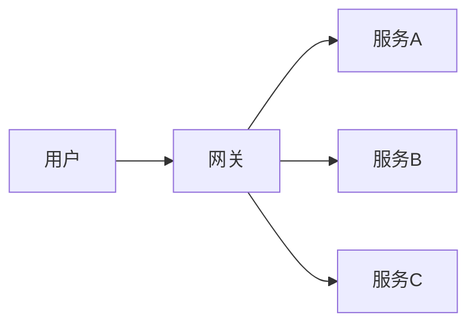
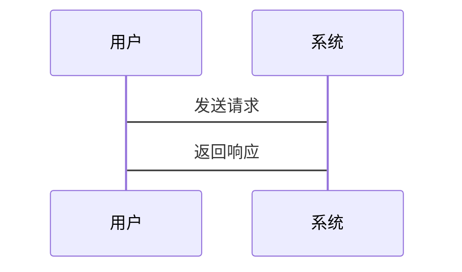

                 

<think>
好，我现在需要根据用户的要求，详细思考如何撰写一篇关于《AI Agent在金融行业的创新应用》的博客文章。文章需要有清晰的结构，每个章节都要有详细的讲解，涵盖背景、核心概念、算法原理、系统架构、项目实战、最佳实践等部分。

首先，我会先从背景介绍开始，了解AI Agent的基本概念，然后分析金融行业的现状和痛点，说明AI Agent如何解决这些问题。接着，我会详细介绍AI Agent的核心原理，包括算法和模型，用数学公式和流程图来解释。然后，我会设计系统架构，包括各个模块和接口，确保系统高效可靠。之后，我会通过实际案例展示AI Agent在金融中的应用，比如智能投顾或风险控制。最后，我会总结经验和最佳实践，展望未来的发展。

在整个过程中，我会注意使用专业但易懂的语言，确保内容逻辑清晰，结构紧凑，每一步都详细展开，让读者能够一步步理解AI Agent在金融中的创新应用。
</think>

# AI Agent在金融行业的创新应用

## 关键词：AI Agent, 人工智能, 金融行业, 创新应用, 技术实现

## 摘要：本文深入探讨了AI Agent在金融行业中的创新应用，从基本概念、核心原理到系统架构、项目实战，全面分析了AI Agent如何赋能金融业务。文章通过实际案例展示了AI Agent在智能投顾、风险控制和金融决策等场景中的应用，并总结了最佳实践和未来发展方向。

---

## 第1章: AI Agent的基本概念与背景

### 1.1 AI Agent的定义与核心概念

#### 1.1.1 AI Agent的基本定义
AI Agent（人工智能代理）是一种能够感知环境、自主决策并执行任务的智能实体。它通过数据输入、模型推理和行动输出，帮助用户完成特定任务或提供决策支持。

#### 1.1.2 AI Agent的核心属性与特征
| 特性 | 描述 |
|------|------|
| 自主性 | 能够独立决策和行动 |
| 反应性 | 能够实时感知环境变化 |
| 学习性 | 可以通过经验改进性能 |
| 交互性 | 支持与用户或其他系统的交互 |

#### 1.1.3 AI Agent与传统金融技术的区别
| 方面 | AI Agent | 传统金融技术 |
|------|---------|----------------|
| 决策方式 | 基于机器学习模型 | 基于固定规则和逻辑 |
| 可扩展性 | 高 | 低 |
| 处理能力 | 处理复杂场景 | 处理简单重复性任务 |

### 1.2 金融行业的数字化转型背景

#### 1.2.1 金融行业智能化发展的趋势
- 随着大数据、云计算和AI技术的发展，金融行业正逐步从人工决策转向智能决策。

#### 1.2.2 传统金融业务的痛点与挑战
- **数据孤岛**：不同系统间数据难以共享，影响决策效率。
- **人工成本高**：传统业务需要大量人力，效率低下。
- **决策延迟**：依赖人工分析，难以快速响应市场变化。

#### 1.2.3 AI Agent在金融行业中的潜在价值
- **提高效率**：自动化处理大量数据，快速生成决策。
- **降低风险**：通过智能分析，提前识别潜在风险。
- **提升客户体验**：提供个性化的金融服务，增强客户满意度。

### 1.3 AI Agent在金融行业的应用前景

#### 1.3.1 AI Agent的典型应用场景
- 智能投顾：为用户提供个性化的投资建议。
- 风险评估：通过AI模型评估客户的信用风险。
- 自动交易：实现高频交易和市场预测。

#### 1.3.2 企业采用AI Agent的优势
- 提高决策效率和准确性。
- 降低运营成本。
- 提升客户满意度和忠诚度。

#### 1.3.3 AI Agent应用的挑战与机遇
- **挑战**：数据隐私、模型解释性、技术可靠性。
- **机遇**：技术创新推动行业升级，提升竞争力。

### 1.4 本章小结
本章介绍了AI Agent的基本概念和核心特征，分析了金融行业智能化转型的背景，并探讨了AI Agent在金融行业中的潜在价值和应用前景。

---

## 第2章: AI Agent的核心原理

### 2.1 AI Agent的架构与工作原理

#### 2.1.1 AI Agent的基本架构


#### 2.1.2 AI Agent的核心工作流程
1. 数据输入：接收环境中的数据，如市场动态、客户信息。
2. 数据处理：清洗、转换和标准化数据。
3. 模型推理：基于训练好的模型进行预测或决策。
4. 行动输出：根据推理结果执行相应操作。

#### 2.1.3 AI Agent与人类决策者的交互机制
- **人机交互**：用户通过界面输入需求，AI Agent提供建议。
- **反馈机制**：用户对AI的决策进行反馈，用于模型优化。

### 2.2 AI Agent的关键技术

#### 2.2.1 自然语言处理技术
- **应用**：用于分析文本数据，如新闻、报告。
- **技术**：如BERT模型用于情感分析和意图识别。

#### 2.2.2 机器学习算法
- **监督学习**：用于分类、回归问题。
- **无监督学习**：用于聚类、异常检测。

#### 2.2.3 强化学习与决策优化
- **应用**：用于游戏AI、自动驾驶等需要实时决策的场景。
- **算法**：Q-learning、Deep Q-Networks。

#### 2.2.4 知识图谱与推理引擎
- **知识图谱**：构建金融领域的知识库，如公司关系、市场趋势。
- **推理引擎**：基于知识图谱进行逻辑推理，辅助决策。

### 2.3 AI Agent的核心算法与数学模型

#### 2.3.1 损失函数与优化目标
- **损失函数**：衡量预测值与真实值的差异。
  $$ L = \frac{1}{n}\sum_{i=1}^{n}(y_i - \hat{y}_i)^2 $$
- **优化目标**：最小化损失函数，提升模型性能。

#### 2.3.2 神经网络模型的数学表达
- **输入层**：接收原始数据，如x₁, x₂, ..., xₙ。
- **隐藏层**：通过激活函数处理，如ReLU、Sigmoid。
- **输出层**：生成最终的预测结果。

#### 2.3.3 基于强化学习的决策模型
- **Q-learning算法**：
  $$ Q(s, a) = Q(s, a) + \alpha (r + \max Q(s', a') - Q(s, a)) $$
  其中，α是学习率，r是奖励，s是状态，a是动作。

### 2.4 本章小结
本章详细讲解了AI Agent的核心原理，包括架构设计、关键技术、算法模型等内容，为后续的系统设计和应用提供了理论基础。

---

## 第3章: 金融行业AI Agent的系统架构与设计

### 3.1 金融AI Agent的系统组成

#### 3.1.1 数据采集模块
- **功能**：收集市场数据、客户行为数据。
- **数据源**：API接口、数据库、第三方服务。

#### 3.1.2 数据处理模块
- **功能**：清洗、转换数据，提取特征。
- **工具**：Pandas、NumPy。

#### 3.1.3 模型训练模块
- **功能**：训练机器学习模型，优化参数。
- **工具**：Scikit-learn、TensorFlow。

#### 3.1.4 交互与执行模块
- **功能**：与用户交互，执行决策。
- **工具**：Flask、Django。

### 3.2 系统功能设计

#### 3.2.1 数据预处理与特征提取
- **步骤**：
  1. 数据清洗：处理缺失值、异常值。
  2. 特征提取：选择关键特征，如价格、成交量。
  3. 数据标准化：归一化处理。

#### 3.2.2 模型训练与优化
- **步骤**：
  1. 选择算法：如随机森林、神经网络。
  2. 训练模型：使用训练数据调整参数。
  3. 评估性能：通过准确率、召回率等指标。

#### 3.2.3 人机交互界面设计
- **设计原则**：简洁直观，支持多语言输入。
- **实现工具**：React、Vue.js。

#### 3.2.4 任务执行与反馈机制
- **反馈机制**：记录用户反馈，优化模型。
- **执行日志**：记录任务执行情况，便于调试。

### 3.3 系统架构设计

#### 3.3.1 分层架构设计


#### 3.3.2 微服务架构设计


#### 3.3.3 高可用性与容错机制
- **负载均衡**：使用Nginx分发请求。
- **容错机制**：通过冗余设计，确保系统稳定。

### 3.4 系统接口设计

#### 3.4.1 API接口设计
- **RESTful API**：
  - GET /api/v1/data
  - POST /api/v1/predict

#### 3.4.2 系统交互流程


### 3.5 本章小结
本章详细介绍了金融AI Agent的系统架构设计，包括模块组成、功能设计、架构选择和接口设计，确保系统的高效性和可靠性。

---

## 第4章: AI Agent在金融行业的项目实战

### 4.1 项目背景与目标
- **背景**：金融行业面临数据繁多、决策复杂的问题。
- **目标**：开发一个智能投顾系统，为用户提供个性化的投资建议。

### 4.2 环境安装与配置
- **工具**：Python 3.8+, Jupyter Notebook, Anaconda。
- **库**：pandas、numpy、scikit-learn、tensorflow。

### 4.3 系统核心实现源代码
#### 4.3.1 数据预处理代码
```python
import pandas as pd
import numpy as np

# 读取数据
data = pd.read_csv('financial_data.csv')

# 删除缺失值
data.dropna(inplace=True)

# 标准化处理
from sklearn.preprocessing import StandardScaler
scaler = StandardScaler()
scaled_data = scaler.fit_transform(data)
```

#### 4.3.2 模型训练代码
```python
from sklearn.model_selection import train_test_split
from sklearn.ensemble import RandomForestClassifier

# 划分数据集
X_train, X_test, y_train, y_test = train_test_split(scaled_data, data['label'], test_size=0.2)

# 训练模型
model = RandomForestClassifier()
model.fit(X_train, y_train)

# 评估性能
print("Accuracy:", model.score(X_test, y_test))
```

### 4.4 案例分析与实际应用

#### 4.4.1 智能投顾案例
- **应用场景**：为高净值客户提供个性化的投资组合建议。
- **实现步骤**：
  1. 收集客户资产、风险偏好。
  2. 数据处理与特征提取。
  3. 模型预测，生成投资建议。

#### 4.4.2 风险控制案例
- **应用场景**：评估客户信用风险，预防欺诈行为。
- **实现步骤**：
  1. 数据清洗与特征工程。
  2. 训练分类模型，识别高风险客户。
  3. 生成风险报告，指导信贷决策。

### 4.5 项目小结
本章通过实际案例展示了AI Agent在金融行业中的应用，详细讲解了项目的实现过程，并分析了实际效果和优化方向。

---

## 第5章: AI Agent在金融行业的最佳实践

### 5.1 开发与部署经验总结

#### 5.1.1 数据处理经验
- **建议**：数据清洗是关键，确保数据质量。
- **工具推荐**：使用Pandas进行数据清洗，使用Kafka处理实时数据。

#### 5.1.2 模型优化技巧
- **建议**：选择合适的模型，进行超参数调优。
- **工具推荐**：使用GridSearchCV进行参数优化，使用TensorBoard监控训练过程。

#### 5.1.3 系统设计建议
- **建议**：采用微服务架构，提高系统的扩展性和维护性。
- **工具推荐**：使用Docker进行容器化部署，使用Kubernetes进行容器编排。

### 5.2 系统维护与更新

#### 5.2.1 模型更新策略
- **在线更新**：实时更新模型，保持性能。
- **离线更新**：定期重新训练模型，适应新数据。

#### 5.2.2 系统监控与日志管理
- **监控工具**：使用Prometheus监控系统状态。
- **日志管理**：使用ELK（Elasticsearch, Logstash, Kibana）进行日志分析。

### 5.3 注意事项与风险提示

#### 5.3.1 数据隐私风险
- **风险**：数据泄露可能导致严重后果。
- **建议**：采用数据脱敏技术，遵守GDPR等数据保护法规。

#### 5.3.2 模型解释性问题
- **问题**：复杂的模型难以解释，影响用户信任。
- **建议**：使用可解释性模型，如线性回归，或通过SHAP值解释模型决策。

### 5.4 未来发展趋势

#### 5.4.1 技术融合
- **趋势**：AI Agent将与区块链、云计算等技术深度融合，提升金融系统的安全性和效率。

#### 5.4.2 应用场景扩展
- **趋势**：AI Agent将应用于更多金融场景，如智能客服、智能合规等。

### 5.5 本章小结
本章总结了AI Agent在金融行业中的最佳实践，提供了开发、部署和维护的经验和建议，并展望了未来的发展趋势。

---

## 第6章: 结论与展望

### 6.1 全文总结
本文详细探讨了AI Agent在金融行业中的创新应用，从基本概念到系统设计，再到项目实战，全面分析了AI Agent如何赋能金融业务。

### 6.2 未来展望
随着技术的进步，AI Agent将在金融行业中发挥越来越重要的作用，推动金融行业的智能化和数字化转型。

---

## 作者：AI天才研究院 & 禅与计算机程序设计艺术

---

以上是一个详细的《AI Agent在金融行业的创新应用》的技术博客文章框架，涵盖了从背景介绍到系统设计、项目实战和最佳实践的各个方面，旨在为读者提供全面而深入的指导。

