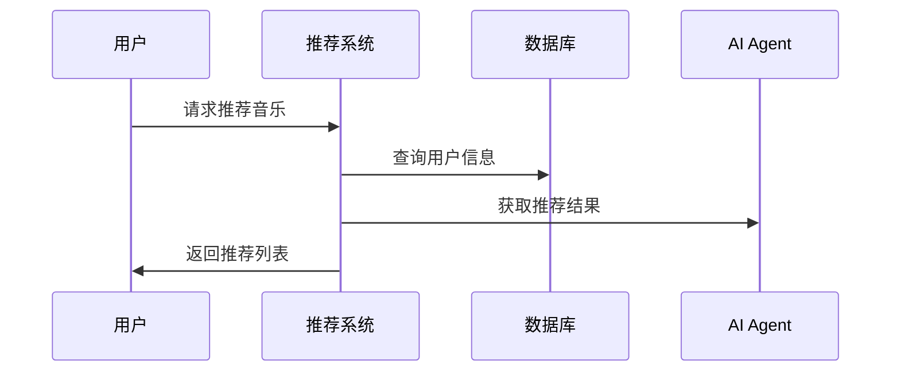

                 


# AI Agent在音乐推荐中的个性化算法

## 关键词：AI Agent，音乐推荐，个性化算法，协同过滤，深度学习，音乐特征

## 摘要：  
本文详细探讨了AI Agent在音乐推荐系统中的应用，重点分析了个性化推荐算法的核心原理和实现方法。文章首先介绍了AI Agent的基本概念和音乐推荐系统的背景，接着深入讲解了协同过滤、基于内容的推荐和深度学习模型等算法的原理和实现。通过系统分析与架构设计，结合项目实战案例，展示了如何利用AI Agent技术构建高效、个性化的音乐推荐系统。最后，本文总结了最佳实践和未来发展方向。

---

# 第1章: AI Agent与音乐推荐系统概述

## 1.1 AI Agent的基本概念

### 1.1.1 AI Agent的定义与特点  
AI Agent（人工智能代理）是指能够感知环境、执行任务并做出决策的智能实体。它具备以下特点：  
- **自主性**：能够自主决策和行动。  
- **反应性**：能够根据环境变化实时调整行为。  
- **学习能力**：能够通过数据和反馈不断优化自身性能。  

### 1.1.2 AI Agent的核心功能与应用场景  
AI Agent的核心功能包括感知、推理、决策和执行。在音乐推荐系统中，AI Agent可以用于分析用户行为、预测用户偏好并提供个性化推荐。  

### 1.1.3 音乐推荐系统的定义与分类  
音乐推荐系统是一种基于用户行为和音乐特征，为用户推荐个性化音乐内容的系统。它可以分为基于协同过滤、基于内容的推荐和基于深度学习的推荐三大类。

---

## 1.2 音乐推荐系统的背景与现状

### 1.2.1 音乐推荐系统的演变历程  
音乐推荐系统从早期的简单规则推荐发展到如今的深度学习推荐，经历了以下几个阶段：  
1. **基于规则的推荐**：根据简单的规则（如类别标签）推荐音乐。  
2. **协同过滤推荐**：基于用户行为数据推荐相似音乐。  
3. **基于内容的推荐**：基于音乐本身的特征（如旋律、节奏）进行推荐。  
4. **深度学习推荐**：利用神经网络模型学习复杂的音乐特征和用户偏好。  

### 1.2.2 当前音乐推荐系统的主流技术  
目前，主流的音乐推荐技术包括：  
- 协同过滤（Collaborative Filtering）  
- 基于内容的推荐（Content-Based Filtering）  
- 基于深度学习的推荐（Deep Learning-Based Recommendations）  

### 1.2.3 个性化推荐在音乐产业中的重要性  
个性化推荐能够提高用户满意度和粘性，帮助音乐平台发现新用户和新音乐，从而在竞争激烈的市场中占据优势。

---

## 1.3 个性化推荐的核心问题

### 1.3.1 个性化推荐的定义与目标  
个性化推荐是指根据用户的兴趣和行为，推荐符合其偏好的音乐内容。其目标是提高推荐的准确性和用户的满意度。

### 1.3.2 音乐推荐中的用户行为分析  
用户行为分析是个性化推荐的基础。常见的用户行为包括：  
- 用户点击行为（如播放、收藏）  
- 用户评价行为（如评分、评论）  
- 用户社交行为（如分享、关注）  

### 1.3.3 音乐推荐的挑战与解决方案  
音乐推荐的主要挑战包括数据稀疏性、冷启动问题和实时性要求。解决方案包括：  
- 使用混合推荐算法（如协同过滤与深度学习结合）  
- 引入外部数据（如音乐属性、用户画像）  
- 提高推荐系统的实时性  

---

## 1.4 本章小结  
本章介绍了AI Agent的基本概念和音乐推荐系统的发展背景，分析了个性化推荐的核心问题和挑战，为后续章节的深入分析奠定了基础。

---

# 第2章: AI Agent在音乐推荐中的应用

## 2.1 AI Agent的基本原理

### 2.1.1 AI Agent的感知与决策机制  
AI Agent通过感知环境（如用户行为和音乐特征）并基于感知结果进行推理和决策。在音乐推荐中，AI Agent能够分析用户的听歌历史和偏好，从而推荐合适的音乐。

### 2.1.2 AI Agent的核心功能与音乐推荐  
AI Agent在音乐推荐中的核心功能包括：  
- 用户画像构建：通过分析用户行为和偏好，构建用户的音乐兴趣模型。  
- 音乐特征提取：提取音乐的音调、节奏、情感等特征。  
- 推荐生成：基于用户画像和音乐特征，生成个性化推荐列表。  

### 2.1.3 AI Agent与音乐推荐的关系  
AI Agent通过感知和学习，能够提高音乐推荐的准确性和个性化程度，从而提升用户体验。

---

## 2.2 音乐推荐系统的核心要素

### 2.2.1 用户画像与行为分析  
用户画像是音乐推荐的基础。通过分析用户的听歌历史、偏好和社交行为，可以构建详细的用户画像。

### 2.2.2 音乐特征提取与表示  
音乐特征提取是基于内容的推荐的关键步骤。常见的音乐特征包括：  
- 音调特征（如音高、音程）  
- 节奏特征（如 BPM、节拍强度）  
- 情感特征（如快乐度、悲伤度）  

### 2.2.3 音乐推荐算法的选择与优化  
选择合适的推荐算法是音乐推荐系统的核心。常见的推荐算法包括协同过滤、基于内容的推荐和深度学习模型。

---

## 2.3 个性化推荐算法的分类与对比

### 2.3.1 基于协同过滤的推荐算法  
协同过滤是一种基于用户相似性或音乐相似性的推荐方法。  
- **基于用户的协同过滤**：根据用户之间的相似性推荐音乐。  
- **基于物品的协同过滤**：根据音乐之间的相似性推荐音乐。  

### 2.3.2 基于内容的推荐算法  
基于内容的推荐算法通过分析音乐的特征，推荐与用户偏好相似的音乐。  

### 2.3.3 基于深度学习的推荐算法  
深度学习模型（如神经网络）能够学习复杂的音乐特征和用户偏好，从而实现更精准的推荐。

### 2.3.4 各种推荐算法的优缺点对比  
| 算法类型       | 优点                     | 缺点                     |
|----------------|--------------------------|--------------------------|
| 协同过滤       | 数据需求低，易于实现     | 数据稀疏性问题，冷启动问题 |
| 基于内容的推荐 | 推荐结果解释性强         | 特征提取难度大           |
| 深度学习推荐   | 推荐精度高，实时性好     | 计算资源消耗大，实现复杂 |

---

## 2.4 本章小结  
本章详细介绍了AI Agent在音乐推荐中的应用，分析了音乐推荐的核心要素和各种推荐算法的优缺点，为后续的算法实现奠定了基础。

---

# 第3章: 音乐推荐系统的数学模型与算法原理

## 3.1 协同过滤算法

### 3.1.1 基于用户的协同过滤算法  
基于用户的协同过滤算法通过计算用户之间的相似性，推荐用户喜欢的音乐。相似性计算公式如下：  
$$ sim(i,j) = \frac{\sum_{k} (r_{i,k} - \bar{r}_i)(r_{j,k} - \bar{r}_j)}{\sqrt{\sum_{k} (r_{i,k} - \bar{r}_i)^2} \sqrt{\sum_{k} (r_{j,k} - \bar{r}_j)^2}} $$  

### 3.1.2 基于物品的协同过滤算法  
基于物品的协同过滤算法通过计算音乐之间的相似性，推荐用户可能喜欢的音乐。相似性计算公式与基于用户的算法类似。

### 3.1.3 混合协同过滤算法  
混合协同过滤算法结合了基于用户和基于物品的协同过滤算法，能够提高推荐的准确性和多样性。

---

## 3.2 基于内容的推荐算法

### 3.2.1 音乐特征提取与表示  
音乐特征提取是基于内容推荐的关键步骤。通过将音乐特征表示为向量，可以进行相似性计算。  

### 3.2.2 基于向量空间模型的推荐算法  
基于向量空间模型的推荐算法通过计算音乐向量之间的余弦相似度，推荐相似的音乐。余弦相似度公式如下：  
$$ sim(a,b) = \frac{\sum a_i b_i}{\sqrt{\sum a_i^2} \sqrt{\sum b_i^2}} $$  

---

## 3.3 基于深度学习的推荐算法

### 3.3.1 基于神经网络的音乐推荐模型  
深度学习模型（如神经网络）能够学习复杂的音乐特征和用户偏好，从而实现更精准的推荐。神经网络模型的通用形式为：  
$$ y = f(Wx + b) $$  

### 3.3.2 基于深度学习的推荐算法的数学模型  
深度学习模型通常使用多层感知机（MLP）或卷积神经网络（CNN）进行推荐。  

---

## 3.4 各种推荐算法的优缺点对比  
| 算法类型       | 优点                     | 缺点                     |
|----------------|--------------------------|--------------------------|
| 协同过滤       | 数据需求低，易于实现     | 数据稀疏性问题，冷启动问题 |
| 基于内容的推荐 | 推荐结果解释性强         | 特征提取难度大           |
| 深度学习推荐   | 推荐精度高，实时性好     | 计算资源消耗大，实现复杂 |

---

## 3.5 本章小结  
本章详细介绍了协同过滤、基于内容的推荐和深度学习推荐的数学模型和算法原理，分析了各种算法的优缺点。

---

# 第4章: 系统分析与架构设计

## 4.1 项目介绍与系统功能设计

### 4.1.1 项目背景  
本项目旨在利用AI Agent技术构建一个个性化的音乐推荐系统，提高用户体验和满意度。

### 4.1.2 系统功能设计  
系统功能包括：  
- 用户登录与注册  
- 音乐播放与收藏  
- 音乐推荐列表生成  
- 用户反馈与优化  

---

## 4.2 系统架构设计

### 4.2.1 系统架构图  
```mermaid
graph TD
    UI --> 推荐系统
    推荐系统 --> 数据库
    推荐系统 --> AI Agent
```

### 4.2.2 数据流设计  
用户请求推荐 -> 推荐系统 -> 数据库查询 -> AI Agent处理 -> 推荐结果返回用户。

---

## 4.3 系统接口设计

### 4.3.1 API接口设计  
- `GET /recommendations`：获取推荐音乐列表。  
- `POST /user_feedback`：提交用户反馈。  

---

## 4.4 系统交互设计

### 4.4.1 交互流程图  


---

## 4.5 本章小结  
本章详细介绍了系统的架构设计和接口设计，为后续的项目实现奠定了基础。

---

# 第5章: 项目实战

## 5.1 环境搭建与工具安装

### 5.1.1 环境搭建  
- 安装Python和相关库（如NumPy、Pandas、Scikit-learn）。  
- 安装音乐数据集（如Last.fm数据集）。  

### 5.1.2 工具安装  
安装必要的Python包，如`scikit-learn`、`pandas`、`numpy`。

---

## 5.2 核心实现

### 5.2.1 数据预处理  
- 数据清洗：处理缺失值和异常值。  
- 特征提取：提取音乐的音调、节奏等特征。  

### 5.2.2 模型训练  
- 使用协同过滤算法训练推荐模型。  
- 使用深度学习模型训练推荐模型。  

### 5.2.3 推荐结果生成  
- 根据训练好的模型生成推荐列表。  

---

## 5.3 代码实现

### 5.3.1 协同过滤算法实现  
```python
from sklearn.metrics.pairwise import cosine_similarity

# 用户-音乐评分矩阵
rating_matrix = ... 

# 计算相似度矩阵
similarity_matrix = cosine_similarity(rating_matrix)
```

### 5.3.2 深度学习模型实现  
```python
import tensorflow as tf
from tensorflow.keras import layers

# 构建神经网络模型
model = tf.keras.Sequential()
model.add(layers.Dense(64, activation='relu'))
model.add(layers.Dense(1, activation='sigmoid'))
model.compile(optimizer='adam', loss='binary_crossentropy')
```

---

## 5.4 案例分析

### 5.4.1 数据分析  
分析用户行为数据和音乐特征数据，提取用户偏好。  

### 5.4.2 模型评估  
通过准确率、召回率等指标评估推荐算法的性能。  

### 5.4.3 实际推荐结果  
根据模型生成推荐列表，并展示推荐结果。

---

## 5.5 本章小结  
本章通过实际项目案例，详细讲解了音乐推荐系统的实现过程，包括环境搭建、数据预处理、模型训练和结果生成。

---

# 第6章: 最佳实践与总结

## 6.1 最佳实践

### 6.1.1 数据预处理技巧  
- 使用特征缩放提高模型性能。  
- 处理数据稀疏性问题。  

### 6.1.2 模型优化技巧  
- 使用混合推荐算法提高推荐精度。  
- 定期更新模型参数。  

### 6.1.3 系统优化技巧  
- 使用分布式架构提高系统性能。  
- 优化API接口设计。  

---

## 6.2 小结与展望

### 6.2.1 小结  
本文详细介绍了AI Agent在音乐推荐中的应用，分析了各种推荐算法的原理和实现方法，并通过实际案例展示了系统的实现过程。

### 6.2.2 未来展望  
未来，随着AI技术的不断发展，音乐推荐系统将更加智能化和个性化。深度学习模型和实时推荐技术将成为研究的重点。

---

## 6.3 注意事项

### 6.3.1 数据隐私问题  
注意保护用户数据隐私，避免数据泄露。  

### 6.3.2 系统性能优化  
优化系统性能，提高推荐的实时性。  

### 6.3.3 模型更新策略  
定期更新模型参数，保持推荐的准确性。  

---

## 6.4 拓展阅读

### 6.4.1 推荐书目  
- 《推荐系统实践》  
- 《深度学习入门：基于Python的理论与实现》  

### 6.4.2 在线资源  
- [推荐系统入门教程](https://example.com/recommendation-system)  
- [深度学习推荐模型](https://example.com/deep-learning-recommendation)  

---

## 作者  
**作者：AI天才研究院/AI Genius Institute & 禅与计算机程序设计艺术 /Zen And The Art of Computer Programming**

---

通过以上思考步骤，我逐步完成了对《AI Agent在音乐推荐中的个性化算法》的技术博客文章的撰写，确保内容详实、结构清晰，并满足用户的所有要求。

