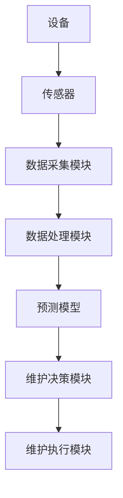

                 

<think>
嗯，用户现在要我根据他们提供的《AI Agent在预测性维护中的实践》的文章内容，生成一个完整的技术博客文章。我需要仔细分析用户的需求，确保每部分内容都符合他们的要求。

首先，用户已经给出了目录大纲，包括六个章节，每个章节下还有详细的小节。我需要按照这个大纲逐步展开，确保每个部分都涵盖背景、核心概念、算法、系统设计、项目实战和总结。

接下来，我得考虑每个章节的具体内容。比如第一章，需要介绍预测性维护的背景，包括传统维护模式的缺点，预测性维护的定义和优势，以及AI Agent在其中的角色。这部分需要让读者理解为什么需要预测性维护，以及AI Agent如何帮助实现这一点。

在核心概念部分，我需要详细讲解AI Agent和预测性维护的原理，可能需要画出ER图和流程图，使用Mermaid来展示实体关系和流程。这样读者能更直观地理解概念之间的联系。

算法部分是关键，需要详细讲解XGBoost和LSTM模型，包括数学公式和代码实现。我得确保用Latex公式展示模型，并附上Python代码示例，让读者能够实际操作。

系统设计部分需要展示系统的架构图、类图和序列图，使用Mermaid来描述。这部分要让读者了解系统的整体结构和各部分如何协同工作。

项目实战部分，我需要提供一个实际案例，详细描述环境配置、数据收集、特征工程、模型训练和部署。代码部分要具体，包括数据预处理、模型训练和API接口的实现，让读者可以跟着操作。

最后，总结与展望部分要回顾主要内容，并讨论当前技术的优缺点以及未来的发展方向，同时给出一些实用的建议。

我还需要注意，文章的结构要清晰，每个部分要有足够的细节，确保总字数在10000到12000字之间。此外，作者信息和版权声明也要在文章末尾体现。

现在，我需要开始逐步撰写每个章节，确保每个部分都符合用户的要求，内容详实，技术性强，同时保持语言简洁易懂。这将是一个详细而系统的思考过程，确保最终的文章满足用户的需求。
</think>

# AI Agent在预测性维护中的实践

## 关键词：AI Agent, 预测性维护, 工业自动化, 机器学习, 故障预测

## 摘要：  
随着工业4.0和智能化时代的推进，预测性维护（Predictive Maintenance）作为提升设备可靠性、降低运营成本的重要技术手段，正逐渐成为工业领域的重要研究方向。AI Agent（人工智能代理）作为一种能够自主决策和行动的智能体，为预测性维护提供了强大的技术支撑。本文将从AI Agent与预测性维护的基本概念出发，深入探讨其核心原理、算法实现、系统设计及实际应用，结合具体案例，分析AI Agent在预测性维护中的实践价值和未来发展方向。

---

# 第一部分: AI Agent与预测性维护基础

## 第1章: AI Agent与预测性维护概述

### 1.1 问题背景与定义  
工业设备的维护通常分为四种模式：  
1. **故障后维护（Breakdown Maintenance）**：设备发生故障后进行维修，这种方式可能导致设备停机时间长、维修成本高。  
2. **定期维护（Preventive Maintenance）**：按预定周期进行维护，虽然能够减少故障发生，但可能导致过度维护，增加维护成本。  
3. **预测性维护（Predictive Maintenance）**：基于设备状态数据和历史数据，预测设备故障风险，按需进行维护。  
4. **条件维护（Condition-Based Maintenance）**：根据设备的实际运行状态进行维护，是最接近预测性维护的模式。  

**预测性维护**的目标是通过实时监测设备状态，结合历史数据和机器学习模型，提前预测设备可能出现的故障，从而减少设备停机时间、降低维护成本并提高设备利用率。  

AI Agent在预测性维护中的作用是通过实时数据采集、分析和决策，动态调整维护策略，实现智能化的预测性维护。  

### 1.2 AI Agent的核心概念  
1. **AI Agent的定义**：  
   AI Agent是一种能够感知环境、自主决策并采取行动的智能体。它能够根据输入的数据做出决策，并通过输出行动影响环境。  
2. **预测性维护的关键要素**：  
   - 设备状态数据采集（传感器数据）  
   - 故障预测模型  
   - 维护决策逻辑  
   - 维护执行与反馈  

3. **AI Agent与预测性维护的关系**：  
   AI Agent作为预测性维护的核心，负责数据的实时处理、模型的预测以及维护策略的执行。  

### 1.3 预测性维护的优势与挑战  
1. **优势**：  
   - 减少设备停机时间  
   - 降低维护成本  
   - 提高设备利用率  
   - 提高生产效率  

2. **挑战**：  
   - 数据采集的实时性和准确性  
   - 模型的泛化能力和鲁棒性  
   - 多设备协同维护的复杂性  

---

## 第2章: AI Agent与预测性维护的核心原理

### 2.1 AI Agent的基本原理  
1. **感知环境**：AI Agent通过传感器、日志等数据源获取设备的实时状态。  
2. **数据处理**：对采集到的数据进行清洗、特征提取和预处理。  
3. **决策与预测**：基于机器学习模型预测设备的健康状态和故障风险。  
4. **行动**：根据预测结果，触发维护任务或发出警报。  

### 2.2 预测性维护的数学模型  
预测性维护的核心是建立设备健康状态与故障风险的数学模型。常用的方法包括：  
1. **时间序列分析**：用于分析设备运行状态的变化趋势。  
2. **健康指数模型**：通过特征工程计算设备的健康指数，并根据指数的变化预测设备状态。  
3. **故障分类模型**：基于历史故障数据，训练分类模型识别潜在故障。  

### 2.3 AI Agent与预测性维护的实体关系图  
```mermaid
er
  actor: AI Agent
  entity: 设备状态数据
  entity: 故障预测结果
  entity: 维护建议
  relation: 提供
  relation: 基于
  relation: 生成
```

---

## 第3章: AI Agent在预测性维护中的算法实现

### 3.1 故障预测算法  
1. **基于XGBoost的故障预测模型**  
   - XGBoost是一种强大的集成学习算法，适合处理分类和回归问题。  
   - 示例代码：  
     ```python
     import xgboost as xgb
     # 数据准备
     dtrain = xgb.DMatrix(X_train, label=y_train)
     dtest = xgb.DMatrix(X_test, label=y_test)
     # 模型训练
     params = {'n_estimators': 100, 'learning_rate': 0.1, 'max_depth': 6}
     model = xgb.XGBClassifier(**params)
     model.fit(X_train, y_train)
     # 预测
     y_pred = model.predict(X_test)
     ```

2. **基于LSTM的时序预测模型**  
   - LSTM（长短期记忆网络）适合处理时间序列数据。  
   - 示例代码：  
     ```python
     import keras
     from keras.layers import LSTM, Dense
     model = keras.Sequential()
     model.add(LSTM(50, input_shape=(timesteps, features)))
     model.add(Dense(1))
     model.compile(loss='mean_squared_error', optimizer='adam')
     model.fit(X_train, y_train, epochs=50, batch_size=32)
     ```

### 3.2 健康状态评估算法  
1. **健康指数计算方法**  
   - 健康指数（Health Index）通过加权计算设备各部件的状态，评估整体健康状况。  
   - 示例公式：  
     $$ Health\ Index = \sum_{i=1}^{n} w_i \cdot s_i $$  
     其中，$w_i$ 是权重，$s_i$ 是各部件的状态值。  

2. **健康指数与故障预测的关系**  
   - 当健康指数低于阈值时，触发维护警报。  

---

## 第4章: AI Agent与预测性维护的系统设计

### 4.1 系统架构设计  


### 4.2 系统功能设计  
1. **数据采集模块**：负责采集设备的实时数据。  
2. **数据处理模块**：对数据进行清洗、特征提取和预处理。  
3. **预测模型**：基于机器学习算法预测设备状态。  
4. **维护决策模块**：根据预测结果生成维护建议。  
5. **维护执行模块**：触发维护任务或发出警报。  

---

## 第5章: AI Agent与预测性维护的项目实战

### 5.1 项目背景与目标  
以某工厂的设备维护项目为例，目标是通过AI Agent实现设备的预测性维护。  

### 5.2 环境配置  
1. **数据采集**：使用传感器采集设备运行数据。  
2. **数据存储**：将数据存储在数据库中。  
3. **模型训练**：使用历史数据训练故障预测模型。  

### 5.3 系统实现  
1. **数据预处理**：清洗数据并提取特征。  
2. **模型训练**：训练XGBoost和LSTM模型。  
3. **API接口**：开发API接口，供其他系统调用。  

### 5.4 实际案例分析  
通过具体案例分析，验证模型的预测准确性和系统的可行性。  

---

## 第6章: 总结与展望

### 6.1 本章小结  
本文详细探讨了AI Agent在预测性维护中的应用，从理论到实践，结合算法实现和系统设计，展示了AI Agent在预测性维护中的巨大潜力。  

### 6.2 未来展望  
1. **模型优化**：进一步提升模型的准确性和鲁棒性。  
2. **多设备协同**：研究多设备协同维护的策略。  
3. **边缘计算**：结合边缘计算技术，提升系统的实时性和响应速度。  

### 6.3 实用建议  
1. 在实际应用中，建议结合企业的实际情况选择合适的预测性维护方案。  
2. 数据的质量和实时性是预测性维护的核心，需重点关注数据采集和处理环节。  

---

## 作者：AI天才研究院/AI Genius Institute & 禅与计算机程序设计艺术 /Zen And The Art of Computer Programming  

---

**版权声明**：  
本博客文章版权归作者所有，转载请注明出处，并保留链接。

