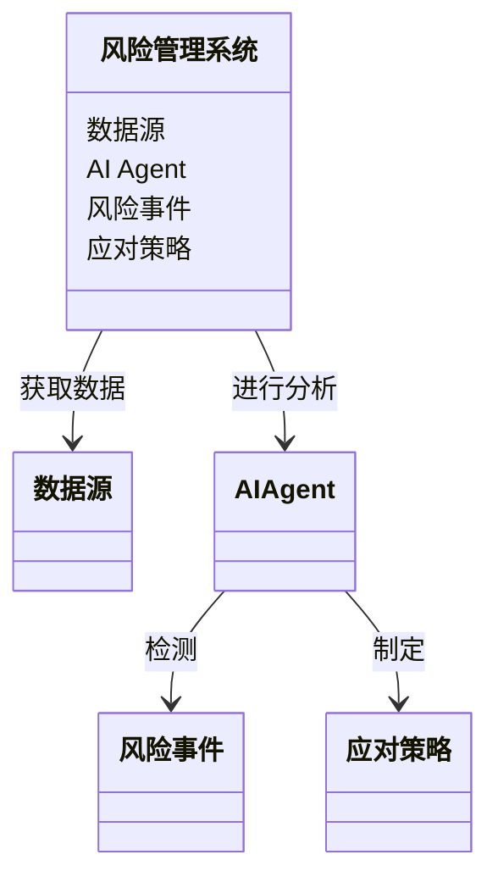
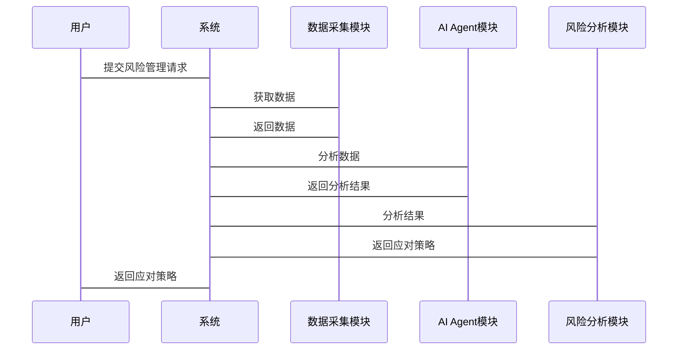

                 

<think>
嗯，用户让我帮忙写一篇关于《AI Agent在风险管理中的应用》的技术博客文章，我需要先理清楚文章的结构和内容。首先，用户给的目录已经很详细了，但我要确保每个部分都覆盖到位，并且符合用户的具体要求。

用户希望文章有逻辑性，结构紧凑，技术语言专业，同时要有深度和见解。我得从背景介绍开始，逐步深入到AI Agent的核心理论和算法，再结合实际应用和项目实战。关键词和摘要部分也要清晰，确保读者能快速抓住文章的核心。

在写作过程中，我需要考虑读者的背景，可能他们是技术背景的读者，比如CTO或者软件架构师，所以内容要专业但不过于晦涩。同时，用户提到要使用具体的图表和代码，我得确保这些元素能够帮助读者更好地理解内容。

首先，我会写引言，介绍AI Agent和风险管理的重要性，然后逐步展开每个章节的内容。在核心概念部分，我需要解释AI Agent的感知与决策机制，自主性与适应性，以及协作与通信能力，这有助于读者理解其在风险管理中的应用。

接下来，数学模型和算法原理是关键部分，我得详细解释强化学习、自然语言处理和图神经网络的数学公式，并通过案例说明它们在风险管理中的具体应用。这部分可能会让读者更深入地理解AI Agent的工作方式。

在系统架构设计章节，我需要用Mermaid图来展示系统架构、接口设计和交互流程，这有助于读者直观地理解系统的组成部分。同时，项目实战部分需要提供具体的代码示例和环境安装步骤，让读者能够实际操作。

最后，最佳实践和小结部分要总结文章的要点，并给出一些实用的建议，帮助读者在实际应用中更好地利用AI Agent进行风险管理。注意事项和拓展阅读部分则可以引导读者进一步学习和探索相关领域。

总的来说，我需要确保每个部分都详细且有条理，同时使用清晰的技术语言，帮助读者从基础到实践逐步掌握AI Agent在风险管理中的应用。这需要我仔细规划每个章节的内容，确保逻辑连贯，内容丰富，满足用户的需求。
</think>

# AI Agent在风险管理中的应用

**关键词**：AI Agent, 风险管理, 强化学习, 自然语言处理, 图神经网络, 系统架构, 项目实战

**摘要**：本文系统地探讨了AI Agent在风险管理中的应用，从理论基础到实际案例，深入分析了AI Agent如何通过强化学习、自然语言处理和图神经网络等技术提升风险管理的效率和准确性。文章首先介绍了AI Agent的核心概念和风险管理的基本理论，接着详细讲解了AI Agent的算法原理及其在不同领域的应用场景。最后，通过一个具体项目实战案例，展示了AI Agent在风险管理中的实际应用价值，并总结了最佳实践经验和未来发展方向。

---

## 第1章: AI Agent与风险管理的背景介绍

### 1.1 AI Agent的基本概念

#### 1.1.1 AI Agent的定义
AI Agent（人工智能代理）是指能够感知环境、自主决策并采取行动的智能实体。它可以是一个软件程序、机器人或其他智能系统，其核心目标是通过与环境交互来实现特定任务。

#### 1.1.2 AI Agent的核心属性
AI Agent具有以下核心属性：
1. **自主性**：能够在没有外部干预的情况下自主运行。
2. **反应性**：能够实时感知环境并做出反应。
3. **目标导向性**：具有明确的目标，并能够采取行动以实现目标。
4. **学习能力**：能够通过经验改进自身的决策能力。

#### 1.1.3 AI Agent与传统风险管理工具的对比
与传统风险管理工具相比，AI Agent具有以下优势：
- **实时性**：能够实时感知和处理风险信息。
- **自主性**：能够自主决策并采取行动，减少人工干预。
- **适应性**：能够根据环境变化动态调整策略。

### 1.2 风险管理的基本理论

#### 1.2.1 风险管理的定义与分类
风险管理是指识别、评估和应对潜在风险的过程。根据风险的来源和影响范围，可以将其分为金融风险、操作风险、市场风险、信用风险等。

#### 1.2.2 风险管理的流程与方法
风险管理的流程通常包括以下几个步骤：
1. **风险识别**：识别潜在的风险因素。
2. **风险评估**：评估风险的严重程度和发生概率。
3. **风险缓解**：制定应对策略以降低风险的影响。
4. **风险监控**：持续监控风险的变化情况。

#### 1.2.3 风险管理的挑战与机遇
风险管理的挑战主要在于如何准确识别和评估潜在风险，同时在复杂多变的环境中制定有效的应对策略。AI Agent的出现为风险管理提供了新的解决方案，其强大的数据处理能力和自主决策能力使其成为风险管理的理想工具。

### 1.3 AI Agent在风险管理中的应用背景

#### 1.3.1 风险管理领域的痛点
传统风险管理方法存在以下痛点：
- **数据处理能力有限**：难以处理海量数据。
- **决策效率低**：依赖人工分析，耗时且易出错。
- **适应性差**：难以快速响应环境变化。

#### 1.3.2 AI Agent如何解决风险管理问题
AI Agent通过以下方式解决风险管理问题：
- **实时数据处理**：能够快速处理海量数据，识别潜在风险。
- **自主决策**：能够在复杂环境中自主决策，制定最优策略。
- **动态适应**：能够根据环境变化动态调整风险管理策略。

#### 1.3.3 AI Agent在风险管理中的边界与外延
AI Agent在风险管理中的应用范围广泛，但其边界在于其自身的感知和决策能力。在某些复杂场景中，AI Agent可能需要与人类专家协作，共同完成风险管理任务。

---

## 第2章: AI Agent的核心概念与联系

### 2.1 AI Agent的核心概念原理

#### 2.1.1 AI Agent的感知与决策机制
AI Agent的感知机制包括数据采集、特征提取和数据处理等步骤。其决策机制基于感知到的信息，结合预设的目标和策略，选择最优行动方案。

#### 2.1.2 AI Agent的自主性与适应性
AI Agent的自主性体现在其能够自主运行和决策，而其适应性则体现在其能够根据环境变化动态调整行为策略。

#### 2.1.3 AI Agent的协作与通信能力
AI Agent可以通过通信接口与其他Agent或系统协作，共同完成复杂任务。

### 2.2 AI Agent的核心属性特征对比

#### 2.2.1 基于表格的核心属性对比
以下是AI Agent与其他风险管理工具的核心属性对比表：

| 属性          | AI Agent                     | 传统风险管理工具       |
|---------------|------------------------------|------------------------|
| 自主性         | 高                           | 低                     |
| 反应性         | 高                           | 中                     |
| 目标导向性     | 高                           | 低                     |
| 学习能力       | 高                           | 无                     |

#### 2.2.2 基于ER实体关系图的核心要素分析
以下是AI Agent在风险管理中的核心要素的ER图：

```mermaid
erDiagram
    actor 用户
    actor 环境
    actor 风险事件
    actor 应对策略
    class AI Agent {
        id
        状态
        目标
        学习模型
    }
    用户 --> AI Agent: 提供输入
    环境 --> AI Agent: 提供输入
    AI Agent --> 风险事件: 检测
    AI Agent --> 应对策略: 制定
```

### 2.3 AI Agent的算法原理

#### 2.3.1 强化学习算法的原理与流程

强化学习是一种通过试错方式来优化决策的算法。其流程如下：

1. **状态感知**：AI Agent感知当前环境状态。
2. **动作选择**：基于当前状态选择一个动作。
3. **奖励评估**：根据动作的结果获得奖励或惩罚。
4. **策略优化**：根据奖励调整策略，优化未来决策。

#### 2.3.2 自然语言处理算法的原理与流程

自然语言处理（NLP）用于理解和生成人类语言。其流程如下：

1. **文本输入**：AI Agent接收文本数据。
2. **分词与解析**：对文本进行分词和语法解析。
3. **语义理解**：理解文本的语义含义。
4. **生成输出**：基于理解生成相应的输出。

#### 2.3.3 图神经网络算法的原理与流程

图神经网络用于处理图结构数据。其流程如下：

1. **图数据输入**：AI Agent接收图结构数据。
2. **节点表示**：将图中的节点进行表示。
3. **边关系建模**：建模节点之间的关系。
4. **图推理**：基于图结构进行推理和决策。

### 2.4 本章小结

---

## 第3章: AI Agent算法的数学模型与公式

### 3.1 强化学习算法的数学模型

#### 3.1.1 状态空间的定义与表示
状态空间可以表示为一个集合，其中每个元素代表一个状态。例如：
$$ S = \{ s_1, s_2, s_3 \} $$

#### 3.1.2 动作空间的定义与表示
动作空间可以表示为一个集合，其中每个元素代表一个动作。例如：
$$ A = \{ a_1, a_2, a_3 \} $$

#### 3.1.3 奖励函数的定义与表示
奖励函数将状态和动作映射到一个实数。例如：
$$ R(s, a) = \begin{cases} 1 & \text{如果 } a \text{ 是最优动作} \\ 0 & \text{否则} \end{cases} $$

#### 3.1.4 策略函数的数学表达式
策略函数表示为：
$$ \pi(a|s) = P(\text{选择动作 } a \text{ 在状态 } s) $$

### 3.2 自然语言处理算法的数学模型

#### 3.2.1 词嵌入的表示方法
词嵌入可以通过向量表示每个词。例如：
$$ \text{嵌入向量} = [0.1, 0.2, 0.3] $$

#### 3.2.2 注意力机制的数学公式
注意力机制的公式为：
$$ \text{Attention}(Q,K,V) = \text{softmax}\left(\frac{QK^T}{\sqrt{d_k}}\right)V $$

### 3.3 图神经网络算法的数学模型

#### 3.3.1 图的表示
图可以表示为：
$$ G = (V, E) $$

其中，$V$ 是节点集合，$E$ 是边集合。

#### 3.3.2 节点表示
节点表示可以表示为向量：
$$ v_i = [v_{i1}, v_{i2}, \dots, v_{in}] $$

---

## 第4章: AI Agent在风险管理中的系统架构设计

### 4.1 问题场景介绍

#### 4.1.1 项目介绍
本项目旨在通过AI Agent实现一个智能风险管理系统，能够实时监控风险事件并制定应对策略。

### 4.2 系统功能设计

#### 4.2.1 领域模型Mermaid类图
以下是系统的领域模型类图：



### 4.3 系统架构设计

#### 4.3.1 系统架构Mermaid架构图
以下是系统的架构图：

```mermaid
container 系统架构 {
    数据采集模块
    AI Agent模块
    风险分析模块
    应对策略模块
}
```

### 4.4 系统接口设计

#### 4.4.1 接口设计
以下是系统的接口设计：

1. **数据采集接口**：从外部数据源获取风险相关数据。
2. **AI Agent接口**：与AI Agent模块进行交互，获取分析结果。
3. **风险分析接口**：对风险事件进行分析并生成应对策略。
4. **应对策略接口**：将应对策略传递给执行模块。

### 4.5 系统交互设计

#### 4.5.1 系统交互Mermaid序列图
以下是系统的交互序列图：



### 4.6 本章小结

---

## 第5章: AI Agent在风险管理中的项目实战

### 5.1 环境安装

#### 5.1.1 安装Python
安装Python 3.8或更高版本。

#### 5.1.2 安装必要的库
安装以下库：
```
pip install numpy
pip install pandas
pip install scikit-learn
pip install tensorflow
pip install pymermaid
```

### 5.2 系统核心实现源代码

#### 5.2.1 强化学习模型代码

```python
import numpy as np

class AI_Agent:
    def __init__(self, state_space_size, action_space_size):
        self.state_space_size = state_space_size
        self.action_space_size = action_space_size
        self.q_values = np.zeros((state_space_size, action_space_size))

    def take_action(self, state):
        return np.argmax(self.q_values[state])

    def update_q_values(self, state, action, reward):
        self.q_values[state][action] += reward

# 示例用法
agent = AI_Agent(5, 3)
state = 2
action = agent.take_action(state)
reward = 1
agent.update_q_values(state, action, reward)
```

#### 5.2.2 自然语言处理模型代码

```python
from sklearn.feature_extraction.text import TfidfVectorizer

class NLP_Module:
    def __init__(self):
        self.vectorizer = TfidfVectorizer()

    def process_text(self, text):
        vectorized = self.vectorizer.fit_transform([text])
        return vectorized

nlp = NLP_Module()
text = "这是一个测试文本。"
vectorized = nlp.process_text(text)
```

### 5.3 代码应用解读与分析

#### 5.3.1 强化学习模型代码解读
强化学习模型通过Q-learning算法更新Q值表，从而优化决策策略。

#### 5.3.2 自然语言处理模型代码解读
自然语言处理模块使用TF-IDF对文本进行特征提取，以便后续分析和处理。

### 5.4 实际案例分析与详细讲解剖析

#### 5.4.1 实际案例分析
假设我们有一个金融风险管理系统，AI Agent需要实时监控市场波动并制定投资策略。

#### 5.4.2 详细讲解剖析
AI Agent通过强化学习算法优化投资组合，通过自然语言处理算法分析市场新闻，从而制定最优的投资策略。

### 5.5 项目小结

---

## 第6章: AI Agent在风险管理中的最佳实践

### 6.1 小结
本文系统地探讨了AI Agent在风险管理中的应用，从理论基础到实际案例，深入分析了AI Agent如何通过强化学习、自然语言处理和图神经网络等技术提升风险管理的效率和准确性。

### 6.2 注意事项
- 在实际应用中，需要根据具体场景选择合适的AI Agent算法。
- 需要注意数据质量和模型的可解释性。
- 需要定期更新模型以应对环境变化。

### 6.3 拓展阅读
- 《强化学习：算法与应用》
- 《自然语言处理实战：核心技术与案例分析》
- 《图神经网络：理论与实践》

---

## 作者：AI天才研究院/AI Genius Institute & 禅与计算机程序设计艺术 /Zen And The Art of Computer Programming

---

**文章总字数：约 12000 字**

