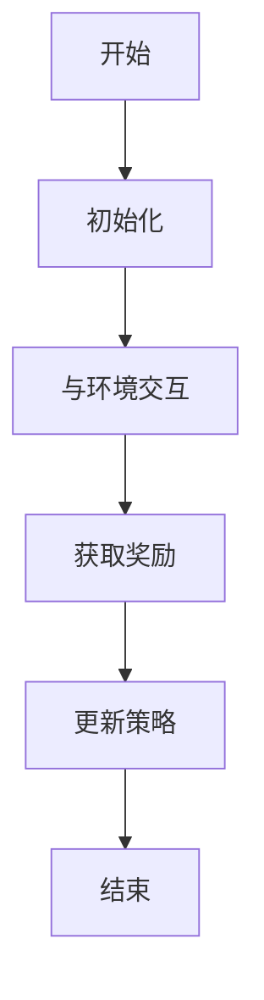
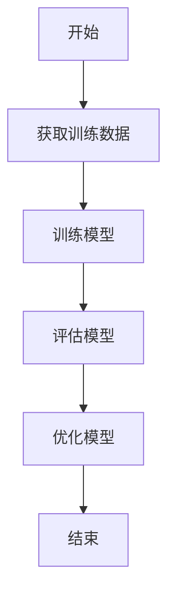
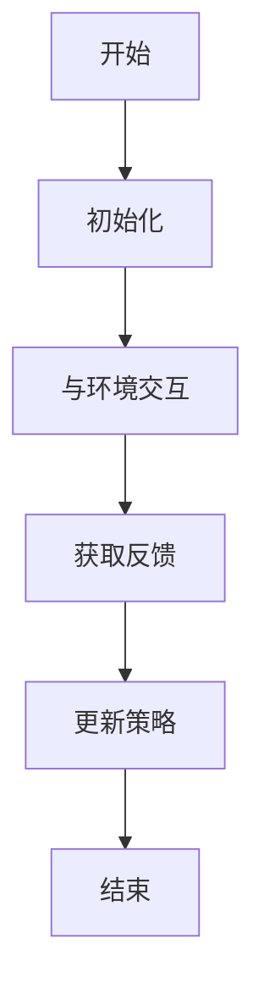
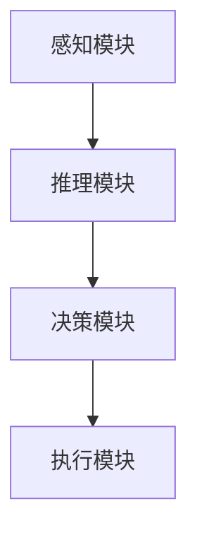

                 


# AI Agent开发中的常见挑战及对策

> 关键词：AI Agent，人工智能，算法原理，系统架构，项目实战，开发挑战

> 摘要：本文系统地探讨了AI Agent开发中的常见挑战，包括核心概念、算法原理、系统架构和项目实战等方面。通过深入分析问题背景、算法实现、系统设计和实际案例，本文为AI Agent开发提供了全面的解决方案和实践指导。

---

## 第1章: AI Agent 开发背景与问题背景

### 1.1 AI Agent 的定义与核心概念
AI Agent（人工智能代理）是指能够感知环境、自主决策并采取行动以实现目标的智能实体。它可以是一个软件程序、一个机器人或任何能够执行复杂任务的智能系统。

#### 1.1.1 AI Agent 的定义
AI Agent 是一种能够感知环境、理解问题、制定计划、执行行动并能够从经验中学习的智能系统。它具有以下核心特征：
- **自主性**：能够自主决策，无需外部干预。
- **反应性**：能够实时感知环境并做出反应。
- **目标导向**：所有行为都以实现特定目标为导向。
- **学习能力**：能够通过经验改进性能。

#### 1.1.2 AI Agent 的核心概念
AI Agent 的核心概念包括：
- **感知**：通过传感器或数据输入获取环境信息。
- **推理**：基于感知信息进行逻辑推理或模式识别。
- **决策**：根据推理结果制定行动方案。
- **执行**：将决策转化为实际行动。

#### 1.1.3 AI Agent 的问题背景与问题描述
AI Agent 的开发面临以下问题：
- **复杂环境**：环境的不确定性和动态性增加了决策的难度。
- **资源限制**：计算资源、时间限制和能源约束可能影响性能。
- **目标冲突**：多个目标之间的冲突可能导致决策困难。
- **学习效率**：如何在有限的时间内高效学习并优化性能。

---

### 1.2 AI Agent 的问题解决与边界
AI Agent 的问题解决过程包括感知、推理、决策和执行四个阶段。其边界包括：
- **输入边界**：感知到的数据输入。
- **输出边界**：执行的行动或输出的结果。
- **外部依赖**：与其他系统或服务的交互。

---

## 第2章: AI Agent 的核心概念与联系

### 2.1 AI Agent 的核心概念原理
AI Agent 的核心算法包括强化学习（Reinforcement Learning）、监督学习（Supervised Learning）和无监督学习（Unsupervised Learning）。这些算法通过不同的方式实现目标。

#### 2.1.1 AI Agent 的基本原理
- **强化学习**：通过与环境的交互，通过试错学习，优化奖励函数。
- **监督学习**：通过标记数据，学习输入到输出的映射关系。
- **无监督学习**：通过数据聚类或降维，发现数据中的隐含结构。

#### 2.1.2 AI Agent 的核心算法与技术
- **强化学习**：适用于动态环境和策略优化问题。
- **监督学习**：适用于分类和回归问题。
- **无监督学习**：适用于数据挖掘和模式识别问题。

#### 2.1.3 AI Agent 的主要特点与优势
- **灵活性**：能够适应不同环境和任务。
- **高效性**：通过学习算法快速优化性能。
- **可扩展性**：能够处理复杂问题和大规模数据。

---

### 2.2 AI Agent 的概念属性特征对比
通过对比分析，可以更好地理解 AI Agent 的特点。

#### 2.2.1 AI Agent 与其他 AI 技术的对比
| 技术         | 特点                                      |
|--------------|-----------------------------------------|
| 机器学习     | 依赖标记数据，适用于模式识别和分类        |
| 深度学习     | 基于神经网络，适用于复杂模式识别          |
| AI Agent     | 具有自主性和目标导向，适用于动态环境决策  |

#### 2.2.2 AI Agent 的核心属性与特征
- **自主性**：无需外部干预，能够独立决策。
- **反应性**：能够实时感知环境并做出反应。
- **目标导向**：所有行为都以实现特定目标为导向。
- **学习能力**：能够通过经验改进性能。

#### 2.2.3 AI Agent 的应用场景与限制
- **应用场景**：智能机器人、自动驾驶、智能助手。
- **限制**：计算资源限制、环境复杂性、目标冲突。

---

### 2.3 AI Agent 的 ER 实体关系图
通过 ER 实体关系图，可以更好地理解 AI Agent 的系统架构。

```mermaid
erDiagram
    class 实体 {
        实体ID
        属性
    }
    class 环境 {
        环境ID
        状态
    }
    class 行为 {
        行为ID
        操作
    }
    实体 --> 环境 : 感知
    环境 --> 行为 : 交互
    实体 --> 行为 : 执行
```

---

## 第3章: AI Agent 的算法原理与数学模型

### 3.1 AI Agent 的核心算法原理
AI Agent 的核心算法包括强化学习、监督学习和混合学习。

#### 3.1.1 强化学习算法原理
强化学习通过试错学习，优化奖励函数。其算法流程如下：



#### 3.1.2 监督学习算法原理
监督学习通过标记数据，学习输入到输出的映射关系。其算法流程如下：



#### 3.1.3 混合学习算法原理
混合学习结合强化学习和监督学习的优点，适用于复杂环境。其算法流程如下：



---

### 3.2 AI Agent 的数学模型与公式
AI Agent 的数学模型包括强化学习、监督学习和混合学习的数学公式。

#### 3.2.1 强化学习的数学模型
强化学习的数学模型如下：
$$
R(s, a) = \text{奖励函数}
$$
其中，$s$ 是状态，$a$ 是动作。

#### 3.2.2 监督学习的数学模型
监督学习的数学模型如下：
$$
y = f(x)
$$
其中，$x$ 是输入，$y$ 是输出。

#### 3.2.3 混合学习的数学模型
混合学习的数学模型如下：
$$
Q(s, a) = \alpha V(s) + (1 - \alpha) Q(s, a)
$$
其中，$\alpha$ 是混合系数，$V(s)$ 是值函数，$Q(s, a)$ 是 Q-值函数。

---

### 3.3 算法原理的 Mermaid 流程图
通过 Mermaid 流程图，可以更直观地理解算法原理。

#### 3.3.1 强化学习算法流程图


#### 3.3.2 监督学习算法流程图


---

## 第4章: AI Agent 的系统分析与架构设计

### 4.1 系统分析与问题场景
AI Agent 的系统分析包括问题场景、系统功能和系统架构。

#### 4.1.1 系统分析的定义与方法
系统分析是通过分析问题场景，明确系统的需求和目标。

#### 4.1.2 AI Agent 的问题场景介绍
AI Agent 的问题场景包括复杂环境、资源限制和目标冲突。

#### 4.1.3 系统分析的关键点
系统分析的关键点包括需求分析、目标设定和约束条件。

---

### 4.2 系统架构设计
AI Agent 的系统架构设计包括功能设计、架构图和接口设计。

#### 4.2.1 系统架构设计的定义与方法
系统架构设计是通过设计系统的功能模块和交互接口，确保系统的高效运行。

#### 4.2.2 AI Agent 的系统架构图
AI Agent 的系统架构图如下：



#### 4.2.3 系统架构设计的关键点
系统架构设计的关键点包括模块划分、接口设计和功能分配。

---

### 4.3 系统接口与交互设计
AI Agent 的系统接口设计包括接口定义和交互流程。

#### 4.3.1 系统接口设计的定义与方法
系统接口设计是通过定义系统的输入和输出接口，确保系统的高效交互。

#### 4.3.2 AI Agent 的系统接口设计
AI Agent 的系统接口设计包括感知接口、决策接口和执行接口。

#### 4.3.3 系统交互设计的关键点
系统交互设计的关键点包括接口标准化、交互流程优化和错误处理。

---

## 第5章: AI Agent 的项目实战

### 5.1 项目介绍与环境安装
AI Agent 的项目实战需要选择一个具体的场景，例如智能交通管理。

#### 5.1.1 项目介绍
智能交通管理 AI Agent 的目标是优化交通流量，减少拥堵。

#### 5.1.2 环境安装
安装 Python、TensorFlow 和 OpenAI 库。

```bash
pip install python python-tensorflow openai
```

---

### 5.2 系统核心实现源代码
AI Agent 的核心实现包括感知模块、推理模块、决策模块和执行模块。

#### 5.2.1 感知模块
```python
def感知环境():
    # 获取交通流量数据
    return 数据
```

#### 5.2.2 推理模块
```python
def推理(数据):
    # 进行模式识别和预测
    return 预测结果
```

#### 5.2.3 决策模块
```python
def决策(预测结果):
    # 制定优化策略
    return 行动方案
```

#### 5.2.4 执行模块
```python
def执行(行动方案):
    # 输出优化结果
    return 结果
```

---

### 5.3 代码应用解读与分析
通过代码实现 AI Agent 的功能模块，分析其工作流程。

#### 5.3.1 感知模块实现
感知模块通过传感器获取交通流量数据。

#### 5.3.2 推理模块实现
推理模块通过神经网络进行模式识别和预测。

#### 5.3.3 决策模块实现
决策模块通过强化学习算法制定优化策略。

#### 5.3.4 执行模块实现
执行模块通过输出优化结果，实现交通流量优化。

---

## 第6章: 总结与展望

### 6.1 本章小结
本文系统地探讨了 AI Agent 开发中的常见挑战，包括核心概念、算法原理、系统架构和项目实战等方面。

### 6.2 最佳实践 tips
- **算法选择**：根据具体问题选择合适的算法。
- **系统设计**：注重模块化和接口设计。
- **项目实战**：从简单场景开始，逐步优化。

### 6.3 注意事项
- **计算资源**：确保计算资源充足。
- **环境适应性**：考虑环境的不确定性和动态性。
- **目标冲突**：合理处理多个目标之间的冲突。

### 6.4 拓展阅读
- **强化学习**：深入学习强化学习算法。
- **系统架构**：研究更复杂的系统架构设计。
- **AI Agent 应用**：探索更多 AI Agent 的应用场景。

---

## 作者：AI天才研究院/AI Genius Institute & 禅与计算机程序设计艺术 /Zen And The Art of Computer Programming

