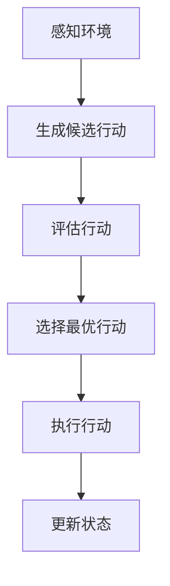
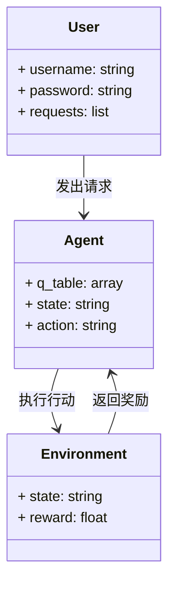
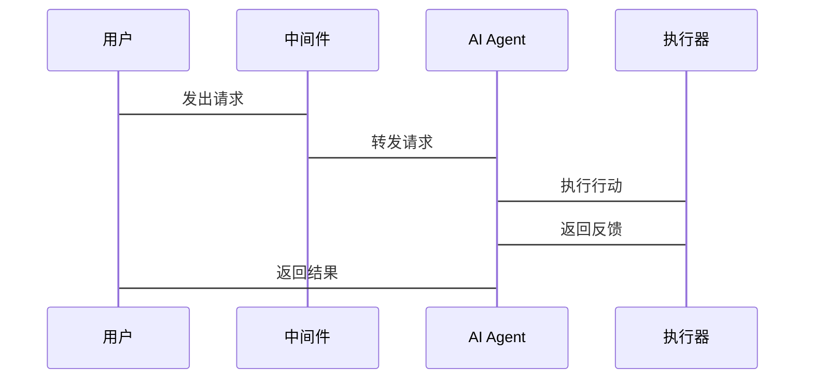

                 


# AI Agent架构设计：从概念到实现

---

## 关键词：
AI Agent, 人工智能, 架构设计, 强化学习, 系统架构, 实践案例

---

## 摘要：
AI Agent（人工智能代理）是一种能够感知环境、自主决策并执行任务的智能实体。本文从AI Agent的基本概念出发，详细探讨其核心原理、算法实现、系统架构设计以及实际应用案例。通过结合理论与实践，本文旨在帮助读者从零开始理解并实现一个完整的AI Agent系统。内容涵盖AI Agent的感知、决策、执行模块的设计，强化学习算法的实现，系统架构的搭建，以及项目实战中的具体应用。通过本文的学习，读者将能够掌握AI Agent的核心技术，并能够将其应用于实际场景中。

---

## 第1章: AI Agent基本概念与背景

### 1.1 AI Agent的定义与核心概念

#### 1.1.1 什么是AI Agent？
AI Agent（人工智能代理）是一种智能实体，能够感知环境、自主决策并执行任务以实现特定目标。与传统程序不同，AI Agent具有自主性、反应性和目标导向性。

#### 1.1.2 AI Agent的核心属性
| 属性 | 描述 |
|------|------|
| 自主性 | 能够自主决策，无需外部干预 |
| 反应性 | 能够感知环境并实时调整行为 |
| 目标导向性 | 以实现特定目标为导向 |
| 学习能力 | 能够通过经验改进性能 |

#### 1.1.3 AI Agent与传统程序的区别
- **自主性**：AI Agent能够自主决策，而传统程序通常需要明确的指令。
- **反应性**：AI Agent能够实时感知环境并调整行为，而传统程序通常是静态的。
- **目标导向性**：AI Agent的行为以目标为导向，而传统程序通常是任务导向的。

### 1.2 AI Agent的历史与发展

#### 1.2.1 AI Agent的起源
AI Agent的概念可以追溯到20世纪60年代，早期的AI研究主要集中在逻辑推理和知识表示上。

#### 1.2.2 AI Agent的演进过程
- **早期阶段**：基于规则的AI Agent，如专家系统。
- **发展阶段**：引入机器学习和强化学习，AI Agent开始具备自主学习能力。
- **现代阶段**：深度学习和强化学习的结合，使AI Agent更加智能和复杂。

#### 1.2.3 当前AI Agent的主要流派
| 流派 | 描述 |
|------|------|
| 基于规则的AI Agent | 基于预定义的规则进行决策 |
| 基于模型的AI Agent | 基于环境模型进行决策 |
| 基于强化学习的AI Agent | 通过强化学习算法进行决策 |
| 混合型AI Agent | 结合多种方法的AI Agent |

### 1.3 AI Agent的应用场景

#### 1.3.1 智能助手
AI Agent可以作为智能助手，帮助用户完成日常任务，如 Siri、Alexa 等。

#### 1.3.2 自动交易系统
AI Agent可以用于金融市场的自动交易，如量化交易策略的执行。

#### 1.3.3 游戏AI
AI Agent可以用于游戏中的非玩家角色（NPC）行为控制，如自动驾驶汽车。

#### 1.3.4 智慧城市中的应用
AI Agent可以用于智慧城市中的交通管理、资源分配等任务。

---

## 第2章: AI Agent的核心概念与联系

### 2.1 AI Agent的核心原理

#### 2.1.1 感知模块
AI Agent通过感知模块获取环境信息，通常包括传感器、摄像头等设备。

#### 2.1.2 决策模块
决策模块基于感知信息，通过算法生成行动方案。

#### 2.1.3 执行模块
执行模块根据决策模块生成的行动方案，执行具体操作。

### 2.2 AI Agent的实体关系图

```mermaid
er
actor: 用户
agent: AI Agent
environment: 环境
goal: 目标
action: 行动
perception: 感知
```

### 2.3 AI Agent的核心算法流程图



---

## 第3章: AI Agent的核心算法原理

### 3.1 基于规则的AI Agent

#### 3.1.1 规则的定义与实现
基于规则的AI Agent通过预定义的规则进行决策，通常使用条件-动作（If-Then）结构。

#### 3.1.2 基于规则的决策流程
1. 感知环境，获取当前状态。
2. 根据预定义规则，生成候选行动。
3. 选择最优行动并执行。

#### 3.1.3 规则的优缺点分析
- **优点**：简单易懂，适用于规则明确的场景。
- **缺点**：难以处理复杂和动态变化的环境。

### 3.2 基于模型的AI Agent

#### 3.2.1 状态空间模型
状态空间模型将环境状态表示为一个状态空间，AI Agent通过探索状态空间来找到最优路径。

#### 3.2.2 行动空间模型
行动空间模型定义了AI Agent在每个状态下可能采取的行动。

#### 3.2.3 基于模型的决策算法
基于模型的决策算法通常使用搜索算法，如广度优先搜索（BFS）和深度优先搜索（DFS）。

### 3.3 基于强化学习的AI Agent

#### 3.3.1 强化学习的基本原理
强化学习是一种通过试错学习的算法，AI Agent通过与环境交互，学习最优策略。

#### 3.3.2 Q-learning算法
Q-learning算法是一种经典的强化学习算法，通过Q值表记录状态-行动对的奖励值，更新Q值以最大化期望奖励。

#### 3.3.3 Deep Q-Network (DQN) 算法
DQN算法通过深度神经网络近似Q值函数，能够处理高维状态空间和动作空间。

#### 3.3.4 Q-learning算法实现示例

```python
import numpy as np

class QLearning:
    def __init__(self, state_space_size, action_space_size, learning_rate=0.1, gamma=0.99):
        self.state_space_size = state_space_size
        self.action_space_size = action_space_size
        self.learning_rate = learning_rate
        self.gamma = gamma
        self.q_table = np.zeros((state_space_size, action_space_size))
    
    def get_action(self, state):
        return np.argmax(self.q_table[state])
    
    def update_q_table(self, state, action, reward, next_state):
        target = reward + self.gamma * np.max(self.q_table[next_state])
        self.q_table[state][action] += self.learning_rate * (target - self.q_table[state][action])
```

#### 3.3.5 Q-learning算法公式
$$ Q(s, a) = Q(s, a) + \alpha \times [r + \gamma \times \max Q(s', a') - Q(s, a)] $$

### 3.4 混合型AI Agent

#### 3.4.1 混合型AI Agent的定义
混合型AI Agent结合了基于规则和基于模型或强化学习的方法，适用于复杂场景。

#### 3.4.2 基于规则与强化学习的结合
混合型AI Agent可以在规则明确的场景下使用规则，而在复杂场景下使用强化学习进行决策。

#### 3.4.3 基于模型与强化学习的结合
混合型AI Agent可以结合环境模型和强化学习算法，优化决策过程。

---

## 第4章: AI Agent的数学模型与公式

### 4.1 基于规则的AI Agent数学模型

#### 4.1.1 规则表示
基于规则的AI Agent可以通过逻辑表达式表示规则，例如：
$$ \text{如果} \; p \; \text{且} \; q \; \text{那么} \; r $$

### 4.2 基于模型的AI Agent数学模型

#### 4.2.1 状态空间模型
状态空间模型可以通过马尔可夫决策过程（MDP）表示：
$$ MDP = (S, A, P, R, \gamma) $$
其中：
- \( S \) 是状态空间
- \( A \) 是动作空间
- \( P \) 是状态转移概率
- \( R \) 是奖励函数
- \( \gamma \) 是折扣因子

### 4.3 基于强化学习的AI Agent数学模型

#### 4.3.1 Q-learning算法数学模型
Q-learning算法的目标是学习最优Q值表，使得：
$$ Q^*(s, a) = \max_{a'} Q(s, a') $$

---

## 第5章: AI Agent的系统分析与架构设计

### 5.1 问题场景介绍
以一个智能助手为例，设计一个AI Agent系统，帮助用户完成日常任务。

### 5.2 系统功能设计

#### 5.2.1 领域模型
领域模型可以通过mermaid类图表示：



### 5.3 系统架构设计

#### 5.3.1 系统架构
系统架构可以通过mermaid架构图表示：


### 5.4 系统接口设计

#### 5.4.1 接口设计
系统接口可以通过mermaid序列图表示：



### 5.5 系统交互设计

#### 5.5.1 交互流程
1. 用户向AI Agent发出请求。
2. AI Agent感知环境，生成候选行动。
3. AI Agent选择最优行动并执行。
4. 执行器返回反馈。
5. AI Agent更新状态并返回结果。

---

## 第6章: AI Agent的项目实战

### 6.1 环境安装

#### 6.1.1 安装Python
确保安装了Python 3.8 或更高版本。

#### 6.1.2 安装依赖
安装必要的Python库，如numpy、mermaid、tensorflow等。

### 6.2 系统核心实现

#### 6.2.1 AI Agent实现

```python
class AI_Agent:
    def __init__(self, state_space_size, action_space_size):
        self.state_space_size = state_space_size
        self.action_space_size = action_space_size
        self.q_table = np.zeros((state_space_size, action_space_size))
    
    def get_action(self, state):
        return np.argmax(self.q_table[state])
    
    def update_q_table(self, state, action, reward, next_state):
        target = reward + self.gamma * np.max(self.q_table[next_state])
        self.q_table[state][action] += self.learning_rate * (target - self.q_table[state][action])
```

#### 6.2.2 执行器实现

```python
class Executor:
    def __init__(self, agent):
        self.agent = agent
    
    def execute_action(self, action):
        # 根据动作执行具体操作
        pass
```

### 6.3 代码应用解读与分析

#### 6.3.1 AI Agent实现解读
AI Agent通过Q-learning算法学习最优策略，通过感知环境和执行行动实现目标。

#### 6.3.2 执行器实现解读
执行器根据AI Agent生成的行动执行具体操作，并返回反馈。

### 6.4 实际案例分析

#### 6.4.1 案例背景
以智能助手为例，设计一个简单的任务处理系统。

#### 6.4.2 案例实现
通过代码实现智能助手的功能，包括请求处理、任务执行和结果反馈。

### 6.5 项目小结
通过项目实战，读者可以理解AI Agent的实现过程，并能够将其应用于实际场景中。

---

## 第7章: 总结与展望

### 7.1 总结
本文从AI Agent的基本概念出发，详细探讨了其核心原理、算法实现、系统架构设计以及实际应用案例。通过理论与实践的结合，帮助读者系统地掌握AI Agent的设计与实现。

### 7.2 未来展望
随着人工智能技术的不断发展，AI Agent将更加智能化和复杂化。未来的研究方向包括多智能体协作、强化学习的优化、人机协作等。

### 7.3 最佳实践 tips
- **选择合适的算法**：根据具体场景选择合适的AI Agent算法。
- **处理数据隐私**：在实际应用中要注意数据隐私和安全问题。
- **优化系统性能**：通过优化算法和系统架构提高AI Agent的性能。

---

## 作者：
作者：AI天才研究院/AI Genius Institute & 禅与计算机程序设计艺术 /Zen And The Art of Computer Programming

