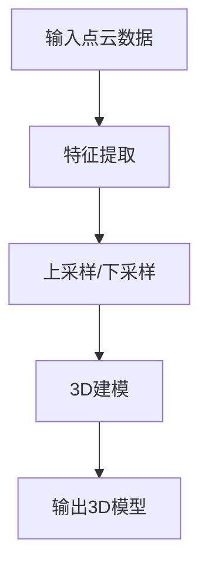
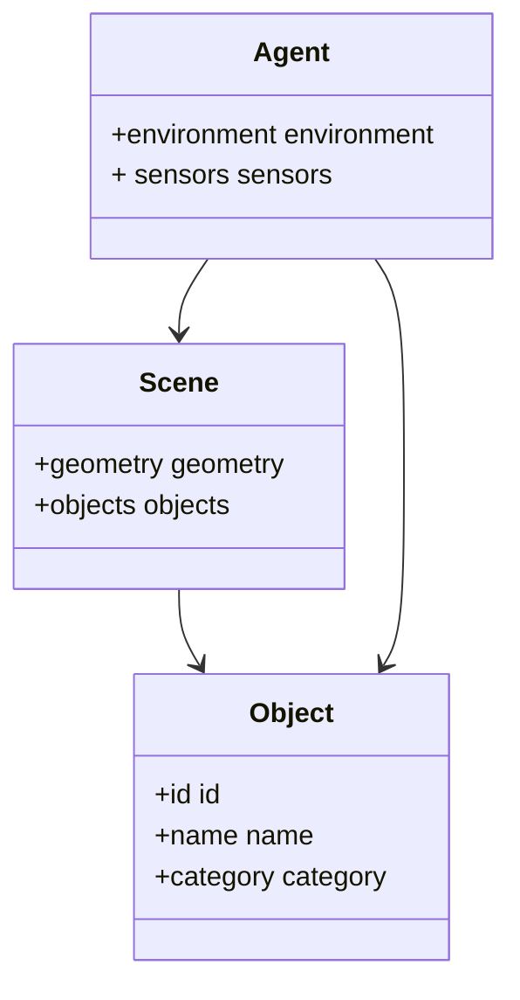
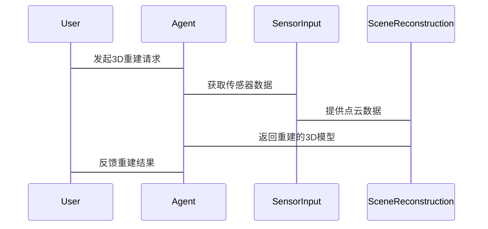

                 


# AI Agent的3D场景重建能力实现

> 关键词：AI Agent，3D场景重建，深度学习，点云，几何建模

> 摘要：本文深入探讨AI Agent在3D场景重建中的实现方法，从背景、核心概念、算法原理到系统架构设计，再到项目实战，全面解析3D场景重建的关键技术与应用。通过理论分析与实践案例结合，帮助读者理解AI Agent如何通过3D场景重建技术实现智能环境理解与交互。

---

## 目录

1. [背景与核心概念](#背景与核心概念)
2. [3D场景重建的算法原理](#3d场景重建的算法原理)
3. [系统分析与架构设计](#系统分析与架构设计)
4. [项目实战](#项目实战)
5. [最佳实践与总结](#最佳实践与总结)
6. [参考文献与扩展阅读](#参考文献与扩展阅读)

---

## 1. 背景与核心概念

### 1.1 3D场景重建的背景与问题描述

#### 1.1.1 3D场景重建的定义与概念
3D场景重建是指通过传感器数据（如LiDAR点云、RGB-D图像等）或图形数据，构建真实场景的三维数字模型的过程。它是计算机视觉和几何建模的核心技术，广泛应用于机器人导航、增强现实（AR）、虚拟现实（VR）、游戏开发和自动驾驶等领域。

AI Agent（智能体）具备3D场景重建能力后，能够更好地理解其所处环境，从而做出更智能的决策和交互。

#### 1.1.2 3D场景重建的核心问题
- **几何建模**：如何从二维或三维数据中重建场景的几何结构。
- **语义理解**：如何在重建的几何模型中嵌入语义信息，使AI Agent能够理解场景中物体的类别、属性和关系。
- **实时性与效率**：如何在资源受限的环境下高效完成3D重建。

#### 1.1.3 AI Agent在3D场景重建中的作用
AI Agent通过3D场景重建能力，可以实现以下功能：
1. 环境感知与理解
2. 智能路径规划
3. 人机交互优化
4. 动态场景处理

---

### 1.2 3D场景重建的核心概念与联系

#### 1.2.1 3D场景重建的核心概念
- **点云（Point Cloud）**：由多个点组成的三维空间数据集，常用于表示物体表面或场景结构。
- **网格（Mesh）**：由顶点、边和面组成的三维模型，用于表示物体的表面形状。
- **体素（Voxel）**：三维空间中的单位立方体，用于表示场景的离散化结构。
- **深度图（Depth Map）**：表示场景中各点到观察者的距离，用于重建三维结构。

#### 1.2.2 核心概念的属性特征对比
| 概念       | 描述                                   | 优点                           | 缺点                           |
|------------|----------------------------------------|--------------------------------|--------------------------------|
| 点云       | 表示场景中物体表面的离散点               | 数据量小，适合实时处理         | 易受噪声影响，难以表示连续区域 |
| 网格       | 表示物体表面的三角形或四边形网格         | 几何精度高，适合渲染           | 数据量大，处理复杂             |
| 体素       | 表示场景的离散化立方体                 | 适合体积计算和分割             | 精度较低，难以表示细节结构     |
| 深度图     | 表示场景中各点的深度信息               | 数据量小，适合单目视觉重建     | 无法直接表示物体表面细节       |

#### 1.2.3 ER实体关系图架构
```mermaid
erDiagram
    actor Scene {
        +string id
        +string name
        +geometry geometry
    }
    actor Object {
        +string id
        +string name
        +category category
    }
    actor User {
        +string id
        +string name
    }
    Scene --> Object : "包含物体"
    Scene --> User : "被用户创建"
    Object --> Scene : "属于场景"
```

---

## 2. 3D场景重建的算法原理

### 2.1 基于深度学习的3D重建算法

#### 2.1.1 网络结构概述
- **PointNet**：首个将点云数据直接输入深度神经网络的模型，通过全局最大值池化操作提取点云的全局特征。
- **PointNet++**：在PointNet的基础上引入了多尺度采样和分层结构，能够更细致地捕捉点云的局部特征。
- **Mesh R-CNN**：基于图结构的3D重建方法，适用于复杂场景中的物体分割与重建。

#### 2.1.2 算法流程图


#### 2.1.3 代码实现示例
```python
import torch
import torch.nn as nn

class PointNet(nn.Module):
    def __init__(self, output_dim=1024):
        super(PointNet, self).__init__()
        self.conv1 = nn.Conv1d(3, 64, kernel_size=1)
        self.conv2 = nn.Conv1d(64, 128, kernel_size=1)
        self.conv3 = nn.Conv1d(128, output_dim, kernel_size=1)
        self.bn1 = nn.BatchNorm1d(64)
        self.bn2 = nn.BatchNorm1d(128)
        self.bn3 = nn.BatchNorm1d(output_dim)
        
    def forward(self, x):
        x = x.permute(0, 2, 1)  # [batch_size, 3, num_points]
        x = self.conv1(x)
        x = self.bn1(x)
        x = nn.functional.relu(x)
        x = self.conv2(x)
        x = self.bn2(x)
        x = nn.functional.relu(x)
        x = self.conv3(x)
        x = self.bn3(x)
        x = nn.functional.relu(x)
        x = x.max(dim=-1)[0]  # 全局最大值池化
        return x
```

---

## 3. 系统分析与架构设计

### 3.1 问题场景介绍
AI Agent需要在动态变化的环境中实时重建3D场景，同时支持多模态数据输入（如RGB-D图像、LiDAR点云、IMU数据等）。

### 3.2 系统功能设计

#### 3.2.1 领域模型设计


#### 3.2.2 系统架构设计


#### 3.2.3 接口设计与交互


---

## 4. 项目实战

### 4.1 环境安装与配置
```bash
pip install torch torchvision numpy open3d
```

### 4.2 核心代码实现

#### 4.2.1 点云处理代码
```python
import open3d as o3d

def read_point_cloud(filename):
    pcd = o3d.io.read_point_cloud(filename)
    return pcd

def visualize_point_cloud(pcd):
    o3d.visualization.draw([pcd])
```

#### 4.2.2 3D重建网络实现
```python
class SceneReconstructionAgent:
    def __init__(self):
        self.point_net = PointNet()
        self.point_net.load_state_dict(torch.load("point_net.pth"))

    def reconstruct(self, input_points):
        device = torch.device("cuda" if torch.cuda.is_available() else "cpu")
        input_points = input_points.to(device)
        with torch.no_grad():
            features = self.point_net(input_points)
        return features
```

#### 4.2.3 案例分析
```python
# 示例输入
input_points = torch.randn(10, 3, 1024)  # [batch_size, 3, num_points]
reconstructed_features = agent.reconstruct(input_points)
print(reconstructed_features.shape)  # (10, 1024)
```

---

## 5. 最佳实践与总结

### 5.1 最佳实践
1. **数据预处理**：在3D重建任务中，数据预处理（如降噪、归一化）至关重要。
2. **模型优化**：根据具体场景需求，选择合适的3D重建算法，并进行模型调优。
3. **多模态融合**：结合RGB-D图像、LiDAR和IMU数据，可以显著提高重建精度。

### 5.2 小结
本文详细探讨了AI Agent在3D场景重建中的实现方法，从理论到实践，全面解析了3D重建的核心技术与应用场景。通过本文的学习，读者可以掌握3D场景重建的基本原理，并能够将其应用于实际项目中。

### 5.3 注意事项
- 确保传感器数据的准确性与同步性。
- 在动态场景中，需考虑物体的运动对重建结果的影响。
- 优化算法的实时性，以满足实际应用的需求。

---

## 6. 参考文献与扩展阅读

1. **PointNet: Deep Learning on Point Sets**  
   - 原文链接：[PointNet: Deep Learning on Point Sets](https://arxiv.org/abs/1611.08409)
2. **PointNet++: Deep Hierarchical Features for Point Sets**  
   - 原文链接：[PointNet++: Deep Hierarchical Features for Point Sets](https://arxiv.org/abs/1706.06671)
3. **Mesh R-CNN: Differentialiable Object Proposal on 3D Point Clouds**  
   - 原文链接：[Mesh R-CNN](https://arxiv.org/abs/1912.08193)
4. **Open3D: A Library for 3D Data Processing**  
   - 官网链接：[Open3D](https://open3d.org/)

---

## 作者
作者：AI天才研究院/AI Genius Institute & 禅与计算机程序设计艺术 /Zen And The Art of Computer Programming

---

通过以上目录，您可以根据实际需求进一步扩展每个章节的具体内容，确保文章的完整性和深度。

