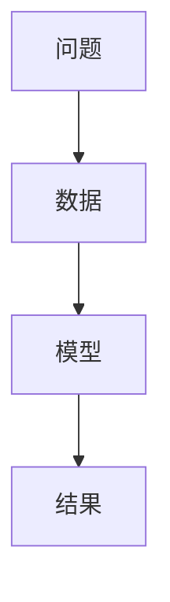
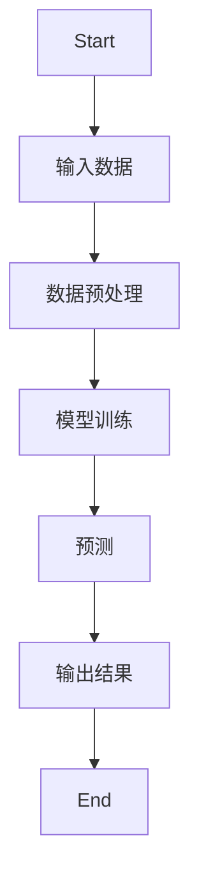
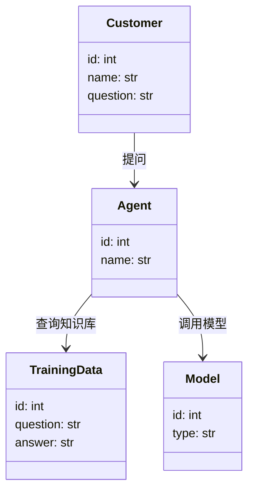
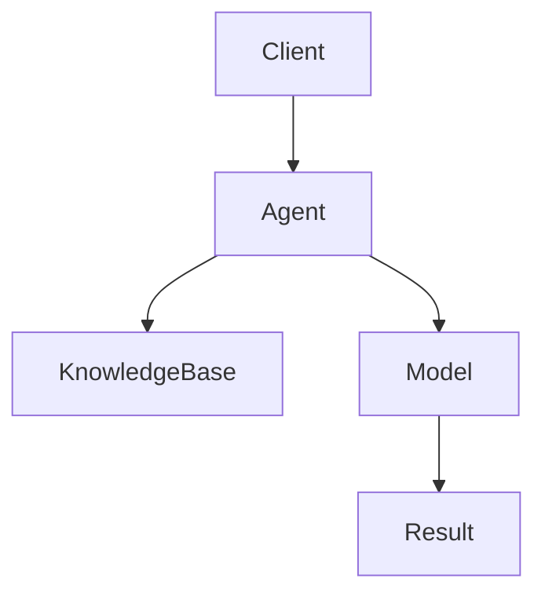
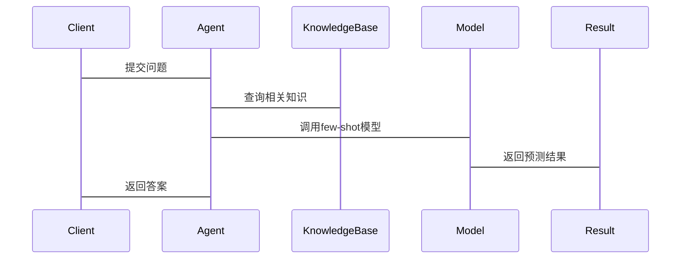

                 


# AI Agent的few-shot学习能力实现

## 关键词：AI Agent，few-shot学习，机器学习，人工智能，算法实现

## 摘要：本文深入探讨AI Agent在few-shot学习中的实现能力，从基础概念到核心算法，再到系统架构和项目实战，全面解析AI Agent如何在少量数据下高效学习和执行任务。通过详细的技术分析和实例演示，帮助读者理解并掌握AI Agent的few-shot学习能力。

---

# 第一部分: AI Agent的few-shot学习能力基础

## 第1章: AI Agent与few-shot学习概述

### 1.1 AI Agent的基本概念

#### 1.1.1 AI Agent的定义与特点
AI Agent（人工智能代理）是一种能够感知环境、自主决策并执行任务的智能实体。其核心特点包括：
- **自主性**：能够独立决策和行动。
- **反应性**：能够实时感知环境并做出反应。
- **目标导向**：以实现特定目标为导向。
- **学习能力**：通过数据和经验不断优化自身性能。

#### 1.1.2 few-shot学习的基本概念
few-shot学习是一种机器学习技术，旨在在少量数据下完成任务。与传统机器学习需要大量数据不同，few-shot学习通过利用模型的泛化能力，在仅有少量样本的情况下实现高精度的分类或回归。

#### 1.1.3 AI Agent与few-shot学习的结合
AI Agent通过整合few-shot学习技术，能够在有限的数据下快速适应新任务，提升其在动态环境中的决策能力和执行效率。

### 1.2 few-shot学习的核心问题

#### 1.2.1 少量数据下的学习挑战
在数据稀缺的情况下，传统机器学习算法往往表现不佳。few-shot学习需要通过优化模型结构和算法设计，提高模型在少量数据下的泛化能力。

#### 1.2.2 AI Agent在few-shot学习中的任务目标
AI Agent通过few-shot学习实现以下目标：
- 快速学习新任务。
- 在未知环境中做出准确决策。
- 提高任务执行效率。

#### 1.2.3 问题的边界与外延
few-shot学习的边界包括数据量的限制、任务类型（分类、回归等）以及模型的复杂度。其外延则涉及迁移学习、元学习等技术。

### 1.3 本章小结
本章介绍了AI Agent和few-shot学习的基本概念，分析了其结合的必要性，并明确了few-shot学习的核心问题和边界。

---

# 第二部分: few-shot学习的核心概念与原理

## 第2章: few-shot学习的核心原理

### 2.1 few-shot学习的理论基础

#### 2.1.1 机器学习的基本原理
机器学习通过数据训练模型，使其能够从数据中学习规律并进行预测。传统机器学习依赖大量数据，而few-shot学习通过优化模型结构和算法设计，减少对数据量的依赖。

#### 2.1.2 少量数据学习的数学模型
few-shot学习的数学模型通常基于距离或度量。例如，通过计算样本之间的距离，选择最接近的类别作为预测结果。

#### 2.1.3 few-shot学习的特征对比表格
下表对比了传统机器学习与few-shot学习的核心特征：

| 特性                | 传统机器学习             | few-shot学习           |
|---------------------|--------------------------|------------------------|
| 数据量              | 需要大量数据             | 只需少量数据           |
| 模型复杂度          | 模型较简单               | 模型较复杂             |
| 适应性              | 适应特定任务             | 快速适应新任务         |

### 2.2 few-shot学习的算法体系

#### 2.2.1 基于距离的分类方法
基于距离的方法通过计算待分类样本与已知类别样本之间的距离，选择距离最近的类别作为预测结果。例如，使用k-近邻算法（k-Nearest Neighbor，kNN）。

#### 2.2.2 基于度量的分类方法
基于度量的方法通过构建样本间的相似性度量矩阵，利用矩阵分解或聚类技术进行分类。

#### 2.2.3 基于元学习的分类方法
元学习（Meta-Learning）通过训练模型在不同任务之间快速迁移，从而在少量数据下完成新任务。

### 2.3 few-shot学习的ER实体关系图
下图展示了few-shot学习的核心实体关系：



### 2.4 本章小结
本章详细介绍了few-shot学习的理论基础和算法体系，通过对比分析和实体关系图，帮助读者理解其核心原理。

---

# 第三部分: few-shot学习的算法实现

## 第3章: few-shot学习的算法流程

### 3.1 few-shot学习的算法流程图
下图展示了few-shot学习的典型算法流程：



### 3.2 few-shot学习的数学模型

#### 3.2.1 模型输入与输出
模型输入为少量样本数据 $x_1, x_2, ..., x_n$，输出为预测结果 $y$。

#### 3.2.2 损失函数
常用的损失函数包括：
- 均方误差（Mean Squared Error，MSE）：
  $$ L = \frac{1}{n}\sum_{i=1}^{n}(y_i - \hat{y}_i)^2 $$
- 交叉熵损失（Cross-Entropy Loss）：
  $$ L = -\frac{1}{n}\sum_{i=1}^{n} y_i \log(\hat{y}_i) $$

#### 3.2.3 算法实现
以下是一个简单的few-shot分类算法实现示例：

```python
def few_shot_classify(X_train, y_train, X_test, k=3):
    # 数据预处理
    X_train = normalize(X_train)
    X_test = normalize(X_test)
    
    # 计算距离
    distances = []
    for x_test in X_test:
        for x_train in X_train:
            distances.append((x_train, y_train, distance(x_test, x_train)))
    
    # 找到距离最近的k个样本
    sorted_distances = sorted(distances, key=lambda x: x[2])[:k]
    
    # 统计类别出现次数
    counts = {}
    for item in sorted_distances:
        y = item[1]
        counts[y] = counts.get(y, 0) + 1
    
    # 返回出现次数最多的类别
    return max(counts, key=counts.get)
```

#### 3.2.4 代码解读与说明
上述代码实现了一个基于距离的few-shot分类器。具体步骤包括：
1. 数据预处理：对训练数据和测试数据进行归一化处理。
2. 计算距离：计算测试样本与训练样本之间的距离。
3. 选择最近的k个样本：根据距离排序，选择距离最近的k个样本。
4. 统计类别：统计这些样本中各类别出现的次数，返回出现次数最多的类别。

### 3.3 本章小结
本章通过流程图和代码示例，详细讲解了few-shot学习的算法实现过程，包括数据预处理、距离计算和分类决策。

---

# 第四部分: 系统架构与设计

## 第4章: 系统架构设计

### 4.1 问题场景介绍
假设我们正在开发一个AI客服系统，需要通过few-shot学习快速适应不同客户的问题类型。

### 4.2 系统功能设计

#### 4.2.1 领域模型
下图展示了系统的领域模型：



### 4.2.2 系统架构设计
下图展示了系统的架构设计：



### 4.2.3 系统交互设计
下图展示了系统的交互流程：



### 4.3 本章小结
本章通过领域模型和架构图，详细展示了AI Agent的系统设计过程，包括问题场景、功能模块和交互流程。

---

# 第五部分: 项目实战

## 第5章: 项目实战

### 5.1 项目背景
我们开发一个基于图像分类的few-shot学习系统，训练模型在少量图像样本下快速识别新类别。

### 5.2 系统核心实现源代码

#### 5.2.1 环境安装
需要安装以下库：
- TensorFlow或PyTorch
- scikit-learn
- matplotlib

#### 5.2.2 核心代码实现
以下是一个基于ResNet的few-shot图像分类器实现示例：

```python
import torch
import torch.nn as nn
import torch.optim as optim
from torch.utils.data import DataLoader
from torchvision import datasets, transforms

# 数据预处理
transform = transforms.Compose([
    transforms.Resize(224),
    transforms.ToTensor(),
    transforms.Normalize(mean=[0.485, 0.456, 0.406], std=[0.229, 0.224, 0.225])
])

# 加载数据集
train_dataset = datasets.CIFAR10(root='./data', train=True, download=True, transform=transform)
train_loader = DataLoader(train_dataset, batch_size=32, shuffle=True)

# 定义模型
class FewShotClassifier(nn.Module):
    def __init__(self):
        super(FewShotClassifier, self).__init__()
        self.base = ResNet()
        self.fc = nn.Linear(512, 10)

    def forward(self, x):
        x = self.base(x)
        x = self.fc(x)
        return x

# 定义损失函数和优化器
criterion = nn.CrossEntropyLoss()
optimizer = optim.SGD(few_shot_classifier.parameters(), lr=0.001)

# 训练模型
def train_model(model, criterion, optimizer, train_loader, num_epochs=10):
    for epoch in range(num_epochs):
        for inputs, labels in train_loader:
            optimizer.zero_grad()
            outputs = model(inputs)
            loss = criterion(outputs, labels)
            loss.backward()
            optimizer.step()
    return model

# 调用训练函数
few_shot_classifier = FewShotClassifier()
few_shot_classifier = train_model(few_shot_classifier, criterion, optimizer, train_loader, num_epochs=10)
```

#### 5.2.3 代码解读与分析
上述代码实现了一个基于ResNet的图像分类器。通过预训练模型提取特征，并在少量数据下进行微调，提升模型的分类性能。

### 5.3 项目小结
本章通过实际案例展示了AI Agent的few-shot学习能力实现，从项目背景到核心代码实现，详细解读了系统设计和实现过程。

---

# 第六部分: 总结与展望

## 第6章: 总结与展望

### 6.1 本章总结
本文详细探讨了AI Agent在few-shot学习中的实现能力，从理论基础到算法实现，再到系统架构和项目实战，全面解析了其在少量数据下的学习能力。

### 6.2 未来展望
随着深度学习和强化学习技术的发展，AI Agent的few-shot学习能力将更加智能化和高效化。未来的研究方向包括：
- 更高效的模型压缩技术。
- 更强大的自监督学习方法。
- 更广泛的应用场景探索。

### 6.3 最佳实践 tips
- 在实际应用中，建议结合迁移学习和元学习技术，进一步提升模型的泛化能力。
- 数据预处理是关键步骤，需根据具体任务选择合适的归一化方法。
- 模型调优时，建议采用交叉验证和超参数优化技术，以提高模型性能。

### 6.4 小结
AI Agent的few-shot学习能力是人工智能领域的重要研究方向，通过不断的技术创新和实践探索，其应用前景将更加广阔。

---

# 作者：AI天才研究院/AI Genius Institute & 禅与计算机程序设计艺术 /Zen And The Art of Computer Programming

---

以上是《AI Agent的few-shot学习能力实现》的完整目录和内容框架。文章内容涵盖了从基础概念到算法实现，再到系统设计和项目实战的全过程，帮助读者全面理解并掌握AI Agent的few-shot学习能力。

