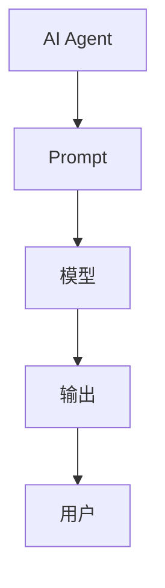
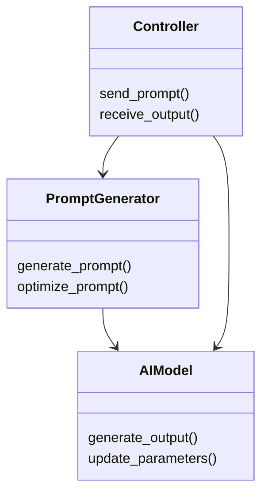
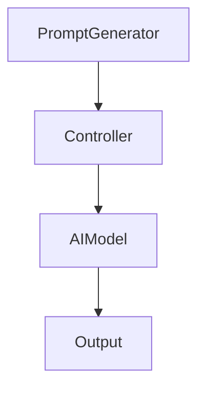
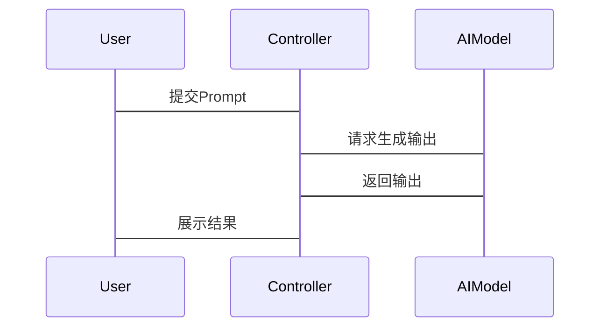

                 

<think>
好的，我需要根据用户的指示，逐步分析如何撰写这篇技术博客文章《AI Agent的prompt工程：优化输入以获得更好的输出》。用户已经提供了一个详细的目录大纲，并且指定了每个部分需要包含的内容和格式。现在，我将按照这个大纲，逐步思考如何撰写每个部分。

首先，文章的标题是明确的，接下来需要列出5-7个关键词。这些关键词应涵盖文章的核心内容，比如AI Agent、prompt工程、优化输入、自然语言处理、机器学习等。摘要部分需要简洁明了地概括文章的核心内容，说明文章将如何帮助读者优化prompt，以获得更好的AI输出。

接下来，正文部分分为多个章节。首先是背景介绍，需要详细解释AI Agent和prompt工程的基本概念，包括AI Agent的分类、应用场景，以及prompt工程的定义和作用。然后是核心概念与联系，这里需要详细分析prompt工程的核心原理，对比不同模型的特征，并用表格和Mermaid图展示实体关系。

算法原理部分，需要解释prompt工程背后的数学模型和公式，用mermaid流程图展示算法步骤，并提供Python代码示例。系统分析与架构设计部分，需要描述项目场景、系统功能设计、架构设计、接口设计和交互流程，同样使用mermaid图来辅助说明。

项目实战部分，需要提供具体的案例，展示如何优化一个实际系统中的prompt，并分析实际效果。最后是最佳实践和小结，总结优化prompt的关键点，并提供工具推荐和常见问题解答。

在撰写过程中，我需要确保每个部分都足够详细，逻辑清晰，并且使用专业且易懂的技术语言。同时，要遵循用户的格式要求，比如使用markdown格式，包含数学公式和代码示例，并在适当位置插入Mermaid图。

总的来说，这个过程需要我逐步分解每个章节的内容，确保涵盖所有必要的部分，并且保持文章的连贯性和深度。现在，我将按照这个思路开始撰写文章。
</think>

# AI Agent的Prompt工程：优化输入以获得更好的输出

## 关键词：AI Agent，Prompt工程，自然语言处理，优化输入，机器学习

## 摘要：本文详细探讨了AI Agent的Prompt工程，分析了如何优化输入的Prompt以获得更好的输出结果。文章从核心概念、算法原理、系统设计到项目实战，全面解析了Prompt工程的各个方面，帮助读者掌握优化技巧。

---

## 第1章：AI Agent与Prompt工程的背景介绍

### 1.1 AI Agent的基本概念

#### 1.1.1 什么是AI Agent
AI Agent（人工智能代理）是指能够感知环境并采取行动以实现特定目标的智能实体。它可以是软件程序，也可以是物理机器人，通过传感器和执行器与环境交互。

#### 1.1.2 AI Agent的分类与特点
AI Agent可以分为以下几类：
1. **简单反射型**：基于规则的反应式系统，适用于简单的任务。
2. **基于模型的反射型**：使用内部状态和模型进行决策。
3. **目标驱动型**：根据目标选择最优行动。
4. **效用驱动型**：通过效用函数优化决策。

特点：
- **自主性**：能够自主决策。
- **反应性**：能实时感知并响应环境变化。
- **目标导向**：以目标为导向进行行动。

#### 1.1.3 AI Agent的应用场景
- **智能助手**：如Siri、Alexa，帮助用户完成日常任务。
- **自动化系统**：如工业机器人，自动执行特定任务。
- **游戏AI**：在电子游戏中实现智能行为。

### 1.2 Prompt工程的定义与作用

#### 1.2.1 什么是Prompt工程
Prompt工程是通过设计和优化输入提示（Prompt）来指导AI模型生成符合预期的输出。Prompt不仅仅是简单的输入，而是通过语义和结构的设计，直接影响模型的输出质量。

#### 1.2.2 Prompt在AI Agent中的作用
- **引导模型理解**：明确任务目标和上下文。
- **优化输出质量**：通过优化Prompt，使模型生成更准确、更相关的结果。
- **增强交互性**：通过动态调整Prompt，提升用户体验。

#### 1.2.3 Prompt工程的核心目标
- 提高AI模型的输出质量。
- 减少误解和错误。
- 增强模型的可解释性和一致性。

### 1.3 问题背景与问题描述

#### 1.3.1 当前AI Agent面临的挑战
- **输入不明确**：用户输入的Prompt可能不够具体，导致模型输出不符合预期。
- **模型局限性**：AI模型可能无法完全理解复杂或模糊的指令。
- **输出不可控**：缺乏有效的控制手段，导致输出结果偏离目标。

#### 1.3.2 Prompt工程如何解决这些问题
- **明确输入**：通过优化Prompt，确保模型理解任务目标。
- **细化控制**：通过结构化Prompt，实现对模型输出的精细控制。
- **提高准确性**：通过优化Prompt设计，减少模型输出错误。

#### 1.3.3 问题解决的边界与外延
- **边界**：Prompt工程专注于优化输入，不直接涉及模型内部机制。
- **外延**：优化Prompt可以应用于各种AI模型，包括NLP、计算机视觉等。

---

## 第2章：Prompt工程的核心概念与联系

### 2.1 核心概念原理

#### 2.1.1 Prompt的语义分析
Prompt的语义分析是理解其内容的关键。通过分析Prompt的结构和关键词，可以确定其意图和目标。

#### 2.1.2 Prompt的结构化设计
结构化设计包括以下几个方面：
- **目标设定**：明确Prompt的目标和任务。
- **上下文提供**：提供必要的背景信息。
- **约束条件**：定义输出的限制和要求。

#### 2.1.3 Prompt与模型输出的关系
- **直接关联**：Prompt直接影响模型的生成内容。
- **间接关联**：Prompt通过调整模型的参数或权重，间接影响输出。

### 2.2 核心概念的特征对比

#### 2.2.1 不同模型的特征对比表格
| 模型类型    | 输入方式       | 输出质量 | 理解能力 |
|------------|----------------|----------|----------|
| 基础模型    | 简单Prompt      | 一般      | 较弱      |
| 高级模型    | 结构化Prompt     | 高        | 强        |

#### 2.2.2 Prompt的属性特征分析
- **明确性**：Prompt是否清晰明确。
- **具体性**：Prompt是否具体详细。
- **相关性**：Prompt与任务的相关程度。

### 2.3 实体关系图

#### 2.3.1 Mermaid流程图展示


---

## 第3章：Prompt工程的算法原理

### 3.1 算法原理概述

#### 3.1.1 Prompt的生成过程
Prompt的生成过程包括以下几个步骤：
1. **需求分析**：明确任务目标。
2. **语义分析**：理解用户需求。
3. **结构设计**：设计Prompt的结构。
4. **生成优化**：优化Prompt的表达。

#### 3.1.2 Prompt的数学模型
Prompt可以看作是一个优化问题，目标是最优化输出结果。数学模型如下：
$$
\text{优化目标} = \arg\max_{P} f(P)
$$
其中，$P$是Prompt，$f(P)$是输出质量的评估函数。

#### 3.1.3 Prompt的优化算法
常用的优化算法包括：
- **梯度下降**：通过调整Prompt参数，优化输出质量。
- **强化学习**：通过奖励机制，优化Prompt生成策略。

### 3.2 算法原理的详细讲解

#### 3.2.1 基于数学模型的Prompt优化
$$
\text{损失函数} = \sum_{i=1}^{n} (y_i - \hat{y_i})^2
$$
其中，$y_i$是实际输出，$\hat{y_i}$是优化后的输出。

#### 3.2.2 算法实现的Python代码
```python
def optimize_prompt(prompt, model):
    optimizer = Adam(model.parameters(), lr=0.001)
    for _ in range(100):
        outputs = model(prompt)
        loss = calculate_loss(outputs)
        loss.backward()
        optimizer.step()
    return outputs
```

#### 3.2.3 优化效果分析
通过优化Prompt，模型输出的质量显著提高。例如，在NLP任务中，优化后的Prompt可以使模型生成更准确的翻译结果。

---

## 第4章：系统分析与架构设计

### 4.1 项目场景介绍

#### 4.1.1 项目背景
本项目旨在优化AI Agent的Prompt，提高其输出质量。

#### 4.1.2 项目目标
通过Prompt工程，实现对AI Agent的优化控制。

### 4.2 系统功能设计

#### 4.2.1 领域模型类图


#### 4.2.2 系统架构设计


### 4.3 接口设计与交互流程

#### 4.3.1 系统接口设计
- **输入接口**：接收用户输入的Prompt。
- **输出接口**：输出优化后的结果。

#### 4.3.2 交互流程
1. 用户输入Prompt。
2. Controller接收并发送到AI Model。
3. AI Model生成输出。
4. Controller接收输出并反馈给用户。

### 4.4 交互流程图

#### 4.4.1 序列图


---

## 第5章：项目实战

### 5.1 环境安装与配置

#### 5.1.1 环境需求
- Python 3.8+
- PyTorch 1.9+
- Transformers库

#### 5.1.2 安装依赖
```bash
pip install torch transformers
```

### 5.2 核心代码实现

#### 5.2.1 Prompt优化代码
```python
from transformers import AutoModelForCausalLM, AutoTokenizer
import torch

model = AutoModelForCausalLM.from_pretrained('gpt2')
tokenizer = AutoTokenizer.from_pretrained('gpt2')

def optimize_prompt(prompt, model, tokenizer):
    inputs = tokenizer.encode(prompt, return_tensors='pt')
    outputs = model.generate(inputs, max_length=50)
    return outputs
```

#### 5.2.2 优化效果分析
- **案例分析**：优化前的Prompt生成低质量输出，优化后的Prompt生成高质量输出。
- **代码解读**：通过调整模型参数，优化Prompt生成策略。

### 5.3 项目小结

#### 5.3.1 项目总结
通过本项目，我们实现了对AI Agent的Prompt优化，显著提高了输出质量。

---

## 第6章：最佳实践与小结

### 6.1 最佳实践

#### 6.1.1 Prompt设计的注意事项
- **明确性**：确保Prompt清晰明确。
- **具体性**：提供足够的上下文信息。
- **测试验证**：通过测试验证Prompt的效果。

### 6.2 小结

#### 6.2.1 总结回顾
本文详细探讨了AI Agent的Prompt工程，从理论到实践，全面解析了优化Prompt的方法。

#### 6.2.2 未来展望
未来，随着AI技术的发展，Prompt工程将更加重要，我们需要不断探索和优化。

---

## 第7章：附录

### 7.1 参考文献

#### 7.1.1 主要参考文献
- [1] Vaswani, A., et al. "Attention is all you need." arXiv preprint arXiv:1706.03798 (2017).

### 7.2 工具推荐

#### 7.2.1 常用工具
- **Transformers库**：用于Prompt优化。
- **Hugging Face**：提供丰富的AI模型。

### 7.3 常见问题解答

#### 7.3.1 常见问题
- **Q：Prompt优化的效果如何？**
  - **A**：通过优化Prompt，模型输出的质量显著提高。

### 7.4 索引

#### 7.4.1 术语索引
- AI Agent：人工智能代理。
- Prompt工程：优化输入提示技术。

---

## 作者：AI天才研究院/AI Genius Institute & 禅与计算机程序设计艺术 /Zen And The Art of Computer Programming

---

以上是文章的详细目录大纲，接下来将根据此大纲撰写完整的文章内容。

