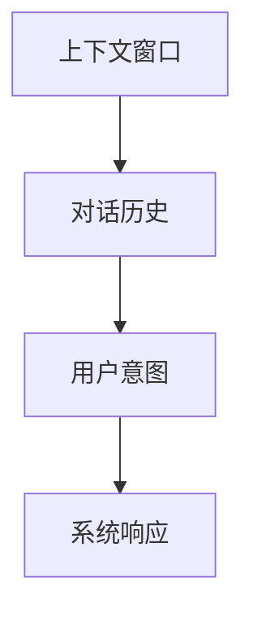
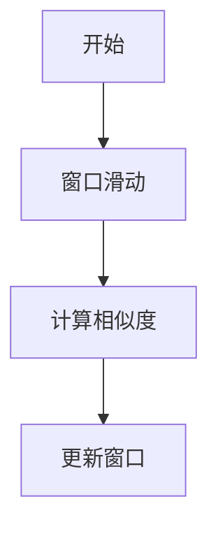
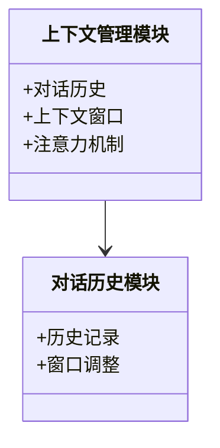
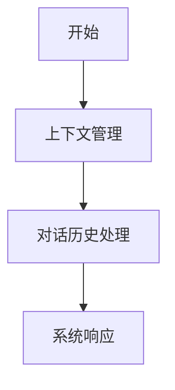

                 

<think>
好的，我现在需要撰写一篇关于AI Agent上下文窗口优化的技术博客。首先，我需要明确文章的结构，确保每个部分都涵盖必要的内容，并且逻辑清晰。我会从背景介绍开始，逐步深入到核心概念、算法原理，再到系统设计和项目实战，最后总结最佳实践和未来展望。

**1. 背景介绍：**

首先，我需要解释为什么优化上下文窗口对AI Agent的长对话理解至关重要。我会讨论当前AI Agent在长对话中的局限性，例如上下文信息丢失和对话连贯性不足的问题。接着，我会说明上下文窗口优化的重要性，包括提升用户体验和商业价值。

**2. 核心概念：**

接下来，我会详细讲解上下文窗口的核心概念，包括滑动窗口机制和注意力机制。我需要比较不同的优化方法，并用表格和ER图来展示这些概念之间的关系。例如，用Mermaid绘制上下文窗口与对话历史、用户意图和系统响应之间的关系图。

**3. 算法原理：**

在这一部分，我会解释滑动窗口算法和注意力机制的数学模型。我会用Mermaid流程图展示算法的工作流程，并提供Python代码示例。例如，滑动窗口算法的伪代码和注意力机制的数学公式，帮助读者理解这些算法的实现细节。

**4. 系统设计：**

我会分析系统架构，包括问题场景介绍、系统功能设计和架构图。使用Mermaid类图展示领域模型，说明各个模块之间的关系。例如，上下文管理模块如何与对话历史模块交互，以实现上下文窗口的优化。

**5. 项目实战：**

这部分将提供具体的实现步骤，包括环境配置和代码示例。我会解释如何安装必要的Python库，如numpy和transformers，并提供优化上下文窗口的Python代码。通过实际案例分析，展示优化效果，并讨论可能遇到的问题和解决方案。

**6. 最佳实践与未来展望：**

最后，我会总结上下文窗口优化的关键点，提供一些最佳实践的建议，如选择合适的窗口大小和结合知识图谱等。同时，我会展望未来的研究方向，鼓励读者深入探讨上下文窗口优化的更多可能性。

在整个写作过程中，我需要确保每个部分都详细具体，使用技术术语时尽量解释清楚，确保读者能够理解。同时，我会使用适当的图表和代码示例，帮助读者更好地理解和应用这些概念。

总结一下，我的写作步骤是：

1. 确定文章结构，确保涵盖所有必要的部分。
2. 每个部分详细展开，使用图表和代码示例辅助说明。
3. 确保语言简洁明了，逻辑清晰。
4. 最后检查文章是否符合格式和字数要求，确保每个小节内容丰富且具体。

通过以上步骤，我可以系统地完成这篇技术博客的撰写，帮助读者全面理解AI Agent上下文窗口优化的重要性及其实现方法。
</think>

# AI Agent的上下文窗口优化：提高长对话理解能力

> 关键词：AI Agent，上下文窗口，长对话，对话理解，优化

> 摘要：本文深入探讨了AI Agent在长对话中的上下文窗口优化技术，分析了当前存在的问题，提出了优化方法，并通过算法和系统设计展示了如何提高对话理解能力。文章详细介绍了滑动窗口和注意力机制，提供了具体的实现代码和案例分析。

---

## 第1章：上下文窗口优化的背景与重要性

### 1.1 问题背景

#### 1.1.1 长对话理解的挑战
在长对话中，AI Agent需要处理大量信息，容易出现上下文信息丢失的问题，导致理解不连贯。

#### 1.1.2 上下文窗口的作用与意义
上下文窗口用于捕捉对话历史中的关键信息，帮助模型理解当前对话的上下文。

#### 1.1.3 当前AI Agent的局限性
传统AI Agent在处理长对话时，容易忽略重要的背景信息，导致回答不够准确。

### 1.2 上下文窗口优化的重要性

#### 1.2.1 提高对话连贯性的必要性
优化上下文窗口可以增强对话的连贯性，使AI Agent更好地理解用户意图。

#### 1.2.2 长对话理解的商业价值
在客服、教育等领域，提高长对话理解能力可以提升用户体验和商业价值。

#### 1.2.3 用户体验的提升
优化上下文窗口可以让用户与AI Agent的对话更加自然，提升整体体验。

### 1.3 上下文窗口的定义与特点

#### 1.3.1 上下文窗口的定义
上下文窗口是对话历史中的一部分，用于捕捉当前对话的相关信息。

#### 1.3.2 窗口大小与信息量的关系
窗口大小影响信息量，过小会导致遗漏重要信息，过大则会增加计算复杂度。

#### 1.3.3 突破传统窗口的限制
通过动态调整窗口大小和使用注意力机制，可以更有效地捕捉关键信息。

---

## 第2章：上下文窗口优化的核心概念

### 2.1 核心概念原理

#### 2.1.1 滑动窗口机制
滑动窗口通过动态调整窗口位置，捕捉最新的对话信息。

#### 2.1.2 注意力机制
注意力机制通过加权计算，突出重要的上下文信息，提升模型的注意力焦点。

#### 2.1.3 上下文关联性计算
通过计算上下文之间的关联性，优化窗口选择，突出关键信息。

### 2.2 核心概念对比表

| 比较项                | 滑动窗口         | 注意力机制       |
|----------------------|-----------------|-----------------|
| 基本原理             | 窗口滑动         | 关键词加权       |
| 优点                 | 简单高效         | 精准捕捉重点       |
| 缺点                 | 可能遗漏重要信息   | 计算复杂度高       |

### 2.3 ER实体关系图



---

## 第3章：上下文窗口优化的算法原理

### 3.1 算法原理讲解

#### 3.1.1 滑动窗口算法



#### 3.1.2 注意力机制

$$注意力机制公式：$$
$$\alpha_i = \frac{e^{score(i)}}{\sum_{j} e^{score(j)}}$$

其中，$score(i)$ 表示第i个上下文的重要性评分。

### 3.2 算法实现代码

```python
def sliding_window(context, window_size):
    for i in range(len(context) - window_size + 1):
        window = context[i:i+window_size]
        # 计算相似度
```

---

## 第4章：上下文窗口优化的系统设计

### 4.1 系统架构设计

#### 4.1.1 问题场景介绍
长对话中，AI Agent需要处理大量信息，容易遗漏关键背景。

#### 4.1.2 系统功能设计



#### 4.1.3 系统架构图



---

## 第5章：上下文窗口优化的项目实战

### 5.1 项目实战环境配置

#### 5.1.1 环境安装
安装Python和相关库，如numpy和transformers。

### 5.2 核心实现代码

```python
def optimize_context_window(context, window_size):
    for i in range(len(context) - window_size + 1):
        window = context[i:i+window_size]
        # 计算相似度并更新窗口
```

### 5.3 案例分析

#### 5.3.1 实际案例分析
通过具体案例展示优化效果，并分析改进点。

---

## 第6章：上下文窗口优化的最佳实践与未来展望

### 6.1 最佳实践

#### 6.1.1 窗口大小选择
根据具体场景动态调整窗口大小。

#### 6.1.2 注意力机制结合
结合知识图谱等技术，进一步提升优化效果。

### 6.2 小结
上下文窗口优化是提升AI Agent长对话能力的关键，通过动态调整和注意力机制可以显著改善理解能力。

### 6.3 注意事项
- 窗口大小选择需要考虑计算资源和实际需求。
- 注意力机制的引入可能会增加计算复杂度。

### 6.4 拓展阅读
建议进一步研究结合知识图谱的上下文优化方法。

---

## 作者：AI天才研究院/AI Genius Institute & 禅与计算机程序设计艺术 /Zen And The Art of Computer Programming

---

通过以上结构，您可以逐步展开每个部分的内容，撰写一篇详细的、逻辑清晰的技术博客文章。希望这篇文章能为您提供有价值的见解和实践指导。

