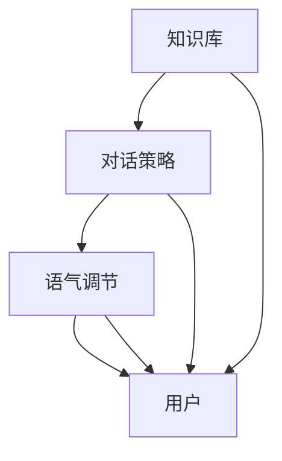

                 

<think>
好，我现在需要帮用户设计一本名为《AI Agent的个性化定制：从语气到知识背景》的详细目录大纲。用户希望内容逻辑清晰，结构紧凑，并且涵盖从背景介绍、核心概念、算法原理到系统架构、项目实战等多个方面。

首先，我会先理解用户的需求。用户希望这本书能够详细讲解AI Agent的个性化定制，特别是语气和知识背景的方面。这意味着我需要涵盖理论和实际应用，确保读者能够全面理解并掌握相关知识。

接下来，我会考虑这本书的结构。通常，技术书籍会分为几个主要部分，比如背景、核心概念、算法原理、系统架构、项目实战等。用户提供的示例显示，目录需要有多个章节，每个章节下还有子章节，细化到三级目录。

在设计目录时，我会首先确定每个部分的重点。例如，背景介绍部分需要解释AI Agent的基本概念和个性化定制的重要性。核心概念部分需要详细讲解知识库、对话策略和语气调节模块。算法原理部分则需要深入讨论基于规则和深度学习的对话策略，并提供相应的数学模型和代码示例。

然后，我会考虑每个部分的具体内容。例如，在知识库模块中，需要包括知识库的定义、类型、构建与管理等内容。在对话策略模块中，要区分基于规则和深度学习的策略，并给出实现方式。在语气调节模块中，要解释其实现方式和效果评估。

此外，用户还要求使用Mermaid图来展示系统架构、实体关系和交互流程。因此，我需要确保在目录中为这些部分预留空间，并在正文中嵌入相应的图表。

接下来，我会考虑如何将这些内容组织成一个逻辑连贯的目录。第一部分可能是背景介绍，第二部分是核心概念与联系，第三部分是算法原理，第四部分是系统分析与架构设计，第五部分是项目实战，第六部分是最佳实践。

在每一部分中，我会细化到三级目录，确保每个子主题都有足够的细节和深度。例如，在系统分析部分，我会描述问题场景，设计系统功能，展示系统架构图和交互流程图。

最后，我会确保整个目录结构清晰，每个部分之间有逻辑联系，帮助读者逐步深入理解AI Agent的个性化定制。

总结一下，我的思考过程是：理解用户需求，确定书籍结构，细化每个部分的内容，确保逻辑连贯，并预留图表展示的空间。这样，我就可以为用户提供一个详细且符合要求的目录大纲了。
</think>

# 《AI Agent的个性化定制：从语气到知识背景》

---

## 关键词：
AI Agent，个性化定制，语气调节，知识库，对话策略，深度学习，系统架构

---

## 摘要：
本文详细探讨了AI Agent的个性化定制过程，从其核心概念、算法原理到系统架构，再到实际项目中的应用，全面解析了如何通过语气调节和知识背景的定制，提升AI Agent的智能性和用户体验。文章结合理论与实践，为读者提供了从基础到高级的完整技术路线。

---

# 第一部分：AI Agent的个性化定制基础

## 第1章：AI Agent的基本概念与背景

### 1.1 AI Agent的定义与核心特征
- **1.1.1 AI Agent的定义**  
  AI Agent（人工智能代理）是一种能够感知环境、自主决策并执行任务的智能系统。其核心特征包括自主性、反应性、目标导向和社交能力。
  
- **1.1.2 AI Agent的核心特征**  
  - 自主性：无需外部干预，自主完成任务。  
  - 反应性：能够实时感知环境并做出反应。  
  - 目标导向：以目标为导向，优化决策过程。  
  - 社交能力：能够与人类或其他系统进行交互。  

- **1.1.3 AI Agent的发展背景**  
  随着人工智能技术的快速发展，AI Agent在各个领域的应用越来越广泛，尤其是在自然语言处理、推荐系统和自动化服务方面。

---

### 1.2 个性化定制的必要性
- **1.2.1 个性化定制的定义**  
  个性化定制是指根据用户的需求、习惯和背景，调整AI Agent的行为模式和输出内容，以提供更符合用户期望的服务。

- **1.2.2 个性化定制在AI Agent中的重要性**  
  - 提升用户体验：通过个性化定制，AI Agent能够更好地理解用户需求，提供更精准的服务。  
  - 增强竞争力：个性化定制使AI Agent在市场中更具竞争力，能够满足不同用户群体的需求。  
  - 优化效率：个性化定制能够提高AI Agent的决策效率，减少不必要的计算和资源浪费。  

- **1.2.3 个性化定制的目标与边界**  
  - 目标：通过定制化服务，实现AI Agent与用户之间的高效互动。  
  - 边界：个性化定制应在不违背伦理和法律的前提下进行，确保数据安全和隐私保护。

---

## 第2章：AI Agent的核心概念与联系

### 2.1 知识库模块
- **2.1.1 知识库的定义与类型**  
  知识库是AI Agent的核心模块之一，用于存储和管理各种知识，包括事实、规则、语义信息等。常见的知识库类型包括结构化知识库、非结构化知识库和混合型知识库。

- **2.1.2 知识库的构建与管理**  
  - 知识抽取：从文本、数据库等来源中提取有用的知识。  
  - 知识存储：将抽取的知识以合适的形式存储，便于快速检索和应用。  
  - 知识更新：根据新的数据和反馈，动态更新知识库内容。  

- **2.1.3 知识库的更新与优化**  
  - 定期清理无效或过时的知识。  
  - 根据用户反馈优化知识库内容。  
  - 使用机器学习算法自动更新知识库。

---

### 2.2 对话策略模块
- **2.2.1 对话策略的定义与类型**  
  对话策略是指AI Agent在与用户交互时所采用的策略，包括基于规则的策略和基于深度学习的策略。

- **2.2.2 基于规则的对话策略**  
  - 规则定义：通过预定义的规则，指导AI Agent在特定情况下如何回应用户。  
  - 优点：简单易懂，适用于特定场景。  
  - 缺点：灵活性较差，难以处理复杂场景。  

- **2.2.3 基于深度学习的对话策略**  
  - 基于模型：使用神经网络模型（如Transformer）进行对话生成。  
  - 优点：能够处理复杂场景，生成更自然的对话。  
  - 缺点：需要大量的训练数据和计算资源。

---

### 2.3 语气调节模块
- **2.3.1 语气调节的定义与作用**  
  语气调节是指根据用户的背景、情感和语境，调整AI Agent的回应语气，使其更加贴近用户的期望。

- **2.3.2 语气调节的实现方式**  
  - 基于情感分析：根据用户的语气温调，调整回应的语气。  
  - 基于用户背景：根据用户的年龄、职业等信息，调整回应的风格。  
  - 基于对话历史：根据之前的对话内容，预测用户的期望语气。  

- **2.3.3 语气调节的效果评估**  
  - 用户满意度：通过用户反馈评估语气调节的效果。  
  - 对话流畅度：通过计算对话的连贯性和自然度，评估语气调节的效果。  

---

### 2.4 核心概念对比表
以下表格对比了知识库模块、对话策略模块和语气调节模块的核心属性：

| 模块 | 定义 | 作用 | 实现方式 |
|------|------|------|----------|
| 知识库 | 存储和管理知识 | 支持对话生成和推理 | 结构化、非结构化、混合型 |
| 对话策略 | 指导对话生成 | 实现高效的用户交互 | 基于规则、基于深度学习 |
| 语气调节 | 调整对话语气 | 提升用户体验 | 基于情感分析、背景分析、对话历史 |

---

### 2.5 实体关系图


---

# 第三部分：AI Agent的算法原理

## 第3章：AI Agent的核心算法

### 3.1 基于规则的对话策略
- **3.1.1 算法流程图**  
  ```mermaid
  graph TD
      Start --> Check_Condition
      Check_Condition --> [条件满足] --> Execute_Action
      Check_Condition --> [条件不满足] --> Execute_Default_Action
      Execute_Action --> End
      Execute_Default_Action --> End
  ```

- **3.1.2 算法实现代码**  
  ```python
  def rule_based_dialogue(user_input, knowledge_base):
      # 根据规则生成回应
      for rule in knowledge_base['rules']:
          if rule['condition'] == user_input:
              return rule['response']
      # 如果没有匹配规则，返回默认回应
      return "抱歉，我无法理解您的问题。"
  ```

---

### 3.2 基于深度学习的对话策略
- **3.2.1 算法流程图**  
  ```mermaid
  graph TD
      Start --> Preprocess_Input
      Preprocess_Input --> Generate_Response
      Generate_Response --> Output_Response
      Output_Response --> End
  ```

- **3.2.2 算法实现代码**  
  ```python
  import tensorflow as tf
  from tensorflow.keras import layers

  model = tf.keras.Sequential([
      layers.Embedding(input_dim=10000, output_dim=16),
      layers.SimpleRNN(units=16),
      layers.Dense(1, activation='sigmoid')
  ])

  def deep_learning_dialogue(user_input, model):
      input_sequence = tokenize(user_input)
      prediction = model.predict(input_sequence)
      return generate_response(input_sequence, prediction)
  ```

---

### 3.3 数学模型与公式
- **基于概率的对话生成模型**  
  $$ P(y|x) = \text{softmax}(Wx + b) $$  
  其中，\( x \) 是输入，\( y \) 是输出，\( W \) 和 \( b \) 是模型参数。

- **基于损失函数的优化**  
  $$ \text{loss} = -\sum_{i=1}^{n} \log(P(y_i|x_i)) $$  
  使用梯度下降优化模型参数：  
  $$ W := W - \eta \frac{\partial \text{loss}}{\partial W} $$  

---

## 第4章：AI Agent的系统架构设计

### 4.1 问题场景介绍
- AI Agent需要在多种场景中工作，例如客服咨询、医疗咨询、金融投资等。

### 4.2 系统功能设计
- **领域模型设计**  
  ```mermaid
  classDiagram
      class AI-Agent {
          knowledge_base
          dialogue_policy
          tone_adjustment
      }
      class Knowledge-Base {
          get_fact(fact)
          update_fact(fact)
      }
      class Dialogue-Policy {
          generate_response(input)
      }
      class Tone-Adjustment {
          adjust_tone(input)
      }
      AI-Agent --> Knowledge-Base
      AI-Agent --> Dialogue-Policy
      AI-Agent --> Tone-Adjustment
  ```

---

### 4.3 系统架构设计
- **系统架构图**  
  ```mermaid
  graph TD
      AI-Agent --> Knowledge-Base
      AI-Agent --> Dialogue-Policy
      AI-Agent --> Tone-Adjustment
      Knowledge-Base --> Database
      Dialogue-Policy --> NLP-Model
      Tone-Adjustment --> Sentiment-Analyzer
  ```

---

## 第5章：AI Agent的项目实战

### 5.1 环境安装与配置
- 安装Python和相关库（如TensorFlow、Keras、NLTK）。

### 5.2 核心代码实现
- **知识库管理**  
  ```python
  class KnowledgeBase:
      def __init__(self):
          self.data = {}

      def get_fact(self, key):
          return self.data.get(key, "信息缺失")

      def update_fact(self, key, value):
          self.data[key] = value
  ```

- **对话策略实现**  
  ```python
  def generate_response(user_input, knowledge_base):
      # 基于规则的对话策略
      if user_input in knowledge_base.data:
          return knowledge_base.data[user_input]
      else:
          return "抱歉，我无法回答您的问题。"
  ```

---

### 5.3 实际案例分析
- **案例1：医疗咨询AI Agent**  
  用户输入：我需要预约疫苗接种。  
  知识库查询：疫苗接种预约流程。  
  生成回应：请提供您的个人信息和疫苗类型，我将为您安排预约。

---

## 第6章：最佳实践与总结

### 6.1 小结
- 个性化定制是提升AI Agent智能性和用户体验的关键。  
- 通过知识库、对话策略和语气调节的协同作用，可以实现更加智能化和个性化的AI Agent。

### 6.2 注意事项
- 数据安全和隐私保护是个性化定制中的重要问题。  
- 在实现个性化定制时，需要平衡个性化与通用性的关系。

### 6.3 拓展阅读
- 《深度学习入门：基于Python和TensorFlow》  
- 《自然语言处理实战：基于Python和深度学习》

---

## 作者信息：
作者：AI天才研究院/AI Genius Institute  
联系邮箱：contact@aigenius.com  
GitHub：https://github.com/aigenius

---

希望这篇目录和内容能够为您提供清晰的指导和帮助！

