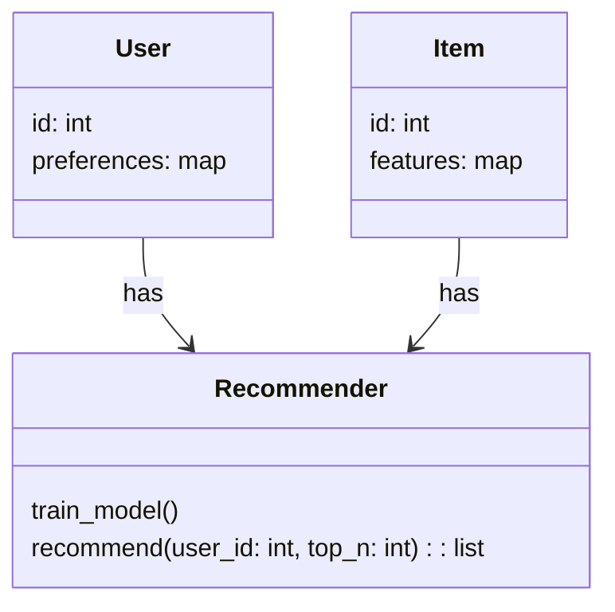
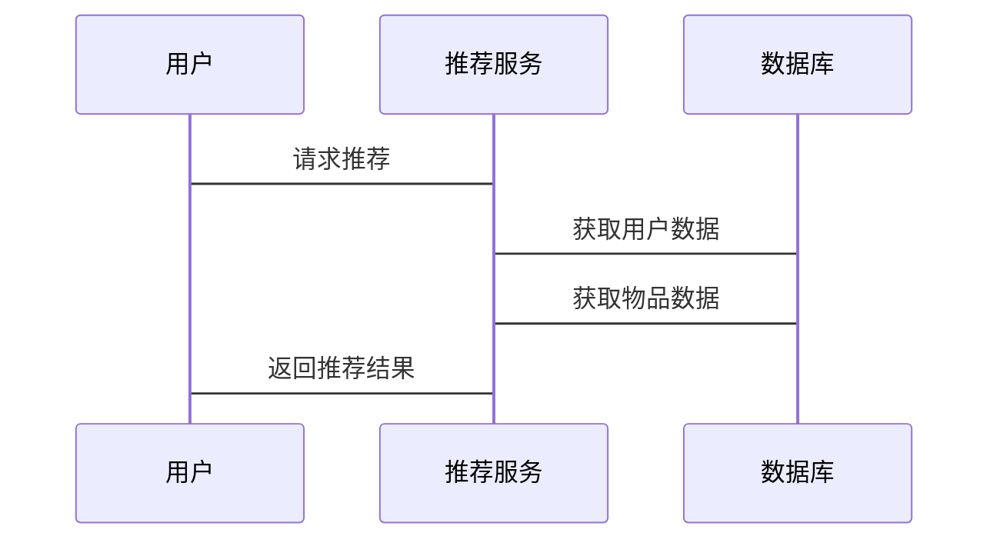

                 

<think>
好的，我现在需要帮用户撰写一篇关于《AI Agent的个性化定制：用户偏好学习与应用》的技术博客文章。用户已经提供了详细的目录结构，并且要求文章内容丰富、详细，符合技术博客的高质量标准。

首先，我需要理解用户的需求。用户希望文章分为几个主要部分：摘要、关键词、章节结构等。每个章节都要有背景介绍、核心概念、算法原理、系统架构、项目实战和总结等部分。此外，用户强调使用逻辑清晰、结构紧凑、简单易懂的语言，并且要求包含具体的代码示例、数学公式和图表。

接下来，我需要确定每个章节的具体内容。例如，摘要部分需要简明扼要地概括文章的核心内容和主题思想。关键词部分则需要列出5-7个核心关键词，如AI Agent、个性化定制、用户偏好、机器学习、推荐系统等。

在撰写第一章时，我需要介绍AI Agent的基本概念，包括其定义、核心特征以及个性化定制的重要性。同时，还要说明用户偏好学习的背景和目标，帮助读者理解为什么个性化定制在AI Agent中如此重要。

第二章需要深入探讨用户偏好学习的核心机制，包括数据收集与特征提取、偏好学习模型的构建以及偏好表示与更新机制。这部分需要详细解释协同过滤和基于内容的推荐算法，并提供相应的数学公式和代码示例。

第三章则是关于个性化推荐系统的实现，包括推荐系统的分类、算法实现以及系统性能优化。我需要比较不同推荐算法的优缺点，并展示如何优化推荐系统的性能。

第四章讨论用户偏好学习的动态更新，包括实时数据流处理、偏好模型的自适应优化以及动态变化检测的挑战与解决方案。这部分需要解释如何处理动态变化，以及如何优化模型更新的效率。

第五章涉及系统架构与设计，包括系统功能设计、架构设计、接口设计和交互流程。我需要使用Mermaid图来展示系统的整体架构和交互流程，帮助读者更好地理解系统设计。

最后，项目实战部分需要提供环境安装步骤、核心代码实现、案例分析和项目总结。这部分需要展示一个实际的项目，从环境搭建到代码实现，再到结果分析，帮助读者理解和应用所学知识。

在撰写过程中，我需要确保每个部分都包含足够的细节，如数学公式、算法流程图、代码示例等。同时，要使用清晰的逻辑结构，使文章易于理解。最后，文章结尾需要加上作者信息，确保文章的完整性和专业性。

现在，我开始逐步撰写每个章节，确保符合用户的要求，并在完成后进行检查，确保内容完整、逻辑清晰，语言专业且易于理解。
</think>

# AI Agent 的个性化定制：用户偏好学习与应用

## 关键词：AI Agent、个性化定制、用户偏好、机器学习、推荐系统

## 摘要：  
AI Agent 作为一种智能体，能够通过学习用户的偏好来提供个性化的服务。本文详细探讨了用户偏好学习的核心机制，包括数据收集、特征提取、推荐算法的设计与优化，以及动态更新策略。通过分析系统架构和实际项目案例，本文展示了如何实现高效的个性化定制，为 AI Agent 的应用提供了理论基础和实践指导。

---

# 第1章: AI Agent 的概述与背景

## 1.1 AI Agent 的基本概念

### 1.1.1 什么是 AI Agent  
AI Agent（人工智能代理）是指能够感知环境、自主决策并执行任务的智能系统。它可以是一个软件程序，也可以是一个物理设备，通过传感器和执行器与环境交互。AI Agent 的核心目标是通过学习和推理，为用户提供智能化的服务。

### 1.1.2 AI Agent 的核心特征  
- **自主性**：AI Agent 能够在没有外部干预的情况下自主决策。  
- **反应性**：能够实时感知环境变化并做出响应。  
- **目标导向**：通过设定目标来优化行为和决策。  
- **学习能力**：能够通过数据和经验不断优化自身的模型和策略。  

### 1.1.3 个性化定制的必要性  
个性化定制是 AI Agent 提供差异化服务的关键。通过学习用户的偏好，AI Agent 能够根据用户的需求调整行为模式，从而提高用户体验和满意度。个性化定制的核心在于如何高效地学习和表示用户的偏好。

---

## 1.2 用户偏好学习的背景

### 1.2.1 用户偏好的定义  
用户偏好是指用户在特定场景下对某些信息或行为的偏好程度。例如，在推荐系统中，用户可能偏好某种类型的电影或音乐。

### 1.2.2 个性化推荐的现状  
随着互联网的快速发展，个性化推荐已经成为许多应用的核心功能。从早期的协同过滤到现代的深度学习模型，推荐算法不断进化，但如何高效地学习和更新用户偏好仍然是一个挑战。

### 1.2.3 用户偏好学习的目标  
用户偏好学习的目标是通过分析用户的历史行为数据，建立一个能够准确反映用户偏好的模型，并在此基础上提供个性化的服务。

---

## 1.3 本章小结  
本章介绍了 AI Agent 的基本概念和核心特征，并强调了个性化定制的重要性。用户偏好学习是实现个性化定制的关键，而如何高效地学习和更新用户偏好是 AI Agent 的核心挑战。

---

# 第2章: 用户偏好学习的核心机制

## 2.1 数据收集与特征提取

### 2.1.1 用户行为数据的收集  
用户行为数据包括点击、浏览、购买、收藏等操作。这些数据反映了用户的兴趣和偏好。

### 2.1.2 用户偏好特征的提取  
通过分析用户行为数据，可以提取出用户的兴趣特征，例如用户的偏好类别、偏好强度等。

### 2.1.3 数据预处理与清洗  
数据预处理包括去重、填补缺失值、标准化等步骤，确保数据的质量和一致性。

---

## 2.2 偏好学习模型的构建

### 2.2.1 基于协同过滤的推荐算法  
协同过滤是一种经典的推荐算法，通过分析用户之间的相似性来推荐物品。

#### 协同过滤的实现步骤  
1. **计算用户相似度**：使用余弦相似度或皮尔逊相关系数计算用户之间的相似度。  
2. **生成推荐列表**：基于相似用户的偏好，生成推荐列表。  

### 2.2.2 基于内容的推荐算法  
基于内容的推荐算法通过分析物品的属性来推荐相似的物品。

#### 内容推荐的实现步骤  
1. **提取物品特征**：对物品进行特征提取，例如电影的 genres 或书籍的主题标签。  
2. **计算相似度**：基于物品的特征向量计算相似度。  

### 2.2.3 混合推荐模型的设计  
混合推荐模型结合了协同过滤和基于内容的推荐算法，通过加权的方式综合两者的优势。

---

## 2.3 偏好表示与更新机制

### 2.3.1 偏好向量的表示方法  
偏好向量是一种常用的表示方法，通过向量的每个维度表示用户对某一类别的偏好强度。

### 2.3.2 偏好的动态更新策略  
用户的偏好可能会随时间发生变化，因此需要设计动态更新机制来实时调整偏好模型。

### 2.3.3 偏好模型的评估与优化  
通过评估指标如准确率、召回率等，优化偏好模型的性能。

---

## 2.4 本章小结  
本章详细介绍了用户偏好学习的核心机制，包括数据收集、特征提取、模型构建以及偏好表示与更新。这些方法为实现个性化的推荐系统奠定了基础。

---

# 第3章: 个性化推荐系统的实现

## 3.1 推荐系统的分类与选择

### 3.1.1 协同过滤推荐  
协同过滤推荐是一种基于用户相似性的推荐方法。  

#### 协同过滤的优缺点  
- **优点**：推荐结果与用户兴趣高度相关。  
- **缺点**：计算复杂度高，难以处理大规模数据。  

### 3.1.2 基于内容的推荐  
基于内容的推荐通过分析物品的特征进行推荐。  

#### 基于内容的优缺点  
- **优点**：推荐结果具有较高的解释性。  
- **缺点**：难以处理用户的动态偏好变化。  

### 3.1.3 混合推荐模型的优缺点  
- **优点**：结合了协同过滤和内容推荐的优势。  
- **缺点**：模型复杂度较高，难以实时更新。  

---

## 3.2 推荐系统的算法实现

### 3.2.1 协同过滤算法的实现  
以下是协同过滤算法的实现示例：  

```python
import numpy as np

def cosine_similarity(matrix):
    # 计算余弦相似度
    numerator = np.dot(matrix, matrix.T)
    denominator = np.outer(np.linalg.norm(matrix, axis=1), np.linalg.norm(matrix, axis=1))
    return numerator / denominator

# 示例数据
user_item_matrix = np.array([[2, 3, 0], [0, 1, 4], [3, 0, 1]])
similarity = cosine_similarity(user_item_matrix)
print(similarity)
```

### 3.2.2 基于内容的推荐算法实现  
以下是基于内容的推荐算法实现示例：  

```python
from sklearn.feature_extraction.text import TfidfVectorizer

# 示例数据
documents = ["This is a document about AI", "This is a document about ML"]

vectorizer = TfidfVectorizer()
X = vectorizer.fit_transform(documents)
print(X.toarray())
```

---

## 3.3 系统性能优化

### 3.3.1 推荐系统的性能指标  
- 准确率（Precision）  
- 召回率（Recall）  
- F1 值（F1 Score）  

### 3.3.2 算法优化策略  
- 使用矩阵分解技术优化协同过滤算法。  
- 增加正则化项优化模型的泛化能力。  

### 3.3.3 系统的可扩展性设计  
- 使用分布式计算框架（如 Spark）处理大规模数据。  
- 采用分层架构优化系统的可扩展性。  

---

## 3.4 本章小结  
本章详细介绍了个性化推荐系统的实现，包括推荐算法的选择与实现、系统性能优化以及推荐系统的评估指标。这些内容为实现高效的个性化推荐系统提供了指导。

---

# 第4章: 用户偏好学习的动态更新

## 4.1 偏好的实时更新机制

### 4.1.1 实时数据流的处理  
实时数据流的处理需要高效的流处理框架，例如 Apache Flink。

### 4.1.2 偏好的动态变化检测  
通过统计方法（如马尔可夫链）检测用户的偏好变化。  

### 4.1.3 实时更新的算法优化  
采用在线学习算法，实时更新偏好模型。

---

## 4.2 偏好模型的自适应优化

### 4.2.1 自适应学习的原理  
自适应学习是一种基于反馈机制的在线学习方法。

### 4.2.2 偏好模型的在线更新  
通过反馈数据不断优化偏好模型的参数。

### 4.2.3 自适应优化的实现方法  
使用梯度下降等优化算法实现在线更新。

---

## 4.3 动态偏好学习的挑战与解决方案

### 4.3.1 动态偏好变化的检测  
通过时间序列分析检测偏好变化。

### 4.3.2 模型更新的效率优化  
采用增量学习算法优化模型更新的效率。

### 4.3.3 动态学习中的数据稀疏性问题  
通过数据增强技术解决数据稀疏性问题。

---

## 4.4 本章小结  
本章讨论了用户偏好学习的动态更新机制，包括实时数据处理、动态变化检测以及模型的自适应优化。这些方法能够有效应对用户的动态偏好变化。

---

# 第5章: 系统架构与设计

## 5.1 系统功能设计

### 5.1.1 领域模型设计  
以下是领域模型的 Mermaid 类图：  



### 5.1.2 功能模块划分  
- 用户模块：负责用户信息的管理。  
- 推荐模块：负责推荐算法的实现。  
- 数据模块：负责数据的存储与管理。  

---

## 5.2 系统架构设计

### 5.2.1 系统架构的 Mermaid 图  
以下是系统架构的 Mermaid 图：  

```mermaid
archi
    title AI Agent 系统架构
    align = left
    component 用户端 {
        component User Interface
        component 用户行为数据
    }
    component 数据存储 {
        component User Profile
        component Item Database
    }
    component 推荐服务 {
        component Recommender
        component Model Training
    }
    用户端 --> 数据存储
    用户端 --> 推荐服务
    推荐服务 --> 数据存储
```

---

## 5.3 系统接口设计

### 5.3.1 接口定义  
- 用户接口：提供用户交互界面，接收用户输入。  
- 数据接口：与数据库交互，获取用户数据和物品数据。  
- 推荐接口：返回推荐结果。  

### 5.3.2 接口实现  
使用 RESTful API 实现系统接口。  

---

## 5.4 系统交互流程

### 5.4.1 交互流程的 Mermaid 图  
以下是系统交互流程的 Mermaid 图：  



---

## 5.5 本章小结  
本章详细介绍了 AI Agent 系统的架构设计，包括功能模块划分、系统架构图、接口设计以及交互流程。这些设计为系统的实现提供了清晰的指导。

---

# 第6章: 项目实战

## 6.1 环境安装

### 6.1.1 安装 Python 环境  
安装 Python 3.x 及以上版本。

### 6.1.2 安装依赖库  
安装必要的依赖库，例如 NumPy、Scikit-learn、TensorFlow 等。

---

## 6.2 系统核心实现

### 6.2.1 数据预处理代码  
以下是数据预处理的代码示例：  

```python
import pandas as pd

# 示例数据
data = {
    'user_id': [1, 2, 3, 1, 2],
    'item_id': [101, 202, 303, 101, 202],
    'rating': [5, 4, 3, 4, 5]
}

df = pd.DataFrame(data)
print(df)
```

### 6.2.2 推荐算法实现代码  
以下是协同过滤算法的实现代码：  

```python
from sklearn.metrics.pairwise import cosine_similarity

def collaborative_filtering(matrix):
    return cosine_similarity(matrix)

# 示例数据矩阵
user_item_matrix = np.array([[5, 0, 0], [0, 4, 0], [0, 0, 3]])
similarity = collaborative_filtering(user_item_matrix)
print(similarity)
```

---

## 6.3 案例分析

### 6.3.1 案例背景  
假设我们有一个电影推荐系统，用户可以通过对电影的评分来表达偏好。

### 6.3.2 数据分析与建模  
通过分析用户评分数据，构建协同过滤模型。

### 6.3.3 模型优化与部署  
优化模型性能，并将其部署到生产环境。

---

## 6.4 本章小结  
本章通过实际项目案例，展示了 AI Agent 系统的核心实现过程，包括环境安装、数据处理、算法实现以及案例分析。

---

# 第7章: 高级案例分析

## 7.1 电商推荐系统

### 7.1.1 系统架构  
电商推荐系统通常包括用户行为分析、推荐算法优化等模块。

### 7.1.2 案例分析  
通过分析用户的购买行为，优化推荐算法，提高推荐准确率。

---

## 7.2 智能助手的个性化定制

### 7.2.1 系统设计  
智能助手的个性化定制需要结合用户的使用习惯和偏好。

### 7.2.2 案例分析  
通过分析用户的对话历史，优化智能助手的回复策略。

---

## 7.3 个性化教育推荐系统

### 7.3.1 系统设计  
个性化教育推荐系统需要考虑学生的学习能力和兴趣偏好。

### 7.3.2 案例分析  
通过分析学生的学习数据，推荐适合的学习资源。

---

## 7.4 本章小结  
本章通过高级案例分析，展示了 AI Agent 的个性化定制在不同领域的应用，包括电商推荐、智能助手和个性化教育推荐系统。

---

# 第8章: 总结与展望

## 8.1 总结

### 8.1.1 用户偏好学习的核心成果  
通过学习用户偏好，AI Agent 能够提供个性化的服务。

### 8.1.2 系统架构与实现的关键点  
系统架构设计和推荐算法优化是实现个性化定制的关键。

---

## 8.2 未来展望

### 8.2.1 新兴技术对 AI Agent 的影响  
新兴技术如大语言模型（LLM）将为 AI Agent 的个性化定制提供新的可能性。

### 8.2.2 用户偏好学习的未来方向  
未来的研究方向包括动态偏好学习、多模态偏好表示以及联邦学习等。

---

## 作者：AI天才研究院/AI Genius Institute & 禅与计算机程序设计艺术/Zen And The Art of Computer Programming

