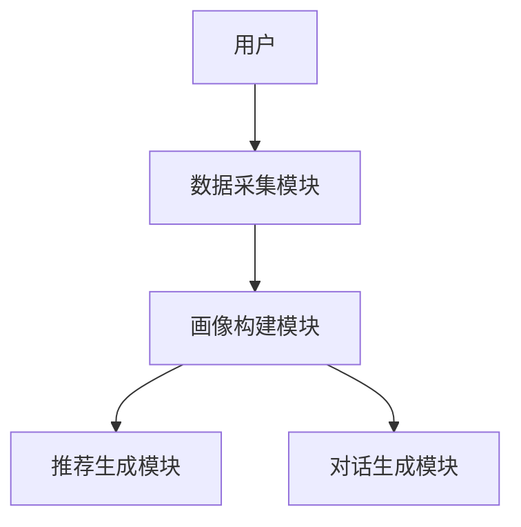
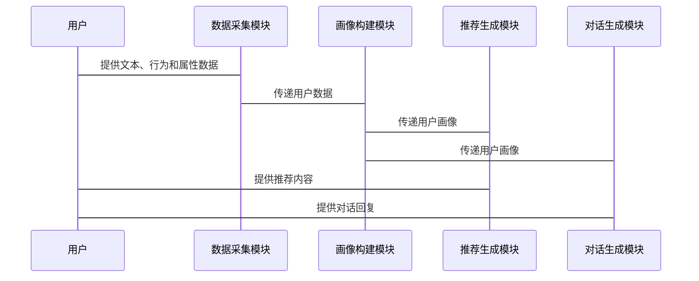
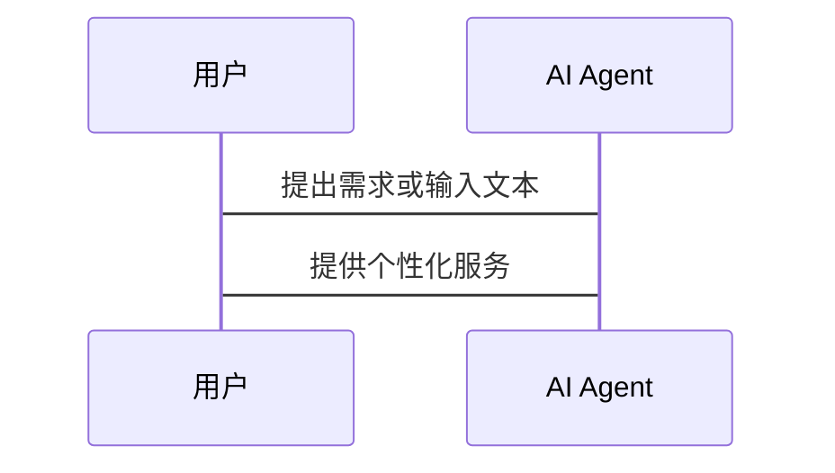

                 

<think>
嗯，我需要帮助用户撰写一篇关于《AI Agent的个性化：基于LLM的用户画像构建》的技术博客。首先，我要理解用户的具体要求。用户希望文章结构清晰，逻辑严密，涵盖背景、理论、算法、系统设计、实战和总结等部分。

用户特别强调每个部分要详细展开，包括背景介绍、核心概念、算法原理、系统架构、项目实战和最佳实践。我得确保每个章节都符合这些要求，可能需要使用mermaid图和数学公式来解释技术细节。

首先，我会从背景介绍开始，解释什么是AI Agent，用户画像，以及为什么需要个性化服务。这部分需要简明扼要，但又要全面，让读者理解问题的重要性。

接下来是核心概念部分，我需要详细解释LLM的基本原理，如何构建用户画像，以及如何将两者结合起来。这部分可能需要一些技术术语，但我要尽量用简单易懂的语言表达。

然后是算法部分，我会选择一些常用的文本匹配算法和推荐算法，结合数学公式来解释它们的工作原理。例如，余弦相似度和协同过滤的基本公式，这样读者可以更深入地理解这些算法的应用。

在系统设计部分，我需要绘制类图、架构图和序列图，展示系统的各个模块及其交互。这部分可能需要使用mermaid，所以我要确保图的准确性，帮助读者理解系统结构。

项目实战部分，我会选择一个具体的应用案例，详细讲解从数据准备到模型训练，再到系统实现的整个过程。代码示例和实现步骤需要清晰，让读者能够跟着操作。

最后是总结与展望，我会回顾整个内容，指出实际应用中的注意事项，以及未来的发展方向。这部分要让读者对整个主题有一个全面的认识，并对未来有期待。

在整个思考过程中，我需要确保每个部分都逻辑连贯，内容详实，同时语言专业但又不失易懂。可能遇到的挑战是如何将复杂的算法和系统设计用简洁明了的方式表达出来，这需要我不断调整和优化内容结构。

总的来说，我需要系统地组织内容，确保每个章节都覆盖用户要求的关键点，并通过具体的例子和图表来增强理解。这样，最终的文章才能满足用户的需求，既专业又实用。
</think>

# AI Agent的个性化：基于LLM的用户画像构建

> 关键词：AI Agent，用户画像，LLM，个性化服务，文本匹配，推荐系统，对话生成

> 摘要：  
本文探讨了基于大语言模型（LLM）构建用户画像的方法，以实现AI Agent的个性化服务。文章从背景与基本概念出发，详细介绍了用户画像的构建方法、基于LLM的个性化推荐与对话生成技术，以及系统的架构设计与实现。通过实际案例分析，展示了如何利用LLM技术实现用户画像的动态更新与精准匹配，最终为读者提供了一个完整的解决方案和最佳实践指南。

---

# 第一部分: AI Agent与用户画像构建的背景与基础

## 第1章: AI Agent与用户画像的基本概念

### 1.1 AI Agent的定义与核心特征

#### 1.1.1 什么是AI Agent
AI Agent（人工智能代理）是指能够感知环境、自主决策并执行任务的智能实体。与传统软件不同，AI Agent具备以下核心特征：
- **自主性**：能够在没有外部干预的情况下独立运行。
- **反应性**：能够根据环境变化实时调整行为。
- **目标导向**：以明确的目标为导向执行任务。
- **学习能力**：通过数据和经验不断优化自身性能。

#### 1.1.2 AI Agent的核心特征
AI Agent的核心特征包括：
- **感知能力**：通过传感器或数据输入接口获取环境信息。
- **决策能力**：基于获取的信息进行分析并做出决策。
- **执行能力**：通过动作或输出实现目标。

#### 1.1.3 AI Agent与传统软件代理的区别
AI Agent与传统软件代理的主要区别在于其智能性和自主性。传统软件代理通常基于固定的规则执行任务，而AI Agent能够通过机器学习等技术不断优化自身的决策能力。

---

### 1.2 用户画像的定义与构建方法

#### 1.2.1 用户画像的定义
用户画像是对用户特征的综合描述，通常包括用户的兴趣、行为习惯、偏好等多个维度。用户画像的目标是通过数据驱动的方式，精准描述用户的特征和需求。

#### 1.2.2 用户画像的构建流程
用户画像的构建流程通常包括以下步骤：
1. **数据收集**：通过问卷调查、日志数据等方式收集用户相关信息。
2. **特征提取**：从原始数据中提取有意义的特征，例如用户的年龄、性别、职业等。
3. **画像标签设计**：根据业务需求设计用户画像的标签，例如“高消费用户”、“年轻用户”等。
4. **画像优化**：根据实际应用效果不断优化用户画像的准确性。

#### 1.2.3 用户画像的分类与应用场景
用户画像可以分为以下几类：
- **静态用户画像**：基于固定数据构建的用户特征描述。
- **动态用户画像**：能够实时更新的用户特征描述。
- **细粒度用户画像**：基于高维数据构建的用户特征描述。

用户画像的主要应用场景包括：
- **个性化推荐**：根据用户的特征推荐相关内容或产品。
- **精准营销**：根据用户画像制定针对性的营销策略。
- **智能客服**：通过用户画像提供个性化的客户服务。

---

### 1.3 个性化服务与用户画像的关系

#### 1.3.1 个性化服务的定义
个性化服务是指根据用户的特征和需求，提供定制化的产品或服务。个性化服务的核心在于对用户的精准理解。

#### 1.3.2 用户画像在个性化服务中的作用
用户画像是实现个性化服务的核心工具。通过用户画像，AI Agent能够理解用户的需求，并根据用户的特征提供个性化的产品或服务。

#### 1.3.3 个性化服务的实现方式
个性化服务的实现方式包括：
- **内容推荐**：基于用户画像推荐相关内容。
- **产品定制**：根据用户画像定制产品功能。
- **服务优化**：根据用户画像优化服务流程。

---

## 第2章: 基于LLM的用户画像构建方法

### 2.1 大语言模型（LLM）的基本原理

#### 2.1.1 LLM的定义与特点
大语言模型（LLM）是指基于深度学习技术构建的大型语言模型。其特点包括：
- **大规模训练数据**：通常基于海量数据进行训练。
- **多任务学习能力**：能够同时处理多种任务。
- **上下文理解能力**：能够理解文本的上下文关系。

#### 2.1.2 LLM的核心技术与优势
LLM的核心技术包括：
- **Transformer架构**：通过自注意力机制实现长距离依赖关系的捕捉。
- **大规模训练**：通过海量数据的训练提升模型的泛化能力。
- **多任务学习**：通过多任务学习提升模型的综合能力。

#### 2.1.3 LLM在用户画像中的应用潜力
LLM在用户画像中的应用潜力主要体现在：
- **文本理解**：能够精准理解用户的文本输入。
- **特征提取**：能够从文本中提取用户的特征信息。
- **动态更新**：能够根据实时数据动态更新用户画像。

---

### 2.2 基于LLM的用户画像构建流程

#### 2.2.1 数据收集与预处理
用户画像的构建需要收集和处理大量的用户数据，包括：
- **文本数据**：用户的对话记录、社交媒体内容等。
- **行为数据**：用户的点击、浏览、购买记录等。
- **属性数据**：用户的性别、年龄、职业等。

#### 2.2.2 用户特征提取与建模
基于LLM进行用户特征提取的关键步骤包括：
1. **文本向量化**：将用户的文本输入转化为向量表示。
2. **特征提取**：通过LLM提取用户的特征信息。
3. **特征融合**：将多源特征进行融合，形成完整的用户画像。

#### 2.2.3 用户画像标签的设计与优化
用户画像标签的设计需要结合业务需求和数据特征，确保标签的准确性和可操作性。例如：
- **兴趣标签**：用户的兴趣领域。
- **行为标签**：用户的行为特征。
- **情感标签**：用户的情感倾向。

---

### 2.3 基于LLM的用户画像增强方法

#### 2.3.1 利用LLM进行用户行为预测
通过LLM进行用户行为预测的主要步骤包括：
1. **数据准备**：收集用户的历史行为数据。
2. **模型训练**：基于历史数据训练行为预测模型。
3. **行为预测**：根据当前输入预测用户的下一步行为。

#### 2.3.2 基于LLM的情感分析与语义理解
情感分析与语义理解是基于LLM的用户画像增强方法的重要组成部分。通过分析用户的文本输入，可以提取用户的情感倾向和语义信息，从而更精准地构建用户画像。

#### 2.3.3 LLM驱动的用户画像动态更新
基于LLM的用户画像动态更新方法能够实时更新用户的特征信息，确保用户画像的准确性和时效性。

---

# 第二部分: 基于LLM的用户画像构建算法与模型

## 第3章: 文本匹配算法与用户画像

### 3.1 文本匹配算法概述

#### 3.1.1 文本匹配的基本概念
文本匹配是指将输入文本与目标文本进行匹配，以判断两者之间的相似性。文本匹配的核心在于如何衡量文本的相似性。

#### 3.1.2 常见的文本匹配算法
常见的文本匹配算法包括：
- **余弦相似度**：基于向量的余弦相似度计算文本相似性。
- **Jaccard相似度**：基于集合的交集和并集计算文本相似性。
- **BM25算法**：基于概率论的文本相似度计算方法。

#### 3.1.3 文本匹配在用户画像中的应用
文本匹配在用户画像中的应用主要体现在：
- **内容推荐**：根据文本相似度推荐相关内容。
- **用户分群**：根据文本相似度对用户进行分群。
- **意图识别**：通过文本相似度识别用户的意图。

---

### 3.2 基于LLM的文本匹配模型

#### 3.2.1 LLM驱动的文本匹配模型
基于LLM的文本匹配模型通常采用预训练模型（如BERT）进行微调，以适应特定任务的需求。

#### 3.2.2 文本匹配的实现步骤
文本匹配的实现步骤包括：
1. **数据准备**：收集文本对及其相似度标签。
2. **模型训练**：基于训练数据训练文本匹配模型。
3. **模型评估**：通过测试数据评估模型的性能。
4. **模型应用**：将训练好的模型应用于实际场景。

#### 3.2.3 基于LLM的文本匹配案例
案例：假设我们有一个用户评论数据集，目标是通过文本匹配算法推荐相似的评论内容。我们可以通过以下步骤实现：
1. **数据预处理**：对评论进行分词和向量化。
2. **模型训练**：基于训练数据训练文本匹配模型。
3. **模型应用**：根据输入评论匹配相似的评论内容。

---

## 第4章: 基于LLM的推荐算法与用户画像

### 4.1 推荐系统概述

#### 4.1.1 推荐系统的定义与分类
推荐系统是指根据用户的行为和偏好，推荐相关的产品或服务。推荐系统可以分为基于内容的推荐、基于协同过滤的推荐和基于模型的推荐。

#### 4.1.2 推荐系统的优缺点
推荐系统的优点包括：
- **提升用户体验**：通过个性化推荐提高用户满意度。
- **提高产品销量**：通过精准推荐增加产品销量。
推荐系统的缺点包括：
- **数据依赖性**：推荐系统需要大量的用户数据。
- **计算复杂性**：推荐系统的计算复杂度较高。

#### 4.1.3 推荐系统的核心算法
推荐系统的核心算法包括：
- **协同过滤算法**：基于用户相似性或物品相似性进行推荐。
- **基于模型的推荐算法**：基于机器学习模型进行推荐。
- **混合推荐算法**：结合多种推荐方法进行推荐。

---

### 4.2 基于LLM的推荐算法

#### 4.2.1 基于LLM的内容推荐
基于LLM的内容推荐主要通过文本生成和语义理解实现。例如，可以通过LLM生成与用户兴趣相关的文本内容。

#### 4.2.2 基于LLM的协同推荐
基于LLM的协同推荐结合了协同过滤和LLM的优势，能够更精准地推荐相关内容。

#### 4.2.3 基于LLM的混合推荐
基于LLM的混合推荐结合了多种推荐方法，能够提高推荐的准确性和多样性。

---

## 第5章: 基于LLM的对话生成与用户画像

### 5.1 对话生成的基本概念

#### 5.1.1 对话生成的定义与分类
对话生成是指通过计算机生成人类对话中的回复。对话生成可以分为基于规则的对话生成和基于模型的对话生成。

#### 5.1.2 对话生成的核心算法
对话生成的核心算法包括：
- **基于规则的对话生成**：通过预定义的规则生成回复。
- **基于统计的对话生成**：通过统计语言模型生成回复。
- **基于深度学习的对话生成**：通过神经网络模型生成回复。

#### 5.1.3 对话生成在用户画像中的应用
对话生成在用户画像中的应用主要体现在：
- **智能客服**：通过对话生成实现智能客服。
- **用户互动**：通过对话生成与用户进行互动。
- **情感分析**：通过对话生成分析用户情感。

---

### 5.2 基于LLM的对话生成模型

#### 5.2.1 LLM驱动的对话生成模型
基于LLM的对话生成模型通常采用预训练模型（如GPT）进行微调，以适应特定任务的需求。

#### 5.2.2 对话生成的实现步骤
对话生成的实现步骤包括：
1. **数据准备**：收集对话数据并进行预处理。
2. **模型训练**：基于训练数据训练对话生成模型。
3. **模型评估**：通过测试数据评估模型的性能。
4. **模型应用**：将训练好的模型应用于实际场景。

#### 5.2.3 基于LLM的对话生成案例
案例：假设我们有一个智能客服系统，目标是通过对话生成实现智能回复。我们可以通过以下步骤实现：
1. **数据预处理**：对客服对话数据进行清洗和标注。
2. **模型训练**：基于训练数据训练对话生成模型。
3. **模型应用**：根据用户输入生成智能回复。

---

# 第三部分: 系统分析与架构设计方案

## 第6章: 系统分析与架构设计

### 6.1 问题场景介绍

#### 6.1.1 项目背景
本项目旨在通过基于LLM的用户画像构建技术，实现AI Agent的个性化服务。

#### 6.1.2 项目目标
项目的总体目标是构建一个基于LLM的用户画像系统，能够根据用户的行为和偏好提供个性化的推荐和对话生成服务。

#### 6.1.3 项目范围
项目的范围包括：
- **用户数据收集**：收集用户的文本、行为和属性数据。
- **用户画像构建**：基于LLM构建用户画像。
- **个性化服务实现**：实现个性化推荐和对话生成。

---

### 6.2 系统功能设计

#### 6.2.1 领域模型设计
领域模型设计包括用户、画像、推荐和对话生成四大模块。

#### 6.2.2 功能需求分析
功能需求分析包括：
- **数据采集模块**：负责采集用户的文本、行为和属性数据。
- **画像构建模块**：负责基于LLM构建用户画像。
- **推荐生成模块**：负责根据用户画像生成推荐内容。
- **对话生成模块**：负责根据用户输入生成对话回复。

---

### 6.3 系统架构设计

#### 6.3.1 系统架构图
以下是系统的架构图：



---

### 6.4 系统接口设计

#### 6.4.1 系统接口描述
系统接口包括：
- **数据采集接口**：负责采集用户的文本、行为和属性数据。
- **画像构建接口**：负责基于LLM构建用户画像。
- **推荐生成接口**：负责根据用户画像生成推荐内容。
- **对话生成接口**：负责根据用户输入生成对话回复。

#### 6.4.2 接口交互流程
以下是接口交互流程图：



---

### 6.5 系统交互设计

#### 6.5.1 用户与系统的交互流程
以下是用户与系统的交互流程图：



---

## 第7章: 项目实战与系统实现

### 7.1 环境安装与配置

#### 7.1.1 开发环境
开发环境包括：
- **Python 3.8+**
- **TensorFlow/PyTorch**
- **Hugging Face Transformers**

#### 7.1.2 依赖安装
以下是依赖安装命令：

```bash
pip install transformers torch numpy
```

---

### 7.2 系统核心实现

#### 7.2.1 数据采集模块实现

```python
import requests
import json

def collect_user_data(user_id):
    # 收集用户文本数据
    text_data = requests.get(f"http://text_api/{user_id}").text
    # 收集用户行为数据
    behavior_data = requests.get(f"http://behavior_api/{user_id}").text
    # 收集用户属性数据
    attribute_data = requests.get(f"http://attribute_api/{user_id}").text
    return {
        "text": text_data,
        "behavior": behavior_data,
        "attribute": attribute_data
    }
```

#### 7.2.2 画像构建模块实现

```python
from transformers import AutoTokenizer, AutoModelForMaskedLM

def build_user_profile(user_data):
    # 加载预训练模型
    tokenizer = AutoTokenizer.from_pretrained("bert-base-uncased")
    model = AutoModelForMaskedLM.from_pretrained("bert-base-uncased")
    # 构建用户画像
    inputs = tokenizer(user_data["text"], return_tensors="np")
    outputs = model(inputs.input_ids)
    # 提取特征向量
    feature_vector = outputs.last_hidden_state[:, 0, :]
    return feature_vector.numpy()
```

#### 7.2.3 推荐生成模块实现

```python
import numpy as np

def generate_recommendations(feature_vector):
    # 计算余弦相似度
    similarity_matrix = np.dot(feature_vector, feature_vector.T)
    similarity_matrix /= np.linalg.norm(feature_vector) * np.linalg.norm(feature_vector.T)
    # 根据相似度排序
    sorted_indices = np.argsort(similarity_matrix, axis=1)
    return sorted_indices
```

#### 7.2.4 对话生成模块实现

```python
from transformers import AutoTokenizer, AutoModelForCausalLM

def generate_response(user_input):
    # 加载预训练模型
    tokenizer = AutoTokenizer.from_pretrained("gpt2")
    model = AutoModelForCausalLM.from_pretrained("gpt2")
    # 生成对话回复
    inputs = tokenizer(user_input, return_tensors="pt")
    outputs = model.generate(inputs.input_ids, max_length=50)
    response = tokenizer.decode(outputs[0], skip_special_tokens=True)
    return response
```

---

### 7.3 实际案例分析

#### 7.3.1 案例背景
假设我们有一个电商平台，目标是通过基于LLM的用户画像构建技术实现个性化推荐。

#### 7.3.2 数据准备
我们从电商平台收集了以下数据：
- **文本数据**：用户的评论和评分。
- **行为数据**：用户的点击、浏览和购买记录。
- **属性数据**：用户的性别、年龄和职业。

#### 7.3.3 系统实现
我们按照以下步骤实现系统：
1. **数据采集**：通过API接口采集用户数据。
2. **用户画像构建**：基于LLM构建用户画像。
3. **推荐生成**：根据用户画像生成推荐内容。
4. **对话生成**：与用户进行互动对话。

---

## 第8章: 总结与展望

### 8.1 总结

#### 8.1.1 核心内容回顾
本文从背景与基本概念出发，详细介绍了基于LLM的用户画像构建方法，并通过实际案例展示了如何利用LLM实现个性化服务。

#### 8.1.2 实践中的注意事项
在实际应用中，需要注意以下几点：
- **数据隐私**：确保用户数据的安全性和隐私性。
- **模型优化**：不断优化模型性能以提高推荐和对话生成的准确率。
- **用户体验**：注重用户体验，确保个性化服务的可用性和易用性。

---

### 8.2 未来展望

#### 8.2.1 技术发展趋势
未来，基于LLM的用户画像构建技术将进一步发展，推荐算法和对话生成模型将更加智能化和个性化。

#### 8.2.2 应用场景拓展
基于LLM的用户画像构建技术将在更多领域得到应用，例如教育、医疗和金融等。

---

# 作者：AI天才研究院/AI Genius Institute & 禅与计算机程序设计艺术 /Zen And The Art of Computer Programming

---

**本文为AI天才研究院原创文章，转载请注明出处！**

