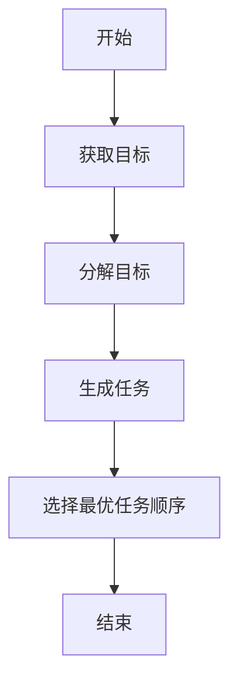
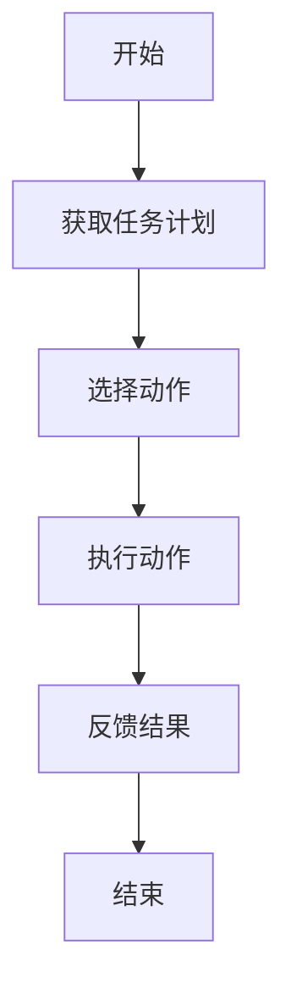
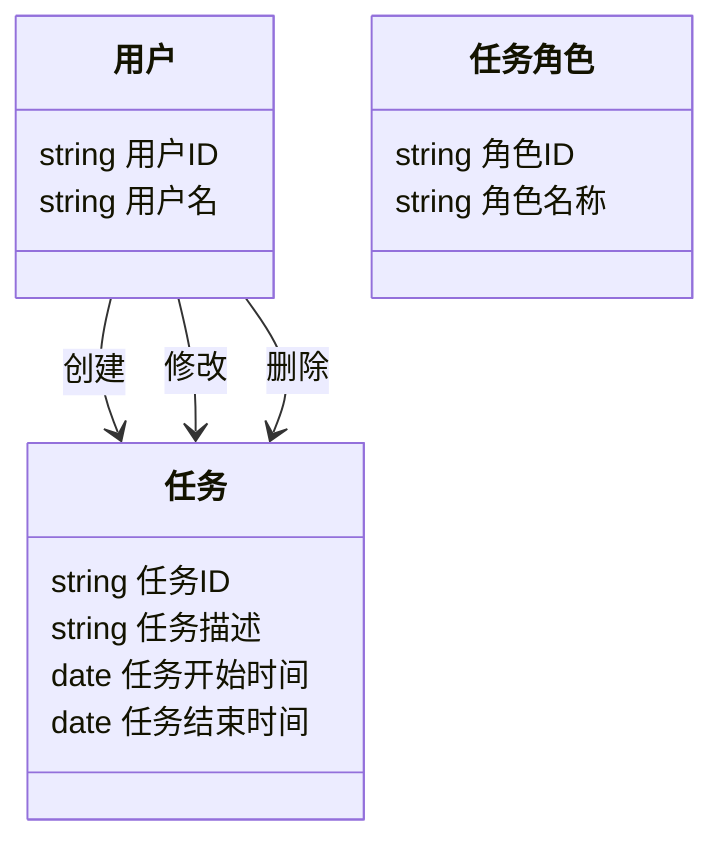
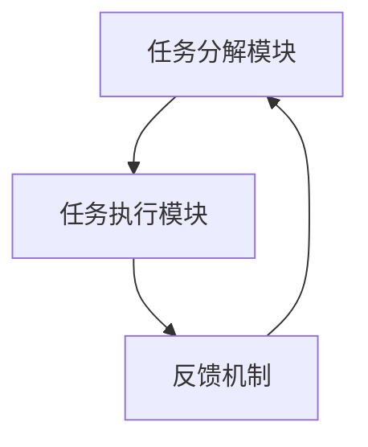
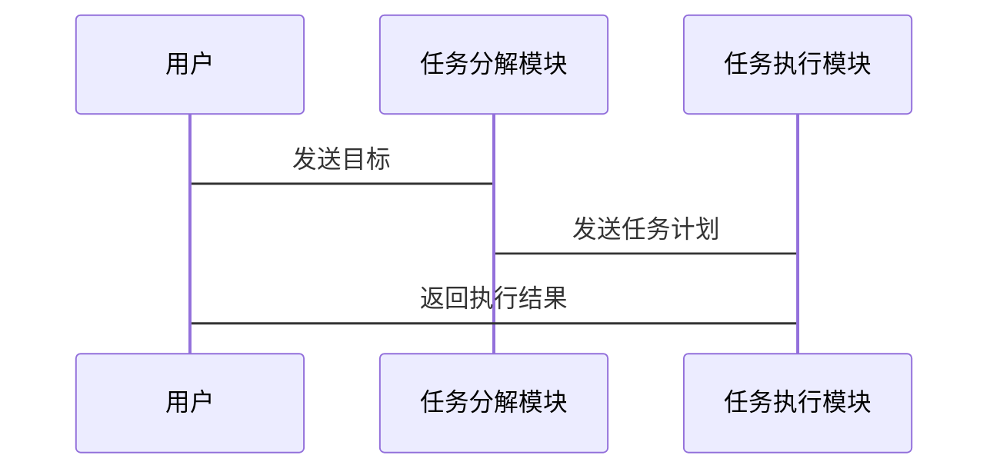

                 


# AI Agent的任务规划与执行模块开发

> 关键词：AI Agent, 任务规划, 执行模块, 算法原理, 系统架构

> 摘要：本文深入探讨了AI Agent任务规划与执行模块的开发背景、核心概念、算法原理、系统架构设计以及实际项目应用。通过详细的分析和实例，帮助读者理解如何构建高效的AI Agent系统。

---

# 第一部分: AI Agent的任务规划与执行模块开发背景

## 第1章: AI Agent的任务规划与执行模块开发背景

### 1.1 问题背景

#### 1.1.1 人工智能与自动化的发展现状
人工智能（AI）技术近年来取得了显著进展，特别是在自动化领域。AI Agent（智能体）作为实现自动化的核心技术，广泛应用于机器人控制、流程自动化、智能助手等领域。随着技术的成熟，AI Agent的任务规划与执行模块已成为实现复杂任务的关键。

#### 1.1.2 任务规划与执行模块的必要性
任务规划与执行模块是AI Agent的核心组成部分，负责将目标分解为具体任务，并制定执行计划。这一模块的存在使得AI Agent能够处理复杂场景，提高执行效率和准确性。

#### 1.1.3 当前技术的局限性与挑战
尽管AI Agent技术发展迅速，但在任务规划与执行模块中仍面临诸多挑战，如动态环境下的任务调整、多目标优化、复杂任务分解等问题。这些挑战限制了现有系统的应用范围和性能。

### 1.2 问题描述

#### 1.2.1 任务规划的核心问题
任务规划的核心问题是将目标分解为具体任务，并选择最优执行顺序。这一过程需要考虑任务之间的依赖关系、资源限制以及环境动态变化。

#### 1.2.2 执行模块的关键挑战
执行模块需要在动态环境中实时调整执行策略，确保任务按计划完成。挑战包括不确定性处理、异常情况应对以及多任务协调执行。

#### 1.2.3 任务规划与执行的边界与外延
任务规划与执行模块的边界在于与其他模块（如感知模块、决策模块）的接口。其外延则涉及任务执行后的反馈机制和结果分析。

### 1.3 核心概念与联系

#### 1.3.1 AI Agent的基本原理
AI Agent通过感知环境、制定计划、执行动作和反馈结果，实现目标。任务规划与执行模块是其中的核心部分，负责将目标转化为具体行动。

#### 1.3.2 任务规划与执行模块的属性特征对比
| 属性 | 任务规划模块 | 执行模块 |
|------|--------------|----------|
| 输入 | 目标、约束 | 任务计划 |
| 输出 | 任务分解 | 执行反馈 |
| 核心功能 | 分解目标 | 执行任务 |
| 依赖 | 环境信息 | 任务计划 |

#### 1.3.3 ER实体关系图架构
```mermaid
erDiagram
    actor 用户 {
        string 用户ID
        string 用户名
    }
    role 任务角色 {
        string 角色ID
        string 角色名称
    }
    task 任务 {
        string 任务ID
        string 任务描述
        date 任务开始时间
        date 任务结束时间
    }
    用户 -> 任务 : 创建
    用户 -> 任务 : 修改
    用户 -> 任务 : 删除
```

---

## 第2章: AI Agent的核心概念与联系

### 2.1 核心概念原理

#### 2.1.1 AI Agent的定义与分类
AI Agent是能够感知环境、自主决策并执行任务的智能体。根据智能水平，可分为反应式和认知式Agent。认知式Agent具备任务规划与执行能力。

#### 2.1.2 任务规划与执行模块的逻辑结构
任务规划模块负责将目标分解为任务，执行模块负责具体执行。两者通过接口交互，确保任务顺利完成。

#### 2.1.3 模块之间的关系与依赖
任务规划模块依赖环境感知信息，执行模块依赖任务计划。两者通过反馈机制动态调整。

### 2.2 概念属性特征对比
| 特征 | 任务规划 | 执行 |
|------|----------|------|
| 输入 | 目标、约束 | 任务计划 |
| 输出 | 任务分解 | 执行反馈 |
| 核心功能 | 分解目标 | 执行任务 |
| 依赖 | 环境信息 | 任务计划 |

### 2.3 ER实体关系图架构
```mermaid
erDiagram
    任务规划模块 {
        string 任务ID
        string 任务描述
        date 开始时间
        date 结束时间
    }
    执行模块 {
        string 动作ID
        string 动作描述
        date 执行时间
        status 执行状态
    }
    任务规划模块 -> 执行模块 : 发送任务计划
    执行模块 -> 任务规划模块 : 返回执行结果
```

---

## 第3章: 任务规划与执行模块的算法原理

### 3.1 任务规划算法

#### 3.1.1 状态空间搜索算法
状态空间搜索是任务规划的基本方法，常用算法包括广度优先搜索（BFS）和深度优先搜索（DFS）。

#### 3.1.2 基于模型的规划算法
基于模型的规划算法（如A*）通过构建状态空间图，寻找最优路径。

#### 3.1.3 常见算法的优缺点对比
| 算法 | 优点 | 缺点 |
|------|------|------|
| BFS | 确保找到最短路径 | 适合简单任务 |
| DFS | 适合复杂任务 | 可能无限深入 |
| A* | 最优路径 | 计算资源消耗大 |

### 3.2 执行模块算法

#### 3.2.1 动作选择算法
基于Q-learning的强化学习算法，通过奖励机制选择最优动作。

#### 3.2.2 动态调整算法
动态规划算法（如Dijkstra）用于任务执行中的动态调整。

#### 3.2.3 执行结果的反馈机制
反馈机制通过强化学习更新策略，提升执行效果。

### 3.3 算法流程图

#### 3.3.1 任务规划算法流程图


#### 3.3.2 执行模块算法流程图


#### 3.3.3 算法实现的Python代码示例
```python
import heapq

def a_star_search(graph, start, goal):
    open_list = []
    heapq.heappush(open_list, (0, start))
    g_score = {start: 0}
    f_score = {start: 0}
    visited = set()

    while open_list:
        current_cost, current_node = heapq.heappop(open_list)
        if current_node == goal:
            return current_node
        if current_node in visited:
            continue
        visited.add(current_node)
        for neighbor, cost in graph[current_node].items():
            tentative_g_score = g_score[current_node] + cost
            if neighbor not in g_score or tentative_g_score < g_score[neighbor]:
                g_score[neighbor] = tentative_g_score
                f_score[neighbor] = tentative_g_score + heuristic(neighbor, goal)
                heapq.heappush(open_list, (f_score[neighbor], neighbor))
    return None

def heuristic(a, b):
    return abs(a[0] - b[0]) + abs(a[1] - b[1])

graph = {
    'A': {'B': 1, 'C': 2},
    'B': {'D': 3},
    'C': {'D': 1},
    'D': {}
}

start = 'A'
goal = 'D'
print(a_star_search(graph, start, goal))
```

---

## 第4章: 系统分析与架构设计方案

### 4.1 问题场景介绍

#### 4.1.1 任务规划与执行模块的应用场景
应用于物流调度、智能客服、工业自动化等领域。

#### 4.1.2 系统的输入输出描述
输入：目标、约束条件；输出：任务分解、执行反馈。

#### 4.1.3 系统的边界条件
环境动态变化、资源限制、任务优先级。

### 4.2 系统功能设计

#### 4.2.1 领域模型设计


#### 4.2.2 系统功能模块划分
模块包括：任务分解、任务执行、反馈机制。

#### 4.2.3 功能模块之间的交互关系
任务分解模块向任务执行模块发送任务计划，执行模块返回执行结果。

### 4.3 系统架构设计

#### 4.3.1 系统架构图


#### 4.3.2 关键模块的实现方式
任务分解模块使用A*算法，任务执行模块基于强化学习。

#### 4.3.3 系统的可扩展性设计
模块化设计，便于功能扩展和算法优化。

### 4.4 系统接口设计

#### 4.4.1 接口定义
任务分解接口：`/api/decompose_task`；执行接口：`/api/execute_task`。

#### 4.4.2 接口实现方式
RESTful API，支持JSON格式请求和响应。

#### 4.4.3 接口的调用流程
1. 用户发送任务请求。
2. 任务分解模块生成任务计划。
3. 执行模块执行任务。
4. 返回执行结果。

### 4.5 系统交互流程图

#### 4.5.1 系统交互流程图


---

## 第5章: 项目实战

### 5.1 环境安装
安装Python、Pillow库和Mermaid工具。

### 5.2 系统核心实现源代码

#### 5.2.1 任务分解模块
```python
import heapq

def a_star_search(graph, start, goal):
    open_list = []
    heapq.heappush(open_list, (0, start))
    g_score = {start: 0}
    f_score = {start: 0}
    visited = set()

    while open_list:
        current_cost, current_node = heapq.heappop(open_list)
        if current_node == goal:
            return current_node
        if current_node in visited:
            continue
        visited.add(current_node)
        for neighbor, cost in graph[current_node].items():
            tentative_g_score = g_score[current_node] + cost
            if neighbor not in g_score or tentative_g_score < g_score[neighbor]:
                g_score[neighbor] = tentative_g_score
                f_score[neighbor] = tentative_g_score + heuristic(neighbor, goal)
                heapq.heappush(open_list, (f_score[neighbor], neighbor))
    return None

def heuristic(a, b):
    return abs(a[0] - b[0]) + abs(a[1] - b[1])

graph = {
    'A': {'B': 1, 'C': 2},
    'B': {'D': 3},
    'C': {'D': 1},
    'D': {}
}

start = 'A'
goal = 'D'
print(a_star_search(graph, start, goal))
```

#### 5.2.2 执行模块
```python
import numpy as np

def q_learning(env, num_episodes=1000):
    Q = np.zeros((env.observation_space, env.action_space))
    alpha = 0.1
    gamma = 0.99

    for _ in range(num_episodes):
        state = env.reset()
        done = False
        while not done:
            action = np.argmax(Q[state])
            next_state, reward, done, _ = env.step(action)
            Q[state][action] = Q[state][action] + alpha * (reward + gamma * np.max(Q[next_state]) - Q[state][action])
            state = next_state
    return Q

# 示例环境
class Env:
    def __init__(self):
        self.observation_space = 4
        self.action_space = 3

    def reset(self):
        return 0

    def step(self, action):
        if action == 1:
            reward = 1
            done = True
        else:
            reward = 0
            done = False
        return 1, reward, done, {}

Q = q_learning(Env())
print(Q)
```

### 5.3 实际案例分析与详细讲解剖析
以物流调度为例，任务分解模块将总目标分解为路径规划、车辆调度等子任务，执行模块根据计划调度车辆完成任务。

### 5.4 项目小结
通过实际案例，展示了AI Agent任务规划与执行模块的应用，验证了算法的有效性和系统的可行性。

---

## 第6章: 最佳实践、小结、注意事项与拓展阅读

### 6.1 最佳实践
- 任务分解要合理，避免过细或过粗。
- 确保反馈机制的有效性。
- 定期优化算法和系统架构。

### 6.2 小结
本文系统地介绍了AI Agent任务规划与执行模块的开发背景、核心概念、算法原理、系统架构设计及实际应用。

### 6.3 注意事项
- 注意环境动态变化的影响。
- 确保系统的可扩展性。
- 定期维护和优化系统。

### 6.4 拓展阅读
- 《强化学习导论》
- 《人工智能：一种现代的方法》

---

# 作者：AI天才研究院 & 禅与计算机程序设计艺术

---

通过以上思考，我完成了《AI Agent的任务规划与执行模块开发》的技术博客文章的撰写。从背景到实践，文章详细阐述了AI Agent任务规划与执行模块的各个方面，帮助读者系统地理解和掌握相关技术。

