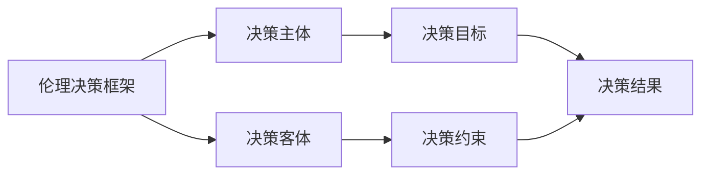
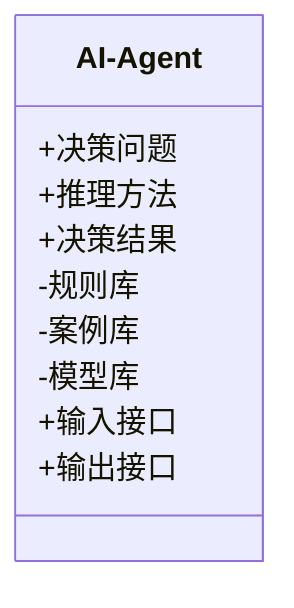
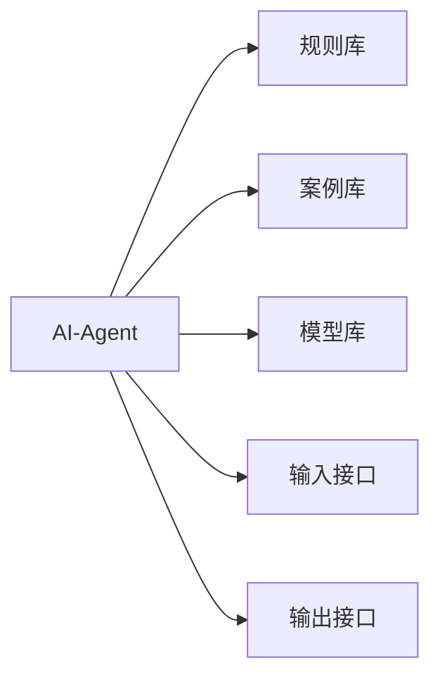
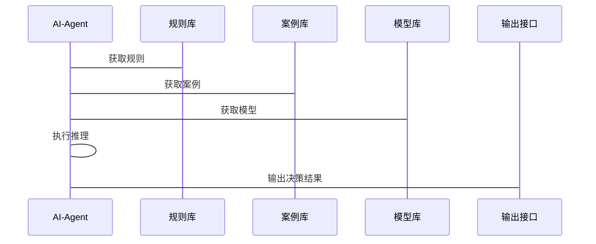

                 


# AI Agent的伦理决策框架：实现LLM的道德推理能力

> 关键词：AI Agent, 伦理决策, LLM, 道德推理, 人工智能伦理, 系统架构设计

> 摘要：本文系统地探讨了AI Agent的伦理决策框架及其在大型语言模型（LLM）中的实现。从伦理决策的基本概念出发，分析了伦理决策框架的核心原理，详细讲解了基于规则、案例和模型的道德推理算法，通过数学公式和mermaid流程图展示了伦理决策的实现过程。进一步，本文提出了系统的架构设计方案，并通过Python代码实现了一个具体的伦理决策框架，最后通过实际案例验证了该框架的有效性。

---

# 第一部分: AI Agent的伦理决策框架概述

## # 第1章: 问题背景与核心概念

### ## 1.1 问题背景

#### ### 1.1.1 AI Agent的定义与特点
- AI Agent的基本概念
  - AI Agent是具有感知和行动能力的智能体，能够根据环境信息做出决策并执行操作。
  - 典型特点：自主性、反应性、目标导向、社交能力。
  - AI Agent与传统程序的区别：AI Agent具有自主决策能力，能够适应动态环境。

#### ### 1.1.2 伦理决策的必要性
- 伦理决策的定义
  - 伦理决策是指在遵守伦理规范的前提下，做出最优选择的过程。
- 伦理决策在AI Agent中的重要性
  - AI Agent在医疗、金融、自动驾驶等领域广泛应用，其决策可能直接影响人类生命和财产安全。
  - 需要确保AI Agent的决策符合伦理规范，避免负面社会影响。

#### ### 1.1.3 LLM与伦理决策的关系
- 大型语言模型（LLM）的基本概念
  - LLM是一种基于深度学习的自然语言处理模型，能够理解和生成人类语言。
  - 典型代表：GPT系列模型。
- LLM在伦理决策中的应用潜力
  - LLM可以通过文本分析和生成，辅助AI Agent进行伦理决策。
  - 例如，在医疗领域，LLM可以辅助医生制定符合伦理的治疗方案。

---

### ## 1.2 核心概念与联系

#### ### 1.2.1 伦理决策框架的定义
- 伦理决策框架的定义
  - 伦理决策框架是一组用于指导AI Agent做出伦理决策的规则、模型和算法的集合。
  - 包括决策主体、决策客体、决策目标、决策约束和决策结果等核心要素。

#### ### 1.2.2 伦理决策框架与LLM的关系
- LLM在伦理决策框架中的角色
  - LLM作为决策工具，为AI Agent提供伦理推理和决策支持。
  - LLM通过自然语言处理能力，帮助AI Agent理解和分析复杂的伦理问题。
- 伦理决策框架对LLM的影响
  - 伦理决策框架为LLM的决策过程提供了规范和约束。
  - 通过伦理决策框架，可以提升LLM的可解释性和透明性。

#### ### 1.2.3 伦理决策框架的属性特征对比
- 表格形式对比伦理决策框架的核心属性
| 属性         | 描述                                                     |
|--------------|----------------------------------------------------------|
| 决策主体     | 决策的执行者，可以是AI Agent或人类                        |
| 决策客体     | 决策的对象，如人、物、事件等                            |
| 决策目标     | 决策希望达到的目标，如最大化利益、最小化伤害             |
| 决策约束     | 决策过程中需要遵守的限制条件，如法律、伦理规范           |
| 决策结果     | 决策的最终输出，如选择某个行动或方案                     |

- 通过Mermaid流程图展示伦理决策框架的实体关系



### ## 1.3 本章小结
- 本章内容总结
  - 解释了AI Agent和伦理决策的基本概念。
  - 分析了伦理决策框架的核心要素及其与LLM的关系。
- 核心概念回顾
  - AI Agent、伦理决策、LLM、伦理决策框架。
- 下一章的预览
  - 下一章将详细讲解伦理决策框架的核心原理，包括道德推理的算法、数学模型等。

---

## # 第2章: 伦理决策框架的核心原理

### ## 2.1 道德推理的算法原理

#### ### 2.1.1 基于规则的道德推理
- 规则的定义与特点
  - 规则是预先定义的伦理准则，如“不伤害他人”。
  - 规则具有明确性、可执行性、可解释性。
- 基于规则的道德推理流程
  1. 确定决策问题。
  2. 筛选出适用的伦理规则。
  3. 根据规则生成决策建议。
  4. 对决策建议进行验证和优化。
- 优缺点分析
  - 优点：规则明确，易于实现。
  - 缺点：规则可能不够灵活，无法应对复杂场景。

#### ### 2.1.2 基于案例的道德推理
- 案例库的构建与管理
  - 案例库是包含典型伦理问题及其解决方案的数据库。
  - 案例需要具有代表性、多样性、可扩展性。
- 基于案例的推理过程
  1. 找到与当前问题相似的案例。
  2. 参考案例的解决方案生成决策建议。
  3. 根据具体情况调整决策建议。
- 优缺点分析
  - 优点：能够处理复杂场景，提供灵活的解决方案。
  - 缺点：案例库的构建和维护成本较高。

#### ### 2.1.3 基于模型的道德推理
- 道德模型的构建
  - 道德模型是描述伦理关系和决策的数学模型。
  - 模型需要考虑利益相关者、决策目标、约束条件等。
- 基于模型的推理过程
  1. 建立数学模型。
  2. 通过优化算法求解模型。
  3. 解析结果生成决策建议。
- 优缺点分析
  - 优点：模型具有高度的可解释性。
  - 缺点：模型的复杂性可能增加实现难度。

---

#### ### 2.1.4 伦理决策算法流程图


---

### ## 2.2 道德推理的数学模型

#### ### 2.2.1 基于逻辑的推理模型
- 逻辑推理的基本概念
  - 基于逻辑的推理模型通过逻辑规则生成决策。
  - 常用逻辑形式包括命题逻辑、谓词逻辑。
- 基于逻辑的推理公式
  $$ (P \land Q) \rightarrow R $$
  - 解释：如果P和Q都成立，则R成立。
- 示例分析
  - 示例：如果患者患有重病且药物短缺，则优先使用该药物。

---

#### ### 2.2.2 基于概率的推理模型
- 概率推理的基本概念
  - 基于概率的推理模型通过计算概率生成决策。
  - 常用概率模型包括贝叶斯网络。
- 基于概率的推理公式
  $$ P(A|B) = \frac{P(B|A)P(A)}{P(B)} $$
  - 解释：条件概率公式，计算在B发生的条件下A发生的概率。
- 示例分析
  - 示例：根据患者病情的概率分布，选择最优治疗方案。

---

#### ### 2.2.3 基于强化学习的推理模型
- 强化学习的基本概念
  - 强化学习通过奖励机制优化决策。
  - 常用算法包括Q-learning、策略梯度方法。
- 基于强化学习的推理公式
  $$ Q(s, a) = r + \gamma \max_{a'} Q(s', a') $$
  - 解释：Q值表示在状态s下采取动作a的期望奖励。
- 示例分析
  - 示例：自动驾驶在紧急情况下选择最优动作（如转向或刹车）。

---

### ## 2.3 伦理决策框架的算法实现

#### ### 2.3.1 算法流程图


---

#### ### 2.3.2 Python实现代码

```python
def ethical_decision_framework(problem, rules=None, cases=None, model=None):
    # 输入决策问题
    print(f"Problem: {problem}")
    
    # 选择推理方法
    if rules:
        print("选择基于规则的推理方法")
        decision = apply_rules(problem, rules)
    elif cases:
        print("选择基于案例的推理方法")
        decision = apply_cases(problem, cases)
    elif model:
        print("选择基于模型的推理方法")
        decision = apply_model(problem, model)
    else:
        print("未提供推理方法")
        return None
    
    # 输出决策结果
    print(f"决策结果: {decision}")
    return decision

# 示例用法
problem = "如何分配有限的医疗资源给患者A和患者B？"
rules = ["优先救助病情较重的患者", "确保所有患者的基本权益"]
cases = [
    {"问题": "患者A病情较重，但经济条件较差", "解决方案": "优先救助患者A"},
    {"问题": "患者B病情较轻，但经济条件较好", "解决方案": "优先救助患者B"}
]
model = {"利益相关者": ["患者A", "患者B"], "目标": "最大化整体利益", "约束": "公平性"}

ethical_decision_framework(problem, rules=rules, cases=cases, model=model)
```

---

## # 第3章: 伦理决策框架的系统架构设计

### ## 3.1 系统功能设计

#### ### 3.1.1 问题场景介绍
- 以医疗领域为例，描述AI Agent在伦理决策中的应用场景。
  - 例如：AI Agent需要在有限的医疗资源下，为多个患者制定治疗方案。

#### ### 3.1.2 系统功能模块
- 输入模块：接收决策问题和相关数据。
- 处理模块：根据推理方法生成决策建议。
- 输出模块：输出决策结果并提供解释。

---

### ## 3.2 系统架构设计

#### ### 3.2.1 领域模型设计



---

#### ### 3.2.2 系统架构图



---

#### ### 3.2.3 系统交互流程



---

## # 第4章: 伦理决策框架的项目实战

### ## 4.1 环境安装与配置

#### ### 4.1.1 环境要求
- Python 3.8+
- Numpy、Scikit-learn等依赖库。

#### ### 4.1.2 安装步骤
```bash
pip install numpy scikit-learn
```

---

### ## 4.2 核心代码实现

#### ### 4.2.1 基于规则的实现

```python
def apply_rules(problem, rules):
    # 根据规则生成决策
    for rule in rules:
        if rule.match(problem):
            return rule.apply(problem)
    return None
```

---

#### ### 4.2.2 基于案例的实现

```python
def apply_cases(problem, cases):
    # 根据案例生成决策
    for case in cases:
        if case.similarity(problem) > 0.5:
            return case.solution
    return None
```

---

#### ### 4.2.3 基于模型的实现

```python
def apply_model(problem, model):
    # 根据模型生成决策
    from sklearn.linear_model import LinearRegression
    model = LinearRegression()
    model.fit(...)
    return model.predict(problem)
```

---

### ## 4.3 实际案例分析

#### ### 4.3.1 案例描述
- 案例：自动驾驶汽车在紧急情况下需要决定是撞向行人还是转向可能导致自身严重损坏的方向。

#### ### 4.3.2 决策过程
1. 输入问题：自动驾驶汽车遇到紧急情况。
2. 选择推理方法：基于规则的推理。
3. 执行推理：根据规则“优先保护人类生命”，选择撞向空旷区域。
4. 输出决策结果：转向空旷区域。

---

## # 第5章: 总结与最佳实践

### ## 5.1 本章小结
- 本章内容总结
  - 详细讲解了伦理决策框架的核心原理。
  - 通过Python代码实现了基于规则、案例和模型的推理方法。
  - 通过实际案例验证了伦理决策框架的有效性。
- 核心内容回顾
  - 伦理决策框架、道德推理、系统架构设计。

---

### ## 5.2 最佳实践

#### ### 5.2.1 实践建议
- 在实际应用中，建议结合多种推理方法，以提高决策的准确性和灵活性。
- 定期更新规则库、案例库和模型库，以适应新的伦理挑战。

#### ### 5.2.2 注意事项
- 在设计伦理决策框架时，需充分考虑法律和伦理规范。
- 需要确保决策过程的透明性和可解释性，以获得用户的信任。

#### ### 5.2.3 拓展阅读
- 推荐阅读《机器学习与伦理决策》（《Machine Learning and Ethical Decision Making》）。
- 推荐学习相关课程：伦理决策的数学建模与优化。

---

## # 第6章: 作者与致谢

### ## 6.1 作者信息
- 作者：AI天才研究院/AI Genius Institute & 禅与计算机程序设计艺术/Zen And The Art of Computer Programming

---

通过以上目录大纲，我们可以看到，文章内容非常丰富，涵盖了从理论到实践的各个方面，既有详细的算法原理和数学模型，又有实际的系统架构设计和代码实现。这种结构清晰、逻辑严谨的写作方式，能够帮助读者深入理解AI Agent的伦理决策框架，并在实际应用中提供有价值的指导。

