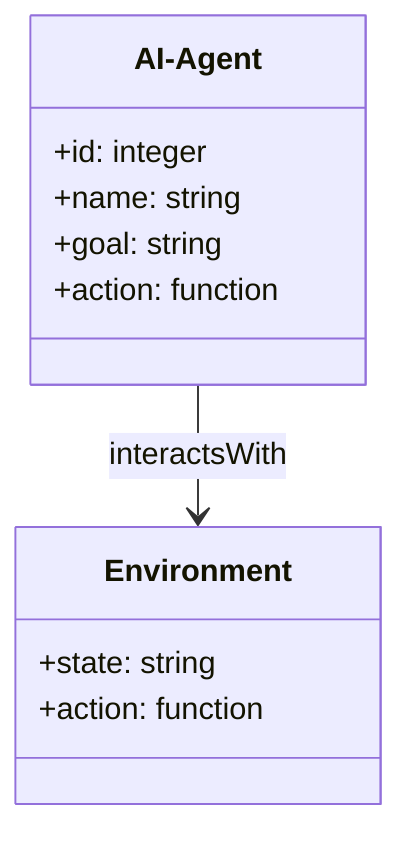
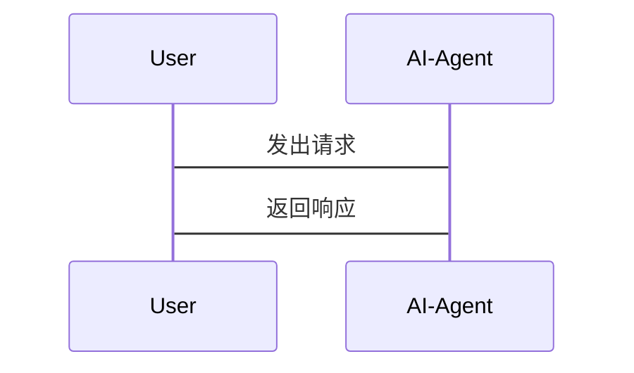
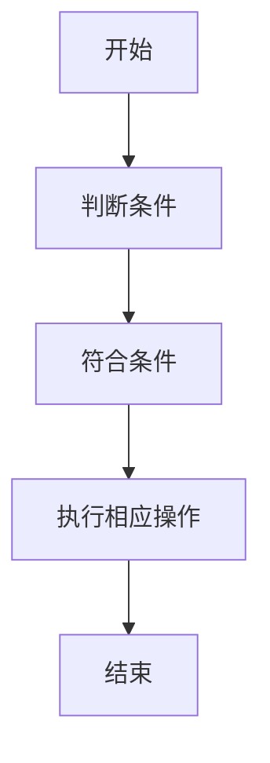

                 

<think>
好的，我需要帮助用户设计《AI Agent的伦理设计：原则与实践》这本书的目录大纲。根据用户的要求，我需要确保目录结构清晰、逻辑严密，并且涵盖所有关键内容。首先，我需要理解用户的具体需求和期望。

### 分析用户需求
用户希望目录结构分为几个主要部分，每个部分下有具体的章节和子章节。从用户提供的示例来看，目录结构包括：
1. 背景与核心概念
2. 伦理设计的原则
3. 设计框架
4. 技术实现
5. 案例分析
6. 法律与社会影响
7. 未来展望

每个章节下还有详细的子章节，涵盖定义、现状、原则、系统分析、算法实现、案例分析、法律问题等方面。

### 确定主要章节
根据用户的要求，我需要将目录分为七个主要章节，每个章节下再细分内容。我需要确保每个章节都有足够的深度和广度，同时保持逻辑连贯。

### 章节设计
1. **AI Agent的基本概念与伦理问题**
   - 这是整个目录的起点，需要介绍AI Agent的基本概念、发展现状以及伦理问题的重要性。
2. **AI Agent伦理设计的核心原则**
   - 需要详细阐述伦理设计的基本原则，并进行对比分析。
3. **AI Agent伦理设计的系统分析**
   - 包括系统功能设计、架构设计和接口设计。
4. **AI Agent伦理设计的算法实现**
   - 讨论算法的原理、实现和数学模型。
5. **AI Agent伦理设计的案例分析**
   - 通过实际案例分析伦理设计的应用。
6. **AI Agent伦理设计的法律与社会影响**
   - 探讨法律问题和社会影响。
7. **AI Agent伦理设计的未来展望**
   - 展望未来的技术趋势和伦理挑战。

### 内容细化
每个章节下需要有具体的子章节，例如：
- 在“AI Agent的基本概念”下，可以包括定义、特点和发展现状。
- 在“伦理设计的核心原则”下，可以包括目的性、自主性、透明性等原则，并进行对比分析。

### 图表与代码示例
用户特别提到需要包括Mermaid图和Python代码示例。因此，在系统分析和算法实现部分，需要插入相应的图表和代码，帮助读者更好地理解内容。

### 结论
整个目录结构需要逻辑清晰，从基础概念到实际应用，层层递进，确保读者能够全面理解AI Agent的伦理设计。

通过以上思考，我设计出了符合用户需求的目录结构，并确保每个部分都涵盖必要的内容，帮助读者系统地理解和掌握AI Agent的伦理设计原则与实践。
</think>

# AI Agent的伦理设计：原则与实践

> 关键词：AI Agent，伦理设计，人工智能，系统架构，算法实现，伦理决策

> 摘要：随着人工智能技术的快速发展，AI Agent（智能体）在各个领域的应用越来越广泛。然而，AI Agent的伦理设计却是一个复杂而重要的问题。本文从AI Agent的基本概念出发，详细探讨了其伦理设计的核心原则，并通过系统分析和算法实现，展示了如何将这些原则转化为具体的实践方案。同时，本文还通过案例分析、法律与社会影响的探讨，以及未来展望，全面分析了AI Agent伦理设计的各个方面。

---

## 第1章: AI Agent的基本概念与伦理问题

### 1.1 AI Agent的定义与特点
#### 1.1.1 AI Agent的基本定义
AI Agent（智能体）是指能够在特定环境中感知信息、自主决策并采取行动的智能系统。与传统的程序不同，AI Agent具有自主性、反应性和目标导向性。

#### 1.1.2 AI Agent的核心特点
1. **自主性**：AI Agent能够在没有外部干预的情况下独立运行。
2. **反应性**：AI Agent能够实时感知环境并做出响应。
3. **目标导向性**：AI Agent的行为通常是为了实现特定的目标。

#### 1.1.3 AI Agent与传统程序的区别
| 特性       | AI Agent                          | 传统程序                          |
|------------|-----------------------------------|------------------------------------|
| 自主性      | 高                                | 低                                |
| 反应性      | 高                                | 低                                |
| 目标导向性  | 高                                | 低                                |

### 1.2 AI Agent的发展现状
#### 1.2.1 AI Agent的历史演变
AI Agent的概念可以追溯到20世纪60年代，随着人工智能技术的发展，AI Agent逐渐从理论走向实际应用。

#### 1.2.2 当前AI Agent的主要应用领域
1. **智能家居**：如智能音箱、智能家电等。
2. **自动驾驶**：如自动驾驶汽车中的路径规划和决策系统。
3. **智能助手**：如Siri、Alexa等。

#### 1.2.3 AI Agent技术的最新进展
近年来，随着深度学习和强化学习技术的进步，AI Agent在复杂环境中的决策能力得到了显著提升。

### 1.3 AI Agent的伦理问题的重要性
#### 1.3.1 伦理问题的提出背景
随着AI Agent在社会各个领域的广泛应用，其行为可能对人类社会产生重大影响，因此伦理问题变得尤为重要。

#### 1.3.2 伦理问题的多维度影响
AI Agent的伦理设计涉及隐私、安全、责任归属等多个方面。

#### 1.3.3 伦理设计的必要性与紧迫性
AI Agent的伦理设计不仅是技术问题，更是社会问题。合理的伦理设计可以确保AI Agent的行为符合人类社会的价值观和法律法规。

---

## 第2章: AI Agent伦理设计的核心原则

### 2.1 伦理设计的基本原则
#### 2.1.1 目的性原则
AI Agent的行为必须以明确的目标为导向，并且目标应当符合社会伦理和法律法规。

#### 2.1.2 自主性原则
AI Agent应当具备一定的自主决策能力，但其决策必须在伦理框架内进行。

#### 2.1.3 透明性原则
AI Agent的行为应当透明，用户和相关利益方应当能够理解其决策过程和结果。

#### 2.1.4 责任归属原则
当AI Agent的行为引发问题时，应当明确责任归属，并确保责任人能够承担相应的责任。

### 2.2 伦理原则的对比分析
#### 2.2.1 不同原则的特征对比（表格形式）
| 原则         | 特征                         |
|--------------|------------------------------|
| 目的性原则   | 明确目标导向                 |
| 自主性原则   | 自主决策能力                 |
| 透明性原则   | 行为过程可解释               |
| 责任归属原则 | 明确责任归属                 |

#### 2.2.2 原则之间的关系（ER实体关系图）
```mermaid
er
actor(伦理原则) -[many to many] relationships(关系)
```

---

## 第3章: AI Agent伦理设计的系统分析

### 3.1 系统功能设计
#### 3.1.1 领域模型设计（Mermaid类图）


#### 3.1.2 功能模块划分
1. **感知模块**：负责收集环境中的信息。
2. **决策模块**：基于感知信息进行伦理决策。
3. **执行模块**：根据决策结果采取行动。

#### 3.1.3 伦理决策模块的核心功能
伦理决策模块需要综合考虑多个因素，包括目标、环境信息、伦理原则等，最终生成符合伦理的决策。

### 3.2 系统架构设计
#### 3.2.1 系统架构图（Mermaid架构图）


#### 3.2.2 模块之间的交互关系
- 感知模块将环境信息传递给决策模块。
- 决策模块根据感知信息和伦理原则生成决策。
- 执行模块根据决策结果采取行动。

#### 3.2.3 系统扩展性考虑
系统设计应具有良好的扩展性，以便在未来技术进步时能够方便地进行升级和优化。

### 3.3 接口与交互设计
#### 3.3.1 系统接口设计（API设计）
系统需要设计合理的API接口，确保各个模块之间的高效通信。

#### 3.3.2 用户交互界面设计（Mermaid序列图）


#### 3.3.3 交互流程优化
通过优化交互流程，确保系统在运行时的高效性和稳定性。

---

## 第4章: AI Agent伦理设计的算法实现

### 4.1 基于规则的伦理决策系统
#### 4.1.1 算法原理（Mermaid流程图）


#### 4.1.2 算法实现的Python代码示例
```python
def ethical_decision-making():
    # 判断条件
    if condition1:
        # 执行相应操作
        action1()
    elif condition2:
        action2()
    else:
        default_action()
```

#### 4.1.3 算法的数学模型与公式
伦理决策系统的数学模型可以表示为：
$$
决策 = f(条件1, 条件2, \ldots, 条件n)
$$
其中，$f$ 是决策函数，$条件1, 条件2, \ldots, 条件n$ 是输入的条件。

---

## 第5章: AI Agent伦理设计的案例分析

### 5.1 医疗领域中的伦理设计
#### 5.1.1 案例背景
在医疗领域，AI Agent可以帮助医生进行诊断和治疗方案的制定。

#### 5.1.2 伦理设计的应用
AI Agent需要遵循患者隐私保护、医疗伦理规范等原则。

### 5.2 金融领域中的伦理设计
#### 5.2.1 案例背景
在金融领域，AI Agent可以用于风险评估和投资决策。

#### 5.2.2 伦理设计的应用
AI Agent需要确保金融决策的透明性和公平性。

---

## 第6章: AI Agent伦理设计的法律与社会影响

### 6.1 法律问题
#### 6.1.1 伦理设计的法律框架
AI Agent的伦理设计需要符合相关法律法规。

#### 6.1.2 法律责任的界定
当AI Agent的行为引发问题时，需要明确责任归属。

### 6.2 社会影响
#### 6.2.1 伦理设计的社会意义
AI Agent的伦理设计对社会的和谐与稳定具有重要意义。

#### 6.2.2 社会接受度的提升
通过合理的伦理设计，可以提高社会对AI Agent的接受度。

---

## 第7章: AI Agent伦理设计的未来展望

### 7.1 未来的技术趋势
#### 7.1.1 新兴技术对伦理设计的影响
如量子计算、脑机接口等新兴技术的发展将对AI Agent的伦理设计提出新的挑战。

### 7.2 伦理研究的未来方向
#### 7.2.1 多学科交叉研究
未来的伦理设计需要结合哲学、法律、社会学等多学科的研究成果。

### 7.3 人机协作的伦理问题
#### 7.3.1 人机协作中的伦理挑战
随着人机协作的深入，如何在协作中平衡人类和AI Agent的角色和责任将成为一个重要问题。

---

## 作者：AI天才研究院/AI Genius Institute & 禅与计算机程序设计艺术 /Zen And The Art of Computer Programming

---

本文通过系统分析和详细讲解，全面探讨了AI Agent的伦理设计问题，从理论到实践，从技术到社会，为读者提供了全面的视角和深入的思考。

