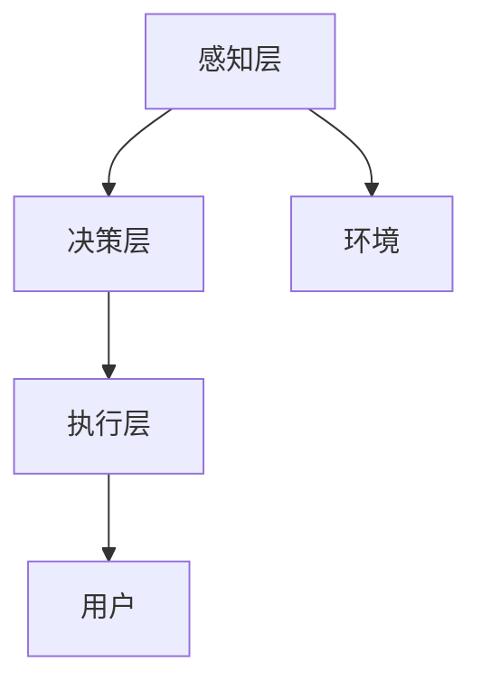
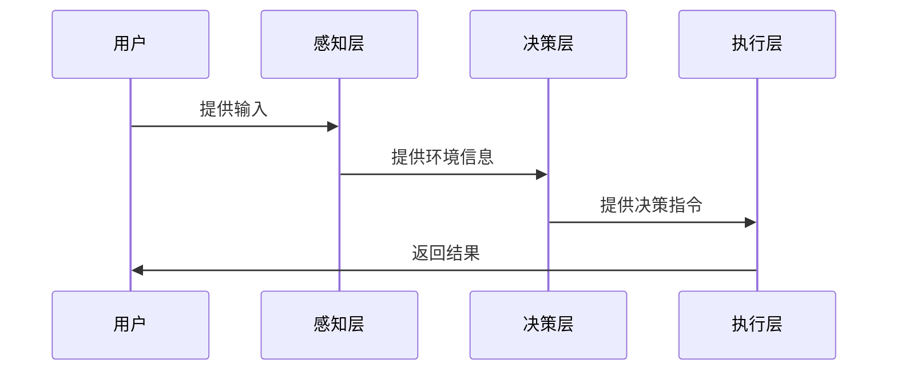

                 


# AI Agent的伦理设计：遵循AI伦理准则

> 关键词：AI Agent，伦理设计，人工智能，算法原理，系统架构，隐私保护，公平性，透明性

摘要：本文深入探讨了AI Agent的伦理设计，从基本概念到算法实现，再到系统架构，详细分析了如何在AI Agent的设计和实现过程中遵循伦理准则，确保技术的健康发展。

---

## 第1章：AI Agent概述

### 1.1 AI Agent的基本概念

#### 1.1.1 什么是AI Agent
AI Agent（人工智能代理）是一种能够感知环境并采取行动以实现目标的智能实体。它可以是一个软件程序、一个机器人或任何能够执行复杂任务的智能系统。AI Agent的核心目标是通过自主决策和行动，为用户或系统创造价值。

#### 1.1.2 AI Agent的类型
AI Agent可以分为以下几种类型：
1. **简单反射型Agent**：基于当前输入做出反应，不依赖历史信息。
2. **基于模型的反射型Agent**：利用内部模型和历史信息进行决策。
3. **目标驱动型Agent**：根据预设目标采取行动。
4. **效用驱动型Agent**：通过最大化效用函数来实现目标。

#### 1.1.3 AI Agent的应用领域
AI Agent广泛应用于多个领域，包括：
- 智能音箱（如Alexa、Siri）
- 自动驾驶汽车（如特斯拉、Waymo）
- 个性化推荐系统（如Netflix、Spotify）
- 智能客服系统（如聊天机器人）

### 1.2 AI Agent的伦理背景

#### 1.2.1 伦理在AI发展中的重要性
随着AI Agent的应用越来越广泛，伦理问题也随之浮现。例如，自动驾驶汽车在紧急情况下如何决策，个性化推荐系统如何避免偏见等。这些问题要求我们在设计AI Agent时必须考虑伦理因素。

#### 1.2.2 当前AI Agent面临的伦理挑战
1. **隐私问题**：AI Agent可能收集大量用户数据，如何保护用户隐私？
2. **偏见与歧视**：算法可能基于历史数据中的偏见做出不公平的决策。
3. **责任归属**：当AI Agent的决策导致问题时，责任应由谁承担？

#### 1.2.3 伦理设计对AI Agent的影响
伦理设计直接影响AI Agent的行为模式和决策能力。通过遵循伦理准则，可以确保AI Agent在实现目标的同时，不会对用户或社会造成负面影响。

---

## 第2章：AI Agent的伦理原则

### 2.1 伦理原则概述

#### 2.1.1 尊重个人隐私
AI Agent在处理用户数据时，必须确保数据的隐私性。这意味着在设计AI Agent时，需要明确数据的使用范围和存储方式，确保用户数据不被滥用。

#### 2.1.2 避免偏见与歧视
AI Agent的决策不能基于偏见或歧视。例如，在招聘系统中，AI Agent不能因为性别或种族而拒绝某个候选人。为了实现这一目标，需要对数据进行清洗，去除潜在的偏见。

#### 2.1.3 透明与可解释性
用户需要了解AI Agent是如何做出决策的。这意味着AI Agent的设计必须具有透明性和可解释性，让用户能够理解其决策过程。

### 2.2 伦理原则的实现

#### 2.2.1 数据收集的伦理考量
在收集用户数据时，必须确保用户知情并同意。同时，数据的使用范围必须明确，避免超出授权范围。

#### 2.2.2 算法决策的透明化
AI Agent的决策过程需要透明，用户能够了解算法是如何做出决策的。例如，推荐系统可以向用户解释推荐的依据。

#### 2.2.3 用户知情同意的实现
在设计AI Agent时，必须确保用户能够明确了解AI Agent的用途和数据使用方式，并在使用前获得用户的知情同意。

---

## 第3章：AI Agent的算法原理与伦理设计

### 3.1 算法设计中的伦理考量

#### 3.1.1 数据偏见的识别与消除
在训练AI Agent时，数据可能包含偏见。例如，某个招聘系统可能因为历史数据中的性别偏见而对女性候选人产生歧视。识别和消除数据偏见是实现公平决策的关键。

#### 3.1.2 决策过程的公平性
AI Agent的决策过程必须公平，不能因为用户的种族、性别或其他特征而产生不公平的决策。这需要在算法设计中加入公平性约束。

#### 3.1.3 算法的可解释性
用户需要了解AI Agent是如何做出决策的。因此，算法必须具有可解释性，能够清晰地说明决策的依据和过程。

### 3.2 伦理准则的算法嵌入

#### 3.2.1 在训练数据中加入伦理约束
在训练AI Agent时，可以通过数据增强或数据清洗的方法，消除数据中的偏见。例如，通过重新平衡数据集中的样本分布，确保算法不会因为数据分布不均而产生偏见。

#### 3.2.2 在模型推理阶段应用伦理过滤
在模型推理阶段，可以通过伦理过滤模块，对模型的输出进行检查，确保其符合伦理准则。例如，对于招聘系统，可以在模型输出结果后，检查是否存在性别或种族偏见。

#### 3.2.3 使用强化学习优化伦理表现
通过强化学习，可以训练AI Agent在决策过程中遵循伦理准则。例如，当AI Agent做出不公平的决策时，会受到惩罚，从而迫使模型调整策略，避免再次出现类似问题。

---

## 第4章：系统分析与架构设计

### 4.1 系统功能设计

#### 4.1.1 领域模型
AI Agent的领域模型需要明确系统的功能模块和交互流程。例如，对于自动驾驶系统，领域模型可能包括感知、决策、执行等模块。

#### 4.1.2 系统架构设计
AI Agent的系统架构设计需要考虑模块之间的交互和数据流。例如，可以通过分层架构设计，将系统划分为感知层、决策层和执行层。

#### 4.1.3 系统接口设计
系统接口设计需要明确各个模块之间的接口和数据格式。例如，感知模块需要向决策模块提供环境信息，决策模块需要向执行模块提供控制指令。

### 4.2 系统架构设计

#### 4.2.1 系统架构图
以下是AI Agent的系统架构图：



#### 4.2.2 系统交互图
以下是AI Agent的系统交互图：



---

## 第5章：项目实战

### 5.1 环境安装

#### 5.1.1 安装Python环境
安装Python 3.8或更高版本，并安装必要的库，例如numpy、pandas、scikit-learn等。

#### 5.1.2 安装其他依赖
安装mermaid和latex支持的工具，例如jupyter notebook、vscode等。

### 5.2 系统核心实现源代码

#### 5.2.1 数据预处理代码
```python
import pandas as pd
from sklearn.preprocessing import StandardScaler

# 加载数据集
data = pd.read_csv('dataset.csv')

# 数据清洗
data = data.dropna()
data = data.drop_duplicates()

# 数据标准化
scaler = StandardScaler()
data_scaled = scaler.fit_transform(data)
```

#### 5.2.2 伦理过滤模块代码
```python
def ethical_filtering(predictions, threshold=0.8):
    # 过滤掉不符合伦理准则的预测结果
    filtered_predictions = []
    for pred in predictions:
        if pred['score'] > threshold and ethical_check(pred['description']):
            filtered_predictions.append(pred)
    return filtered_predictions
```

### 5.3 代码应用解读与分析

#### 5.3.1 数据预处理
数据预处理是AI Agent设计中的关键步骤，通过清洗和标准化数据，可以消除数据中的噪声和偏见，确保模型能够准确地学习到数据的特征。

#### 5.3.2 伦理过滤模块
伦理过滤模块的作用是对模型的输出进行检查，确保其符合伦理准则。通过设置阈值和伦理检查函数，可以有效地过滤掉不符合伦理的预测结果。

### 5.4 案例分析

#### 5.4.1 案例介绍
以自动驾驶汽车为例，假设AI Agent需要在紧急情况下做出决策，例如在碰撞不可避免时，如何选择碰撞对象以最小化伤害。

#### 5.4.2 伦理决策过程
AI Agent会根据预设的伦理准则，优先保护行人或乘客的生命安全，而不是选择伤害更多的人。这种决策过程需要在算法中明确体现。

#### 5.4.3 案例小结
通过伦理设计，AI Agent可以在紧急情况下做出符合伦理的决策，从而减少伤害。

### 5.5 项目小结

#### 5.5.1 项目总结
通过实际案例，展示了如何在AI Agent的设计和实现过程中遵循伦理准则，确保技术的健康发展。

#### 5.5.2 项目经验
在实际项目中，伦理设计需要从数据收集、算法设计到系统实现的整个过程进行考虑，确保每个环节都符合伦理准则。

---

## 第6章：最佳实践与未来展望

### 6.1 最佳实践

#### 6.1.1 伦理准则的持续优化
AI Agent的伦理准则需要随着技术的发展和社会的变化而不断优化，确保其始终符合社会的道德标准。

#### 6.1.2 用户教育与反馈
用户需要了解AI Agent的伦理设计，同时可以通过反馈机制，帮助开发者不断优化系统。

#### 6.1.3 技术透明与公开
AI Agent的设计和实现过程需要尽可能透明，通过公开技术细节和算法，让用户能够了解其决策过程。

### 6.2 未来展望

#### 6.2.1 更高级的伦理模型
未来，随着AI技术的发展，伦理模型将更加复杂和智能，能够更好地理解和应对复杂的伦理问题。

#### 6.2.2 伦理与技术的深度融合
伦理设计将与AI技术更加紧密地结合，成为AI Agent设计的核心部分。

#### 6.2.3 全球性伦理标准的制定
随着AI技术的全球化应用，制定统一的伦理标准将成为一个重要趋势，以确保技术的健康发展。

---

## 作者：AI天才研究院/AI Genius Institute & 禅与计算机程序设计艺术 /Zen And The Art of Computer Programming

---

**摘要**：本文详细探讨了AI Agent的伦理设计，从基本概念到算法实现，再到系统架构，全面分析了如何在AI Agent的设计和实现过程中遵循伦理准则，确保技术的健康发展。通过实际案例和最佳实践，本文为AI Agent的伦理设计提供了有价值的参考和指导。

