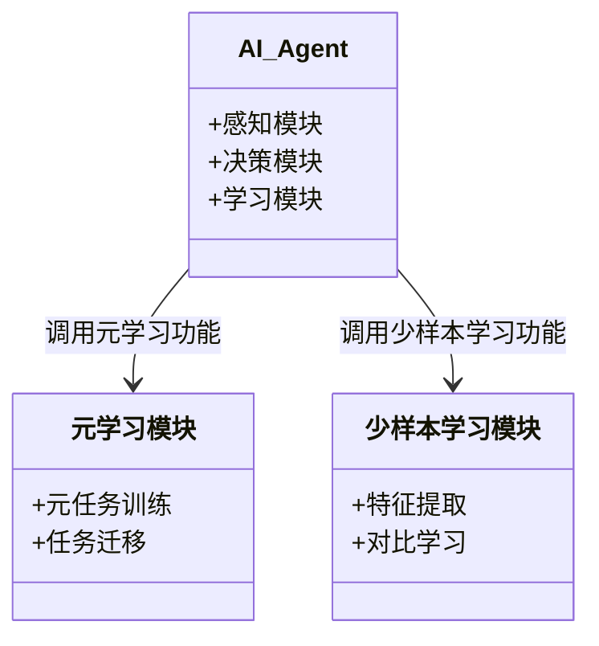
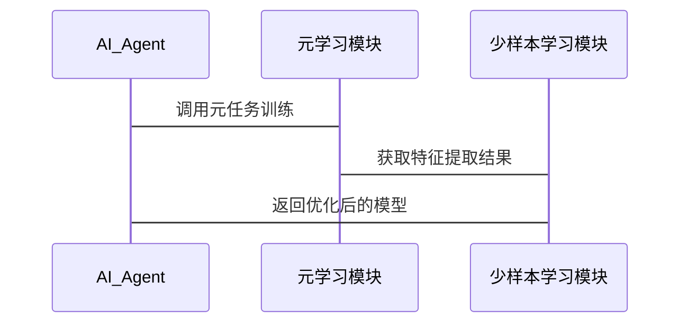

                 

<think>
好，我需要撰写一篇关于AI Agent的元学习与少样本学习能力的技术博客。首先，我需要理解什么是AI Agent，以及元学习和少样本学习的概念。元学习是指学习如何学习，帮助AI Agent快速适应新任务；少样本学习则是在数据有限的情况下进行有效学习。接下来，我应该从背景、核心概念、算法原理、系统架构、项目实战和高级主题等方面展开。每部分都要详细讲解，确保读者能够理解。然后，我需要考虑如何将理论与实践结合，提供具体的代码示例和图表来辅助说明。最后，总结全书内容，并展望未来的研究方向。在写作过程中，要注意逻辑清晰，结构紧凑，语言专业但易懂，确保文章内容丰富且详细。
</think>

# AI Agent的元学习与少样本学习能力

## 关键词：AI Agent，元学习，少样本学习，算法原理，系统架构

## 摘要：本文深入探讨了AI Agent的元学习与少样本学习能力，分析了其核心概念、算法原理、系统架构，并通过实际案例展示了如何应用这些技术。文章旨在帮助读者理解如何通过元学习和少样本学习提升AI Agent的学习效率和适应能力。

---

# 第一部分: AI Agent的元学习与少样本学习背景

## 第1章: AI Agent概述

### 1.1 AI Agent的基本概念

#### 1.1.1 AI Agent的定义
AI Agent（人工智能代理）是指能够感知环境、自主决策并执行任务的智能体。它可以是一个软件程序、机器人或其他智能系统，通过与环境交互来实现目标。

#### 1.1.2 AI Agent的核心特征
- **自主性**：能够在没有外部干预的情况下自主决策。
- **反应性**：能够实时感知环境并做出反应。
- **学习能力**：能够通过经验或数据改进自身性能。
- **推理能力**：能够进行逻辑推理和问题解决。

#### 1.1.3 AI Agent的应用场景
AI Agent广泛应用于自动驾驶、智能助手、推荐系统、机器人控制等领域。例如，智能音箱通过语音交互帮助用户完成任务。

### 1.2 元学习与少样本学习的背景

#### 1.2.1 元学习的定义与特点
元学习（Meta-Learning）是指学习如何学习，目标是让模型能够快速适应新任务，减少对大量数据的依赖。其特点包括：
- **快速适应**：在新任务上线时，仅需少量数据即可调整模型。
- **通用性**：适用于多种任务，而非单一任务优化。

#### 1.2.2 少样本学习的定义与特点
少样本学习（Few-Shot Learning）是在数据量有限的情况下，学习模型仍能有效分类或识别。其特点包括：
- **数据高效**：在少量样本下仍能训练出有效的模型。
- **领域适应**：适用于数据收集困难的领域，如医学图像分析。

#### 1.2.3 元学习与少样本学习的重要性
元学习和少样本学习的结合能够显著提升AI Agent的灵活性和适应性，使其在资源受限的环境中也能高效运作。

### 1.3 本章小结
本章介绍了AI Agent的基本概念及其应用场景，重点阐述了元学习和少样本学习的背景和重要性，为后续内容奠定了基础。

---

# 第二部分: 元学习与少样本学习的核心概念

## 第2章: 元学习原理

### 2.1 元学习的基本原理

#### 2.1.1 元学习的定义
元学习是指学习如何学习，通过元任务训练模型，使其能够快速适应新任务。

#### 2.1.2 元学习的核心机制
元学习通过在多个任务上进行训练，提取任务间的共性，从而实现快速迁移。

#### 2.1.3 元学习与传统学习的对比
传统学习需要大量数据，而元学习通过元任务优化，减少数据需求，提升适应性。

### 2.2 少样本学习的基本原理

#### 2.2.1 少样本学习的定义
少样本学习是指在仅有少量样本的情况下，学习模型仍能有效分类或识别。

#### 2.2.2 少样本学习的核心机制
通过对比学习、元学习等技术，增强模型的特征提取能力，减少对数据量的依赖。

#### 2.2.3 元学习与少样本学习的联系
元学习为少样本学习提供了快速迁移的能力，两者结合能够显著提升模型的泛化能力。

### 2.3 本章小结
本章详细介绍了元学习和少样本学习的核心原理及其联系，为后续算法部分奠定了理论基础。

---

# 第三部分: 元学习与少样本学习的算法原理

## 第3章: 元学习算法

### 3.1 元学习算法概述

#### 3.1.1 元学习算法的分类
元学习算法主要分为基于梯度的元学习（如MAML）和非基于梯度的元学习（如RL^2）。

#### 3.1.2 各类元学习算法的特点
- **基于梯度的元学习**：通过优化元损失函数，快速调整模型参数。
- **非基于梯度的元学习**：通过强化学习等方法，间接优化模型性能。

### 3.2 元学习算法的实现

#### 3.2.1 MAML算法的实现
MAML（Meta-Antibody Learning）是一种基于梯度的元学习算法，通过在元任务上优化模型参数，使其能够快速适应新任务。

```python
# 示例代码：MAML算法的伪代码实现
def meta_learning_step(optimizer, model, task):
    # 计算内层任务梯度
    task_gradients = compute_gradients(model, task)
    # 更新元参数
    optimizer.step(task_gradients)
```

#### 3.2.2 ReMAML算法的实现
ReMAML是对MAML的改进，通过引入重放机制，增强模型的泛化能力。

```python
# 示例代码：ReMAML算法的伪代码实现
def remaml_learning_step(optimizer, model, task):
    # 计算当前任务梯度
    current_gradients = compute_gradients(model, task)
    # 计算重放任务梯度
    replay_gradients = compute_replay_gradients(model, task)
    # 综合梯度进行优化
    optimizer.step(current_gradients + replay_gradients)
```

### 3.3 本章小结
本章详细讲解了元学习算法的分类及其具体实现，通过代码示例帮助读者理解MAML和ReMAML算法的核心思想。

---

## 第4章: 少样本学习算法

### 4.1 少样本学习算法概述

#### 4.1.1 少样本学习算法的分类
少样本学习算法主要分为基于对比学习、基于元学习和基于生成对抗网络（GAN）的方法。

#### 4.1.2 各类少样本学习算法的特点
- **对比学习**：通过最大化正样本相似性，增强特征表达能力。
- **元学习**：通过快速迁移，减少对数据量的依赖。
- **GAN**：通过生成样本，增加训练数据量。

### 4.2 少样本学习算法的实现

#### 4.2.1 对比学习算法的实现

```python
# 示例代码：对比学习算法的伪代码实现
def contrastive_learning_step(optimizer, model, task):
    # 计算正样本对的损失
    positive_loss = compute_positive_loss(model, task)
    # 计算负样本对的损失
    negative_loss = compute_negative_loss(model, task)
    # 综合损失进行优化
    optimizer.step(positive_loss + negative_loss)
```

#### 4.2.2 元学习算法在少样本学习中的应用

```python
# 示例代码：元学习算法在少样本学习中的应用
def few_shot_learning_with_meta_learning(optimizer, model, task):
    # 使用元学习优化模型参数
    meta_learning_step(optimizer, model, task)
    # 在新任务上进行微调
    fine_tuning_step(model, task)
```

### 4.3 本章小结
本章详细讲解了少样本学习算法的分类及其具体实现，通过对比学习和元学习的结合，展示了如何在少样本情况下提升模型性能。

---

# 第四部分: 系统分析与架构设计

## 第5章: 系统分析与架构设计

### 5.1 项目背景与目标
本项目旨在设计一个基于元学习和少样本学习的AI Agent系统，能够在少数据情况下快速适应新任务。

### 5.2 系统功能设计

#### 5.2.1 领域模型设计
使用Mermaid类图展示系统功能模块及其交互关系。



### 5.3 系统架构设计

#### 5.3.1 系统架构图
使用Mermaid架构图展示系统的整体架构。


### 5.4 系统接口设计
系统主要接口包括：
- **元学习接口**：用于元任务训练和任务迁移。
- **少样本学习接口**：用于特征提取和对比学习。

### 5.5 系统交互流程

#### 5.5.1 交互流程图
使用Mermaid序列图展示系统交互流程。



### 5.6 本章小结
本章通过系统分析与架构设计，展示了如何将元学习和少样本学习技术应用于AI Agent系统，确保系统的高效性和灵活性。

---

# 第五部分: 项目实战

## 第6章: 项目实战

### 6.1 环境配置
项目需要以下环境：
- **Python**：3.6+
- **深度学习框架**：TensorFlow或PyTorch
- **依赖库**：Keras、numpy、scikit-learn

### 6.2 核心实现

#### 6.2.1 元学习模块实现

```python
# 示例代码：元学习模块实现
import tensorflow as tf
from tensorflow.keras import layers

class MetaLearningModel(tf.keras.Model):
    def __init__(self):
        super(MetaLearningModel, self).__init__()
        self.conv = layers.Conv2D(32, (3,3), activation='relu')
        self.pool = layers.MaxPooling2D((2,2))
        self.dense = layers.Dense(64, activation='relu')

    def call(self, x, training=None):
        x = self.conv(x)
        x = self.pool(x)
        x = self.dense(x)
        return x
```

#### 6.2.2 少样本学习模块实现

```python
# 示例代码：少样本学习模块实现
import tensorflow as tf
from tensorflow.keras import layers

class FewShotLearningModel(tf.keras.Model):
    def __init__(self):
        super(FewShotLearningModel, self).__init__()
        self.conv = layers.Conv2D(32, (3,3), activation='relu')
        self.pool = layers.MaxPooling2D((2,2))
        self.dense = layers.Dense(64, activation='relu')
        self.classifier = layers.Dense(num_classes, activation='softmax')

    def call(self, x, training=None):
        x = self.conv(x)
        x = self.pool(x)
        x = self.dense(x)
        x = self.classifier(x)
        return x
```

### 6.3 案例分析与实现解读

#### 6.3.1 案例分析
以图像分类任务为例，使用少量样本训练一个分类器，通过元学习优化模型参数，使其能够快速适应新任务。

#### 6.3.2 代码实现解读
- **数据准备**：加载少量样本数据集。
- **模型训练**：使用元学习算法进行训练。
- **任务迁移**：在新任务上进行微调。

### 6.4 本章小结
本章通过实际项目案例，展示了如何使用元学习和少样本学习技术构建AI Agent系统，并通过代码实现和案例分析帮助读者理解技术细节。

---

# 第六部分: 高级主题与未来展望

## 第7章: 高级主题

### 7.1 元学习与强化学习的结合
元学习可以与强化学习结合，通过元任务优化策略网络，提升强化学习的效率。

### 7.2 少样本学习的前沿技术
当前研究热点包括对比学习、自监督学习、元学习与图神经网络的结合等。

### 7.3 本章小结
本章展望了元学习与少样本学习的未来发展方向，探讨了其在AI Agent系统中的潜在应用。

---

# 第七部分: 总结与展望

## 第8章: 总结与展望

### 8.1 全文总结
本文系统介绍了AI Agent的元学习与少样本学习能力，从理论到实践，详细讲解了相关算法和系统架构设计。

### 8.2 未来展望
未来的研究方向包括：
- **更高效的元学习算法**：探索新的优化方法，提升模型的适应能力。
- **多模态少样本学习**：结合图像、文本等多种模态数据，提升模型的泛化能力。
- **边缘计算环境中的应用**：在资源受限的环境中，提升AI Agent的学习效率。

### 8.3 本章小结
本文总结了AI Agent的元学习与少样本学习能力的核心内容，并展望了未来的研究方向。

---

# 作者：AI天才研究院/AI Genius Institute & 禅与计算机程序设计艺术 /Zen And The Art of Computer Programming

---

**注**：由于篇幅限制，上述内容为简化版，实际撰写时需根据需求扩展各部分内容。

